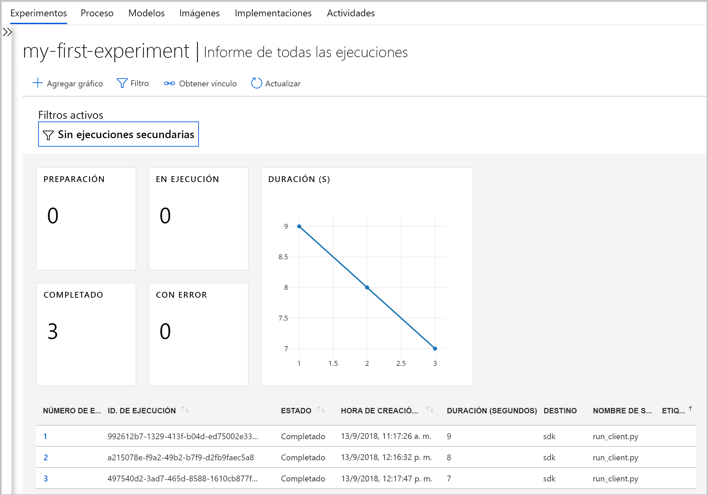
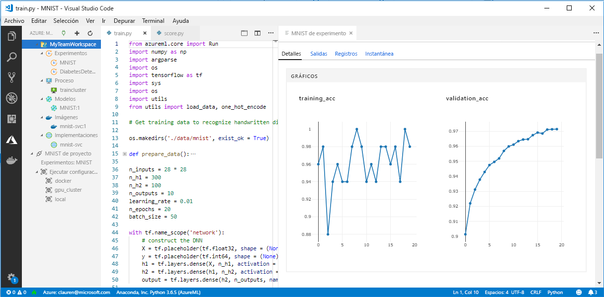

# ¿Qué ha ocurrido con Workbench en Azure Machine Learning (versión preliminar)?

La aplicación Workbench y algunas otras características tempranas han quedado en desuso en la versión de septiembre de 2018 para hacer hueco a una [arquitectura](concept-azure-machine-learning-architecture.md) mejorada. La versión contiene muchas actualizaciones importantes solicitadas por los comentarios de los clientes para mejorar su experiencia. La funcionalidad básica de ejecuciones de experimento hasta la implementación de modelos no ha cambiado, pero ahora puede usar un <a href="http://aka.ms/aml-sdk" target="_blank">SDK</a> y una [CLI](reference-azure-machine-learning-cli.md) sólidos para realizar sus tareas y canalizaciones de aprendizaje automático.  

En este artículo obtendrá información sobre qué ha cambiado y cómo ello afecta al trabajo ya existente con el servicio de Azure Machine Learning.

## ¿Qué ha cambiado?

La última versión de Azure Machine Learning incluye lo siguiente:
+ Un [modelo simplificado de los recursos de Azure](concept-azure-machine-learning-architecture.md).
+ Una [nueva interfaz de usuario del portal](how-to-track-experiments.md) para administrar sus experimentos y destinos de proceso.
+ Un <a href="http://aka.ms/aml-sdk" target="_blank">SDK</a> nuevo y más completo de Python.
+ Una nueva [extensión de la CLI de Azure](reference-azure-machine-learning-cli.md) expandida para el aprendizaje automático.

Se ha rediseñado la [arquitectura](concept-azure-machine-learning-architecture.md) teniendo en mente la facilidad de uso. En lugar de varias cuentas y recursos de Azure, solo necesita un [área de trabajo de Azure Machine Learning](concept-azure-machine-learning-architecture.md#workspace).  Puede crear áreas de trabajo rápidamente en [Azure Portal](quickstart-get-started.md).  Un área de trabajo la pueden usar varios usuarios para almacenar destinos de proceso de entrenamiento e implementación, experimentos de modelos, imágenes de Docker, modelos implementados, etc.

Aunque hay nuevos clientes mejorados de CLI y SDK en la versión actual, la propia aplicación de escritorio Workbench está en desuso. Ahora, puede supervisar sus experimentos en el [panel del área de trabajo en el portal web de Azure](how-to-track-experiments.md#view-the-experiment-in-the-azure-portal). Use el panel para obtener el historial de experimentos, administrar los destinos de proceso asociados al área de trabajo, administrar los modelos e imágenes de Docker e incluso implementar servicios web.

## ¿Cómo realizo una migración?

La mayoría de los artefactos creados en la versión anterior del servicio Azure Machine Learning se almacenan en su propio almacenamiento local o en la nube. Estos artefactos nunca desaparecerán. Para migrar, debe volver a registrar los artefactos con el servicio de Azure Machine Learning actualizado. Obtenga información sobre lo que puede migrar y cómo hacerlo en este [artículo de migración](how-to-migrate.md).

## Escala de tiempo del soporte técnico

Puede seguir usando sus cuentas de Experimentación y Administración de modelos, así como la aplicación Workbench durante algún tiempo después de septiembre de 2018. El soporte técnico para los siguientes recursos se retirará progresivamente en los 3 o 4 meses posteriores a ese lanzamiento. De todas formas, la documentación de las características antiguas sigue disponible en la [sección Recursos](../desktop-workbench/tutorial-classifying-iris-part-1.md) al final de la tabla de contenido.

|Fase|Detalles del soporte técnico para características anteriores|
|:---:|----------------|
|1|Termina la capacidad para crear _cuentas de Experimentación_ y _Administración de modelos de Azure Machine Learning_ en Azure Portal y desde la CLI. También termina la capacidad para crear entornos de Proceso de ML desde la CLI. Si ya tiene una cuenta, la CLI y la aplicación de escritorio Workbench continúan funcionando en esta fase.|
|2|Las API subyacentes para crear áreas de trabajo y proyectos antiguos en la aplicación de escritorio Workbench y con la CLI terminan. Aún puede abrir proyectos actuales, agregarles scripts y ejecutar scripts en ellos, así como implementar servicios web en entornos de Proceso de ML actuales en esta fase.|
|3|El soporte técnico para todo lo demás, incluidas las demás API y la aplicación de escritorio Workbench finaliza en esta fase.|

[Inicia la migración](how-to-migrate.md) hoy mismo. Todas las funcionalidades más recientes están disponibles con el <a href="http://aka.ms/aml-sdk" target="_blank">SDK</a>, la [CLI](reference-azure-machine-learning-cli.md) y el [portal](quickstart-get-started.md) nuevos.

## ¿Qué sucede con los historiales de ejecución?

Los historiales de ejecución seguirán estando accesibles durante un tiempo. Cuando esté listo para pasar a la versión actualizada del servicio de Azure Machine Learning, puede exportar estos historiales de ejecución si quiere conservar una copia.

Los historiales de ejecución ahora se denominan _experimentos_ en la versión actual. Puede recopilar los experimentos de su modelo y explorarlos mediante el SDK, la CLI o el portal web.

El panel del área de trabajo del portal solo es compatible con los exploradores de Edge, Chrome y Firefox.

[  ] (./media/overview-what-happened-to-workbench/image001.png#lightbox)

## ¿Aún se puede preparar datos?

Los archivos de preparación de datos ya existentes no se pueden portar a la versión más reciente, puesto que ya no tenemos Workbench. Pero todavía puede preparar los datos para el modelado.  

Con conjuntos de datos más pequeños, puede usar el <a href="http://aka.ms/aml-sdk" target="_blank">Azure Machine Learning Data Prep SDK</a> para preparar rápidamente los datos antes del modelado. 

Puede usar este mismo <a href="http://aka.ms/aml-sdk" target="_blank">SDK</a> para conjuntos de datos más grandes o usar Azure Databricks para preparar conjuntos de macrodatos. 

## ¿Se conservarán los proyectos?

No perderá ningún código ni trabajo. En la versión anterior, los proyectos son entidades en la nube con un directorio local. En la versión más reciente, los directorios locales se adjuntan al área de trabajo de Azure Machine Learning mediante un archivo de configuración local. [Vea un diagrama de la arquitectura más reciente](concept-azure-machine-learning-architecture.md).

Dado que gran parte del contenido del proyecto ya estaba en el equipo local, basta crear un archivo de configuración en ese directorio y hacer referencia a él en el código para conectarse a su área de trabajo. [Obtenga información sobre cómo migrar los proyectos existentes.](how-to-migrate.md#projects)

Obtenga información sobre cómo empezar a trabajar [en Python con el SDK principal](quickstart-get-started.md).

## ¿Qué sucede con mis modelos de registros e imágenes?
 
Debe migrar los modelos que ha registrado en el registro del modelo antiguo a la nueva área de trabajo si quiere seguir usándolos. Para ello, [descargue los modelos y vuelva a registrarlos](how-to-migrate.md) en el área de trabajo nueva. 

Las imágenes que creó en el registro de la imagen anterior se deben volver a crear en el área de trabajo nueva para seguir usándolas. Puede hacerlo siguiendo la sección sobre la [creación de imágenes de Docker](how-to-deploy-to-aci.md#configure-an-image). 

## ¿Qué sucede con los servicios web implementados?

Los modelos que implementó como servicios web con su cuenta de Administración de modelos seguirán funcionando siempre que Azure Container Service (ACS) sea compatible. Dichos servicios web funcionarán incluso después de que haya finalizado el soporte técnico para las cuentas de Administración de modelos. Pero cuando finalice el soporte técnico para las CLI anteriores, también lo hará la capacidad de administrar dichos servicios web.

En la versión más reciente, los modelos se implementan como servicios web para clústeres de [Azure Container Instances](how-to-deploy-to-aci.md) (ACI) o [Azure Kubernetes Service](how-to-deploy-to-aks.md) (AKS). También puede [implementar en FPGA y en IoT Edge](how-to-deploy-and-where.md). Sin tener que cambiar ninguno de los archivos, dependencias y esquemas de puntuación, puede volver a implementar los modelos mediante el nuevo SDK o CLI. 

## ¿Qué sucede con el SDK y la CLI antiguos?

Seguirán funcionando durante un tiempo (consulte la [escala de tiempo](#timeline) más arriba). Es recomendable que comience a crear nuevos experimentos y modelos con el SDK o la CLI más reciente.

En la versión más reciente, el nuevo SDK de Python le permite interactuar con el servicio de Azure Machine Learning en cualquier entorno de Python. Más información sobre cómo instalar el <a href="http://aka.ms/aml-sdk" target="_blank">SDK</a> más reciente.  También puede usar la [extensión de aprendizaje automático de la CLI de Azure actualizada](reference-azure-machine-learning-cli.md) con el amplio conjunto de comandos `az ml` para interactuar con el servicio en cualquier entorno de línea de comandos, incluido el shell de la nube de Azure Portal.

## ¿Qué sucede con Visual Studio Code Tools for AI?

Con esta versión más reciente, se ha ampliado y mejorado la extensión Visual Studio (VS) Code Tools for AI para trabajar con las nuevas características anteriores.

[  ] (./media/overview-what-happened-to-workbench/vscode-big.png#lightbox)

## ¿Qué sucede con los paquetes de dominio?

Los paquetes de dominio para [Computer Vision, Text Analytics y Forecasting](../desktop-workbench/reference-python-package-overview.md) no se pueden usar con la versión más reciente de Azure Machine Learning. Pero todavía puede crear y entrenar modelos de previsión, texto y computer vision con el <a href="http://aka.ms/aml-sdk" target="_blank">SDK</a> más reciente de Python de Azure Machine Learning. Para más información sobre cómo migrar los modelos ya existentes creados con los paquetes Computer Vision, Text Analytics y Forecasting, póngase en contacto con nosotros en [AML-Packages@microsoft.com ](mailto:AML-Packages@microsoft.com).

## Pasos siguientes

Obtenga información sobre [la arquitectura más reciente para el servicio de Azure Machine Learning](concept-azure-machine-learning-architecture.md) y pruebe una de las guías de inicio rápido o tutoriales:

* [¿Qué es el servicio Azure Machine Learning?](overview-what-is-azure-ml.md)
* [Guía de inicio rápido: Creación de un área de trabajo con Python](quickstart-get-started.md)
* [Tutorial: Entrenamiento de un modelo](tutorial-train-models-with-aml.md)
