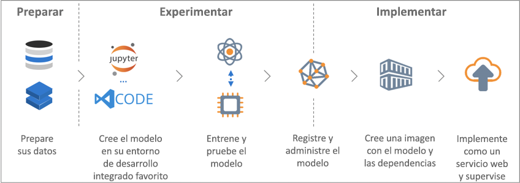

# ¿Qué es el servicio Azure Machine Learning?

Azure Machine Learning Service es un servicio en la nube que se usa para entrenar, implementar, automatizar y administrar modelos de aprendizaje automático, y todo ello con la gran capacidad de escalado que proporciona la nube.

## ¿Qué es el aprendizaje automático?

El aprendizaje automático es una técnica de ciencia de datos que permite a los equipos utilizar datos existentes para prever tendencias, resultados y comportamientos futuros. Mediante el aprendizaje automático, los equipos aprenden sin necesidad de programarlos explícitamente.

Las previsiones o predicciones del aprendizaje automático pueden hacer que las aplicaciones y los dispositivos sean más inteligentes. Por ejemplo, cuando compra en línea, el aprendizaje automático ayuda a recomendar otros productos según lo que haya adquirido. O, cuando pasa su tarjeta de crédito, el aprendizaje automático compara la transacción con una base de datos de transacciones y ayuda a detectar fraudes. Y cuando la aspiradora robot aspira una sala, el aprendizaje automático le ayuda a decidir si se ha terminado el trabajo.

## ¿Qué es Azure Machine Learning Service?

Azure Machine Learning Service proporciona un entorno basado en la nube que puede utilizar para preparar los datos, entrenar, probar, implementar, administrar y realizar un seguimiento de los modelos de aprendizaje automático.

[ ] (./media/overview-what-is-azure-ml/aml.png#lightbox)

Azure Machine Learning Service es totalmente compatible con las tecnologías de código abierto. Puede usar decenas de miles de paquetes de Python de código abierto con los componentes de aprendizaje automático. Algunos ejemplos son PyTorch, TensorFlow y scikit-learn.
La compatibilidad con herramientas enriquecidas facilita la exploración interactiva de los datos, su preparación y el posterior desarrollo y prueba de los modelos. Algunos ejemplos son los [cuadernos de Jupyter Notebook](http://jupyter.org) o la extensión de [Azure Machine Learning for Visual Studio Code](https://marketplace.visualstudio.com/items?itemName=ms-toolsai.vscode-ai#overview).
El servicio Azure Machine Learning también incluye características que [automatizan la generación y la optimización de modelos](tutorial-auto-train-models.md) para ayudarle a crear modelos con facilidad, eficiencia y precisión.

Con Azure Machine Learning Service puede comenzar a entrenar en la máquina local y luego escalar horizontalmente a la nube. Con muchos [destinos de proceso](how-to-set-up-training-targets.md) disponibles, por ejemplo, los procesos de Azure Machine Learning y [Azure Databricks](/azure/azure-databricks/what-is-azure-databricks), y con los [servicios avanzados de ajuste de hiperparámetros](how-to-tune-hyperparameters.md), puede compilar mejores modelos de forma más rápida gracias al potencial de la nube.

Cuando tenga el modelo adecuado, puede implementar fácilmente en un contenedor como Docker. De este modo, resulta fácil la implementación en Azure Container Instances o Azure Kubernetes Service. O bien, puede usar el contenedor en sus propias implementaciones, ya sea de modo local o en la nube. Para más información, consulte el artículo sobre [cómo y dónde llevar a cabo la implementación](how-to-deploy-and-where.md).

Puede administrar los modelos implementados y realizar un seguimiento de varias ejecuciones mientras experimenta para encontrar la mejor solución.
Una vez implementado, el modelo puede devolver predicciones en [tiempo real](how-to-consume-web-service.md) o de forma [asincrónica](how-to-run-batch-predictions.md) para grandes cantidades de datos.

Y con las [canalizaciones de aprendizaje automático](concept-ml-pipelines.md) avanzadas, puede colaborar en todos los pasos de preparación de datos, entrenamiento y evaluación de modelos, e implementación.

## ¿Qué puedo hacer con el servicio Azure Machine Learning?

Mediante el <a href="https://aka.ms/aml-sdk" target="_blank">SDK principal para Python</a> y el <a href="https://aka.ms/data-prep-sdk" target="_blank">SDK Data Prep</a> para Azure Machine Learning, junto con los paquetes Python de código abierto, se pueden crear y entrenar modelos de aprendizaje profundo y de aprendizaje automático sumamente precisos en un área de trabajo de Azure Machine Learning Service.
Puede elegir entre muchos componentes de aprendizaje automático disponibles en los paquetes de Python de código abierto, como los siguientes ejemplos:

- <a href="https://scikit-learn.org/stable/" target="_blank">Scikit-learn</a>
- <a href="https://www.tensorflow.org" target="_blank">Tensorflow</a>
- <a href="https://pytorch.org" target="_blank">PyTorch</a>
- <a href="https://www.microsoft.com/en-us/cognitive-toolkit/" target="_blank">CNTK</a>
- <a href="http://mxnet.io" target="_blank">MXNet</a>

Azure Machine Learning Service también puede entrenar un modelo y ajustarlo automáticamente.
Consulte un ejemplo en [Entrenamiento de un modelo de regresión con el aprendizaje automático automatizado](tutorial-auto-train-models.md).

Una vez que tiene un modelo, puede usarlo para crear un contenedor, como Docker, que se puede implementar de forma local para la realización de pruebas. Una vez que se realiza la prueba, puede implementar el modelo como un servicio web de producción en Azure Container Instances o en Azure Kubernetes Service. Para más información, consulte el artículo sobre [cómo y dónde llevar a cabo la implementación](how-to-deploy-and-where.md).

Después, puede administrar los modelos implementados mediante el [SDK para Python de Azure Machine Learning](https://aka.ms/aml-sdk) o [Azure Portal](https://portal.azure.com/).
Puede evaluar las métricas del modelo, volver a entrenar e implementar nuevas versiones del modelo, todo ello al tiempo que realiza un seguimiento de los experimentos del modelo.

Para comenzar a usar Azure Machine Learning Service, consulte la sección [Pasos siguientes](#next-steps).

## ¿En qué se diferencia Azure Machine Learning Service de Machine Learning Studio?

Azure Machine Learning Studio es un área de trabajo visual de colaborativa y de arrastrar y colocar donde puede crear, probar e implementar soluciones de aprendizaje automático sin necesidad de escribir código. Utiliza algoritmos de aprendizaje automático y módulos de control de datos pregenerados y preconfigurados. 

Utilice Machine Learning Studio cuando desee experimentar con modelos de aprendizaje automático de forma rápida y sencilla, y los algoritmos de aprendizaje automático integrados son suficientes para sus soluciones.

Utilice el servicio Machine Learning si trabaja en un entorno Python, si desea tener más control sobre los algoritmos de aprendizaje automático o si desea utilizar bibliotecas de aprendizaje automático de código abierto.

> [!NOTE]
> Azure Machine Learning Service no puede implementar ni administrar los modelos creados en Azure Machine Learning Studio.

## Evaluación gratuita

Si no tiene una suscripción a Azure, cree una cuenta gratuita antes de empezar. Pruebe hoy mismo la [versión gratuita o de pago de Azure Machine Learning Service](http://aka.ms/AMLFree).

Puede obtener créditos para gastarlos en servicios de Azure. Después de que se agoten los créditos, puede mantener la cuenta y usar los [servicios gratuitos de Azure](https://azure.microsoft.com/free/). No se le realizará ningún cargo en su tarjeta de crédito a menos que cambie explícitamente la configuración y lo solicite. O bien, [active las ventajas de suscriptor de MSDN](https://azure.microsoft.com/pricing/member-offers/msdn-benefits-details/?WT.mc_id=A261C142F) que le proporciona crédito todos los meses que puede usar con servicios de Azure de pago.

## Pasos siguientes

- Cree un área de trabajo de Machine Learning Service y empiece a trabajar [con Azure Portal](quickstart-get-started.md) (enfoque sin instalación) o [en Python](quickstart-create-workspace-with-python.md) (enfoque con instalación de SDK).

- Siga los tutoriales completos: 
  + [Entrenamiento de un modelo de clasificación de imágenes con Azure Machine Learning Service](tutorial-train-models-with-aml.md) 
  + [Preparación de datos y uso de Machine Learning automatizado para entrenar un modelo de regresión](tutorial-data-prep.md)
  
- Use el [SDK de preparación de datos de Azure Machine Learning](https://aka.ms/data-prep-sdk) para preparar los datos.

- Aprenda sobre [la canalización de aprendizaje automático ](/azure/machine-learning/service/concept-ml-pipelines) para crear, optimizar y administrar los escenarios de aprendizaje automático.

- Lea detenidamente el artículo [Arquitectura y conceptos del servicio Azure Machine Learning](concept-azure-machine-learning-architecture.md).

- Para información, consulte [otros productos de Microsoft de aprendizaje automático](./overview-more-machine-learning.md).
