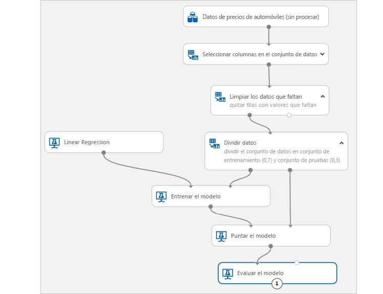

# ¿Qué es el servicio Azure Machine Learning?

Azure Machine Learning Service es un servicio en la nube que se usa para entrenar, implementar, automatizar y administrar modelos de aprendizaje automático, y todo ello con la gran capacidad de escalado que proporciona la nube.

## ¿Qué es el aprendizaje automático?

El aprendizaje automático es una técnica de ciencia de datos que permite a los equipos utilizar datos existentes para prever tendencias, resultados y comportamientos futuros. Mediante el aprendizaje automático, los equipos aprenden sin necesidad de programarlos explícitamente.

Las previsiones o predicciones del aprendizaje automático pueden hacer que las aplicaciones y los dispositivos sean más inteligentes. Por ejemplo, cuando compra en línea, el aprendizaje automático ayuda a recomendar otros productos según lo que haya adquirido. O, cuando pasa su tarjeta de crédito, el aprendizaje automático compara la transacción con una base de datos de transacciones y ayuda a detectar fraudes. Y cuando la aspiradora robot aspira una sala, el aprendizaje automático le ayuda a decidir si se ha terminado el trabajo.

## ¿Qué es el servicio Azure Machine Learning?

Azure Machine Learning Service proporciona un entorno basado en la nube que puede utilizar para preparar los datos, entrenar, probar, implementar, administrar y realizar un seguimiento de los modelos de aprendizaje automático. Comience a entrenar en su máquina local y luego escale horizontalmente a la nube. El servicio es totalmente compatible con tecnologías de código abierto como PyTorch, TensorFlow y scikit-learn y puede usarse para cualquier tipo de aprendizaje automático, desde el clásico a un modelo de aprendizaje profundo, supervisado y no supervisado. 

Explore y prepare datos, entrene y pruebe modelos e impleméntelos mediante herramientas enriquecidas, como:
+ Una [interfaz visual](ui-quickstart-run-experiment.md) en la que se pueden arrastrar y colocar módulos para compilar sus experimentos y, después, implementar modelos.
+ [Cuadernos de Jupyter Notebook](https://jupyter.org) en los que puede utilizar [SDK](https://docs.microsoft.com/azure/machine-learning/service/#reference) para escribir su propio código como, por ejemplo [estos cuadernos de ejemplo](https://aka.ms/aml-notebooks).
+ [Extensión de Visual Studio Code](how-to-vscode-tools.md)

## ¿Qué puedo hacer con el servicio Azure Machine Learning?

Use el <a href="https://aka.ms/aml-sdk" target="_blank">SDK de Azure Machine Learning para Python</a> con paquetes Python de código abierto, o bien use la [interfaz visual (versión preliminar)](ui-quickstart-run-experiment.md) para crear y entrenar modelos de aprendizaje profundo y de aprendizaje automático muy precisos en un área de trabajo de Azure Machine Learning Service.

Puede elegir entre muchos componentes de aprendizaje automático disponibles en los paquetes de Python de código abierto como, por ejemplo, <a href="https://scikit-learn.org/stable/" target="_blank">Scikit-learn</a>, <a href="https://www.tensorflow.org" target="_blank">Tensorflow</a>, <a href="https://pytorch.org" target="_blank">PyTorch</a> y <a href="https://mxnet.io" target="_blank">MXNet</a>.

Tanto si escribe código como si usa la interfaz visual, puede realizar el seguimiento de varias ejecuciones mientras experimenta hasta encontrar la mejor solución y administra los modelos implementados.

### Experiencia con modelo "el código primero"

Comience a entrenar en su máquina local mediante el <a href="https://aka.ms/aml-sdk" target="_blank">SDK de Python para Azure Machine Learning</a> y, luego, escale horizontalmente a la nube. Con muchos [destinos de proceso](how-to-set-up-training-targets.md) disponibles, por ejemplo, los procesos de Azure Machine Learning y [Azure Databricks](/azure/azure-databricks/what-is-azure-databricks), y con los [servicios avanzados de ajuste de hiperparámetros](how-to-tune-hyperparameters.md), puede compilar mejores modelos de forma más rápida gracias al potencial de la nube.

También puede [automatizar el entrenamiento y optimización del modelo](tutorial-auto-train-models.md) mediante el SDK.

### Experiencia sin código o con poco código

Para el entrenamiento sin código, pruebe:

+ La interfaz visual para arrastrar y colocar los experimentos y las implementaciones
    
    

+ La opción de Azure portal para experimentos automatizados de Machine Learning

### Operacionalización (MLOps)

Cuando tenga el modelo adecuado, podrá usarlo fácilmente en un servicio web, en un dispositivo de IoT o en Power BI. Para más información, consulte el artículo sobre [cómo y dónde llevar a cabo la implementación](how-to-deploy-and-where.md). 

Después, puede administrar los modelos implementados mediante el [SDK para Python de Azure Machine Learning](https://aka.ms/aml-sdk) o [Azure Portal](https://portal.azure.com/). 

Se pueden usar estos modelos para que devuelvan predicciones en [tiempo real](how-to-consume-web-service.md) o de forma [asincrónica](how-to-run-batch-predictions.md) para grandes cantidades de datos.

Y con las [canalizaciones de aprendizaje automático](concept-ml-pipelines.md) avanzadas, puede colaborar en cada paso desde la preparación de datos, el entrenamiento y la evaluación de modelos hasta su implementación.

Para comenzar a usar Azure Machine Learning Service, consulte la sección [Pasos siguientes](#next-steps).

## ¿Cómo difiere el servicio Azure Machine Learning Service de Studio?

[Machine Learning Studio](../studio/what-is-ml-studio.md) es un área de trabajo visual colaborativa de arrastrar y colocar, en la que pueden crear, probar e implementar soluciones de aprendizaje automático sin necesidad de escribir código. Utiliza algoritmos de aprendizaje automático y módulos de control de datos pregenerados y preconfigurados así como una plataforma de procesamiento propietaria.

Azure Machine Learning Service proporciona los SDK **y** una interfaz visual (versión preliminar) para preparar datos, entrenar e implementar los modelos de Machine Learning con rapidez. Esta interfaz visual (versión preliminar) ofrece una experiencia de arrastrar y colocar parecida a la de Studio. Sin embargo, a diferencia de la plataforma de proceso propiedad de Studio, la interfaz visual utiliza sus propios recursos de proceso y está totalmente integrada en Azure Machine Learning Service.

Esta es una comparación rápida.

|| Machine Learning Studio | Azure Machine Learning Service: Interfaz visual|
|---| --- | --- |
|| Disponible con carácter general | En versión preliminar|
|Módulos de la interfaz| Muchos | Conjunto inicial de módulos conocidos|
|Entrenamiento de destinos de proceso| Destino de proceso propietario, solo admite CPU| Admite el proceso con Azure Machine Learning, GPU o CPU. (Se admiten otros procesos en el SDK)|
|Destinos de proceso de implementación| Formato del servicio web propietario, no personalizable | Opciones de seguridad de empresa y Azure Kubernetes Service.  ([Otros procesos](how-to-deploy-and-where.md) que admite el SDK) |
|Entrenamiento de modelos y optimización de hiperparámetros automatizado | Sin  | No disponible todavía en la interfaz visual.   (Se admite en el SDK y en Azure Portal). | 

Pruebe la interfaz visual (versión preliminar) con [Inicio rápido: Preparación y visualización de datos sin escribir código](ui-quickstart-run-experiment.md)

> [!NOTE]
> Azure Machine Learning Service no puede implementar ni administrar los modelos creados en Studio. Sin embargo, los modelos creados e implementados en la interfaz visual del servicio se pueden administrar mediante el área de trabajo de Azure Machine Learning Service.

## Evaluación gratuita

Si no tiene una suscripción a Azure, cree una cuenta gratuita antes de empezar. Pruebe hoy mismo la [versión gratuita o de pago de Azure Machine Learning Service](https://aka.ms/AMLFree).

Puede obtener créditos para gastarlos en servicios de Azure. Después de que se agoten los créditos, puede mantener la cuenta y usar los [servicios gratuitos de Azure](https://azure.microsoft.com/free/). No se le realizará ningún cargo en su tarjeta de crédito a menos que cambie explícitamente la configuración y lo solicite. O bien, [active las ventajas de suscriptor de MSDN](https://azure.microsoft.com/pricing/member-offers/msdn-benefits-details/?WT.mc_id=A261C142F) que le proporciona crédito todos los meses que puede usar con servicios de Azure de pago.

## Pasos siguientes

- [Cree un área de trabajo de Machine Learning Service](setup-create-workspace.md) para empezar a trabajar.

- Siga los tutoriales completos: 
  + [Entrenamiento de un modelo de clasificación de imágenes con Azure Machine Learning Service](tutorial-train-models-with-aml.md) 
  + [Preparación de datos y uso de Machine Learning automatizado para entrenar un modelo de regresión](tutorial-data-prep.md)

- Aprenda sobre [la canalización de aprendizaje automático ](/azure/machine-learning/service/concept-ml-pipelines) para crear, optimizar y administrar los escenarios de aprendizaje automático.

- Lea detenidamente el artículo [Arquitectura y conceptos del servicio Azure Machine Learning](concept-azure-machine-learning-architecture.md).

- Para información, consulte [otros productos de Microsoft de aprendizaje automático](/azure/architecture/data-guide/technology-choices/data-science-and-machine-learning).
