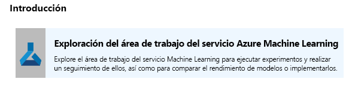
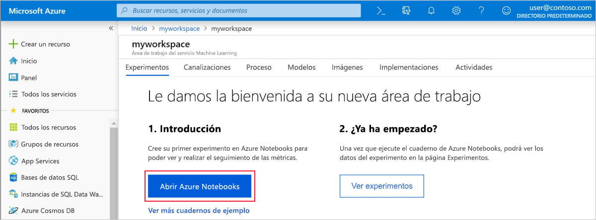
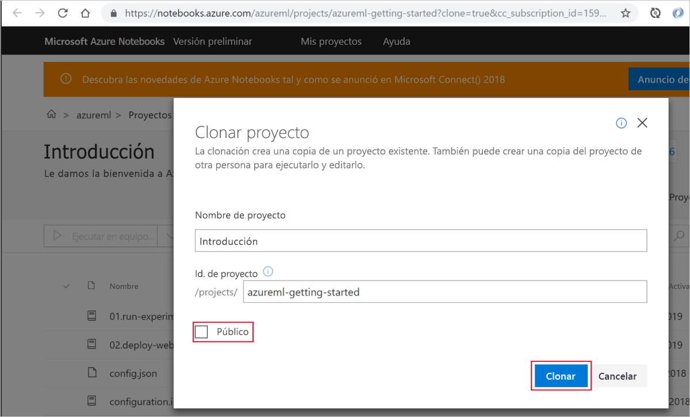
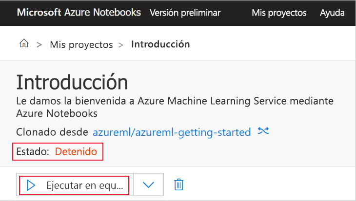
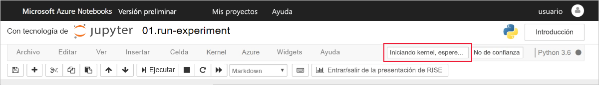
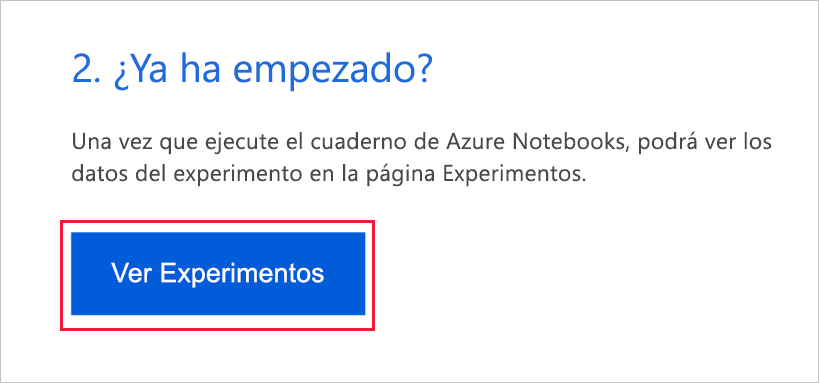
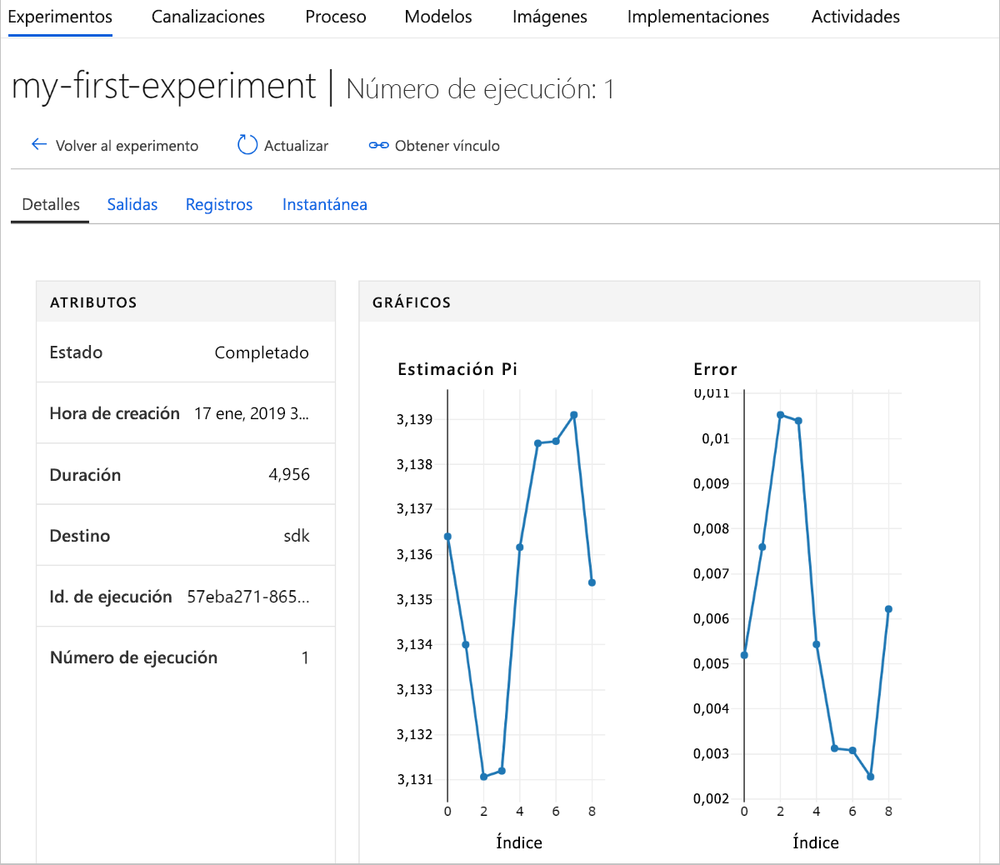

# Guía de inicio rápido: Uso de Azure Portal para empezar a trabajar con Azure Machine Learning

Use Azure Portal para crear un área de trabajo de Azure Machine Learning. Esta área de trabajo se encuentra en la nube y es el bloque fundamental que se utiliza para experimentar, entrenar e implementar modelos de aprendizaje automático con Machine Learning. Esta guía de inicio rápido usa recursos en la nube y no requiere ninguna instalación. Para configurar en su lugar un servidor de Jupyter Notebook propio, vea [Inicio rápido: Uso de Python para empezar a usar Azure Machine Learning](quickstart-create-workspace-with-python.md).  
 
En este artículo de inicio rápido, lleve a cabo las acciones siguientes:

* Crear un área de trabajo en la suscripción de Azure.
* Pruébela con Python en un cuaderno de Jupyter y registre los valores en varias iteraciones.
* Verá los valores registrados en el área de trabajo.

Los siguientes recursos de Azure se agregan automáticamente al área de trabajo cuando estén disponibles por regiones:

  - [Azure Container Registry](https://azure.microsoft.com/services/container-registry/)
  - [Azure Storage](https://azure.microsoft.com/services/storage/)
  - [Azure Application Insights](https://azure.microsoft.com/services/application-insights/) 
  - [Azure Key Vault](https://azure.microsoft.com/services/key-vault/)

Los recursos que cree se pueden usar como requisitos previos para otros tutoriales y artículos de procedimientos de Machine Learning. Al igual que en otros servicios de Azure, existen límites en determinados recursos asociados con Machine Learning. Un ejemplo es el tamaño del clúster de proceso. Obtenga más información sobre los [límites predeterminados y cómo aumentar la cuota](how-to-manage-quotas.md).

Si no tiene una suscripción a Azure, cree una cuenta gratuita antes de empezar. Pruebe hoy mismo la [versión gratuita o de pago de Azure Machine Learning Service](http://aka.ms/AMLFree).

## Crear un área de trabajo 

[!INCLUDE [aml-create-portal](../../../includes/aml-create-in-portal.md)]

## Uso del área de trabajo

> [!VIDEO https://www.microsoft.com/en-us/videoplayer/embed/RE2F9Ad]

Aprenda ahora cómo un área de trabajo lo ayuda a administrar los scripts de aprendizaje automático. En esta sección, lleve a cabo estos pasos:

* Va a abrir un cuaderno en Azure Notebooks.
* Ejecutará código que cree algunos valores registrados.
* Verá los valores registrados en el área de trabajo.

En este ejemplo se muestra cómo el área de trabajo puede ayudarle a realizar un seguimiento de la información generada en un script. 

### Abra un cuaderno. 

[Azure Notebooks](https://notebooks.azure.com) ofrece una plataforma de nube gratuita para cuadernos de Jupyter preconfigurada con todo lo que necesita para ejecutar Machine Learning. Desde el área de trabajo, puede iniciar esta plataforma para empezar a usar el área de trabajo de Azure Machine Learning Service.

1. En la página del área de trabajo, seleccione **Explore your Azure Machine Learning service Workspace** (Exploración del área de trabajo del servicio Azure Machine Learning).

 

1. Seleccione **Open Azure Notebooks** (Abrir Azure Notebooks) para probar su primer experimento en Azure Notebooks.  Azure Notebooks es un servicio independiente que permite ejecutar cuadernos de Jupyter de manera gratuita en la nube.  Cuando se usa este vínculo al servicio, se agrega a la biblioteca que crea en Azure Notebooks información sobre cómo conectarse al área de trabajo.

 

1. Inicie sesión en Azure Notebooks.  Asegúrese de hacerlo con la misma cuenta que usó para iniciar sesión en Azure Portal. Su organización puede requerir el [consentimiento del administrador](https://notebooks.azure.com/help/signing-up/work-or-school-account/admin-consent) para poder iniciar sesión.

1. Después de iniciar sesión, se abrirá una nueva pestaña y un aviso `Clone Library`. Al clonarse esta biblioteca se cargará un conjunto de cuadernos y otros archivos en su cuenta de Azure Notebooks.  Estos archivos le ayudan a explorar las funcionalidades de Azure Machine Learning.

1. Desactive la opción **Public** (Público) para evitar compartir la información de su área de trabajo con otros usuarios.

1. Seleccione **Clonar**.

 

1. Si observa que el estado del proyecto es detenido, haga clic en **Run on Free Compute** (Ejecutar en proceso gratuito) para usar el servidor de cuaderno gratuito.

    

### Ejecución del cuaderno

En la lista de archivos de este proyecto, verá un archivo `config.json`. Este archivo de configuración contiene información sobre el área de trabajo que creó en Azure Portal.  Este archivo permite que el código se conecte al área de trabajo y agregue información a esta.

1. Seleccione **01.run-experiment.ipynb** para abrir el cuaderno.

1. El área de estado le dice que espere hasta que se haya iniciado el kernel.  El mensaje desaparece una vez que el kernel está listo.

    

1. Una vez iniciado el kernel, ejecute las celdas de una en una mediante **Mayús + Intro**. O bien, seleccione **Cells** > **Run All** (Celdas > Ejecutar todo) para ejecutar todo el cuaderno. Si ve un asterisco, __*__, junto a una celda, significa que aún se está ejecutando la celda. Cuando finalice el código de esa celda, aparece un número. 

1. Siga las instrucciones que aparecen en el cuaderno para autenticar su suscripción de Azure.

Cuando haya terminado de ejecutar todas las celdas del cuaderno, podrá ver los valores registrados en el área de trabajo.

## Visualización de los datos registrados

1. La salida de la celda `run` contiene un vínculo que lleva de vuelta a Azure Portal para que vea los resultados del experimento en el área de trabajo. 

    

1. Haga clic en el **vínculo a Azure Portal** para ver información sobre la ejecución en el área de trabajo.  Este vínculo abre el área de trabajo en Azure Portal.

1. Los trazados de los valores registrados que ve se crearon automáticamente en el área de trabajo. Cada vez que registre varios valores con el mismo parámetro de nombre, se genera automáticamente un trazado.

   

Dado que el código para la aproximación de pi usa valores aleatorios, los trazados mostrarán otros valores.  

## Limpieza de recursos 

[!INCLUDE [aml-delete-resource-group](../../../includes/aml-delete-resource-group.md)]

También puede mantener el grupo de recursos pero eliminar una sola área de trabajo. Muestre las propiedades del área de trabajo y seleccione **Eliminar**.

## Pasos siguientes

Ha creado los recursos necesarios para experimentar con modelos e implementarlos. También ha ejecutado algún código en un cuaderno. Y ha explorado el historial de ejecución desde dicho código en el área de trabajo en la nube.

Para ver de forma detallada la experiencia de flujo de trabajo, siga los tutoriales de Machine Learning para entrenar e implementar un modelo:  

> [!div class="nextstepaction"]
> [Tutorial: Entrenamiento de un modelo de clasificación de imágenes](tutorial-train-models-with-aml.md)
