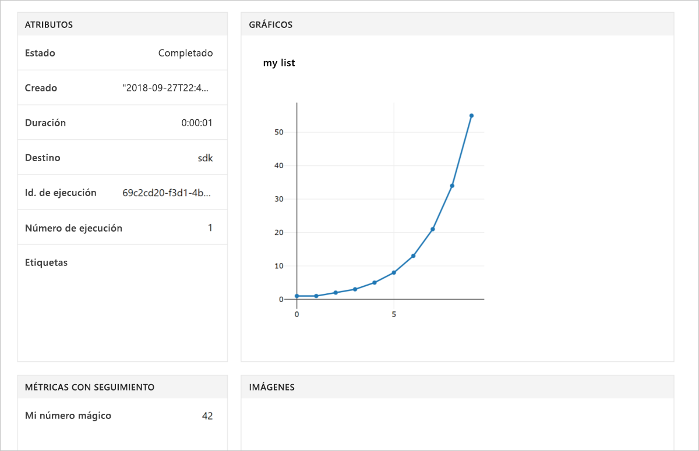

# <a name="quickstart-use-your-own-notebook-server-to-get-started-with-azure-machine-learning"></a>Inicio rápido: Uso de su propio servidor de cuadernos para empezar a trabajar con Azure Machine Learning

Use su propio servidor de cuadernos para ejecutar el código que registra valores en el [área de trabajo de Azure Machine Learning Service](concept-azure-machine-learning-architecture.md). El área de trabajo se encuentra en la nube y es el bloque fundamental que se utiliza para experimentar, entrenar e implementar modelos de aprendizaje automático con Machine Learning.

Este inicio rápido usa su propio entorno de Python y el servidor de Jupyter Notebook. Para empezar a trabajar rápidamente sin necesidad de instalar el SDK, consulte [Inicio rápido: Uso de un servidor de cuadernos basado en la nube para empezar a trabajar con Azure Machine Learning](quickstart-run-cloud-notebook.md) 

Vea una versión en vídeo de este artículo de inicio rápido:

> [!VIDEO https://www.microsoft.com/en-us/videoplayer/embed/RE2G9N6]

Si no tiene una suscripción a Azure, cree una cuenta gratuita antes de empezar. Pruebe hoy mismo la [versión gratuita o de pago de Azure Machine Learning Service](https://aka.ms/AMLFree).

## <a name="prerequisites"></a>Requisitos previos

* Un servidor de cuadernos de Python 3.6 con el SDK de Azure Machine Learning instalado.
* Un área de trabajo de Azure Machine Learning Service.
* Un archivo de configuración de área de trabajo (**aml_config/config.json**).

Consiga todos estos requisitos previos en [Creación de un área de trabajo de Azure Machine Learning Service](setup-create-workspace.md#portal).


## <a name="use-the-workspace"></a>Uso del área de trabajo

Cree un script o inicie un cuaderno en el mismo directorio que el archivo de configuración de área de trabajo. Ejecute este código, que usa las API básicas del SDK para realizar un seguimiento de las ejecuciones del experimento:

1. Cree un experimento en el área de trabajo.
1. Registre un valor individual en el experimento.
1. Registre una lista de valores en el experimento.

[!code-python[](~/aml-sdk-samples/ignore/doc-qa/quickstart-create-workspace-with-python/quickstart.py?name=useWs)]

## <a name="view-logged-results"></a>Visualización de los resultados registrados

Cuando finaliza la ejecución, puede ver la ejecución del experimento en Azure Portal. Para imprimir una dirección URL que lleva a los resultados de la última ejecución, use el código siguiente:

```python
print(run.get_portal_url())
```

Este código devuelve un vínculo que se puede usar para ver los valores de Azure Portal en el explorador.



## <a name="clean-up-resources"></a>Limpieza de recursos 

>[!IMPORTANT]
>Puede usar los recursos que creó aquí como requisitos previos para otros tutoriales y artículos de procedimientos de Machine Learning.

Si no tiene planeado usar los recursos que creó en este artículo, elimínelos para evitar incurrir en cualquier cargos.

[!code-python[](~/aml-sdk-samples/ignore/doc-qa/quickstart-create-workspace-with-python/quickstart.py?name=delete)]

## <a name="next-steps"></a>Pasos siguientes

En este artículo, creó los recursos necesarios para experimentar con los modelos e implementarlos. Ejecutó código en un cuaderno y exploró el historial de ejecuciones del código en el área de trabajo en la nube.

> [!div class="nextstepaction"]
> [Tutorial: Entrenamiento de un modelo de clasificación de imágenes](tutorial-train-models-with-aml.md)

También puede explorar [ejemplos más avanzados en GitHub](https://aka.ms/aml-notebooks) o ver la [guía de usuario del SDK](https://docs.microsoft.com/python/api/overview/azure/ml/intro?view=azure-ml-py).
