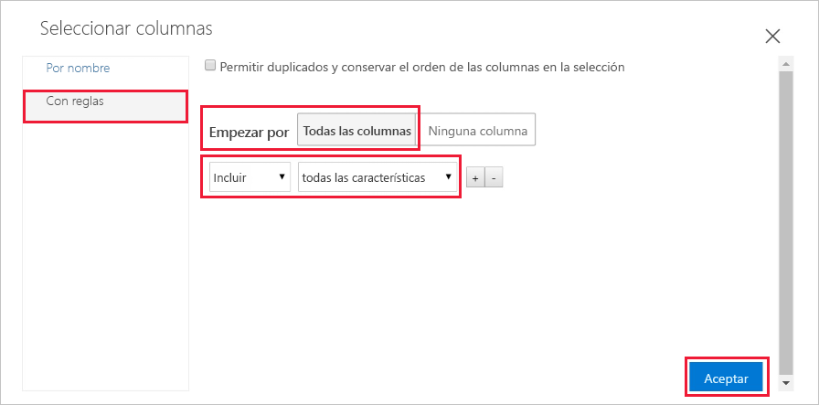
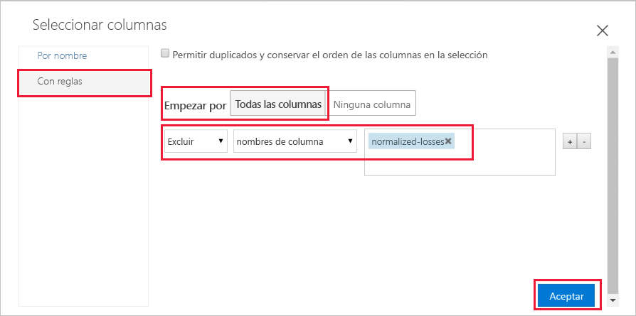
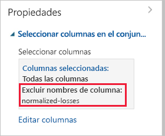
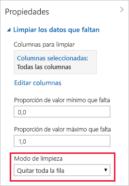

# Inicio rápido: Preparación y visualización de datos sin escribir código en Azure Machine Learning

Prepare y visualice los datos en la interfaz visual de arrastrar y colocar (versión preliminar) para Azure Machine Learning. Los datos que se usarán incluyen entradas para diversos automóviles individuales, por ejemplo, información sobre la marca, el modelo, las especificaciones técnicas y el precio.  

En este inicio rápido podrá explorar y preparar los datos:

- Creará su primer experimento para agregar y obtener una vista previa de los datos
- Preparará los datos mediante la eliminación de los valores que faltan
- Ejecución del experimento
- Visualizará los datos resultantes

Si no está familiarizado con el aprendizaje automático, la serie de vídeos [Data Science for Beginners](https://docs.microsoft.com/azure/machine-learning/studio/data-science-for-beginners-the-5-questions-data-science-answers) (Ciencia de datos para principiantes) le puede brindar una excelente introducción al aprendizaje automático.

## Requisitos previos

Si no tiene una suscripción a Azure, cree una cuenta gratuita antes de empezar. Pruebe hoy mismo la [versión gratuita o de pago de Azure Machine Learning Service](https://aka.ms/AMLFree).

### Crear un área de trabajo

Si tiene un área de trabajo de Azure Machine Learning Service, vaya a la [siguiente sección](#start). En caso contrario, créela ahora.

[!INCLUDE [aml-create-portal](../../../includes/aml-create-in-portal.md)]

##  Apertura de la página web de la interfaz visual

1. Abra el área de trabajo en [Azure Portal](https://portal.azure.com/).  

1. En el área de trabajo, seleccione **Interfaz visual**.  Luego, seleccione **Iniciar interfaz visual**.  
 
    

    La página web de la interfaz se abre en una nueva página del explorador.  

## Creación de su primer experimento

La herramienta de interfaz visual le proporciona un área de trabajo visual e interactiva para generar, probar e iterar con toda facilidad sobre un modelo de análisis predictivo. Se arrastran y colocan conjuntos de datos y módulos de análisis en un lienzo interactivo, conectándolos todos para formar un _experimento_.  Cree su primer experimento hoy mismo.

1. En la esquina inferior izquierda, seleccione **Agregar nuevo**.

1. Seleccione **Experimento en blanco**.

1. El experimento recibe un nombre predeterminado. Seleccione este texto y cambie su nombre por el de "Inicio rápido: exploración de datos". No es necesario que este nombre sea único.

1. El **minimapa** de la parte inferior de la pantalla es útil para ver experimentos de gran tamaño.  No lo necesitará en este inicio rápido, así que haga clic en la flecha de la parte superior para minimizarlo.  

    

## Agregar datos

Lo primero que necesita en el aprendizaje automático son datos. Hay varios conjuntos de datos de ejemplo en esta interfaz que puede usar; otra opción es importarlos de diversos orígenes. En este ejemplo, usaremos el conjunto de datos de ejemplo, **Automobile price data (Raw)** (Datos de precios de automóviles, sin procesar). 

1. A la izquierda del lienzo de experimentos, hay una paleta de conjuntos de datos y módulos. Seleccione **Conjuntos de datos guardados** y, a continuación, seleccione **Ejemplos** para ver los conjuntos de datos de ejemplo disponibles.

1. Seleccione el conjunto de datos **Automobile price data (raw)** y arrástrelo al lienzo.

   

## Select columns

Seleccione las columnas de datos con las que va a trabajar.  Para empezar, configure el módulo para que muestre todas las columnas disponibles.

> [!TIP]
> Si conoce el nombre de los datos o el módulo que desea, utilice la barra de búsqueda de la parte superior de la paleta para encontrarlo rápidamente.  Durante el resto del inicio rápido usará este acceso directo.

1. Escriba **Select** (Seleccionar) en el cuadro de búsqueda para buscar el módulo **Select Columns in Dataset** (Seleccionar columnas en el conjunto de datos).

1. Haga clic y arrastre el módulo **Select Columns in Dataset** al lienzo. Coloque el módulo bajo el conjunto de datos que agregó anteriormente.

1. Conecte el conjunto de datos al módulo **Select Columns in Dataset**: haga clic en el puerto de salida del conjunto de datos, arrastre al puerto de entrada de **Select Columns in Dataset** y, finalmente, suelte el botón del mouse. El conjunto de datos y el módulo permanecen conectados aunque se desplace por el lienzo.

    > [!TIP]
    > Los conjuntos de datos y los módulos tienen puertos de entrada y de salida representados por pequeños círculos: los puertos de entrada arriba y los puertos de salida abajo. Puede crear un flujo de datos a través del experimento si conecta un puerto de salida de un módulo a un puerto de entrada de otro.
    >
    > Si tiene problemas para conectar los módulos, intente arrastrarlo hacia el nodo al que se va a conectar.

     

    El signo de exclamación en rojo indica que no se han configurado aún las propiedades de este módulo. Se hará a continuación.
   
1. Seleccione el módulo **Select Columns in Dataset**.

1. En el panel **Propiedades** a la derecha del lienzo, seleccione **Editar columnas**.

    En el cuadro de diálogo **Seleccionar columnas**, seleccione **TODAS LAS COLUMNAS** e incluya **todas las características**. El cuadro de diálogo debe ser similar al siguiente:

     

1. En la esquina inferior derecha, seleccione **Aceptar** para cerrar el selector de columnas.

## Ejecución del experimento

En cualquier momento, puede hacer clic en el puerto de salida de un conjunto de datos o de un módulo para ver el aspecto de los datos en ese punto del flujo de datos.  Si la opción **Visualizar** está deshabilitada, primero debe ejecutar el experimento.  Se hará a continuación.

[!INCLUDE [aml-ui-create-training-compute](../../../includes/aml-ui-create-training-compute.md)]

Cuando el destino de proceso está disponible, se ejecuta el experimento. Una vez completada la ejecución, aparece una marca de verificación verde en cada módulo.

## Vista previa de los datos

Ahora que ha ejecutado el experimento inicial, puede visualizar los datos para conocer mejor la información con la que debe trabajar.

1. Seleccione el puerto de salida en la parte inferior del módulo **Select Columns in Dataset** y, a continuación, seleccione **Visualizar**.

1. Haga clic en diferentes columnas de la ventana de datos para ver información acerca de esa columna.  

    En este conjunto de datos, cada fila representa un automóvil y las variables asociadas a cada automóvil aparecen como columnas.    Hay 205 filas y 26 columnas en este conjunto de datos.

     Cada vez que haga clic en una columna de datos, la información de **estadística** y la imagen de **visualización** de esa columna aparecerá a la izquierda.  Por ejemplo, si hace clic en **num-of-doors** (número de puertas) verá que tiene dos valores únicos y dos valores que faltan.  Desplácese hacia abajo para ver los valores: dos y cuatro puertas.

     

1. Haga clic en cada columna para más información sobre el conjunto de datos.

## Preparación de los datos

Normalmente, un conjunto de datos requiere algún procesamiento previo antes de que se pueda analizar. Es posible que haya observado los valores que faltan en las columnas de varias filas. Estos valores que faltan se deben limpiar para que el modelo pueda analizar los datos de manera adecuada. Va a quitar todas las filas que tengan valores que faltan. Además, la columna **normalized-losses** tiene una gran proporción de valores que faltan, por lo que excluiremos esa columna del modelo por completo.

> [!TIP]
> Limpiar los valores que faltan de los datos de entrada es un requisito previo para usar la mayoría de los módulos.  

### Quitar columna

En primer lugar, elimine por completo la columna **normalized-losses**.

1. Seleccione el módulo **Select Columns in Dataset**.

1. En el panel **Propiedades** a la derecha del lienzo, seleccione **Editar columnas**.

    * Deje las opciones **With rules** (Con reglas) y **TODAS LAS COLUMNAS** seleccionadas.

    * En los menús desplegables, seleccione **Excluir** y **nombres de columna** y luego haga clic en el cuadro de texto. Escriba **normalized-losses**.

    * En la esquina inferior derecha, seleccione **Aceptar** para cerrar el selector de columnas.

    
        
    Ahora el panel de propiedades de Select Columns in Dataset (Seleccionar columnas en el conjunto de datos) indica que se pasará por todas las columnas del conjunto de datos excepto **normalized-losses**.
        
    El panel de propiedades muestra que la columna **normalized-losses** se ha excluido.
        
    
        
    Puede agregar un comentario a un módulo; para ello, haga doble clic en el módulo y escriba texto. Esto puede ayudarle a ver de un vistazo lo que el módulo hace en el experimento. 

1. Haga doble clic en el módulo **Select Columns in Dataset** y escriba el comentario "Excluir normalized-losses". 
    
    Después de escribir el comentario, haga clic fuera del módulo.  Aparece una flecha hacia abajo que indica que el módulo contiene un comentario.

1. Haga clic en esta flecha para mostrar el comentario.

    El módulo ahora muestra una flecha hacia arriba para ocultar el comentario.
        
    

### Limpiar datos que faltan

A continuación, agregue otro módulo que quite las filas restantes que tengan datos que faltan.

1. Escriba **Clean** (Limpiar) en el cuadro de búsqueda para encontrar el módulo **Clean Missing Data** (Limpiar datos que faltan).

1. Arrastre el módulo **Clean Missing Data** al lienzo del experimento y conéctelo con el módulo **Select Columns in Dataset**. 

1. En el panel Propiedades, seleccione **Remove entire row** (Quitar la fila entera) en **Cleaning mode** (Modo de limpieza).

    Estas opciones indican a **Clean Missing Data** (Limpiar los datos que faltan) que limpie los datos quitando las filas con valores que faltan.

1. Haga doble clic en el módulo y escriba el comentario "Quitar las filas sin valor".
 
    

    El experimento debería tener ahora un aspecto similar al siguiente:
    
    

## Visualización de los resultados

Como ha realizado cambios en los módulos del experimento, el estado ha cambiado a "Borrador".  Para visualizar los nuevos datos limpios, primero debe ejecutar de nuevo el experimento.

1. Seleccione **Ejecutar** en la parte inferior para ejecutar el experimento.

    Esta vez se puede reutilizar el destino de proceso que creó anteriormente.  

1. Seleccione **Ejecutar** en el cuadro de diálogo.

   

1. Cuando se complete la ejecución, haga clic con el botón derecho en el módulo **Clean Missing Data** para visualizar los nuevos datos limpios.  

    

1. Haga clic en diferentes columnas de la ventana de datos limpios para ver cómo han cambiado los datos.  

    

    Ahora hay 193 filas y 25 columnas.

    Si hace clic en **num-of-doors** (número de puertas) verá que aún tiene dos valores únicos pero ahora ya no tiene ningún valor que falte.  

## Limpieza de recursos

[!INCLUDE [aml-ui-cleanup](../../../includes/aml-ui-cleanup.md)]

## Pasos siguientes

En este tutorial, ha aprendido a hacer lo siguiente:

- Creará su primer experimento para agregar y obtener una vista previa de los datos
- Preparará los datos mediante la eliminación de los valores que faltan
- Visualizará los datos resultantes

Seguir el tutorial para usar estos datos para predecir el precio de un automóvil.

> [!div class="nextstepaction"]
> [Tutorial: Predicción del precio de un automóvil con la interfaz visual](ui-tutorial-automobile-price-train-score.md)
