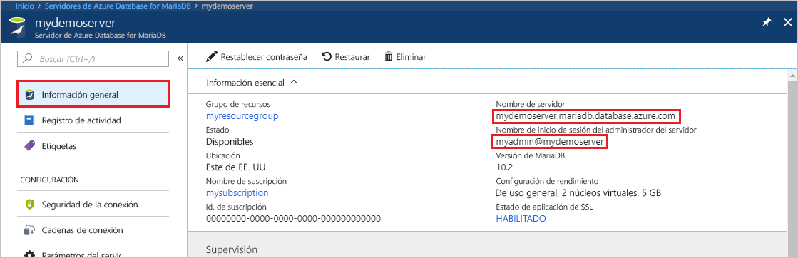
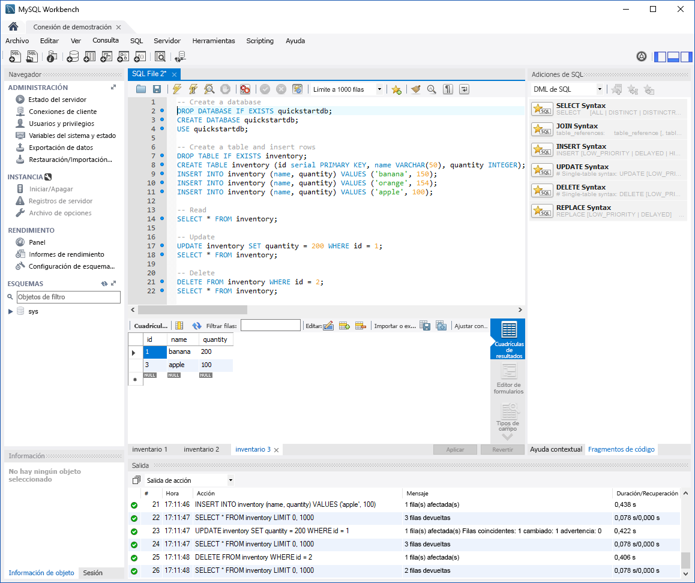

# <a name="azure-database-for-mariadb-use-mysql-workbench-to-connect-and-query-data"></a>Azure Database for MariaDB: uso de MySQL Workbench para conectarse y consultar datos

En esta guía de inicio rápido se muestra cómo conectarse a una instancia de Azure Database for MariaDB mediante MySQL Workbench. 

## <a name="prerequisites"></a>Requisitos previos

En esta guía de inicio rápido se usan como punto de partida los recursos creados en una de las guías siguientes:

- [Creación de un servidor de Azure Database for MariaDB mediante Azure Portal](./quickstart-create-mariadb-server-database-using-azure-portal.md)
- [Creación de un servidor de Azure Database for MariaDB mediante la CLI de Azure](./quickstart-create-mariadb-server-database-using-azure-cli.md)

## <a name="install-mysql-workbench"></a>Instalación de MySQL Workbench

[Descargue MySQL Workbench](https://dev.mysql.com/downloads/workbench/) e instálelo en su equipo.

## <a name="get-connection-information"></a>Obtención de información sobre la conexión

Obtenga la información de conexión necesaria para conectarse a la instancia de Azure Database for MariaDB. Necesitará el nombre completo del servidor y las credenciales de inicio de sesión.

1. Inicie sesión en el [Azure Portal](https://portal.azure.com/).

2. Seleccione **Todos los recursos** en el menú de la izquierda de Azure Portal. Busque el servidor que ha creado (por ejemplo, **mydemoserver**).

3. Seleccione el nombre del servidor.

4. En la página **Información general** del servidor, anote los valores del **nombre del servidor** y del **nombre de inicio de sesión del administrador del servidor**. Si olvidó la contraseña, también puede restablecerla en esta página.

 

## <a name="connect-to-the-server-by-using-mysql-workbench"></a>Conexión al servidor con MySQL Workbench

Para conectarse a un servidor de Azure Database for MariaDB mediante MySQL Workbench:

1.  Abra MySQL Workbench en el equipo. 

2.  En el cuadro de diálogo **Setup New Connection** (Configurar nueva conexión), escriba la siguiente información en la pestaña **Parameters** (Parámetros):

    | Configuración | Valor sugerido | Descripción del campo |
    |---|---|---|
    |   Nombre de la conexión | **Conexión de demostración** | Especifique una etiqueta para esta conexión. |
    | Método de conexión | **Estándar (TCP/IP)** | Estándar (TCP/IP) es suficiente. |
    | Nombre de host. | *nombre del servidor* | Especifique el valor del nombre de servidor que usó al crear la instancia de Azure Database for MariaDB. El servidor de ejemplo es **mydemoserver.mariadb.database.azure.com**. Use el nombre de dominio completo (\*.mariadb.database.azure.com) como se muestra en el ejemplo. Si no recuerda el nombre del servidor, siga los pasos de la sección anterior para obtener la información de conexión.  |
    | Port | **3306** | Utilice siempre el puerto 3306 para conectarse a Azure Database for MariaDB. |
    | Nombre de usuario |  *nombre de inicio de sesión del administrador del servidor* | Escriba el valor del nombre de usuario de inicio de sesión del administrador que usó al crear la instancia de Azure Database for MariaDB. El nombre de usuario del ejemplo es **myadmin@mydemoserver**. Si no recuerda el nombre de inicio de sesión del administrador del servidor, siga los pasos de la sección anterior para obtener la información de conexión. El formato es *username@servername*.
    | Contraseña | *la contraseña* | Para guardar la contraseña, seleccione **Store in Vault** (Almacenar en el almacén). |

    

3.   Para comprobar si todos los parámetros están configurados correctamente, seleccione **Test Connection** (Probar conexión). 

4.   Seleccione **Aceptar** para guardar la conexión. 

5.   En **MySQL Connections** (Conexiones de MySQL), seleccione el icono correspondiente al servidor. Espere a que se establezca la conexión.

    Una pestaña SQL nueva se abre con un editor en blanco en el que puede escribir las consultas.
    
    > [!NOTE]
    > De forma predeterminada, la seguridad de la conexión SSL es necesaria y se aplica al servidor de Azure Database for MariaDB. Aunque normalmente no se necesita ninguna configuración adicional de los certificados SSL para que MySQL Workbench se conecte al servidor, se recomienda enlazar el certificado SSL de entidad de certificación con MySQL Workbench. Si necesita deshabilitar SSL, en el menú de la página de información general del servidor en Azure Portal, seleccione **Seguridad de la conexión**. En **Aplicar conexión SSL**, seleccione **Deshabilitado**.

## <a name="create-table-and-insert-read-update-and-delete-data"></a>Creación de una tabla e inserción, lectura, actualización y eliminación de datos

1. Copie y pegue el siguiente código SQL de ejemplo en la página de una pestaña SQL en blanco para mostrar algunos datos de ejemplo.

    Este código crea una base de datos vacía denominada **quickstartdb**. A continuación, crea una tabla de ejemplo denominada **inventory**. El código inserta algunas filas y luego las lee. Cambia los datos con una instrucción de actualización y vuelve a leer las filas. Finalmente, elimina una fila y vuelve a leer las filas.
    
    ```sql
    -- Create a database
    -- DROP DATABASE IF EXISTS quickstartdb;
    CREATE DATABASE quickstartdb;
    USE quickstartdb;
    
    -- Create a table and insert rows
    DROP TABLE IF EXISTS inventory;
    CREATE TABLE inventory (id serial PRIMARY KEY, name VARCHAR(50), quantity INTEGER);
    INSERT INTO inventory (name, quantity) VALUES ('banana', 150);
    INSERT INTO inventory (name, quantity) VALUES ('orange', 154);
    INSERT INTO inventory (name, quantity) VALUES ('apple', 100);
    
    -- Read
    SELECT * FROM inventory;
    
    -- Update
    UPDATE inventory SET quantity = 200 WHERE id = 1;
    SELECT * FROM inventory;
    
    -- Delete
    DELETE FROM inventory WHERE id = 2;
    SELECT * FROM inventory;
    ```

    En la captura de pantalla se muestra un ejemplo de código de SQL en MySQL Workbench y la salida tras la ejecución:
    
    

2. Para ejecutar el código de SQL de ejemplo, seleccione el icono de rayo que aparece en la barra de herramientas de la pestaña **Archivo SQL**.
3. Observe los tres resultados tabulados de la sección **Cuadrículas de resultados** del centro de la página. 
4. Observe la lista **Salida** que se encuentra en la parte inferior de la página. Se muestra el estado de cada comando. 

En esta guía de inicio rápido se ha creado una conexión a Azure Database for MariaDB con MySQL Workbench y se han consultado datos mediante el lenguaje SQL.

<!--
## Next steps
> [!div class="nextstepaction"]
> [Migrate your database using Export and Import](./concepts-migrate-import-export.md)
-->