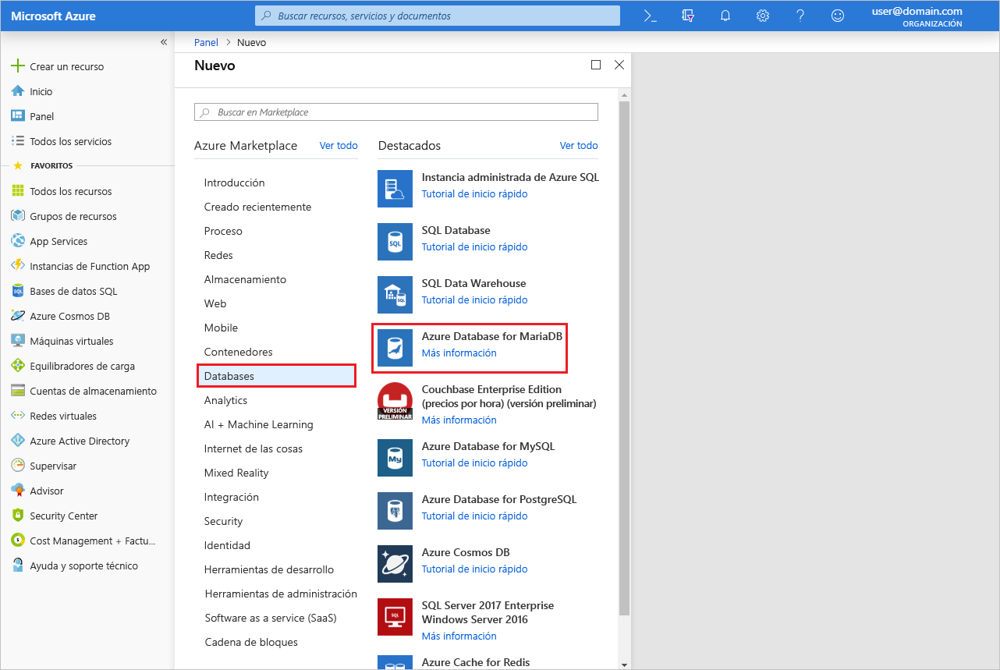
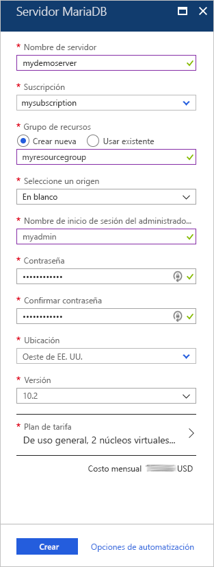
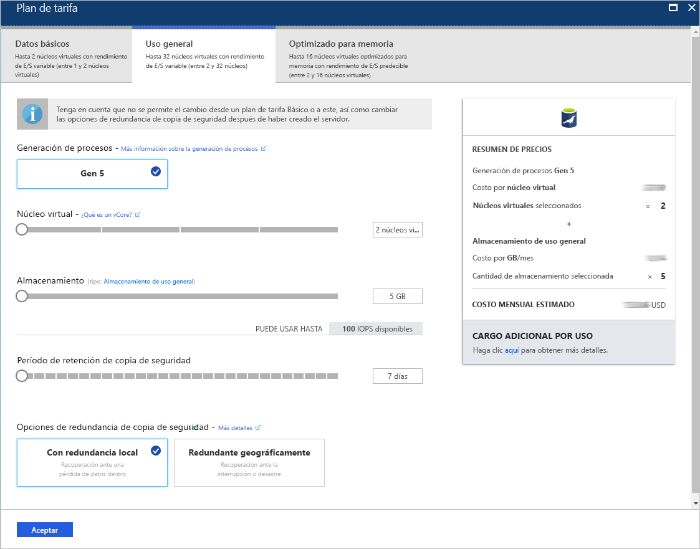
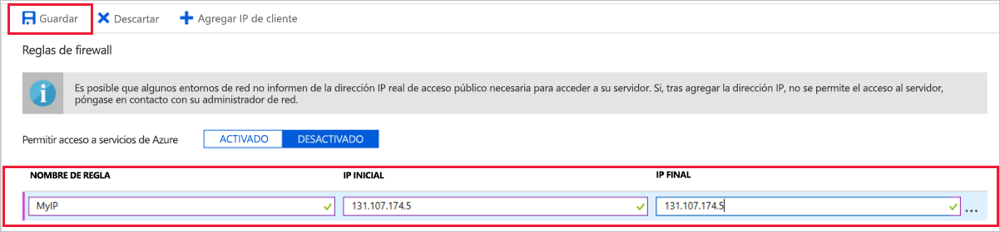
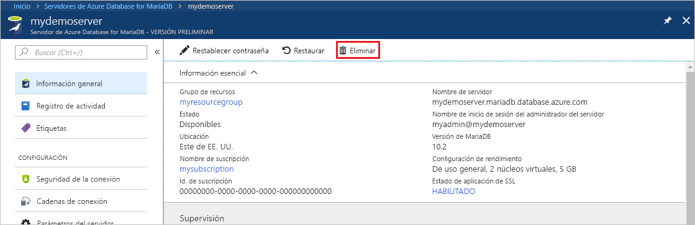

# <a name="create-an-azure-database-for-mariadb-server-by-using-the-azure-portal"></a>Creación de un servidor de Azure Database for MariaDB mediante Azure Portal

Azure Database for MariaDB es un servicio administrado que se usa para ejecutar, administrar y escalar bases de datos MariaDB de alta disponibilidad en la nube. En esta guía de inicio rápido se muestra cómo crear un servidor de Azure Database for MariaDB en unos cinco minutos mediante Azure Portal.  

Si no tiene una suscripción a Azure, cree una [cuenta gratuita de Azure](https://azure.microsoft.com/free/) antes de empezar.

## <a name="sign-in-to-the-azure-portal"></a>Inicio de sesión en Azure Portal

En el explorador web, vaya a [Azure Portal](https://portal.azure.com/). Introduzca sus credenciales para iniciar sesión en el portal. La vista predeterminada es el panel del servicio.

## <a name="create-an-azure-database-for-mariadb-server"></a>Creación de un servidor de Azure Database for MariaDB

Se crea un servidor de Azure Database for MariaDB con un conjunto definido de [recursos de proceso y almacenamiento](concepts-pricing-tiers.md). Cree el servidor dentro en un [grupo de recursos de Azure](../azure-resource-manager/resource-group-overview.md).

Creación de un servidor de Azure Database for MariaDB:

1. Seleccione el botón **Crear un recurso** (+) de la esquina superior izquierda del portal.

2. Seleccione **Bases de datos** > **Azure Database for MariaDB**. También puede escribir **MariaDB** en el cuadro de búsqueda para encontrar el servicio.

   

3. Escriba o seleccione los siguientes detalles del servidor:
   
   

    Configuración | Valor sugerido | DESCRIPCIÓN
    ---|---|---
    Nombre de servidor | *nombre del servidor único* | Elija un nombre único que identifique el servidor de Azure Database for MariaDB. Por ejemplo, **mydemoserver**. El nombre de dominio *.mariadb.database.azure.com* se anexa al nombre de servidor especificado. El nombre del servidor solo puede contener letras minúsculas, números y el carácter de guion (-). Debe contener entre 3 y 63 caracteres.
    Subscription | *su suscripción* | Seleccione la suscripción de Azure que quiere usar para el servidor. Si tiene varias suscripciones, elija aquella en la que se factura el recurso.
    Resource group | **myresourcegroup** | Escriba un nuevo nombre de grupo de recursos o seleccione uno existente. 
    Seleccionar origen | **En blanco** | Seleccione **En blanco** para crear un nuevo servidor desde el principio. (Seleccione **Copia de seguridad** si va a crear un servidor a partir de una copia de seguridad con replicación geográfica de un servidor de Azure Database for MariaDB existente).
    Inicio de sesión de administrador de servidor | **myadmin** | Una cuenta de inicio de sesión para usarla al conectarse al servidor. El nombre de inicio de sesión de administrador no puede ser **azure_superuser**, **admin**, **administrator**, **root**, **guest** ni **public**.
    Contraseña | *la que elija* | Escriba una nueva contraseña para la cuenta de administrador del servidor. Debe tener entre 8 y 128 caracteres. La contraseña debe contener caracteres de tres de las siguientes categorías: Letras del alfabeto inglés mayúsculas y minúsculas, números (0-9) y caracteres no alfanuméricos (!, $, #, %, etc.).
    Confirmar contraseña | *la que elija*| Confirme la contraseña de la cuenta de administrador.
    Location | *la región más cercana a los usuarios*| Elija la ubicación más cercana a los usuarios o a sus otras aplicaciones de Azure.
    Versión | *la versión más reciente*| La versión más reciente (a menos que tenga requisitos específicos para el uso de una versión diferente).
    Plan de tarifa | Consulte la descripción. | Configuración de los recursos de proceso, almacenamiento y copia de seguridad para el nuevo servidor. Seleccione **Plan de tarifa** > **Uso general**. Mantenga los valores predeterminados de los siguientes valores de configuración:<br><ul><li>**Generación de procesos** (Gen 5)</li><li>**Núcleo virtual** (4 núcleos virtuales)</li><li>**Almacenamiento** (100 GB)</li><li>**Período de retención de copia de seguridad** (7 días)</li></ul><br>Para habilitar las copias de seguridad del servidor en el almacenamiento con redundancia geográfica, seleccione **Redundancia geográfica** en **Opciones de redundancia de copia de seguridad**. <br><br>Para guardar el plan de tarifa elegido, seleccione **Aceptar**. La captura de pantalla siguiente muestra estas opciones seleccionadas.
  
   > [!NOTE]
   > Considere la posibilidad de usar el plan de tarifa Básico si menos proceso y E/S resultan adecuados para su carga de trabajo. Tenga en cuenta que los servidores que creó en el plan de tarifa Básico no se podrán escalar más adelante a De uso general u Optimizada para memoria. Consulte la [página de precios](https://azure.microsoft.com/pricing/details/mariadb/) para más información.
   > 

   

4.  Seleccione **Crear** para realizar el aprovisionamiento del servidor. El aprovisionamiento puede tardar hasta 20 minutos.
   
5.  Para supervisar el proceso de implementación, haga clic en **Notificaciones** en la barra de herramientas (icono de campana).
   
De forma predeterminada, se crean las bases de datos siguientes en el servidor: **information_schema**, **mysql**, **performance_schema** y **sys**.


## <a name="configure-firewall-rule"></a>Configuración de una regla de firewall a nivel de servidor

El servicio Azure Database for MariaDB crea un firewall en el nivel de servidor. Este firewall evita que herramientas y aplicaciones externas se conecten al servidor o a las bases de datos de este, a menos que se cree una regla de firewall que lo abra para direcciones IP concretas. 

Creación de una regla de firewall a nivel de servidor:

1. Cuando haya finalizado la implementación, busque el servidor. Si es necesario, puede buscarlo. Por ejemplo, en el menú izquierdo, seleccione **Todos los recursos**. Escriba el nombre del servidor. Por ejemplo, **mydemoserver** para buscar el servidor recién creado. Seleccione el nombre del servidor en la lista de resultados de la búsqueda. Se abrirá la página **Introducción** del servidor. En esta página puede cambiar la configuración adicional.

2. En la página de introducción del servidor, seleccione **Seguridad de la conexión**.

3. En **Reglas de firewall**, seleccione el cuadro de texto en blanco de la columna **Nombre de regla** para empezar a crear la regla de firewall. Especifique el intervalo IP preciso de los clientes que se van a conectar a este servidor.
   
   

4. En la barra de herramientas superior de la página **Seguridad de la conexión**, seleccione **Guardar**. Antes de continuar, espere hasta que aparezca la notificación que indica que la actualización ha finalizado correctamente. 

   > [!NOTE]
   > Las conexiones a Azure Database for MariaDB se comunican mediante puerto 3306. Si intenta conectarse desde una red corporativa, es posible que no se permita el tráfico saliente a través del puerto 3306. En este caso, para conectarse al servidor, el departamento de TI debe abrir el puerto 3306.
   > 

## <a name="get-connection-information"></a>Obtención de información sobre la conexión

Para conectarse al servidor de bases de datos, es preciso utilizar el nombre completo del servidor y las credenciales de inicio de sesión de administrador. Es posible que anotara dichos valores anteriormente en este artículo. En caso contrario, tanto el nombre del servidor como la información de inicio de sesión se pueden encontrar con facilidad en la página **Introducción** del servidor o en la página **Propiedades** de Azure Portal:

1. Abra la página **Introducción** del servidor. Tome nota de los valores de **Nombre del servidor** y de **Nombre de inicio de sesión del administrador del servidor**. 

2. Para copiar los valores, coloque el cursor sobre el campo que desea copiar. El icono de copia aparece a la derecha del texto. Seleccione el icono de copiar según sea necesario para copiar los valores.

En este ejemplo, el nombre del servidor es **mydemoserver.mariadb.database.azure.com** y el nombre de inicio de sesión del administrador del servidor es **myadmin\@mydemoserver**.

## <a name="connect-to-azure-database-for-mariadb-by-using-the-mysql-command-line"></a>Conexión a Azure Database for MariaDB mediante la línea de comandos de mysql

Para la conexión al servidor de Azure Database for MariaDB se pueden usar distintas aplicaciones.

Primero usaremos la herramienta de la línea de comandos [mysql](https://dev.mysql.com/doc/refman/5.7/en/mysql.html) para conectarnos al servidor. También puede utilizar un explorador web y Azure Cloud Shell sin instalar software. Si la utilidad mysql está instalada en el entorno local, también se puede conectar desde este.

1. Inicie Azure Cloud Shell desde el icono del terminal ( **>_** ) de la barra de herramientas parte superior derecha de Azure Portal.
   

2. Azure Cloud Shell se abre en el explorador. Puede usar los comandos de shell de Bash en Cloud Shell.

   

3. En el símbolo del sistema de Cloud Shell, escriba la línea de comandos de mysql para conectarse al servidor de Azure Database for MariaDB.

    Para conectarse a un servidor de Azure Database for MariaDB con la utilidad mysql, use el siguiente formato:

    ```bash
    mysql --host <fully qualified server name> --user <server admin login name>@<server name> -p
    ```

    Por ejemplo, el siguiente comando conecta con nuestro servidor de ejemplo:

    ```azurecli-interactive
    mysql --host mydemoserver.mariadb.database.azure.com --user myadmin@mydemoserver -p
    ```

    parámetro mysql |Valor sugerido|DESCRIPCIÓN
    ---|---|---
    --host | *nombre del servidor* | Valor del nombre de servidor que usó al crear el servidor de Azure Database for MariaDB. El servidor de ejemplo es **mydemoserver.mariadb.database.azure.com**. Use el nombre de dominio completo ( **\*.mariadb.database.azure.com**) como se muestra en el ejemplo. Si no recuerda el nombre del servidor, siga los pasos de la sección anterior para obtener la información de conexión.
    --user | *nombre de inicio de sesión del administrador del servidor* |Valor del nombre de usuario de inicio de sesión del administrador del servidor que usó al crear el servidor de Azure Database for MariaDB. Si no recuerda el nombre de usuario, siga los pasos de la sección anterior para obtener la información de conexión. El formato es *nombre de usuario\@nombre de servidor*.
    -p | *La contraseña*<br>(espere hasta que se le pida) |Cuando se le solicite, escriba la contraseña que usó para crear el servidor. Los caracteres que escriba de la contraseña no se muestran en el símbolo del sistema de Bash al escribirlos. Después de escribir la contraseña, presione Entrar.

   Con la utilidad mysql conectada se muestra un aviso `mysql>`. Puede escribir comandos en el aviso. 

   Este es un ejemplo de salida de mysql:

    ```bash
    Welcome to the MySQL monitor.  Commands end with ; or \g.
    Your MySQL connection id is 65505
    Server version: 5.6.39.0 MariaDB Server
    
    Copyright (c) 2000, 2017, Oracle and/or its affiliates. All rights reserved.
    
    Oracle is a registered trademark of Oracle Corporation and/or its
    affiliates. Other names may be trademarks of their respective
    owners.

    Type 'help;' or '\h' for help. Type '\c' to clear the current input statement.
    
    mysql>
    ```
    
    > [!TIP]
    > Si el firewall no está configurado para permitir la dirección IP de la instancia de Azure Cloud Shell, aparece el siguiente error:
    >
    >   ERROR 2003 (28000): No está permitido que el cliente con la dirección IP 123.456.789.0 acceda al servidor.
    >
    > Para resolver el error, asegúrese de que la configuración del servidor coincida con los pasos descritos en [Configuración de una regla de firewall a nivel de servidor](#configure-firewall-rule).

4. Para verificar la conexión, escriba **estado** en el aviso `mysql>` para comprobar el estado del servidor.

    ```sql
    status
    ```

   > [!TIP]
   > Para otros comandos, consulte el [capítulo 4.5.1 del Manual de referencia de MySQL 5.7](https://dev.mysql.com/doc/refman/5.7/en/mysql.html).

5. Escriba el siguiente comando para crear una base de datos vacía en el aviso `mysql>`:

   ```sql
   CREATE DATABASE quickstartdb;
   ```
   El comando puede tardar unos minutos en finalizar. 

   En un servidor de Azure Database for MariaDB se pueden crear una o varias bases de datos. Puede crear una sola base de datos por servidor para que use todos los recursos, o bien varias para que los compartan. No hay límite en el número de bases de datos que se pueden crear, pero varias bases de datos comparten los mismos recursos del servidor. 

6. Escriba el siguiente comando para enumerar las bases de datos en el aviso `mysql>`:

    ```sql
    SHOW DATABASES;
    ```

7. Escriba **\q** y presione Entrar para salir de la herramienta mysql. A continuación puede cerrar Azure Cloud Shell.

Se ha conectado al servidor de Azure Database for MariaDB y ha creado una base de datos de usuario en blanco. En la siguiente sección se conectará al mismo servidor con otra herramienta común, MySQL Workbench.

## <a name="connect-to-the-server-by-using-mysql-workbench"></a>Conexión al servidor con MySQL Workbench

Conexión al servidor con MySQL Workbench:

1. Abra MySQL Workbench en el equipo cliente. MySQL Workbench se puede descargar e instalar desde [Download MySQL Workbench](https://dev.mysql.com/downloads/workbench/) (Descargar MySQL Workbench).

2. Para crear una conexión, seleccione el icono del signo más ( **+** ) junto al encabezado **MySQL Connections** (Conexiones de MySQL).

3. En el cuadro de diálogo **Setup New Connection** (Configurar nueva conexión), escriba la información de conexión del servidor en la pestaña **Parameters** (Parámetros). Los valores de marcador de posición se muestran como ejemplo. Reemplace **Nombre de host**, **Nombre de usuario** y **Contraseña** por sus propios valores.

   

    |Configuración |Valor sugerido|Descripción del campo|
    |---|---|---|
     Nombre de conexión | **Conexión de demostración** | Una etiqueta para esta conexión. |
    Método de conexión | **Estándar (TCP/IP)** | Estándar (TCP/IP) es suficiente. |
    Nombre de host. | *nombre del servidor* | Valor del nombre de servidor que usó al crear el servidor de Azure Database for MariaDB. El servidor de ejemplo es **mydemoserver.mariadb.database.azure.com**. Use el nombre de dominio completo ( **\*.mariadb.database.azure.com**) como se muestra en el ejemplo. Si no recuerda el nombre del servidor, siga los pasos anteriores de este artículo para obtener la información de conexión.|
     Port | 3306 | Puerto que se usará para la conexión al servidor de Azure Database for MariaDB. |
    Nombre de usuario |  *nombre de inicio de sesión del administrador del servidor* | Información de inicio de sesión del administrador del servidor que usó al crear el servidor de Azure Database for MariaDB. Nuestro nombre de usuario de ejemplo es **myadmin\@mydemoserver**. Si no recuerda el nombre de usuario, siga los pasos anteriores de este artículo para obtener la información de conexión. El formato es *nombre de usuario\@nombre de servidor*.
    Contraseña | *La contraseña* | Para guardar la contraseña, seleccione **Store in Vault** (Almacenar en el almacén). |

4. Para comprobar si todos los parámetros están configurados correctamente, seleccione **Test Connection** (Probar conexión). Luego, seleccione **Aceptar** para guardar la conexión. 

    > [!NOTE]
    > En el servidor se aplica SSL de forma predeterminada. Requiere configuración adicional para conectarse correctamente. Para más información, consulte [Configuración de la conectividad SSL en la aplicación para conectarse de forma segura a Azure Database for MariaDB](./howto-configure-ssl.md). Para deshabilitar SSL para esta guía de inicio rápido, en el menú de la página de introducción del servidor de Azure Portal, seleccione **Seguridad de la conexión**. En **Aplicar conexión SSL**, seleccione **Deshabilitado**.
    >

## <a name="clean-up-resources"></a>Limpieza de recursos

Hay dos forma de eliminar los recursos que ha creado en esta guía de inicio rápido. El [grupo de recursos de Azure](../azure-resource-manager/resource-group-overview.md) se puede eliminar. Esta opción elimina todos los recursos del grupo de recursos. Si desea mantener intactos los restantes recursos, elimine solo el único recurso del servidor.

> [!TIP]
> Otras guías de inicio rápido de esta colección se basan en esta. Si tiene previsto seguir con las guías de inicio rápido de Azure Database for MariaDB, no elimine los recursos que ha creado en esta. Si no tiene previsto continuar, siga estos pasos para eliminar todos los recursos que ha creado en esta guía.
>

Para eliminar todo el grupo de recursos, incluido el servidor recién creado:

1.  Ubique el grupo de recursos en Azure Portal. En el menú de la izquierda, seleccione **Grupos de recursos** y el nombre del grupo de recursos (en el ejemplo, **myresourcegroup**).

2.  En la página del grupo de recursos, seleccione **Eliminar**. Escriba el nombre del grupo de recursos (en nuestro ejemplo, **myresourcegroup**) para confirmar la eliminación. Seleccione **Eliminar**.

Para eliminar solo el servidor recién creado:

1. Busque el servidor en Azure Portal si no lo tiene abierto ya. En el menú izquierdo, seleccione **Todos los recursos**. Luego busque el servidor que ha creado.

2. En la página **Información general**, seleccione **Eliminar**. 

   

3. Confirme el nombre del servidor que desea eliminar. Muestre las bases de datos que se verán afectadas por la eliminación. Escriba el nombre del servidor (en el ejemplo, **mydemoserver**) para confirmar la eliminación. Seleccione **Eliminar**.

## <a name="next-steps"></a>Pasos siguientes

- [Diseño de la primera base de datos de Azure Database for MariaDB](./tutorial-design-database-using-portal.md)
