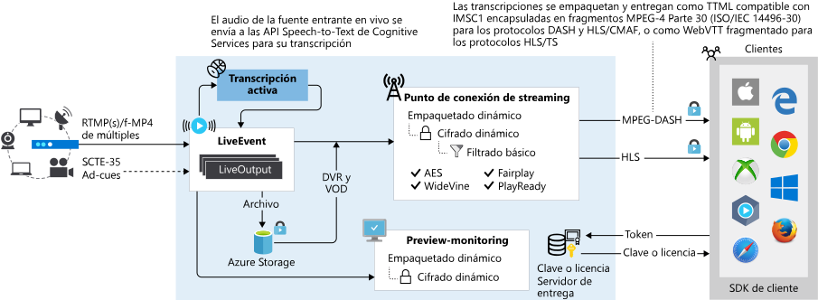

# Streaming en vivo con Azure Media Services v3

Azure Media Services permite entregar eventos en directo a sus clientes en la nube de Azure. Para transmitir los eventos en directo con Media Services, necesita lo siguiente:  

- Una cámara que se utilice para capturar el evento en directo. Para obtener ideas para la configuración, consulte [Simple and portable event video gear setup]( https://link.medium.com/KNTtiN6IeT) (Equipo de vídeo para eventos sencillo y portátil).

    Si no tiene acceso a una cámara, puede usar herramientas como [Telestream Wirecast](https://www.telestream.net/wirecast/overview.htm) para generar una fuente en directo a partir de un archivo de vídeo.
- Un codificador de vídeo en vivo que convierte las señales de una cámara (u otro dispositivo, como un portátil) en una fuente de contribución que se envía a Media Services. La fuente de contribución puede incluir señales relacionadas con la publicidad, como los marcadores SCTE-35. Para obtener una lista de los codificadores de streaming en vivo recomendados, consulte [Codificadores de streaming en vivo](recommended-on-premises-live-encoders.md). Vea también este blog: [Live streaming production with OBS](https://link.medium.com/ttuwHpaJeT) (Producción de streaming en vivo con OBS).
- Componentes de Media Services, que permiten ingerir, previsualizar, empaquetar, registrar, cifrar y difundir el evento en directo a los clientes o a una red CDN para una futura distribución.

En este artículo se proporciona información general y una guía del streaming en vivo con Media Services y vínculos a otros artículos pertinentes.
 
> [!NOTE]
> Puede usar [Azure Portal](https://portal.azure.com/) para administrar los [eventos en directo](live-events-outputs-concept.md) de la versión 3, ver los [recursos](assets-concept.md) de la versión 3, obtener información sobre el acceso a las API. Para las restantes tareas de administración (por ejemplo, Transformaciones y trabajos y Protección de contenido), use la [API REST](https://aka.ms/ams-v3-rest-ref), la [CLI](https://aka.ms/ams-v3-cli-ref), o uno de los [SDK](media-services-apis-overview.md#sdks) compatibles.

## Empaquetado dinámico

Con Media Services puede aprovechar el [empaquetado dinámico](dynamic-packaging-overview.md), que le permite obtener una vista previa y difundir streaming en vivo en los [formatos MPEG DASH, HLS y Smooth Streaming](https://en.wikipedia.org/wiki/Adaptive_bitrate_streaming) desde la fuente de contribución que se envía al servicio. Los espectadores pueden reproducir el streaming en vivo con cualquier reproductor compatible con HLS, DASH o Smooth Streaming. Puede utilizar [Azure Media Player](https://amp.azure.net/libs/amp/latest/docs/index.html) en las aplicaciones web o móviles para entregar la transmisión en cualquiera de estos protocolos.

## Cifrado dinámico

El cifrado dinámico permite cifrar de forma dinámica el contenido en directo o a petición con AES-128 o cualquiera de los tres principales sistemas de administración de derechos digitales (DRM): Microsoft PlayReady, Google Widevine y Apple FairPlay. Media Services también proporciona un servicio para entregar claves AES y licencias de DMR (PlayReady, Widevine y FairPlay) a los clientes autorizados. Para obtener más información, consulte [Cifrado dinámico](content-protection-overview.md).

> [!NOTE]
> Widevine es un servicio que ofrece Google Inc. y que está sujeto a los términos del servicio y la directiva de privacidad de Google, Inc.

## Manifiesto dinámico

El filtro dinámico se usa para controlar el número de pistas, formatos, velocidades de bits y ventanas de tiempo de presentación que se envían a los reproductores. Para obtener más información, consulte los detalles de los [filtros y los manifiestos dinámicos](filters-dynamic-manifest-overview.md).

## Tipos de objetos LiveEvent

Los objetos [LiveEvents](https://docs.microsoft.com/rest/api/media/liveevents) son responsables de la ingesta y el procesamiento de las fuentes de vídeo en directo. Un evento en directo se puede establecer en una codificación de *paso a través* (un codificador en directo local envía una secuencia de velocidad de bits múltiple) o en una *codificación en directo* (un codificador en directo local envía una secuencia de velocidad de bits única). Para obtener más información sobre el streaming en vivo en Media Services v3, vea [Eventos en directo y salidas en vivo](live-events-outputs-concept.md).

### Paso a través

Cuando se utiliza el **objeto LiveEvent** de paso a través, se confía en el codificador en directo local para generar una secuencia de vídeo con múltiples velocidades de bits y enviarla como fuente de contribución al objeto LiveEvent (mediante el protocolo de entrada RTMP o MP4 fragmentado). Tras ello, el objeto LiveEvent realiza la secuencia de vídeo entrante al empaquetador dinámico (punto de conexión de streaming) sin necesidad de transcodificar nada más. Este tipo de objeto LiveEvent de paso a través está optimizado para eventos en directo de larga duración o para el streaming en vivo ininterrumpidamente. 

### Live Encoding  

Si utiliza la codificación en la nube con Media Services, deberá configurar el codificador en directo local para que envíe un vídeo con una única velocidad de bits como fuente de contribución (agregado de 32 Mbps como máximo) al objeto LiveEvent (mediante el protocolo de entrada RTMP o MP4 fragmentado). El objeto LiveEvent transcodifica la secuencia de velocidad de bits única entrante en [varias secuencias de vídeo de velocidad de bits](https://en.wikipedia.org/wiki/Adaptive_bitrate_streaming) a resoluciones diferentes para mejorar la entrega, y las pone a disposición para su entrega a dispositivos de reproducción a través de protocolos estándar del sector como MPEG-DASH, Apple HTTP Live Streaming (HLS) y Microsoft Smooth Streaming. 

### Transcripción en directo (versión preliminar)

La transcripción en directo es una característica que puede usar con eventos en directo que son de paso a través o de codificación en directo. Para más información, consulte [transcripción en directo](live-transcription.md). Cuando esta característica está habilitada, el servicio usa la característica [Voz a texto](../../cognitive-services/speech-service/speech-to-text.md) de Cognitive Services para transcribir el texto oral del audio entrante en texto escrito. A continuación, se pone a disposición este texto para su entrega junto con el vídeo y el audio en los protocolos MPEG-DASH y HLS.

> [!NOTE]
> Actualmente, la transcripción en directo está disponible como una característica en vista previa en la región Oeste de EE. UU. 2.

## Flujo de trabajo de streaming en vivo

Para conocer el flujo de trabajo de streaming en vivo de Media Services v3, primero tendrá que examinar y conocer los conceptos siguientes: 

- [Puntos de conexión de streaming](streaming-endpoint-concept.md)
- [Objetos LiveEvent y LiveOutput](live-events-outputs-concept.md)
- [Localizadores de streaming](streaming-locators-concept.md)

### Pasos generales

1. En la cuenta de Media Services, asegúrese de que el **Punto de conexión de streaming** (origen) esté en ejecución. 
2. Cree un [evento en directo](live-events-outputs-concept.md).  Al crear el evento, puede especificar que se inicie automáticamente. De lo contrario, puede iniciar el evento cuando esté listo para iniciar el streaming.  Cuando el inicio automático está establecido en true, el evento en directo se iniciará después de la creación. La facturación comienza en cuanto el objeto LiveEvent empieza a ejecutarse. Debe llamar explícitamente a Stop en el recurso del objeto LiveEvent para evitar que continúe la facturación. Para más información, consulte [Estados y facturación de LiveEvent](live-event-states-billing.md).
3. Obtenga las direcciones URL de ingesta y configure el codificador local a fin de usar la dirección URL para enviar la fuente de contribución. Consulte [Codificadores de streaming en vivo recomendados](recommended-on-premises-live-encoders.md).
4. Obtenga la dirección URL de versión preliminar y úsela para verificar que la entrada del codificador se está recibiendo realmente.
5. Cree un nuevo objeto de **recurso**. 

    Cada objeto Live Output está asociado a un recurso cuya salida utiliza para grabar el vídeo en el contenedor de Azure Blob Storage asociado. 
6. Cree un objeto **Live Output** y use el nombre del recurso que ha creado para que se pueda archivar el flujo en el recurso.

    Los objetos LiveOutput comienzan al crearlos y se detienen cuando se eliminan. Cuando se elimina el objeto Live Output, no se elimina el recurso subyacente ni su contenido.
7. Cree un objeto **Streaming Locator** con los [tipos del objeto Streaming Policy integrados](streaming-policy-concept.md).

    Para publicar Live Output, debe crear un objeto Streaming Locator para el recurso asociado. 
8. Enumere las rutas de acceso en el **localizador de streaming** para recuperar las direcciones URL que se van a usar (estas son deterministas).
9. Obtenga el nombre de host para el **Punto de conexión de streaming** desde el que quiere hacer el streaming.
10. Combine la dirección URL del paso 8 con el nombre de host del paso 9 para obtener la dirección URL completa.
11. Si desea que **LiveEvent** deje de estar visible, es preciso que deje de transmitir en secuencias el evento y que elimine el objeto **StreamingLocator**.
12. Si se realizan eventos de streaming y desea limpiar los recursos aprovisionados anteriormente, siga el procedimiento siguiente.

    * Detenga la inserción de la secuencia en el codificador.
    * Detenga el objeto LiveEvent. Una vez que el objeto LiveEvent se detenga, dejará de suponer un coste. Cuando necesite iniciarlo de nuevo, tendrá la misma URL de introducción, por lo que no necesitará volver a configurar su codificador.
    * Puede detener el extremo de streaming, a menos que desee seguir proporcionando el archivo de su evento en vivo como una secuencia a petición. Si el evento en directo está en estado detenido, no supondrá ningún coste.

El recurso en el que se está archivando la salida en directo, se convierte automáticamente en un recurso a petición cuando se elimina esa salida en directo. Debe eliminar todas las salidas en directo antes de que un evento en directo pueda detenerse. Puede usar una marca opcional [removeOutputsOnStop](https://docs.microsoft.com/rest/api/media/liveevents/stop#request-body) para quitar automáticamente las salidas en directo cuando se detenga el proceso. 

> [!TIP]
> Consulte el [tutorial sobre streaming en vivo](stream-live-tutorial-with-api.md), en el artículo se examina el código que implementa los pasos descritos anteriormente.

## Otros artículos importantes

- [Recommended live encoders](recommended-on-premises-live-encoders.md) (Codificadores en directo recomendados)
- [Uso de un DVR en la nube](live-event-cloud-dvr.md)
- [Comparación de tipos de objetos LiveEvent](live-event-types-comparison.md)
- [Estados y facturación](live-event-states-billing.md)
- [Latency](live-event-latency.md)

## Formule preguntas, realice comentarios y obtenga actualizaciones

Consulte el artículo [Comunidad de Azure Media Services](media-services-community.md) para ver diferentes formas de formular preguntas, enviar comentarios y obtener actualizaciones de Media Services.

## Pasos siguientes

* [Inicio rápido de streaming en vivo] (live-events-wirecast-quickstart.md (
* [Tutorial de Live Streaming](stream-live-tutorial-with-api.md)
* [Guía de migración para mover de Media Services v2 a v3](migrate-from-v2-to-v3.md)
