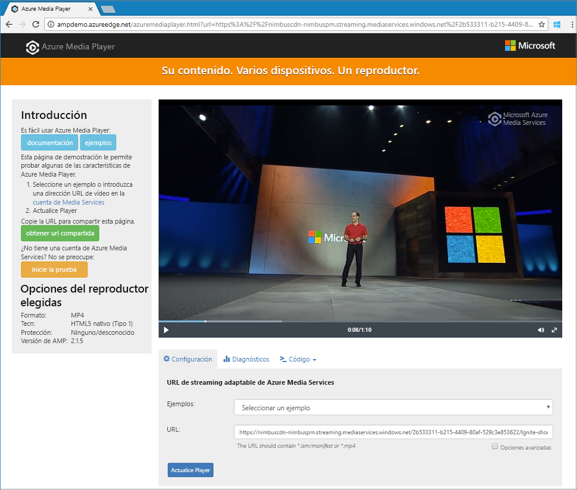

# <a name="tutorial-encode-a-remote-file-based-on-url-and-stream-the-video---net"></a>Tutorial: Codificación de un archivo remoto según una dirección URL y transmisión del vídeo: .NET

En este tutorial se muestra lo fácil que es codificar vídeos y comenzar a transmitirlos en streaming en una amplia variedad de exploradores y dispositivos con Azure Media Services. Se puede especificar contenido de entrada con direcciones URL de HTTPS, direcciones URL de SAS o rutas de acceso a archivos ubicados en Azure Blob Storage.
El ejemplo de este tema permite codificar contenido que se hace accesible a través de una dirección URL HTTPS. Tenga en cuenta que, actualmente, AMS v3 no admite la codificación de transferencia fragmentada a través de direcciones URL de HTTPS.

Al final del tutorial, podrá transmitir un vídeo en streaming.  



[!INCLUDE [quickstarts-free-trial-note](../../../includes/quickstarts-free-trial-note.md)]

## <a name="prerequisites"></a>Prerrequisitos

- Si no tiene Visual Studio instalado, puede obtener [Visual Studio Community 2017](https://www.visualstudio.com/thank-you-downloading-visual-studio/?sku=Community&rel=15).
- [Cree una cuenta de Media Services](create-account-cli-how-to.md).<br/>Asegúrese de recordar los valores que usó para el nombre de la cuenta de Media Services y el nombre del grupo de recursos.
- Siga los pasos de [Acceso a la API de Azure Media Services con la CLI de Azure](access-api-cli-how-to.md) y guarde las credenciales. Deberá usarlas para acceder a la API.

## <a name="download-and-configure-the-sample"></a>Descarga y configuración del ejemplo

Clone un repositorio GitHub que contenga el ejemplo de .NET de streaming en la máquina con el siguiente comando:  

 ```bash
 git clone https://github.com/Azure-Samples/media-services-v3-dotnet-quickstarts.git
 ```

El ejemplo se encuentra en la carpeta [EncodeAndStreamFiles](https://github.com/Azure-Samples/media-services-v3-dotnet-quickstarts/tree/master/AMSV3Quickstarts/EncodeAndStreamFiles).

Abra [appsettings.json](https://github.com/Azure-Samples/media-services-v3-dotnet-quickstarts/blob/master/AMSV3Quickstarts/EncodeAndStreamFiles/appsettings.json) en el proyecto que ha descargado. Sustituya los valores por las credenciales que obtuvo de [acceder a las API](access-api-cli-how-to.md).

Este ejemplo realiza las acciones siguientes:

1. Crea una **transformación** (antes comprueba si existe la transformación especificada). 
2. Crea un **recurso** de salida que se utiliza como salida del **trabajo** de codificación.
3. Crea la entrada del **trabajo**, que se basa en una dirección URL HTTPS.
4. Envía el **trabajo** de codificación mediante la entrada y salida que se creó previamente.
5. Comprueba el estado del trabajo.
6. Crea un **objeto StreamingLocator**.
7. Crea direcciones URL de streaming.

Para obtener una explicación sobre qué hace cada función en el ejemplo, examine el código y observe los comentarios en [este archivo de origen](https://github.com/Azure-Samples/media-services-v3-dotnet-quickstarts/blob/master/AMSV3Quickstarts/EncodeAndStreamFiles/Program.cs).

## <a name="run-the-sample-app"></a>Ejecutar la aplicación de ejemplo

Al ejecutar la aplicación, se muestran las direcciones URL que se pueden usar para reproducir el vídeo con diferentes protocolos. 

1. Presione Control + F5 para ejecutar la aplicación *EncodeAndStreamFiles*.
2. Elija el protocolo **HLS** de Apple (termina por *manifest(format=m3u8-aapl)* ) y copie la dirección URL del streaming desde la consola.


En el [código fuente](https://github.com/Azure-Samples/media-services-v3-dotnet-quickstarts/blob/master/AMSV3Quickstarts/EncodeAndStreamFiles/Program.cs) del ejemplo, puede ver cómo se compila la dirección URL. Para compilarla, debe concatenar el nombre de host del punto de conexión del streaming y la ruta de acceso del localizador del streaming.  

## <a name="test-with-azure-media-player"></a>Prueba con Azure Media Player

Para probar el streaming, este artículo usa Azure Media Player. 

> [!NOTE]
> Si el reproductor está hospedado en un sitio https, asegúrese de actualizar la dirección URL a "https".

1. Abra un explorador web y vaya a [https://aka.ms/azuremediaplayer/](https://aka.ms/azuremediaplayer/).
2. En el cuadro **Dirección URL:** , pegue uno de los valores de la dirección URL de streaming que se obtuvo al ejecutar la aplicación. 
 
     Puede pegar la dirección URL en formato HLS, Dash o Smooth y Azure Media Player cambiará automáticamente a un protocolo de streaming adecuado en su dispositivo.
3. Presione **Actualizar Player**.

Azure Media Player puede usarse para realizar pruebas, pero no debe usarse en un entorno de producción. 

## <a name="clean-up-resources"></a>Limpieza de recursos

Si ya no necesita ninguno de los recursos del grupo de recursos, como las cuentas de almacenamiento y de Media Services que creó en este tutorial, elimine el grupo de recursos.

Ejecute el siguiente comando de la CLI:

```azurecli
az group delete --name amsResourceGroup
```

## <a name="examine-the-code"></a>Examen del código

Para obtener una explicación sobre qué hace cada función en el ejemplo, examine el código y observe los comentarios en [este archivo de origen](https://github.com/Azure-Samples/media-services-v3-dotnet-quickstarts/blob/master/AMSV3Quickstarts/EncodeAndStreamFiles/Program.cs).

El tutorial [Carga, codificación y streaming de archivos](stream-files-tutorial-with-api.md) proporciona un ejemplo de streaming más avanzado con explicaciones detalladas. 

### <a name="job-error-codes"></a>Códigos de error de trabajo

Consulte [Códigos de error](https://docs.microsoft.com/rest/api/media/jobs/get#joberrorcode).

## <a name="multithreading"></a>Subprocesamiento múltiple

Los SDK de Azure Media Services v3 no son seguros para subprocesos. Al trabajar con una aplicación que admite multithreading, debe generar un nuevo objeto AzureMediaServicesClient por subproceso.

## <a name="next-steps"></a>Pasos siguientes

> [!div class="nextstepaction"]
> [Tutorial: Carga, codificación y streaming de archivos](stream-files-tutorial-with-api.md)
