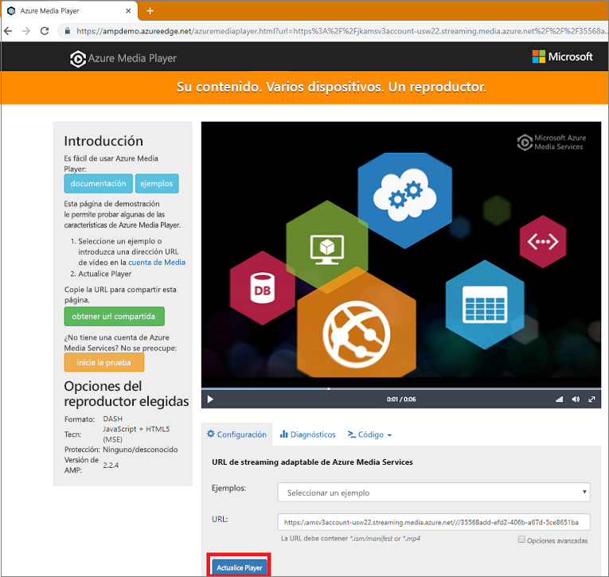

# <a name="tutorial-encode-a-remote-file-based-on-url-and-stream-the-video---nodejs"></a>Tutorial: Codificación de un archivo remoto según una dirección URL y transmisión del vídeo: Node.js

En este tutorial se muestra lo fácil que es codificar vídeos y comenzar a transmitirlos en streaming en una amplia variedad de exploradores y dispositivos con Azure Media Services. Se puede especificar contenido de entrada con direcciones URL de HTTPS, direcciones URL de SAS o rutas de acceso a archivos ubicados en Azure Blob Storage.

En el ejemplo de este artículo se codifica contenido que se hace accesible a través de una dirección URL HTTPS. Tenga en cuenta que, actualmente, AMS v3 no admite la codificación de transferencia fragmentada a través de direcciones URL de HTTPS.

Al final del tutorial, podrá transmitir un vídeo en streaming.  



[!INCLUDE [quickstarts-free-trial-note](../../../includes/quickstarts-free-trial-note.md)]

## <a name="prerequisites"></a>Requisitos previos

- Instalar [Node.js](https://nodejs.org/en/download/)
- [Cree una cuenta de Media Services](create-account-cli-how-to.md).<br/>Asegúrese de recordar los valores que usó para el nombre de la cuenta de Media Services y el nombre del grupo de recursos.
- Siga los pasos de [Acceso a la API de Azure Media Services con la CLI de Azure](access-api-cli-how-to.md) y guarde las credenciales. Deberá usarlas para acceder a la API.

## <a name="download-and-configure-the-sample"></a>Descarga y configuración del ejemplo

Clone un repositorio GitHub que contenga el ejemplo de Node.js de streaming en la máquina con el siguiente comando:  

 ```bash
 git clone https://github.com/Azure-Samples/media-services-v3-node-tutorials.git
 ```

El ejemplo se encuentra en la carpeta [StreamFilesSample](https://github.com/Azure-Samples/media-services-v3-node-tutorials/tree/master/AMSv3Samples/StreamFilesSample).

Abra [index.js](https://github.com/Azure-Samples/media-services-v3-node-tutorials/blob/master/AMSv3Samples/StreamFilesSample/index.js#L25) en el proyecto descargado. Sustituya los valores de `endpoint config` por las credenciales que obtuvo al [acceder a las API](access-api-cli-how-to.md).

Este ejemplo realiza las acciones siguientes:

1. Crea una **transformación** (antes comprueba si existe la transformación especificada). 
2. Crea un **recurso** de salida que se utiliza como salida del **trabajo** de codificación.
3. Crea la entrada del **trabajo**, que se basa en una dirección URL HTTPS.
4. Envía el **trabajo** de codificación mediante la entrada y salida que se creó previamente.
5. Comprueba el estado del trabajo.
6. Crea un **objeto StreamingLocator**.
7. Crea direcciones URL de streaming.

## <a name="run-the-sample-app"></a>Ejecutar la aplicación de ejemplo

1. La aplicación descarga archivos codificados. Cree la carpeta a la que desea que vayan los archivos de salida ir y actualice el valor de la variable **outputFolder** en el archivo [index.js](https://github.com/Azure-Samples/media-services-v3-node-tutorials/blob/master/AMSv3Samples/StreamFilesSample/index.js#L39).
1. Abra el **símbolo del sistema**, busque el directorio del ejemplo y ejecute los comandos siguientes.

    ```
    npm install 
    node index.js
    ```

Cuando finalice la ejecución, el resultado debería ser similar a este:


## <a name="test-with-azure-media-player"></a>Prueba con Azure Media Player

Para probar el streaming, este artículo usa Azure Media Player. 

> [!NOTE]
> Si el reproductor está hospedado en un sitio https, asegúrese de actualizar la dirección URL a "https".

1. Abra un explorador web y vaya a [https://aka.ms/azuremediaplayer/](https://aka.ms/azuremediaplayer/).
2. En el cuadro **Dirección URL:** , pegue uno de los valores de la dirección URL de streaming que se obtuvo al ejecutar la aplicación. 
 
     Puede pegar la dirección URL en formato HLS, Dash o Smooth y Azure Media Player cambiará automáticamente a un protocolo de streaming adecuado en su dispositivo.
3. Presione **Actualizar Player**.

Azure Media Player puede usarse para realizar pruebas, pero no debe usarse en un entorno de producción. 

## <a name="clean-up-resources"></a>Limpieza de recursos

Si ya no necesita ninguno de los recursos del grupo de recursos, como las cuentas de almacenamiento y de Media Services que creó en este tutorial, elimine el grupo de recursos.

Ejecute el siguiente comando de la CLI:

```azurecli
az group delete --name amsResourceGroup
```

## <a name="see-also"></a>Otras referencias

[Códigos de error de trabajo](https://docs.microsoft.com/rest/api/media/jobs/get#joberrorcode).

## <a name="next-steps"></a>Pasos siguientes

> [!div class="nextstepaction"]
> [Conceptos de Azure Media Services](concepts-overview.md)
