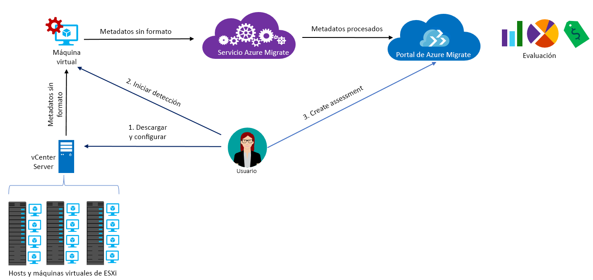

# Acerca de Azure Migrate

El servicio Azure Migrate evalúa las cargas de trabajo locales para su migración a Azure. El servicio evalúa la idoneidad de la migración de las máquinas locales, realiza el ajuste de tamaño basado en el rendimiento, y proporciona estimaciones del costo que supone la ejecución de máquinas locales en Azure. Si está pensando en migrar mediante lift-and-shift o se encuentra en las primeras fases de la evaluación de la migración, este es el servicio que debe elegir. Tras la evaluación, puede usar servicios como [Azure Site Recovery](https://docs.microsoft.com/azure/site-recovery/site-recovery-overview) y [Azure Database Migration Service](https://docs.microsoft.com/azure/dms/dms-overview) para migrar las máquinas a Azure.

## ¿Por qué usar Azure Migrate?

Azure Migrate le ayuda a:

- **Evaluar la preparación para Azure**: evalúe si las máquinas locales son apropiadas para ejecutarse en Azure.
- **Obtener recomendaciones de tamaño**: averigüe el tamaño recomendado de las máquinas virtuales de Azure en función del historial de rendimiento de las máquinas virtuales locales.
- **Calcular los costos mensuales**: calcule el costo estimado de la ejecución de máquinas locales en Azure.  
- **Migrar con una confianza alta**: vea las dependencias de los equipos locales para crear los grupos de equipos que va a evaluar y migrar a la vez.

## Limitaciones actuales

- Solo puede evaluar máquinas virtuales de VMware locales para la migración a máquinas virtuales de Azure. Las máquinas virtuales de VMware las debe administrar vCenter Server (versiones 5.5, 6.0 o 6.5).
- Si desea evaluar servidores físicos y máquinas virtuales Hyper-V, utilice [Azure Site Recovery Deployment Planner](https://aka.ms/asr-dp-hyperv-doc) para Hyper-V y nuestras [herramientas de asociados](https://azure.microsoft.com/migration/partners/) para las máquinas físicas.
- Puede detectar hasta 1500 máquinas virtuales en una sola detección y hasta 1500 en un solo proyecto. Además, puede evaluar hasta 1500 máquinas virtuales en una valoración única.
- Si desea detectar un entorno más grande puede dividir la detección y crear varios proyectos. [Más información](how-to-scale-assessment.md). Azure Migrate admite hasta 20 proyectos por suscripción.
- Azure Migrate solo admite discos administrados para la valoración de la migración.
-  Los proyectos de Azure Migrate solo se pueden crear en la geografía de Estados Unidos. Sin embargo, puede planear la migración de cualquier ubicación de Azure de destino.
    - Solo los metadatos que se detectan en el entorno local se almacenan en la región del proyecto de migración.
    - Los metadatos se almacenan en una de las regiones en la geografía seleccionada: Centro-oeste de EE. UU. o Este de EE. UU.
    - Si utiliza la visualización de dependencias mediante la creación de un área de trabajo de Log Analytics, el área de trabajo se crea en la misma región que el proyecto.

## ¿Por qué conceptos tengo qué pagar?

[Más información](https://azure.microsoft.com/pricing/details/azure-migrate/) sobre los precios de Azure Migrate.

## ¿Qué es una evaluación?

La configuración de evaluación se puede personalizar según sus necesidades. Las propiedades de evaluación se resumen en la tabla siguiente.

**Propiedad** | **Detalles**
--- | ---
**Ubicación de destino** | La ubicación de Azure a la que desea realizar la migración.  Actualmente, Azure Migrate admite 33 regiones como ubicaciones de destino de migración. [Compruebe las regiones](https://azure.microsoft.com/global-infrastructure/services/). De forma predeterminada, la región de destino es la región Oeste de EE. UU. 2.
**Tipo de almacenamiento** | El tipo de discos administrados que desea asignar para todas las máquinas virtuales que forman parte de la valoración. Si el criterio para el tamaño es *ajuste de tamaño como local* puede especificar el tipo de disco de destino como discos premium (valor predeterminado), discos SSD estándar o discos HDD estándar. Para el *ajuste de tamaño basado en el rendimiento*, junto con las opciones anteriores, también tiene la opción de seleccionar Automático, lo que asegurará que la recomendación de tamaño del disco se realiza automáticamente en función de los datos de rendimiento de las máquinas virtuales. Por ejemplo, si desea conseguir un [Acuerdo de Nivel de Servicio de máquina virtual de única instancia del 99,9 %](https://azure.microsoft.com/support/legal/sla/virtual-machines/v1_8/), es posible que quiera especificar el tipo de almacenamiento como discos administrados Premium ya que este garantizará que todos los discos de la evaluación se recomienden como discos administrados Premium. Tenga en cuenta que Azure Migrate solo admite discos administrados para la valoración de la migración.
**Instancias reservadas** |  Indica si dispone de [instancias reservadas](https://azure.microsoft.com/pricing/reserved-vm-instances/) de Azure. Azure Migrate calcula el costo en consecuencia.
**Criterio de ajuste de tamaño** | El ajuste de tamaño se puede basar en el **historial de rendimiento** de las máquinas virtuales locales (opción predeterminada), o **como local**, sin tener en cuenta el historial de rendimiento.
**Historial de rendimiento** | De forma predeterminada, Azure Migrate usa el historial de rendimiento del último día para evaluar el rendimiento de las máquinas locales, con un valor de percentil del 95 %.
**Factor de confort** | Azure Migrate tiene en cuenta un búfer (factor de confort) durante la evaluación. Dicho búfer se aplica además de los datos de uso de la máquina en las máquinas virtuales (CPU, memoria, disco y red). El factor de confort se tiene en cuenta en problemas como el uso estacional, un historial de rendimiento corto y los posibles aumentos en el uso futuro.   Por ejemplo, una máquina virtual de 10 núcleos con un uso del 20 % normalmente genera una máquina virtual de 2 núcleos. Sin embargo, con un factor de confort de 2.0 x, el resultado es una máquina virtual de 4 núcleos. El valor de confort predeterminado es 1.3 x.
**Series de VM** | La serie de máquinas virtuales que se usa para las estimaciones de tamaño. Por ejemplo, si tiene un entorno de producción que no vaya a migrar a la serie A de las máquinas virtuales de Azure, puede excluir la serie A de la lista o serie. El ajuste de tamaño se basa solo en la serie seleccionada.   
**Moneda** | Divisa de facturación. El valor predeterminado es el dólar estadounidense.
**Descuento (%)** | Cualquier descuento específico de la suscripción que reciba además de la oferta de Azure. La configuración predeterminada es 0 %.
**Tiempo de actividad de VM** | Si las máquinas virtuales no se van a ejecutar todas las horas en Azure, puede especificar la duración (número de días al mes y número de horas al día) del período en el que se estarán ejecutando y las estimaciones de costo se realizarán en consecuencia. El valor predeterminado es 31 días al mes y 24 horas al día.
**Oferta de Azure** | La [oferta de Azure](https://azure.microsoft.com/support/legal/offer-details/) en la que está inscrito. Azure Migrate calcula el costo en consecuencia.
**Ventaja híbrida de Azure** | Indica si dispone de Software Assurance y tiene derecho a [Ventaja híbrida de Azure](https://azure.microsoft.com/pricing/hybrid-use-benefit/) para obtener precios con descuento.

## ¿Cómo funciona Azure Migrate?

1.  Cree un proyecto de Azure Migrate.
2.  Azure Migrate usa una máquina virtual local, llamada el dispositivo recopilador, para detectar información acerca de las máquinas locales. Para crear el dispositivo, descargue el archivo de instalación en formato Open Virtualization Appliance (.ova) e impórtelo como una máquina virtual en la instancia local de vCenter Server.
3. Conéctese a la máquina virtual desde vCenter Server y especifique una nueva contraseña para ella al conectarse.
4. Ejecute el recopilador en la máquina virtual para iniciar la detección.
5. El recopilador recoge metadatos de máquinas virtuales con los cmdlets de PowerCLI para VMware. La detección se realiza sin agente y no instala nada en los hosts ni en las máquinas virtuales de VMware. Los metadatos recopilados incluyen información acerca de la máquina virtual (núcleos, memoria, discos, tamaños de disco y adaptadores de red). También recopila datos de rendimiento de las máquinas virtuales, incluyendo el uso de la CPU y de la memoria, el IOPS de disco, el rendimiento del disco (MBps) y la red de salida (MBps).
5.  Los metadatos se insertan en el proyecto de Azure Migrate. Puede verlo en Azure Portal.
6.  Para la evaluación, las máquinas virtuales detectadas se reúnen en grupos. Por ejemplo, se pueden agrupar las máquinas virtuales que ejecutan la misma aplicación. Para obtener un agrupamiento más preciso, puede usar la visualización de dependencias para ver las dependencias de una máquina específica o de todas las máquinas de un grupo, y refinar el grupo.
7.  Después de definir un grupo, cree una evaluación para este.
8.  Una vez finalizada la evaluación, se puede ver en el portal, o bien descargar en formato de Excel.

  

## ¿Cuáles son los requisitos de puertos?

La tabla resumen los puertos necesarios para las comunicaciones de Azure Migrate.

Componente | Se comunica con |  Detalles
--- | --- |---
Recopilador  | Servicio Azure Migrate | El recopilador se conecta al servicio a través del puerto 443 de SSL.
Recopilador | vCenter Server | De manera predeterminada, el recopilador se conecta a vCenter Server en el puerto 443. Si el servidor escucha otro puerto, configúrelo como puerto de salida en la máquina virtual del recopilador.
Máquina virtual local | Área de trabajo de Log Analytics | [TCP 443] | [Microsoft Monitoring Agent (MMA)](../log-analytics/log-analytics-windows-agent.md) usa el puerto TCP 443 para conectarse a Log Analytics. Este puerto solo se necesita si se usa la característica de visualización de dependencias que requiere el agente MMA.

## ¿Qué pasa después de la evaluación?

Una vez que haya evaluado las máquinas locales, puede usar un par de herramientas para realizar la migración:

- **Azure Site Recovery**: puede usar Azure Site Recovery para realizar la migración a Azure. Para ello, [prepare los componentes de Azure](../site-recovery/tutorial-prepare-azure.md) que necesita, incluida una cuenta de almacenamiento y una red virtual. De forma local, [prepare el entorno de VMware](../site-recovery/vmware-azure-tutorial-prepare-on-premises.md). Cuando todo esté preparado, configure y habilite la replicación en Azure y migre las máquinas virtuales. [Más información](../site-recovery/vmware-azure-tutorial.md).
- **Azure Database Migration**: si las máquinas locales ejecutan una base de datos como SQL Server, MySQL u Oracle, puede usar [Azure Database Migration Service](../dms/dms-overview.md) para migrarlas a Azure.

## Pasos siguientes

- [Siga el tutorial](tutorial-assessment-vmware.md) para crear una evaluación de una máquina virtual de VMware local.
- [Repase las preguntas más frecuentes](resources-faq.md) sobre Azure Migrate.
