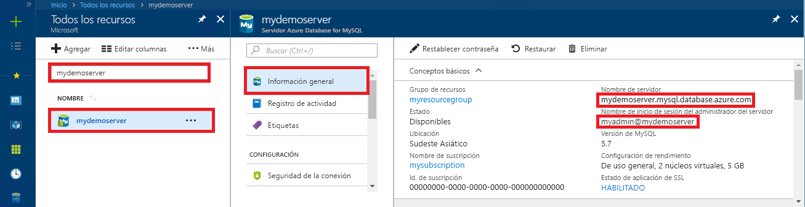

# <a name="quickstart-use-java-to-connect-to-and-query-data-in-azure-database-for-mysql"></a>Inicio rápido: Uso de Java para conectarse y consultar datos en Azure Database for MySQL

En este inicio rápido, va a conectar una instancia de Azure Database for MySQL mediante una aplicación de Java y el controlador JDBC MariaDB Connector/J. Puede usar instrucciones SQL para consultar, insertar, actualizar y eliminar datos de la base de datos en las plataformas Mac, Ubuntu Linux y Windows. 

En este tema se da por hecho que está familiarizado con el desarrollo mediante Java, pero nunca ha trabajado con Azure Database for MySQL.

## <a name="prerequisites"></a>Prerequisites

- Una cuenta de Azure con una suscripción activa. [Cree una cuenta gratuita](https://azure.microsoft.com/free/?ref=microsoft.com&utm_source=microsoft.com&utm_medium=docs&utm_campaign=visualstudio).
- Un servidor de Azure Database for MySQL. [Creación de un servidor de Azure Database for MySQL mediante Azure Portal](quickstart-create-mysql-server-database-using-azure-portal.md) o [Creación de un servidor de Azure Database for MySQL mediante la CLI de Azure](quickstart-create-mysql-server-database-using-azure-cli.md).
- La seguridad de conexión de Azure Database for MySQL se configura con el firewall abierto y la configuración de la conexión SSL preparada para la aplicación.

## <a name="obtain-the-mariadb-connector"></a>Obtención del conector de MariaDB

Obtenga el conector [MariaDB Connector/J](https://mariadb.com/kb/en/library/mariadb-connector-j/) mediante uno de los métodos siguientes:
   - Use el paquete de Maven [mariadb-java-client](https://search.maven.org/search?q=a:mariadb-java-client) para incluir la [dependencia mariadb-java-client](https://mvnrepository.com/artifact/org.mariadb.jdbc/mariadb-java-client) en el archivo POM del proyecto.
   - Descargue el controlador JDBC [MariaDB Connector/J](https://downloads.mariadb.org/connector-java/) e incluya el archivo .jar de JDBC (por ejemplo, mariadb-java-client-2.4.3.jar) en la ruta de acceso de la clase de la aplicación. Consulte la documentación del entorno para obtener los detalles de la ruta de acceso de la clase, como [Apache Tomcat](https://tomcat.apache.org/tomcat-7.0-doc/class-loader-howto.html) o [Java SE](https://docs.oracle.com/javase/7/docs/technotes/tools/windows/classpath.html).

## <a name="get-connection-information"></a>Obtención de información sobre la conexión

Obtenga la información de conexión necesaria para conectarse a Azure Database for MySQL. Necesitará el nombre completo del servidor y las credenciales de inicio de sesión.

1. Inicie sesión en [Azure Portal](https://portal.azure.com/).
2. En el menú izquierdo de Azure Portal, seleccione **Todos los recursos** y, luego, busque el servidor que ha creado, por ejemplo, **mydemoserver**.
3. Seleccione el nombre del servidor.
4. En el panel **Información general** del servidor, anote el **nombre del servidor** y el **nombre de inicio de sesión del administrador del servidor**. Si olvida la contraseña, puede restablecerla en este panel.
 

## <a name="connect-create-table-and-insert-data"></a>Conexión, creación de una tabla e inserción de datos

Use el código siguiente para conectarse y cargar los datos mediante la función con una instrucción SQL **INSERT**. Para la conexión a MySQL se utiliza el método [getConnection()](https://mariadb.com/kb/en/library/about-mariadb-connector-j/#using-drivermanager). Los métodos [createStatement()](https://mariadb.com/kb/en/library/about-mariadb-connector-j/#creating-a-table-on-a-mariadb-or-mysql-server) y execute() sirven para colocar y crear la tabla. El objeto prepareStatement sirve para generar los comandos insert, con setString() y setInt() para enlazar los valores de los parámetros. El método executeUpdate() ejecuta el comando para insertar los valores en cada conjunto de parámetros. 

Reemplace los parámetros de host, database, user y password por los valores que especificó al crear el servidor y la base de datos.

```java
import java.sql.*;
import java.util.Properties;

public class CreateTableInsertRows {

    public static void main (String[] args)  throws Exception
    {
        // Initialize connection variables. 
        String host = "mydemoserver.mysql.database.azure.com";
        String database = "quickstartdb";
        String user = "myadmin@mydemoserver";
        String password = "<server_admin_password>";

        // check that the driver is installed
        try
        {
            Class.forName("org.mariadb.jdbc");
        }
        catch (ClassNotFoundException e)
        {
            throw new ClassNotFoundException("MariaDB JDBC driver NOT detected in library path.", e);
        }

        System.out.println("MariaDB JDBC driver detected in library path.");

        Connection connection = null;

        // Initialize connection object
        try
        {
            String url = String.format("jdbc:mariadb://%s/%s", host, database);

            // Set connection properties.
            Properties properties = new Properties();
            properties.setProperty("user", user);
            properties.setProperty("password", password);
            properties.setProperty("useSSL", "true");
            properties.setProperty("verifyServerCertificate", "true");
            properties.setProperty("requireSSL", "false");

            // get connection
            connection = DriverManager.getConnection(url, properties);
        }
        catch (SQLException e)
        {
            throw new SQLException("Failed to create connection to database.", e);
        }
        if (connection != null) 
        { 
            System.out.println("Successfully created connection to database.");
        
            // Perform some SQL queries over the connection.
            try
            {
                // Drop previous table of same name if one exists.
                Statement statement = connection.createStatement();
                statement.execute("DROP TABLE IF EXISTS inventory;");
                System.out.println("Finished dropping table (if existed).");
    
                // Create table.
                statement.execute("CREATE TABLE inventory (id serial PRIMARY KEY, name VARCHAR(50), quantity INTEGER);");
                System.out.println("Created table.");
                
                // Insert some data into table.
                int nRowsInserted = 0;
                PreparedStatement preparedStatement = connection.prepareStatement("INSERT INTO inventory (name, quantity) VALUES (?, ?);");
                preparedStatement.setString(1, "banana");
                preparedStatement.setInt(2, 150);
                nRowsInserted += preparedStatement.executeUpdate();

                preparedStatement.setString(1, "orange");
                preparedStatement.setInt(2, 154);
                nRowsInserted += preparedStatement.executeUpdate();

                preparedStatement.setString(1, "apple");
                preparedStatement.setInt(2, 100);
                nRowsInserted += preparedStatement.executeUpdate();
                System.out.println(String.format("Inserted %d row(s) of data.", nRowsInserted));
    
                // NOTE No need to commit all changes to database, as auto-commit is enabled by default.
    
            }
            catch (SQLException e)
            {
                throw new SQLException("Encountered an error when executing given sql statement.", e);
            }       
        }
        else {
            System.out.println("Failed to create connection to database.");
        }
        System.out.println("Execution finished.");
    }
}

```

## <a name="read-data"></a>Lectura de datos

Use el código siguiente para leer los datos con una instrucción SQL **SELECT**. Para la conexión a MySQL se utiliza el método [getConnection()](https://mariadb.com/kb/en/library/about-mariadb-connector-j/#using-drivermanager). Los métodos [crateStatement()](https://mariadb.com/kb/en/library/about-mariadb-connector-j/#creating-a-table-on-a-mariadb-or-mysql-server) y executeQuery() se usan para la conexión y la ejecución de la instrucción seleccionada. Los resultados se procesan mediante un objeto ResultSet. 

Reemplace los parámetros de host, database, user y password por los valores que especificó al crear el servidor y la base de datos.

```java
import java.sql.*;
import java.util.Properties;

public class ReadTable {

    public static void main (String[] args)  throws Exception
    {
        // Initialize connection variables.
        String host = "mydemoserver.mysql.database.azure.com";
        String database = "quickstartdb";
        String user = "myadmin@mydemoserver";
        String password = "<server_admin_password>";

        // check that the driver is installed
        try
        {
            Class.forName("org.mariadb.jdbc");
        }
        catch (ClassNotFoundException e)
        {
            throw new ClassNotFoundException("MariaDB JDBC driver NOT detected in library path.", e);
        }

        System.out.println("MariaDB JDBC driver detected in library path.");

        Connection connection = null;

        // Initialize connection object
        try
        {
            String url = String.format("jdbc:mariadb://%s/%s", host, database);

            // Set connection properties.
            Properties properties = new Properties();
            properties.setProperty("user", user);
            properties.setProperty("password", password);
            properties.setProperty("useSSL", "true");
            properties.setProperty("verifyServerCertificate", "true");
            properties.setProperty("requireSSL", "false");
            
            // get connection
            connection = DriverManager.getConnection(url, properties);
        }
        catch (SQLException e)
        {
            throw new SQLException("Failed to create connection to database", e);
        }
        if (connection != null) 
        { 
            System.out.println("Successfully created connection to database.");
        
            // Perform some SQL queries over the connection.
            try
            {
    
                Statement statement = connection.createStatement();
                ResultSet results = statement.executeQuery("SELECT * from inventory;");
                while (results.next())
                {
                    String outputString = 
                        String.format(
                            "Data row = (%s, %s, %s)",
                            results.getString(1),
                            results.getString(2),
                            results.getString(3));
                    System.out.println(outputString);
                }
            }
            catch (SQLException e)
            {
                throw new SQLException("Encountered an error when executing given sql statement", e);
            }       
        }
        else {
            System.out.println("Failed to create connection to database."); 
        }
        System.out.println("Execution finished.");
    }
}
```

## <a name="update-data"></a>Actualización de datos

Use el código siguiente para cambiar los datos con una instrucción SQL **UPDATE**. Para la conexión a MySQL se utiliza el método [getConnection()](https://mariadb.com/kb/en/library/about-mariadb-connector-j/#using-drivermanager). Los métodos [prepareStatement()](https://docs.oracle.com/javase/tutorial/jdbc/basics/prepared.html) y executeUpdate() se usan para la conexión y la ejecución de la instrucción update. 

Reemplace los parámetros de host, database, user y password por los valores que especificó al crear el servidor y la base de datos.

```java
import java.sql.*;
import java.util.Properties;

public class UpdateTable {
    public static void main (String[] args)  throws Exception
    {
        // Initialize connection variables. 
        String host = "mydemoserver.mysql.database.azure.com";
        String database = "quickstartdb";
        String user = "myadmin@mydemoserver";
        String password = "<server_admin_password>";

        // check that the driver is installed
        try
        {
            Class.forName("org.mariadb.jdbc");
        }
        catch (ClassNotFoundException e)
        {
            throw new ClassNotFoundException("MariaDB JDBC driver NOT detected in library path.", e);
        }

        System.out.println("MariaDB JDBC driver detected in library path.");

        Connection connection = null;

        // Initialize connection object
        try
        {
            String url = String.format("jdbc:mariadb://%s/%s", host, database);
            
            // set up the connection properties
            Properties properties = new Properties();
            properties.setProperty("user", user);
            properties.setProperty("password", password);
            properties.setProperty("useSSL", "true");
            properties.setProperty("verifyServerCertificate", "true");
            properties.setProperty("requireSSL", "false");

            // get connection
            connection = DriverManager.getConnection(url, properties);
        }
        catch (SQLException e)
        {
            throw new SQLException("Failed to create connection to database.", e);
        }
        if (connection != null) 
        { 
            System.out.println("Successfully created connection to database.");
        
            // Perform some SQL queries over the connection.
            try
            {
                // Modify some data in table.
                int nRowsUpdated = 0;
                PreparedStatement preparedStatement = connection.prepareStatement("UPDATE inventory SET quantity = ? WHERE name = ?;");
                preparedStatement.setInt(1, 200);
                preparedStatement.setString(2, "banana");
                nRowsUpdated += preparedStatement.executeUpdate();
                System.out.println(String.format("Updated %d row(s) of data.", nRowsUpdated));
    
                // NOTE No need to commit all changes to database, as auto-commit is enabled by default.
            }
            catch (SQLException e)
            {
                throw new SQLException("Encountered an error when executing given sql statement.", e);
            }       
        }
        else {
            System.out.println("Failed to create connection to database.");
        }
        System.out.println("Execution finished.");
    }
}
```

## <a name="delete-data"></a>Eliminación de datos

Use el código siguiente para quitar datos con una instrucción SQL **DELETE**. Para la conexión a MySQL se utiliza el método [getConnection()](https://mariadb.com/kb/en/library/about-mariadb-connector-j/#using-drivermanager).  Los métodos [prepareStatement()](https://docs.oracle.com/javase/tutorial/jdbc/basics/prepared.html) y executeUpdate() se usan para la conexión y la ejecución de la instrucción delete. 

Reemplace los parámetros de host, database, user y password por los valores que especificó al crear el servidor y la base de datos.

```java
import java.sql.*;
import java.util.Properties;

public class DeleteTable {
    public static void main (String[] args)  throws Exception
    {
        // Initialize connection variables.
        String host = "mydemoserver.mysql.database.azure.com";
        String database = "quickstartdb";
        String user = "myadmin@mydemoserver";
        String password = "<server_admin_password>";
        
        // check that the driver is installed
        try
        {
            Class.forName("org.mariadb.jdbc");
        }
        catch (ClassNotFoundException e)
        {
            throw new ClassNotFoundException("MariaDB JDBC driver NOT detected in library path.", e);
        }

        System.out.println("MariaDB JDBC driver detected in library path.");

        Connection connection = null;

        // Initialize connection object
        try
        {
            String url = String.format("jdbc:mariadb://%s/%s", host, database);
            
            // set up the connection properties
            Properties properties = new Properties();
            properties.setProperty("user", user);
            properties.setProperty("password", password);
            properties.setProperty("useSSL", "true");
            properties.setProperty("verifyServerCertificate", "true");
            properties.setProperty("requireSSL", "false");
            
            // get connection
            connection = DriverManager.getConnection(url, properties);
        }
        catch (SQLException e)
        {
            throw new SQLException("Failed to create connection to database", e);
        }
        if (connection != null) 
        { 
            System.out.println("Successfully created connection to database.");
        
            // Perform some SQL queries over the connection.
            try
            {
                // Delete some data from table.
                int nRowsDeleted = 0;
                PreparedStatement preparedStatement = connection.prepareStatement("DELETE FROM inventory WHERE name = ?;");
                preparedStatement.setString(1, "orange");
                nRowsDeleted += preparedStatement.executeUpdate();
                System.out.println(String.format("Deleted %d row(s) of data.", nRowsDeleted));
    
                // NOTE No need to commit all changes to database, as auto-commit is enabled by default.
            }
            catch (SQLException e)
            {
                throw new SQLException("Encountered an error when executing given sql statement.", e);
            }       
        }
        else {
            System.out.println("Failed to create connection to database.");
        }
        System.out.println("Execution finished.");
    }
}
```

## <a name="next-steps"></a>Pasos siguientes

> [!div class="nextstepaction"]
> [Migre su Base de datos MySQL a Azure Database for MySQL mediante el volcado y la restauración](concepts-migrate-dump-restore.md)
