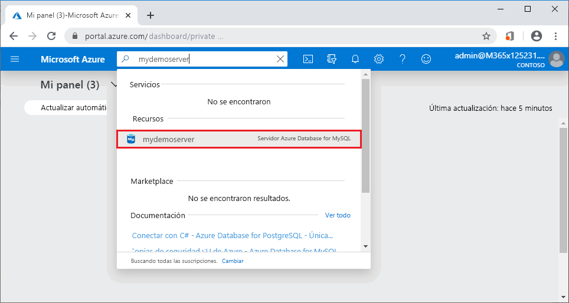
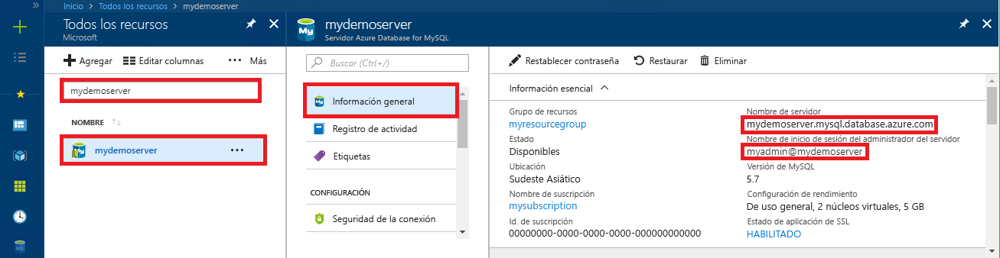

# <a name="quickstart-use-python-to-connect-and-query-data-with-azure-database-for-mysql"></a>Inicio rápido: Uso de Python para conectarse y consultar datos con Azure Database for MySQL

En este inicio rápido, va a conectar a una instancia de Azure Database for MySQL mediante Python. Puede usar instrucciones SQL para consultar, insertar, actualizar y eliminar datos de la base de datos en las plataformas Mac, Ubuntu Linux y Windows. 

En este tema se da por hecho que está familiarizado con el desarrollo mediante Python y que nunca ha usado Azure Database for MySQL.

## <a name="prerequisites"></a>Prerequisites

- Una cuenta de Azure con una suscripción activa. [Cree una cuenta gratuita](https://azure.microsoft.com/free/?ref=microsoft.com&utm_source=microsoft.com&utm_medium=docs&utm_campaign=visualstudio).
- Un servidor de Azure Database for MySQL. [Creación de un servidor de Azure Database for MySQL mediante Azure Portal](quickstart-create-mysql-server-database-using-azure-portal.md) o [Creación de un servidor de Azure Database for MySQL mediante la CLI de Azure](quickstart-create-mysql-server-database-using-azure-cli.md).

## <a name="install-python-and-the-mysql-connector"></a>Instalación de Python y el conector de MySQL

Instale Python y el conector de MySQL para Python en su propio equipo de la forma siguiente: 

> [!NOTE]
> En este inicio rápido se usa un enfoque de consulta SQL sin procesar para conectarse a MySQL. Si usa una plataforma web, utilice el conector recomendado para ella, por ejemplo, [mysqlclient](https://pypi.org/project/mysqlclient/) para Django.

1. Descargue e instale [Python 3.7 o superior](https://www.python.org/downloads/) para su sistema operativo. Asegúrese de agregar Python a `PATH`, porque el conector de MySQL lo requiere.
   
1. Abra un símbolo del sistema o un shell de `bash` y compruebe la versión de Python mediante la ejecución de `python -V` con el modificador V mayúscula.
   
1. El instalador de paquetes de `pip` se incluye en las versiones más recientes de Python. Actualice `pip` a la versión más reciente mediante la ejecución de `pip install -U pip`. 
   
   Si `pip` no está instalado, puede descargarlo e instalarlo con `get-pip.py`. Para más información, consulte [Instalación](https://pip.pypa.io/en/stable/installing/). 
   
1. Utilice `pip` para instalar el conector de MySQL para Python y sus dependencias:
   
   ```bash
   pip install mysql-connector-python
   ```
   
   También puede instalar el conector de Python para MySQL en [mysql.com](https://dev.mysql.com/downloads/connector/python/). Para más información sobre el conector de MySQL para Python, consulte la [guía del desarrollador de Python o del conector de MySQL](https://dev.mysql.com/doc/connector-python/en/). 

## <a name="get-connection-information"></a>Obtención de información sobre la conexión

Obtenga la información de conexión necesaria para conectarse a Azure Database for MySQL en Azure Portal. Necesitará el nombre del servidor, el nombre de la base de datos y las credenciales de inicio de sesión.

1. Inicie sesión en [Azure Portal](https://portal.azure.com/).
   
1. En la barra de búsqueda del portal, busque y seleccione el servidor de Azure Database for MySQL que ha creado, como **mydemoserver**.
   
   
   
1. En la página **Información general** del servidor, anote el **nombre del servidor** y el **nombre de inicio de sesión del administrador del servidor**. Si olvida la contraseña, puede restablecerla también en esta página.
   
   

## <a name="run-the-python-examples"></a>Ejecución de los ejemplos de Python

Para cada ejemplo de código de este artículo:

1. Cree un nuevo archivo en un editor de texto.
1. Agregue el ejemplo de código al archivo. En el código, reemplace los marcadores de posición `<mydemoserver>`, `<myadmin>`, `<mypassword>`y `<mydatabase>` por los valores de la base de datos y el servidor de MySQL.
1. Guarde el archivo en una carpeta de proyecto con una extensión *.py*, como *C:\pythonmysql\createtable.py* o */home/username/pythonmysql/createtable.py*.
1. Para ejecutar el código, abra un símbolo del sistema o el shell de `bash` y luego cambie el directorio a la carpeta del proyecto, por ejemplo `cd pythonmysql`. Escriba el comando `python createtable.py` seguido del nombre de archivo, por ejemplo `python`, y presione Entrar. 
   
   > [!NOTE]
   > En Windows, si no se encuentra *python.exe*, puede que tenga que agregar la ruta de acceso de Python a la variable de entorno PATH o proporcione la ruta de acceso completa a *python.exe*, por ejemplo `C:\python27\python.exe createtable.py`.

## <a name="create-a-table-and-insert-data"></a>Crear una tabla e insertar datos

Use el código siguiente para conectarse al servidor y a la base de datos, crear una tabla y cargar los datos mediante una instrucción SQL **INSERT**. 

El código importa la biblioteca mysql.connector y utiliza la función [connect()](https://dev.mysql.com/doc/connector-python/en/connector-python-api-mysql-connector-connect.html) para conectarse a Azure Database for MySQL mediante los [argumentos](https://dev.mysql.com/doc/connector-python/en/connector-python-connectargs.html) de la colección de configuración. El código usa un cursor en la conexión, y el método [cursor.execute()](https://dev.mysql.com/doc/connector-python/en/connector-python-api-mysqlcursor-execute.html) ejecuta la consulta SQL en la base de datos MySQL. 

```python
import mysql.connector
from mysql.connector import errorcode

# Obtain connection string information from the portal
config = {
  'host':'<mydemoserver>.mysql.database.azure.com',
  'user':'<myadmin>@<mydemoserver>',
  'password':'<mypassword>',
  'database':'<mydatabase>'
}

# Construct connection string
try:
   conn = mysql.connector.connect(**config)
   print("Connection established")
except mysql.connector.Error as err:
  if err.errno == errorcode.ER_ACCESS_DENIED_ERROR:
    print("Something is wrong with the user name or password")
  elif err.errno == errorcode.ER_BAD_DB_ERROR:
    print("Database does not exist")
  else:
    print(err)
else:
  cursor = conn.cursor()

  # Drop previous table of same name if one exists
  cursor.execute("DROP TABLE IF EXISTS inventory;")
  print("Finished dropping table (if existed).")

  # Create table
  cursor.execute("CREATE TABLE inventory (id serial PRIMARY KEY, name VARCHAR(50), quantity INTEGER);")
  print("Finished creating table.")

  # Insert some data into table
  cursor.execute("INSERT INTO inventory (name, quantity) VALUES (%s, %s);", ("banana", 150))
  print("Inserted",cursor.rowcount,"row(s) of data.")
  cursor.execute("INSERT INTO inventory (name, quantity) VALUES (%s, %s);", ("orange", 154))
  print("Inserted",cursor.rowcount,"row(s) of data.")
  cursor.execute("INSERT INTO inventory (name, quantity) VALUES (%s, %s);", ("apple", 100))
  print("Inserted",cursor.rowcount,"row(s) of data.")

  # Cleanup
  conn.commit()
  cursor.close()
  conn.close()
  print("Done.")
```

## <a name="read-data"></a>Lectura de datos

Use el código siguiente para conectarse y leer los datos mediante la instrucción SQL **SELECT**. 

El código importa la biblioteca mysql.connector y utiliza la función [connect()](https://dev.mysql.com/doc/connector-python/en/connector-python-api-mysql-connector-connect.html) para conectarse a Azure Database for MySQL mediante los [argumentos](https://dev.mysql.com/doc/connector-python/en/connector-python-connectargs.html) de la colección de configuración. El código usa un cursor en la conexión, y el método [cursor.execute()](https://dev.mysql.com/doc/connector-python/en/connector-python-api-mysqlcursor-execute.html) ejecuta la consulta SQL en la base de datos MySQL. 

El código lee las filas de datos con el método [fetchall()](https://dev.mysql.com/doc/connector-python/en/connector-python-api-mysqlcursor-fetchall.html), mantiene el conjunto de resultados en una fila de colección y usa un iterador `for` para recorrer las filas.

```python
import mysql.connector
from mysql.connector import errorcode

# Obtain connection string information from the portal
config = {
  'host':'<mydemoserver>.mysql.database.azure.com',
  'user':'<myadmin>@<mydemoserver>',
  'password':'<mypassword>',
  'database':'<mydatabase>'
}

# Construct connection string
try:
   conn = mysql.connector.connect(**config)
   print("Connection established")
except mysql.connector.Error as err:
  if err.errno == errorcode.ER_ACCESS_DENIED_ERROR:
    print("Something is wrong with the user name or password")
  elif err.errno == errorcode.ER_BAD_DB_ERROR:
    print("Database does not exist")
  else:
    print(err)
else:
  cursor = conn.cursor()

  # Read data
  cursor.execute("SELECT * FROM inventory;")
  rows = cursor.fetchall()
  print("Read",cursor.rowcount,"row(s) of data.")

  # Print all rows
  for row in rows:
    print("Data row = (%s, %s, %s)" %(str(row[0]), str(row[1]), str(row[2])))

  # Cleanup
  conn.commit()
  cursor.close()
  conn.close()
  print("Done.")
```

## <a name="update-data"></a>Actualización de datos

Use el código siguiente para conectarse y actualizar los datos mediante la instrucción SQL **UPDATE**. 

El código importa la biblioteca mysql.connector y utiliza la función [connect()](https://dev.mysql.com/doc/connector-python/en/connector-python-api-mysql-connector-connect.html) para conectarse a Azure Database for MySQL mediante los [argumentos](https://dev.mysql.com/doc/connector-python/en/connector-python-connectargs.html) de la colección de configuración. El código usa un cursor en la conexión, y el método [cursor.execute()](https://dev.mysql.com/doc/connector-python/en/connector-python-api-mysqlcursor-execute.html) ejecuta la consulta SQL en la base de datos MySQL. 

```python
import mysql.connector
from mysql.connector import errorcode

# Obtain connection string information from the portal
config = {
  'host':'<mydemoserver>.mysql.database.azure.com',
  'user':'<myadmin>@<mydemoserver>',
  'password':'<mypassword>',
  'database':'<mydatabase>'
}

# Construct connection string
try:
   conn = mysql.connector.connect(**config)
   print("Connection established")
except mysql.connector.Error as err:
  if err.errno == errorcode.ER_ACCESS_DENIED_ERROR:
    print("Something is wrong with the user name or password")
  elif err.errno == errorcode.ER_BAD_DB_ERROR:
    print("Database does not exist")
  else:
    print(err)
else:
  cursor = conn.cursor()

  # Update a data row in the table
  cursor.execute("UPDATE inventory SET quantity = %s WHERE name = %s;", (200, "banana"))
  print("Updated",cursor.rowcount,"row(s) of data.")

  # Cleanup
  conn.commit()
  cursor.close()
  conn.close()
  print("Done.")
```

## <a name="delete-data"></a>Eliminación de datos

Use el código siguiente para conectarse y eliminar datos mediante la instrucción SQL **DELETE**. 

El código importa la biblioteca mysql.connector y utiliza la función [connect()](https://dev.mysql.com/doc/connector-python/en/connector-python-api-mysql-connector-connect.html) para conectarse a Azure Database for MySQL mediante los [argumentos](https://dev.mysql.com/doc/connector-python/en/connector-python-connectargs.html) de la colección de configuración. El código usa un cursor en la conexión, y el método [cursor.execute()](https://dev.mysql.com/doc/connector-python/en/connector-python-api-mysqlcursor-execute.html) ejecuta la consulta SQL en la base de datos MySQL. 

```python
import mysql.connector
from mysql.connector import errorcode

# Obtain connection string information from the portal
config = {
  'host':'<mydemoserver>.mysql.database.azure.com',
  'user':'<myadmin>@<mydemoserver>',
  'password':'<mypassword>',
  'database':'<mydatabase>'
}

# Construct connection string
try:
   conn = mysql.connector.connect(**config)
   print("Connection established.")
except mysql.connector.Error as err:
  if err.errno == errorcode.ER_ACCESS_DENIED_ERROR:
    print("Something is wrong with the user name or password.")
  elif err.errno == errorcode.ER_BAD_DB_ERROR:
    print("Database does not exist.")
  else:
    print(err)
else:
  cursor = conn.cursor()

  # Delete a data row in the table
  cursor.execute("DELETE FROM inventory WHERE name=%(param1)s;", {'param1':"orange"})
  print("Deleted",cursor.rowcount,"row(s) of data.")

  # Cleanup
  conn.commit()
  cursor.close()
  conn.close()
  print("Done.")
```

## <a name="next-steps"></a>Pasos siguientes

> [!div class="nextstepaction"]
> [Migración de una base de datos mediante exportación e importación](./concepts-migrate-import-export.md)
