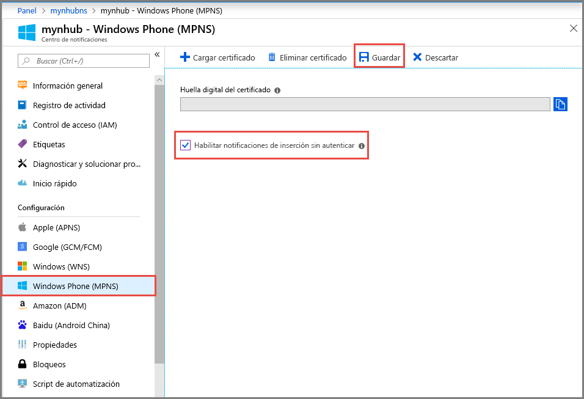

# Configuración del Servicio de notificaciones push de Microsoft (MPNS) para un centro de notificaciones en Azure Portal
En este artículo podrá ver cómo establecer la configuración del Servicio de notificaciones push de Microsoft (MPNS) para un centro de notificaciones de Azure mediante Azure Portal. 

## Requisitos previos
Si aún no ha creado un centro de notificaciones, cree uno ahora. Para más información, consulte [Creación de un centro de notificaciones de Azure en Azure Portal](create-notification-hub-portal.md). 

## Configuración del Servicio de notificaciones push de Microsoft (MPNS)

El siguiente procedimiento le proporciona los pasos para establecer la configuración del Servicio de notificaciones push de Microsoft (MPNS) para un centro de notificaciones: 

1. En Azure Portal, en la página **Centro de notificaciones**, seleccione **Windows Phone (MPNS)** en el menú izquierdo.
1. Habilite las notificaciones push sin autenticar o autenticadas:

   a. Para habilitar las notificaciones push no autenticadas, seleccione **Habilitar notificaciones de inserción sin autenticar** > **Guardar**.

      

   b. Para habilitar las notificaciones push no autenticadas:
      * Seleccione **Cargar certificado** en la barra de herramientas.
      * Seleccione el icono de archivo y el archivo de certificado.
      * Escriba la contraseña del certificado.
      * Seleccione **Aceptar**.
      * En la página **Windows Phone (MPNS)** , seleccione **Guardar**.

## Pasos siguientes
Para ver un tutorial con instrucciones paso a paso sobre cómo insertar notificaciones en aplicaciones de Windows Phone mediante Azure Notification Hubs y el Servicio de notificaciones push de Microsoft (MPNS), consulte [Envío de notificaciones push a aplicaciones de Windows Phone mediante Notification Hubs](notification-hubs-windows-mobile-push-notifications-mpns.md).

