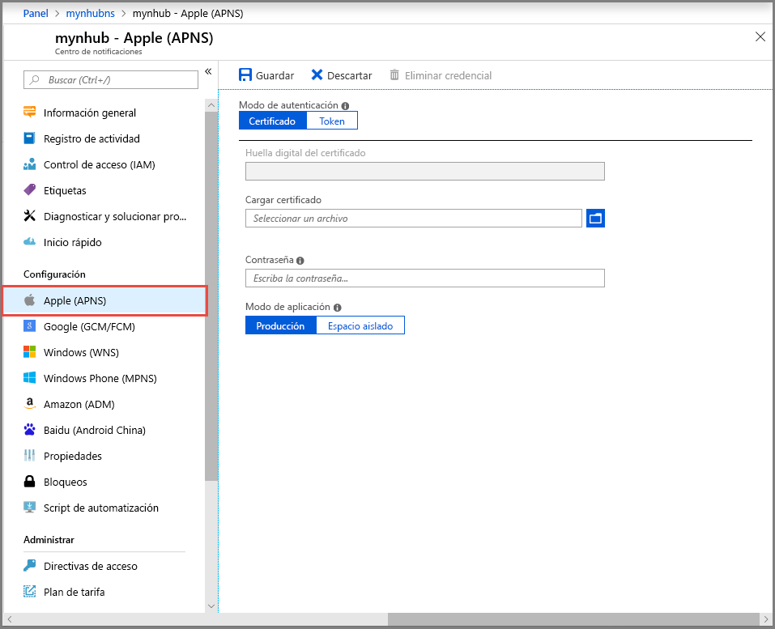
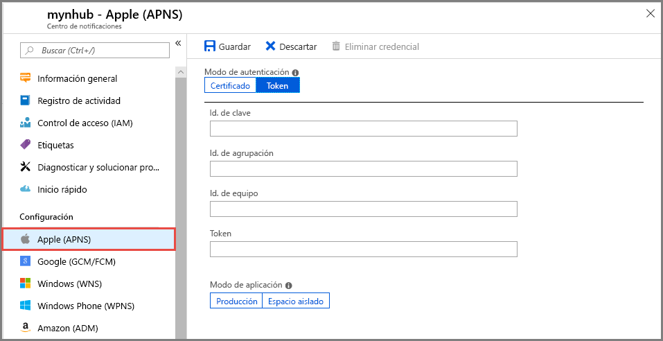
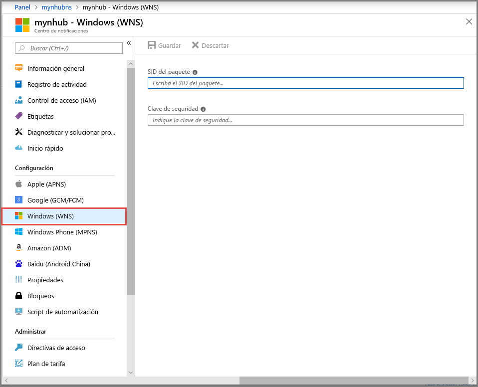
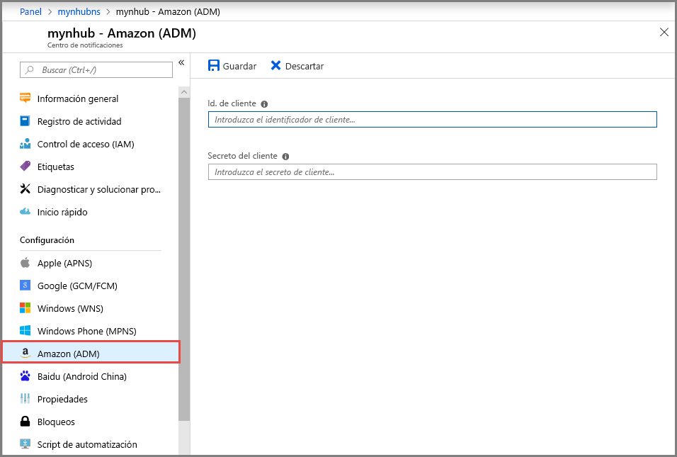
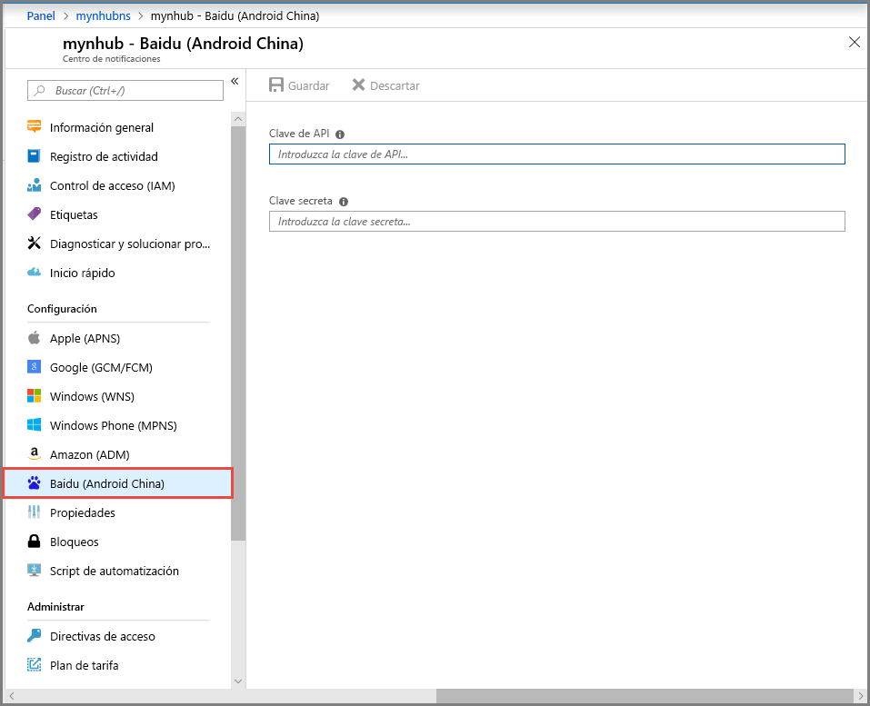

# Configuración de un centro de notificaciones de Azure con la configuración del sistema de notificación de plataforma en Azure Portal 
Azure Notification Hubs proporciona un motor de inserción de escalabilidad horizontal y fácil de usar que le permite enviar notificaciones a cualquier plataforma (iOS, Android, Windows, Kindle, Baidu, etc.) desde cualquier back-end (en la nube o local). Para más información sobre el servicio, consulte [¿Qué es Azure Notification Hubs?](notification-hubs-push-notification-overview.md).

[Cree un centro de notificaciones de Azure mediante Azure Portal](create-notification-hub-portal.md) si aún no lo ha hecho. En este inicio rápido, aprenderá cómo configurar un centro de notificaciones en Azure Portal con la configuración del sistema de notificación de plataforma (PNS).

## Servicio de notificaciones de inserción de Apple (APNS)
1. En la página **Notification Hub** (Centro de notificaciones) de Azure Portal, seleccione **Apple (APNS)** en **Configuración** en el menú izquierdo.
2. Si selecciona **Certificado**, realice las acciones siguientes:
    1. Seleccione el **icono de archivo** y el archivo **.p12** que cargar. 
    2. Especifique la **contraseña**.
    3. Seleccione el modo **Espacio aislado**. Use el modo **Producción** únicamente si desea enviar notificaciones de inserción a los usuarios que compraron la aplicación en la tienda.

        
3. Si selecciona **Token**, siga estos pasos: 
    1. Especifique los valores de **key ID** (id. clave), **bundle ID** (Id. de agrupación), **team ID** (Id. de equipo) y **token**.
    2. Seleccione el modo **Espacio aislado**. Use el modo **Producción** únicamente si desea enviar notificaciones de inserción a los usuarios que compraron la aplicación en la tienda.

        

Para ver un tutorial completo sobre las notificaciones de inserción en dispositivos iOS mediante Azure Notification Hubs y Apple Push Notification Service (APNs), consulte [este tutorial](notification-hubs-ios-apple-push-notification-apns-get-started.md).

## Google Firebase Cloud Messaging (FCM)
1. En la página **Notification Hub** (Centro de notificaciones) de Azure Portal, seleccione **Google (GCM/FCM)** en **Configuración** en el menú izquierdo. 
2. Pegue la **clave de servidor** para el proyecto FCM que ha guardado anteriormente. 
3. Seleccione **Guardar** en la barra de herramientas. 

    
4. Aparece un mensaje en las alertas que indica que los centros de notificaciones se han actualizado correctamente. El botón **Save** (Guardar) está deshabilitado. 

Para ver un tutorial completo sobre las notificaciones de inserción en dispositivos Android mediante Azure Notification Hubs y Google Firebase Cloud Messaging, consulte, [este tutorial](notification-hubs-android-push-notification-google-fcm-get-started.md).

## Servicio de notificaciones de inserción de Windows (WNS)
1. En la página **Notification Hub** (Centro de notificaciones) de Azure Portal, seleccione **Windows (WNS)** en **Configuración** en el menú izquierdo.
2. Especifique los valores de **SID de paquete** y **Clave de seguridad**.
3. Seleccione **Guardar** en la barra de herramientas.

    

Para ver un tutorial completo sobre las notificaciones de inserción en una aplicación de Plataforma Universal de Windows (UWP) en ejecución en un dispositivo Windows, consulte [este tutorial](notification-hubs-windows-store-dotnet-get-started-wns-push-notification.md).

## Windows Phone: Servicio de notificaciones push de Microsoft
1. En la página **Notification Hub** (Centro de notificaciones) de Azure Portal, seleccione **Windows Phone (MPNS)** en **Configuración**.
2. Si desea habilitar notificaciones de inserción sin autenticar, seleccione **Habilitar notificaciones de inserción sin autenticar** y, a continuación, seleccione **Guardar** en la barra de herramientas.

    
3. Si desea usar notificaciones de inserción **autenticadas**, siga estos pasos:
    1. Seleccione **Cargar certificado** en la barra de herramientas.
    2. Seleccione el **icono de archivo** y el archivo de certificado.
    3. Escriba la **contraseña** del certificado. 
    4. Seleccione **Aceptar** para cerrar la página **Cargar certificado**. 
    5. En la página **Windows Phone (MPNS)**, seleccione **Guardar** en la barra de herramientas.

Para ver un tutorial completo sobre las notificaciones de inserción en una aplicación de Windows Phone 8 mediante el Servicio de notificaciones push de Microsoft (MPNS), consulte [este tutorial](notification-hubs-windows-mobile-push-notifications-mpns.md).
      
## Amazon Device Messaging (ADM)
1. En la página **Notification Hub** (Centro de notificaciones) de Azure Portal, seleccione **Amazon (ADM)** en **Configuración** en el menú izquierdo.
2. Especifique los valores de **Id. de cliente** y **Secreto de cliente**.
3. Seleccione **Guardar** en la barra de herramientas.
    
    

Para ver un tutorial completo sobre el uso de notificaciones de inserción de Azure Notification Hubs en una aplicación de Kindle, consulte [este tutorial](notification-hubs-kindle-amazon-adm-push-notification.md).

## Baidu (Android China)
1. En la página **Notification Hub** (Centro de notificaciones) de Azure Portal, seleccione **Baidu (Android China)** en **Configuración** en el menú izquierdo. 
2. Escriba la **clave de API** que ha obtenido en la consola de Baidu, en el proyecto Baidu Cloud Push. 
3. Escriba la **clave secreta** que ha obtenido en la consola de Baidu, en el proyecto Baidu Cloud Push. 
4. Seleccione **Guardar** en la barra de herramientas. 

    
4. Aparece un mensaje en las alertas que indica que los centros de notificaciones se han actualizado correctamente. El botón **Save** (Guardar) está deshabilitado. 

Para ver un tutorial completo sobre el uso de notificaciones de inserción mediante Azure Notifications Hubs y Baidu Cloud Push, consulte [este tutorial](notification-hubs-baidu-china-android-notifications-get-started.md).

## Pasos siguientes
En este inicio rápido, ha aprendido cómo configurar sistemas de notificaciones de distintas plataformas para un centro de notificaciones en Azure Portal. 

Para obtener instrucciones detalladas completas sobre el uso de notificaciones de inserción en estas plataformas, consulte los tutoriales de la sección **Tutoriales**.

- [Envío de notificaciones de inserción a dispositivos iOS mediante Azure Notification Hubs y Apple Push Notification Service (APNs)](notification-hubs-ios-apple-push-notification-apns-get-started.md).
- [Envío de notificaciones de inserción a dispositivos Android con Azure Notification Hubs y Google Firebase Cloud Messaging](notification-hubs-android-push-notification-google-fcm-get-started.md).
- [Envío de notificaciones de inserción a una aplicación de Plataforma Universal de Windows (UWP) en un dispositivo Windows](notification-hubs-windows-store-dotnet-get-started-wns-push-notification.md).
- [Envío de notificaciones de inserción a una aplicación de Windows Phone 8 mediante el Servicio de notificaciones push de Microsoft (MPNS)](notification-hubs-windows-mobile-push-notifications-mpns.md).
- [Envío de notificaciones de inserción a una aplicación de Kindle](notification-hubs-kindle-amazon-adm-push-notification.md).
- [Envío de notificaciones de inserción mediante Azure Notification Hubs y Baidu Cloud Push](notification-hubs-baidu-china-android-notifications-get-started.md).
