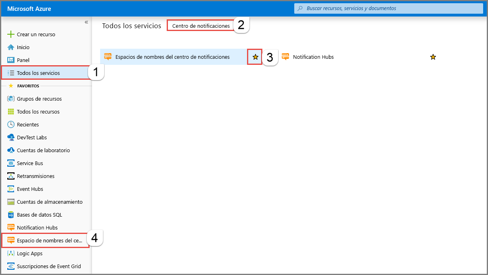
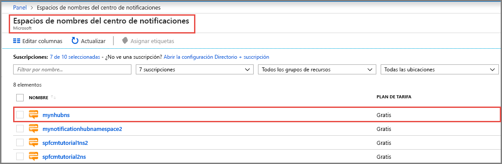
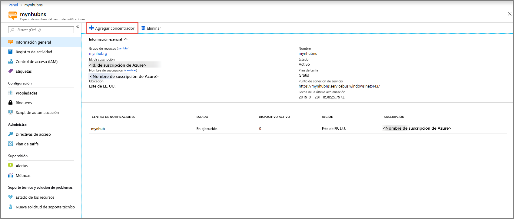
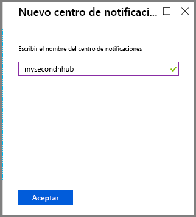
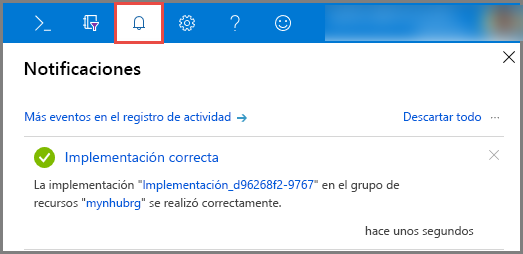
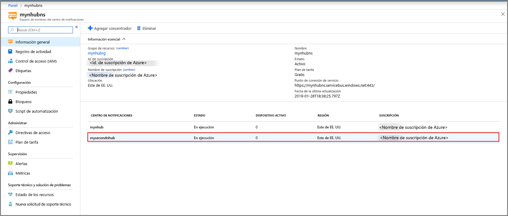
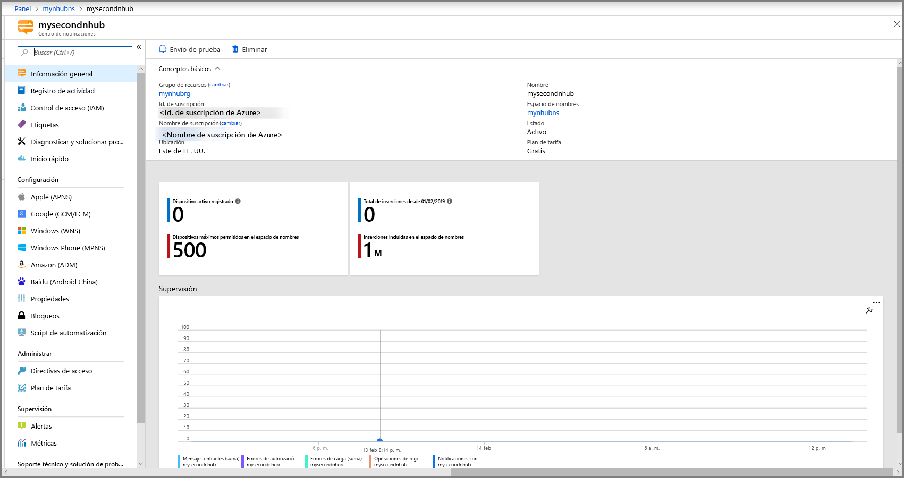

# Creación de un centro de notificaciones de Azure en Azure Portal 
Azure Notification Hubs proporciona un motor de inserción de escalabilidad horizontal y fácil de usar que le permite enviar notificaciones a cualquier plataforma (iOS, Android, Windows, Kindle, Baidu, etc.) desde cualquier back-end (en la nube o local). Para más información sobre el servicio, consulte [¿Qué es Azure Notification Hubs?](notification-hubs-push-notification-overview.md).

En este inicio rápido, creará un centro de notificaciones en Azure Portal. La primera sección proporciona los pasos para crear un espacio de nombres de Notification Hubs y un centro en ese espacio de nombres. La segunda sección proporciona los pasos para crear un centro de notificaciones en un espacio de nombres de Notification Hubs existente. 

## Creación de un espacio de nombres y un centro de notificaciones
En esta sección, creará un espacio de nombres y un centro en el espacio de nombres. 

[!INCLUDE [notification-hubs-portal-create-new-hub](../../includes/notification-hubs-portal-create-new-hub.md)]

## Creación de un centro de notificaciones en un espacio de nombres existente
En esta sección, creará un centro de notificaciones en un espacio de nombres existente. 

1. Inicie sesión en el [Azure Portal](https://portal.azure.com).
2. Seleccione **Todos los servicios** en el menú izquierdo, busque **Notification Hub** (Centro de notificaciones), seleccione la **estrella** (`*`) junto a **Notification Hub Namespaces** (Espacios de nombres de centros de notificaciones) para añadirlo a la sección **FAVORITOS** del menú izquierdo. Seleccione **Notification Hub Namespaces** (Espacios de nombres del centros de notificaciones). 

      
3. En la página **Notification Hub Namespaces** (Espacios de nombres del centros de notificaciones), seleccione el espacio de nombres en la lista. 

      
1. En la página **Espacio de nombres del centros de notificaciones**, seleccione **Agregar concentrador** en la barra de herramientas. 

      
4. En la página **Nuevo centro de notificaciones**, escriba un nombre para el centro de notificaciones y seleccione **Aceptar**.

      
4. Seleccione **Notificaciones** (icono de campana) en la parte superior para ver el estado de la implementación del nuevo centro. Seleccione **X** en la esquina derecha para cerrar la ventana de notificaciones. 

      
5. Actualice la página web **Notification Hub Namespaces** (Espacios de nombres del centros de notificaciones) para ver el nuevo centro en la lista. 

      
6. Seleccione el **centro de notificaciones** para ver la página principal del centro de notificaciones. 

      

## Pasos siguientes
En este inicio rápido, ha creado un centro de notificaciones. Para obtener información sobre cómo configurar el centro con la configuración del sistema de notificación de plataforma (PNS), consulte [Configuración de un centro de notificaciones con la configuración de PNS](configure-notification-hub-portal-pns-settings.md). 