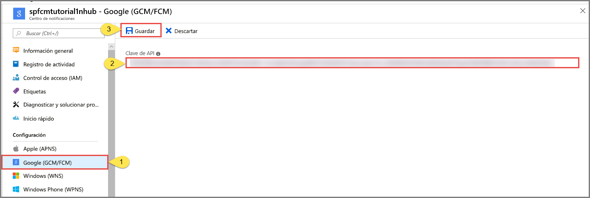

# <a name="tutorial-push-notifications-to-android-devices-by-using-azure-notification-hubs-and-google-firebase-cloud-messaging"></a>Tutorial: Envío de notificaciones push a dispositivos Android con Azure Notification Hubs y Google Firebase Cloud Messaging

[!INCLUDE [notification-hubs-selector-get-started](../../includes/notification-hubs-selector-get-started.md)]

En este tutorial se muestra cómo usar Azure Notification Hubs y Firebase Cloud Messaging (FCM) para enviar notificaciones push a una aplicación de Android. En este tutorial, creará una aplicación de Android en blanco que recibirá notificaciones push mediante Firebase Cloud Messaging (FCM).

El código completo de este tutorial se puede descargar de GitHub, [aquí](https://github.com/Azure/azure-notificationhubs-android/tree/master/samples/FCMTutorialApp).

En este tutorial, realizará los siguientes pasos:

> [!div class="checklist"]
> * Crear un nuevo proyecto en Android Studio
> * Crear un proyecto en Firebase que admita Firebase Cloud Messaging
> * Crear un Centro de notificaciones
> * Conectar una aplicación al Centro de notificaciones
> * Probar la aplicación.

## <a name="prerequisites"></a>Requisitos previos

Para completar este tutorial, deberá tener una cuenta de Azure activa. En caso de no tener cuenta, puede crear una de evaluación gratuita en tan solo unos minutos. Para obtener más información, consulte [Evaluación gratuita de Azure](https://azure.microsoft.com/free/).

* Además de la cuenta de Azure activa mencionada anteriormente, este tutorial requiere la versión más reciente de [Android Studio](https://go.microsoft.com/fwlink/?LinkId=389797).
* Android 2.3, o una versión superior, para Firebase Cloud Messaging.
* Para Firebase Cloud Messaging, se requiere la revisión 27 del repositorio de Google, o una revisión posterior.
* Google Play Services 9.0.2, o una versión superior, para Firebase Cloud Messaging.
* La realización de este tutorial es un requisito previo para todos los tutoriales de Notification Hubs para aplicaciones Android.

## <a name="create-an-android-studio-project"></a>Creación de un nuevo proyecto en Android Studio

1. Inicie Android Studio.
2. Seleccione sucesivamente **File** (Archivo) en el menú, **New** (Nuevo) y **New Project** (Nuevo proyecto). 
2. En la página **Choose your project** (Elija su proyecto), seleccione **Empty Activity** (Vaciar actividad) y seleccione **Next** (Siguiente). 
3. En la página **Configure your project** (Configurar el proyecto), siga estos pasos: 
    1. Escriba un **nombre** para la aplicación.
    2. Especifique una ubicación para guardar los archivos del proyecto. 
    3. Seleccione **Finalizar**. 

        

## <a name="create-a-firebase-project-that-supports-fcm"></a>Creación de un proyecto en Firebase que admita FCM

[!INCLUDE [notification-hubs-enable-firebase-cloud-messaging](../../includes/notification-hubs-enable-firebase-cloud-messaging.md)]

## <a name="configure-a-notification-hub"></a>Configuración de un Centro de notificaciones

[!INCLUDE [notification-hubs-portal-create-new-hub](../../includes/notification-hubs-portal-create-new-hub.md)]

### <a name="configure-firebase-cloud-messaging-settings-for-the-hub"></a>Configuración de los valores de Firebase Cloud Messaging para el centro

1. Seleccione **Google (GCM/FCM)** en **Settings** (Configuración) en el menú de la izquierda. 
2. Pegue la **clave de servidor** para el proyecto FCM que ha guardado anteriormente. 
3. Seleccione **Guardar** en la barra de herramientas. 

    
4. Aparece un mensaje en las alertas que indica que los centros de notificaciones se han actualizado correctamente. El botón **Save** (Guardar) está deshabilitado. 

El Centro de notificaciones está configurado para funcionar con Firebase Cloud Messaging y el usuario dispone de las cadenas de conexión necesarias para registrar su aplicación para que reciba y envíe notificaciones push.

## <a id="connecting-app"></a>Conexión de la aplicación al Centro de notificaciones

### <a name="add-google-play-services-to-the-project"></a>Incorporación de los servicios de Google Play al proyecto

[!INCLUDE [Add Play Services](../../includes/notification-hubs-android-studio-add-google-play-services.md)]

### <a name="adding-azure-notification-hubs-libraries"></a>Incorporación de bibliotecas de Azure Notification Hubs

1. En el archivo `Build.Gradle` de la **aplicación**, agregue las siguientes líneas en la sección **dependencies**.

    ```gradle
    implementation 'com.microsoft.azure:notification-hubs-android-sdk:0.6@aar'
    implementation 'com.microsoft.azure:azure-notifications-handler:1.0.1@aar'
    ```

2. Agregue el repositorio siguiente después de la sección de **dependencias** .

    ```gradle
    repositories {
        maven {
            url "https://dl.bintray.com/microsoftazuremobile/SDK"
        }
    }
    ```

### <a name="add-google-firebase-support"></a>Adición de compatibilidad con Google Firebase

1. En el archivo `Build.Gradle` de la **aplicación**, agregue las siguientes líneas en la sección de **dependencias** si todavía no existen. 

    ```gradle
    implementation 'com.google.firebase:firebase-core:16.0.8'
    implementation 'com.google.firebase:firebase-messaging:17.3.4'
    ```

2. Agregue el siguiente complemento al final del archivo si todavía no existe. 

    ```gradle
    apply plugin: 'com.google.gms.google-services'
    ```
3. Seleccione **Sinc Now** (Sincronizar ahora) en la barra de herramientas.

### <a name="updating-the-androidmanifestxml"></a>Actualización de AndroidManifest.xml

1. Una vez que haya recibido el token de registro de FCM, úselo para el [registro en Azure Notification Hub](notification-hubs-push-notification-registration-management.md). Este registro se admite en segundo plano con un servicio `IntentService` llamado `RegistrationIntentService`. Este servicio también es responsable de actualizar su token de registro de FCM.

    Agregue la siguiente definición de servicio al archivo AndroidManifest.xml, en la etiqueta `<application>` .

    ```xml
    <service
        android:name=".RegistrationIntentService"
        android:exported="false">
    </service>
    ```

2. También debe definir un receptor para recibir las notificaciones. Agregue la siguiente definición de receptor al archivo AndroidManifest.xml, en la etiqueta `<application>` . 

    ```xml
    <receiver android:name="com.microsoft.windowsazure.notifications.NotificationsBroadcastReceiver"
        android:permission="com.google.android.c2dm.permission.SEND">
        <intent-filter>
            <action android:name="com.google.android.c2dm.intent.RECEIVE" />
            <category android:name="<your package name>" />
        </intent-filter>
    </receiver>
    ```

    > [!IMPORTANT]
    > Reemplace el marcador de posición `<your package NAME>` por el nombre real del paquete, que se muestra en la parte superior del archivo `AndroidManifest.xml`.
3. Agregue los siguientes permisos relacionados con FCM necesarios **debajo** de la etiqueta `</application>`.

    ```xml
    <uses-permission android:name="android.permission.INTERNET"/>
    <uses-permission android:name="android.permission.GET_ACCOUNTS"/>
    <uses-permission android:name="com.google.android.c2dm.permission.RECEIVE" />
    ```

### <a name="adding-code"></a>Incorporación de código

1. En la Vista de proyecto, expanda **app** > **src** > **main** > **java**. Haga clic con el botón derecho en la carpeta del paquete en **java**, haga clic en **Nuevo** y, a continuación, haga clic en **Clase Java**. Escriba `NotificationSettings` para el nombre y seleccione **OK** (Aceptar).

    Asegúrese de actualizar estos tres marcadores de posición en el código siguiente para la clase `NotificationSettings`:

   * **HubListenConnectionString**: la cadena de conexión **DefaultListenAccessSignature** del centro. Para copiar dicha cadena de conexión, haga clic en **Directivas de acceso** en su centro en [Azure Portal].
   * **HubName**: use el nombre del centro de notificaciones que aparece en la página del centro de [Azure Portal].

     `NotificationSettings` :

        ```java
        public class NotificationSettings {
            public static String HubName = "<Your HubName>";
            public static String HubListenConnectionString = "<Enter your DefaultListenSharedAccessSignature connection string>";
        }
        ```

     > [!IMPORTANT]
     > Escriba el **nombre** y elemento **DefaultListenSharedAccessSignature** del centro de notificaciones antes de continuar. 

3. Agregue otra clase nueva, llamada `RegistrationIntentService`, al proyecto. Esta clase implementa la interfaz de `IntentService` y controla la [actualización del token de FCM](https://developers.google.com/instance-id/guides/android-implementation#refresh_tokens) y el [registro en el Centro de notificaciones](notification-hubs-push-notification-registration-management.md).

    Use el siguiente código para esta clase.

    ```java
    import android.app.IntentService;
    import android.content.Intent;
    import android.content.SharedPreferences;
    import android.preference.PreferenceManager;
    import android.util.Log;
    import com.google.android.gms.tasks.OnSuccessListener;
    import com.google.firebase.iid.FirebaseInstanceId;
    import com.google.firebase.iid.InstanceIdResult;
    import com.microsoft.windowsazure.messaging.NotificationHub;
    import java.util.concurrent.TimeUnit;

    public class RegistrationIntentService extends IntentService {

        private static final String TAG = "RegIntentService";
        String FCM_token = null;

        private NotificationHub hub;

        public RegistrationIntentService() {
            super(TAG);
        }

        @Override
        protected void onHandleIntent(Intent intent) {

            SharedPreferences sharedPreferences = PreferenceManager.getDefaultSharedPreferences(this);
            String resultString = null;
            String regID = null;
            String storedToken = null;

            try {
                FirebaseInstanceId.getInstance().getInstanceId().addOnSuccessListener(new OnSuccessListener<InstanceIdResult>() { 
                    @Override 
                    public void onSuccess(InstanceIdResult instanceIdResult) { 
                        FCM_token = instanceIdResult.getToken(); 
                        Log.d(TAG, "FCM Registration Token: " + FCM_token); 
                    } 
                }); 
                TimeUnit.SECONDS.sleep(1);

                // Storing the registration ID that indicates whether the generated token has been
                // sent to your server. If it is not stored, send the token to your server,
                // otherwise your server should have already received the token.
                if (((regID=sharedPreferences.getString("registrationID", null)) == null)){

                    NotificationHub hub = new NotificationHub(NotificationSettings.HubName,
                            NotificationSettings.HubListenConnectionString, this);
                    Log.d(TAG, "Attempting a new registration with NH using FCM token : " + FCM_token);
                    regID = hub.register(FCM_token).getRegistrationId();

                    // If you want to use tags...
                    // Refer to : https://azure.microsoft.com/documentation/articles/notification-hubs-routing-tag-expressions/
                    // regID = hub.register(token, "tag1,tag2").getRegistrationId();

                    resultString = "New NH Registration Successfully - RegId : " + regID;
                    Log.d(TAG, resultString);

                    sharedPreferences.edit().putString("registrationID", regID ).apply();
                    sharedPreferences.edit().putString("FCMtoken", FCM_token ).apply();
                }

                // Check if the token may have been compromised and needs refreshing.
                else if ((storedToken=sharedPreferences.getString("FCMtoken", "")) != FCM_token) {

                    NotificationHub hub = new NotificationHub(NotificationSettings.HubName,
                            NotificationSettings.HubListenConnectionString, this);
                    Log.d(TAG, "NH Registration refreshing with token : " + FCM_token);
                    regID = hub.register(FCM_token).getRegistrationId();

                    // If you want to use tags...
                    // Refer to : https://azure.microsoft.com/documentation/articles/notification-hubs-routing-tag-expressions/
                    // regID = hub.register(token, "tag1,tag2").getRegistrationId();

                    resultString = "New NH Registration Successfully - RegId : " + regID;
                    Log.d(TAG, resultString);

                    sharedPreferences.edit().putString("registrationID", regID ).apply();
                    sharedPreferences.edit().putString("FCMtoken", FCM_token ).apply();
                }

                else {
                    resultString = "Previously Registered Successfully - RegId : " + regID;
                }
            } catch (Exception e) {
                Log.e(TAG, resultString="Failed to complete registration", e);
                // If an exception happens while fetching the new token or updating our registration data
                // on a third-party server, this ensures that we'll attempt the update at a later time.
            }

            // Notify UI that registration has completed.
            if (MainActivity.isVisible) {
                MainActivity.mainActivity.ToastNotify(resultString);
            }
        }
    }
    ```

4. En la clase `MainActivity`, agregue las siguientes instrucciones `import` encima de la declaración de la clase.

    ```java
    import com.google.android.gms.common.ConnectionResult;
    import com.google.android.gms.common.GoogleApiAvailability;
    import com.microsoft.windowsazure.notifications.NotificationsManager;
    import android.content.Intent;
    import android.util.Log;
    import android.widget.TextView;
    import android.widget.Toast;
    ```

5. Agregue los siguientes miembros al principio de la clase. Use estos campos para [comprobar la disponibilidad de Google Play Services, tal como recomienda Google](https://developers.google.com/android/guides/setup#ensure_devices_have_the_google_play_services_apk).

    ```java
    public static MainActivity mainActivity;
    public static Boolean isVisible = false;
    private static final String TAG = "MainActivity";
    private static final int PLAY_SERVICES_RESOLUTION_REQUEST = 9000;
    ```

6. En la clase `MainActivity`, agregue el método siguiente para comprobar la disponibilidad de Google Play Services.

    ```java
    /**
    * Check the device to make sure it has the Google Play Services APK. If
    * it doesn't, display a dialog that allows users to download the APK from
    * the Google Play Store or enable it in the device's system settings.
    */

    private boolean checkPlayServices() {
        GoogleApiAvailability apiAvailability = GoogleApiAvailability.getInstance();
        int resultCode = apiAvailability.isGooglePlayServicesAvailable(this);
        if (resultCode != ConnectionResult.SUCCESS) {
            if (apiAvailability.isUserResolvableError(resultCode)) {
                apiAvailability.getErrorDialog(this, resultCode, PLAY_SERVICES_RESOLUTION_REQUEST)
                        .show();
            } else {
                Log.i(TAG, "This device is not supported by Google Play Services.");
                ToastNotify("This device is not supported by Google Play Services.");
                finish();
            }
            return false;
        }
        return true;
    }
    ```

7. En la clase `MainActivity`, agregue el siguiente código, que comprueba Google Play Services antes de llamar a `IntentService` para obtener el token de registro de FCM y realizar el registro en el Centro de notificaciones.

    ```java
    public void registerWithNotificationHubs()
    {
        if (checkPlayServices()) {
            // Start IntentService to register this application with FCM.
            Intent intent = new Intent(this, RegistrationIntentService.class);
            startService(intent);
        }
    }
    ```

8. En el método `OnCreate` de la clase `MainActivity`, agregue el código siguiente para iniciar el proceso de registro cuando se crea la actividad.

    ```java
    @Override
    protected void onCreate(Bundle savedInstanceState) {
        super.onCreate(savedInstanceState);
        setContentView(R.layout.activity_main);

        mainActivity = this;
        registerWithNotificationHubs();
        MyHandler.createChannelAndHandleNotifications(getApplicationContext());
    }
    ```

9. Para comprobar el estado de la aplicación y el del informe de la aplicación, agregue estos métodos adicionales a la clase `MainActivity`.

    ```java
    @Override
    protected void onStart() {
        super.onStart();
        isVisible = true;
    }

    @Override
    protected void onPause() {
        super.onPause();
        isVisible = false;
    }

    @Override
    protected void onResume() {
        super.onResume();
        isVisible = true;
    }

    @Override
    protected void onStop() {
        super.onStop();
        isVisible = false;
    }

    public void ToastNotify(final String notificationMessage) {
        runOnUiThread(new Runnable() {
            @Override
            public void run() {
                Toast.makeText(MainActivity.this, notificationMessage, Toast.LENGTH_LONG).show();
                TextView helloText = (TextView) findViewById(R.id.text_hello);
                helloText.setText(notificationMessage);
            }
        });
    }
    ```

10. El método `ToastNotify` usa el control *"Hello World"* `TextView` para informar del estado y de las notificaciones de forma persistente en la aplicación. En el diseño **res** -> **layout** -> **activity_main.xml**, agregue el siguiente identificador para ese control.

    ```java
    android:id="@+id/text_hello"
    ```

11. A continuación, agregue una subclase para el receptor que definió en el archivo AndroidManifest.xml. Agregue otra clase nueva, llamada `MyHandler`, al proyecto.

12. Agregue las siguientes instrucciones de importación en la parte superior de `MyHandler.java`:

    ```java
    import android.app.NotificationChannel;
    import android.app.NotificationManager;
    import android.app.PendingIntent;
    import android.content.Context;
    import android.content.Intent;
    import android.media.RingtoneManager;
    import android.net.Uri;
    import android.os.Build;
    import android.os.Bundle;
    import android.support.v4.app.NotificationCompat;
    import com.microsoft.windowsazure.notifications.NotificationsHandler;    
    import com.microsoft.windowsazure.notifications.NotificationsManager;
    ```

13. Agregue el siguiente código para la clase `MyHandler` para convertirla en una subclase de `com.microsoft.windowsazure.notifications.NotificationsHandler`.

    Este código invalida el método `OnReceive`, por lo que el controlador informa de las notificaciones que se reciben. El controlador también envía la notificación push al administrador de notificaciones de Android mediante el método `sendNotification()` . El método `sendNotification()` se debe ejecutar cuando se reciba una notificación y la aplicación no se esté ejecutando.

    ```java
    public class MyHandler extends NotificationsHandler {
        public static final String NOTIFICATION_CHANNEL_ID = "nh-demo-channel-id";
        public static final String NOTIFICATION_CHANNEL_NAME = "Notification Hubs Demo Channel";
        public static final String NOTIFICATION_CHANNEL_DESCRIPTION = "Notification Hubs Demo Channel";
    
        public static final int NOTIFICATION_ID = 1;
        private NotificationManager mNotificationManager;
        NotificationCompat.Builder builder;
        Context ctx;
    
        @Override
        public void onReceive(Context context, Bundle bundle) {
            ctx = context;
            String nhMessage = bundle.getString("message");
            sendNotification(nhMessage);
            if (MainActivity.isVisible) {
                MainActivity.mainActivity.ToastNotify(nhMessage);
            }
        }
    
        private void sendNotification(String msg) {
    
            Intent intent = new Intent(ctx, MainActivity.class);
            intent.addFlags(Intent.FLAG_ACTIVITY_CLEAR_TOP);
    
            mNotificationManager = (NotificationManager)
                    ctx.getSystemService(Context.NOTIFICATION_SERVICE);
    
            PendingIntent contentIntent = PendingIntent.getActivity(ctx, 0,
                    intent, PendingIntent.FLAG_ONE_SHOT);
    
            Uri defaultSoundUri = RingtoneManager.getDefaultUri(RingtoneManager.TYPE_NOTIFICATION);
            NotificationCompat.Builder notificationBuilder = new NotificationCompat.Builder(
                    ctx,
                    NOTIFICATION_CHANNEL_ID)
                    .setContentText(msg)
                    .setPriority(NotificationCompat.PRIORITY_HIGH)
                    .setSmallIcon(android.R.drawable.ic_popup_reminder)
                    .setBadgeIconType(NotificationCompat.BADGE_ICON_SMALL);
    
            notificationBuilder.setContentIntent(contentIntent);
            mNotificationManager.notify(NOTIFICATION_ID, notificationBuilder.build());
        }
    
        public static void createChannelAndHandleNotifications(Context context) {
            if (Build.VERSION.SDK_INT >= Build.VERSION_CODES.O) {
                NotificationChannel channel = new NotificationChannel(
                        NOTIFICATION_CHANNEL_ID,
                        NOTIFICATION_CHANNEL_NAME,
                        NotificationManager.IMPORTANCE_HIGH);
                channel.setDescription(NOTIFICATION_CHANNEL_DESCRIPTION);
                channel.setShowBadge(true);
    
                NotificationManager notificationManager = context.getSystemService(NotificationManager.class);
                notificationManager.createNotificationChannel(channel);
                NotificationsManager.handleNotifications(context, "", MyHandler.class);
            }
        }
    }
    ```

14. En la barra de menús de Android Studio, haga clic en **Build** (Compilar)  > **Rebuild Project** (Recompilar proyecto) para asegurarse de que no hay errores en el código. Si recibe un error sobre el icono `ic_launcher`, quite la siguiente instrucción del archivo AndroidManifest.xml. 

    ```
        android:icon="@mipmap/ic_launcher"
    ```
15. Ejecute la aplicación en el dispositivo y compruebe que se registra correctamente con el Centro de notificaciones.

    > [!NOTE]
    > El registro puede producir un error la primera vez que se realiza el inicio hasta que se llama al método `onTokenRefresh()` del servicio de identificación de la instancia. La actualización debe iniciar un registro correcto en el Centro de notificaciones.

    

## <a name="test-send-notification-from-the-notification-hub"></a>Envío de prueba de notificación desde el Centro de notificaciones

Para enviar notificaciones push desde [Azure Portal] realice las siguientes acciones:

1. En Azure Portal, en la página **Notification Hubs** del centro de notificaciones, seleccione **Envío de prueba** en la sección **Solución de problemas**.
3. En **Plataformas**, seleccione **Android**.
4. Seleccione **Enviar**.  No verá aún ninguna notificación en el dispositivo Android, porque no ha ejecutado la aplicación móvil en él. Después de ejecutar la aplicación móvil, vuelva a seleccionar el botón **Enviar** para ver el mensaje de notificación.
5. Vea el **resultado** de la operación en la lista de la parte inferior.

    
6. Verá el mensaje de notificación en el dispositivo. 

    
    

[!INCLUDE [notification-hubs-sending-notifications-from-the-portal](../../includes/notification-hubs-sending-notifications-from-the-portal.md)]

### <a name="run-the-mobile-app-on-emulator"></a>Ejecución de la aplicación móvil en el emulador
Si desea probar notificaciones push en un emulador, asegúrese de que la imagen del emulador admita el nivel de API de Google que elija para la aplicación. Si la imagen no admite las API de Google nativas, puede obtener la excepción **SERVICE\_NOT\_AVAILABLE**.

Además, asegúrese de haber agregado su cuenta de Google al emulador en ejecución en **Configuración** > **Cuentas**. De lo contrario, sus intentos de registrarse con FCM podrían generar la excepción **AUTHENTICATION\_FAILED**.

## <a name="next-steps"></a>Pasos siguientes
En este tutorial, se usa Firebase Cloud Messaging para enviar notificaciones de difusión a todos los dispositivos Android registrados en el back-end. Para aprender a enviar notificaciones push a dispositivos específicos, pase al siguiente tutorial:

> [!div class="nextstepaction"]
>[Tutorial: Envío de notificaciones push a dispositivos Android específicos](notification-hubs-aspnet-backend-android-xplat-segmented-gcm-push-notification.md)

<!-- Images. -->

<!-- URLs. -->
[Get started with push notifications in Mobile Services]: ../mobile-services-javascript-backend-android-get-started-push.md  
[Mobile Services Android SDK]: https://go.microsoft.com/fwLink/?LinkID=280126&clcid=0x409
[Referencing a library project]: https://go.microsoft.com/fwlink/?LinkId=389800
[Notification Hubs Guidance]: notification-hubs-push-notification-overview.md
[Azure Portal]: https://portal.azure.com
