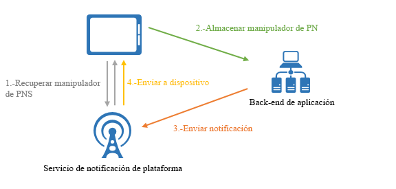
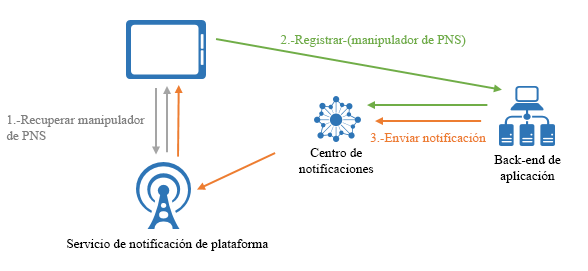

# ¿Qué es Azure Notification Hubs?

Azure Notification Hubs proporciona un motor de inserción de escalabilidad horizontal y fácil de usar que le permite enviar notificaciones a cualquier plataforma (iOS, Android, Windows, Kindle, Baidu, etc.) desde cualquier back-end (en la nube o local). Notification Hubs funciona muy bien tanto para escenarios empresariales como de consumidores. Estos son algunos escenarios de ejemplo:

- Enviar notificaciones de noticias de última hora a millones de usuarios con baja latencia.
- Enviar cupones basados en la ubicación a segmentos de usuarios interesados.
- Enviar notificaciones relacionadas con eventos a usuarios o grupos para aplicaciones de medios, deportivas, de finanzas o de juegos.
- Inserte contenido promocional en aplicaciones para ponerse en contacto y comercializar con clientes.
- Informar a los usuarios sobre eventos empresariales como, por ejemplo, nuevos mensajes o elementos de trabajo.
- Enviar códigos para Multi-Factor Authentication.

## ¿Qué son las notificaciones push?

Las notificaciones push son una forma de comunicación de aplicación a usuario en la que los usuarios de aplicaciones móviles reciben una notificación con determinada información que desean, por lo general, en un cuadro de diálogo o una ventana emergente en un dispositivo móvil. Normalmente, los usuarios eligen ver o descartar el mensaje; si eligen lo primero, se abrirá la aplicación móvil que les ha comunicado la notificación. Algunas notificaciones son silenciosas, es decir, que se entregan en segundo plano para que la aplicación se procese en segundo plano y decida qué hacer.

Las notificaciones push son vitales para las aplicaciones de consumidor, ya que aumentan el uso y la interacción de las aplicaciones, así como para las aplicaciones empresariales, ya que comunican información empresarial actualizada. Es la mejor forma de comunicación de aplicación a usuario porque ahorra energía para los dispositivos móviles, es flexible para los remitentes de notificaciones y está disponible cuando las aplicaciones correspondientes no están activas.

Para obtener más información acerca de las notificaciones push de algunas plataformas populares, consulte los temas siguientes:

- [Android](https://developer.android.com/guide/topics/ui/notifiers/notifications.html)
- [iOS](https://developer.apple.com/notifications/)
- [Windows](https://msdn.microsoft.com/library/windows/apps/hh779725.aspx)

## Funcionamiento de las notificaciones push

Las notificaciones push se entregan a través de unas infraestructuras específicas para la plataforma llamadas *Sistemas de notificación de plataforma* (PNS). Ofrecen funcionalidades de inserción esenciales para la entrega de un mensaje a un dispositivo con un identificador proporcionado y no tienen ninguna interfaz común. Para enviar una notificación a todos los clientes en versiones de Android, iOS y Windows de una aplicación, el desarrollador debe trabajar con Apple Push Notification Service (APNS), Firebase Cloud Messaging (FCM) y el Servicio de notificaciones de Windows (WNS) por separado.

A continuación se muestra cómo funciona la inserción, a nivel general:

1. Una aplicación decide que desea recibir una notificación, por lo que se pone en contacto con PNS para la plataforma de destino donde la aplicación se está ejecutando y solicita un identificador de inserción único y temporal. El tipo de identificador depende del sistema (por ejemplo, WNS usa URI, mientras que APNS usa tokens).
2. La aplicación cliente almacena este identificador en el back-end o el proveedor de la aplicación.
3. Para enviar una notificación push, el back-end de la aplicación se pone en contacto con el PNS a través del identificador para dirigirse a una aplicación cliente específica.
4. El PNS reenvía la notificación al dispositivo que especifica el identificador.

## Los desafíos de las notificaciones push

Los PNS son potentes. No obstante, exigen mucho trabajo al desarrollador de aplicaciones para poder implementar incluso escenarios comunes de notificaciones push, como la difusión de notificaciones push a usuarios segmentados.

Las notificaciones push requieren una infraestructura compleja que no esté relacionada con la lógica de negocios principal de la aplicación. Algunos de los desafíos que presenta la infraestructura son:

- **Dependencia de la plataforma**
  - El back-end requiere una lógica, dependiente de la plataforma, compleja y difícil de mantener para enviar notificaciones a dispositivos de distintas plataformas, ya que los PNS no están unificados.
- **Escala**
  - Según las directrices de PNS, se deben actualizar los tokens de dispositivo cada vez que se inicia la aplicación. El back-end trata con una gran cantidad de tráfico y acceso de bases de datos solo para mantener actualizados los tokens. Cuando el número de dispositivos aumenta a centenares, millares o millones, la creación y el mantenimiento de esta infraestructura supone un costo enorme.
  - La mayoría de los PNS no son compatibles con la difusión a varios dispositivos. Una simple difusión a un millón de dispositivos genera un millón de llamadas a los PNS. El escalado de esta cantidad de tráfico con una latencia mínima no es algo trivial.
- **Enrutamiento**
  - Aunque los PNS proporcionan una manera de enviar mensajes a dispositivos, la mayoría de las notificaciones de aplicaciones se dirigen a usuarios o grupos de interés. El back-end debe mantener un registro para asociar dispositivos a grupos de interés, usuarios, propiedades, etc. Esta sobrecarga se agrega al tiempo de comercialización total y a los costos de mantenimiento de una aplicación.

## Motivos para usar Azure Notification Hubs

Notification Hubs elimina todas las complejidades asociadas a la inserción de notificaciones por su cuenta desde el back-end de su aplicación. Su infraestructura de notificaciones push multiplataforma y escalada horizontalmente reduce la codificación relativa a la inserción y simplifica el back-end. Con Notification Hubs, los dispositivos solo son responsables de registrar identificadores de PNS con un centro, mientras que el back-end envía mensajes a usuarios o grupos de interés, tal como se muestra en la ilustración siguiente:

Notification Hubs es un motor de inserción listo para usar que presenta las siguientes ventajas:

- **Multiplataforma**
  - Compatibilidad para las principales plataformas push incluidos iOS, Android, Windows, Kindle y Baidu.
  - Una interfaz común para insertar en todas las plataformas en formatos específicos de la plataforma o independientes de esta sin ningún tipo de trabajo específico de la plataforma.
  - Administración de controladores de dispositivos en un único lugar.
- **Back-ends cruzados**
  - En la nube o local
  - .NET, Node.js, Java, Python, etc.
- **Conjunto completo de patrones de entrega**
  - Difusión para una o varias plataformas: puede difundir al instante a millones de dispositivos entre plataformas con una sola llamada API.
  - Inserción en dispositivo: puede destinar las notificaciones a dispositivos individuales.
  - Inserción en usuario: las características de etiquetas y plantillas le ayudan a llegar a todos los dispositivos multiplataforma de un usuario.
  - Inserción en segmento con etiquetas dinámicas: las características de etiquetas le ayudan a segmentar dispositivos e insertar en ellos en función de sus necesidades, tanto si va a enviar a un segmento como si lo envía a una expresión de segmentos (por ejemplo: AND activo reside en Seattle NO es un usuario nuevo). En lugar de limitarse a la publicación-suscripción, puede actualizar las etiquetas de dispositivo en cualquier lugar y en cualquier momento.
  - Inserción localizada: la característica de plantillas le ayuda a obtener la localización sin alterar el código de back-end.
  - Inserción silenciosa: puede habilitar el modelo de inserción a extracción enviando notificaciones silenciosas a dispositivos y desencadenándolos para que realicen ciertas extracciones o acciones.
  - Inserción programada: puede programar el envío de notificaciones en cualquier momento.
  - Inserción directa: puede omitir el registro de dispositivos con el servicio Notification Hubs y procesar por lotes directamente las inserciones a una lista de identificadores de dispositivo.
  - Inserción personalizada: las variables de inserción de dispositivo le ayudan a enviar notificaciones push personalizadas específicas de dispositivo con pares de clave-valor personalizados.
- **Telemetría enriquecida**
  - La telemetría de inserción general, dispositivo, error y operación está disponible en Azure Portal y mediante programación.
  - La telemetría por mensaje realiza el seguimiento de cada inserción desde la llamada de la solicitud inicial al servicio Notification Hubs, procesando por lotes correctamente el envío de las inserciones.
  - Platform Notification System Feedback (Comentarios del Sistema de notificación de plataforma) comunica todos los comentarios de los Sistemas de notificación de plataforma para ayudar en la depuración.
- **Escalabilidad**
  - Envíe mensajes rápidos a millones de dispositivos sin tener que volver a diseñar la arquitectura ni realizar el particionamiento del dispositivo.
- **Seguridad**
  - Firma de acceso compartido (SAS) o autenticación federada.

## Pasos siguientes

Conozca la información para la creación y el uso de un centro de notificaciones en [Tutorial: Envío de notificaciones push a aplicaciones móviles](notification-hubs-android-push-notification-google-fcm-get-started.md).

[0]: ./media/notification-hubs-overview/registration-diagram.png
[1]: ./media/notification-hubs-overview/notification-hub-diagram.png

[How customers are using Notification Hubs]: https://azure.microsoft.com/services/notification-hubs
[Notification Hubs tutorials and guides]: https://azure.microsoft.com/documentation/services/notification-hubs
[iOS]: https://azure.microsoft.com/documentation/articles/notification-hubs-ios-get-started
[Android]: https://azure.microsoft.com/documentation/articles/notification-hubs-android-get-started
[Windows Universal]: https://azure.microsoft.com/documentation/articles/notification-hubs-windows-store-dotnet-get-started
[Windows Phone]: https://azure.microsoft.com/documentation/articles/notification-hubs-windows-phone-get-started
[Kindle]: https://azure.microsoft.com/documentation/articles/notification-hubs-kindle-get-started
[Xamarin.iOS]: https://azure.microsoft.com/documentation/articles/partner-xamarin-notification-hubs-ios-get-started
[Xamarin.Android]: https://azure.microsoft.com/documentation/articles/partner-xamarin-notification-hubs-android-get-started
[Microsoft.WindowsAzure.Messaging.NotificationHub]: https://msdn.microsoft.com/library/microsoft.windowsazure.messaging.notificationhub.aspx
[Microsoft.ServiceBus.Notifications]: https://msdn.microsoft.com/library/microsoft.servicebus.notifications.aspx
[App Service Mobile Apps]: https://azure.microsoft.com/documentation/articles/app-service-mobile-value-prop/
[templates]: notification-hubs-templates-cross-platform-push-messages.md
[Azure portal]: https://portal.azure.com
[tags]: (https://msdn.microsoft.com/library/azure/dn530749.aspx)
