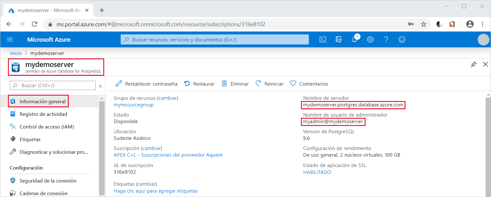

# <a name="quickstart-use-java-to-connect-to-and-query-data-in-azure-database-for-postgresql---single-server"></a>Inicio rápido: uso de Java para conectarse a Azure Database for PostgreSQL y consultar datos: servidor único

En este inicio rápido se va a conectar a una instancia de Azure Database for PostgreSQL mediante una aplicación de Java. Se indica cómo usar instrucciones SQL para consultar, insertar, actualizar y eliminar datos en la base de datos. En los pasos de este artículo, se da por hecho que está familiarizado con el desarrollo con Java, pero que nunca ha trabajado con Azure Database for PostgreSQL.

## <a name="prerequisites"></a>Prerequisites

- Una cuenta de Azure con una suscripción activa. [Cree una cuenta gratuita](https://azure.microsoft.com/free/?ref=microsoft.com&utm_source=microsoft.com&utm_medium=docs&utm_campaign=visualstudio).

- Finalización de [Inicio rápido: Cree un servidor de Azure Database for PostgreSQL en Azure Portal ](quickstart-create-server-database-portal.md)o [ en la guía de Inicio rápido de: Cree un Azure Database for PostgreSQL mediante la de CLI de Azure](quickstart-create-server-database-azure-cli.md).

- [Controlador JDBC de PostgreSQL](https://jdbc.postgresql.org/download.html): coincide con la versión de Java y Java Development Kit.
- [Detalles de la ruta de acceso de clase](https://jdbc.postgresql.org/documentation/head/classpath.html): incluya el archivo jar JDBC de PostgreSQL (por ejemplo postgresql-42.1.1.jar) en la ruta de acceso de clase de aplicación.

## <a name="get-connection-information"></a>Obtención de información sobre la conexión
Obtenga la información de conexión necesaria para conectarse a Azure Database for PostgreSQL. Necesitará el nombre completo del servidor y las credenciales de inicio de sesión.

1. En [Azure Portal](https://portal.azure.com/), busque y seleccione el servidor que ha creado (como **mydemoserver**).

1. En el panel **Información general** del servidor, anote el **nombre del servidor** y el **nombre de usuario del administrador**. Si olvida la contraseña, puede restablecerla en este panel.

    

## <a name="connect-create-table-and-insert-data"></a>Conexión, creación de una tabla e inserción de datos
Use el código siguiente para conectarse y cargar los datos en la base de datos mediante la función con una instrucción SQL **INSERT**. Los métodos [getConnection()](https://www.postgresql.org/docs/7.4/static/jdbc-use.html), [createStatement()](https://jdbc.postgresql.org/documentation/head/query.html) y [executeQuery()](https://jdbc.postgresql.org/documentation/head/query.html) se usan para conectarse a la base de datos, colocar y crear la tabla. El objeto [prepareStatement](https://jdbc.postgresql.org/documentation/head/query.html) se usa para generar los comandos insert, con setString() y setInt() para enlazar los valores de parámetro. El método [executeUpdate()](https://jdbc.postgresql.org/documentation/head/update.html) ejecuta el comando para cada conjunto de parámetros. 

Reemplace los parámetros de host, database, user y password por los valores que especificó al crear el servidor y la base de datos.

```java
import java.sql.*;
import java.util.Properties;

public class CreateTableInsertRows {

    public static void main (String[] args)  throws Exception
    {

        // Initialize connection variables.
        String host = "mydemoserver.postgres.database.azure.com";
        String database = "mypgsqldb";
        String user = "mylogin@mydemoserver";
        String password = "<server_admin_password>";

        // check that the driver is installed
        try
        {
            Class.forName("org.postgresql.Driver");
        }
        catch (ClassNotFoundException e)
        {
            throw new ClassNotFoundException("PostgreSQL JDBC driver NOT detected in library path.", e);
        }

        System.out.println("PostgreSQL JDBC driver detected in library path.");

        Connection connection = null;

        // Initialize connection object
        try
        {
            String url = String.format("jdbc:postgresql://%s/%s", host, database);
            
            // set up the connection properties
            Properties properties = new Properties();
            properties.setProperty("user", user);
            properties.setProperty("password", password);
            properties.setProperty("ssl", "true");

            // get connection
            connection = DriverManager.getConnection(url, properties);
        }
        catch (SQLException e)
        {
            throw new SQLException("Failed to create connection to database.", e);
        }
        if (connection != null) 
        { 
            System.out.println("Successfully created connection to database.");
        
            // Perform some SQL queries over the connection.
            try
            {
                // Drop previous table of same name if one exists.
                Statement statement = connection.createStatement();
                statement.execute("DROP TABLE IF EXISTS inventory;");
                System.out.println("Finished dropping table (if existed).");
    
                // Create table.
                statement.execute("CREATE TABLE inventory (id serial PRIMARY KEY, name VARCHAR(50), quantity INTEGER);");
                System.out.println("Created table.");
    
                // Insert some data into table.
                int nRowsInserted = 0;
                PreparedStatement preparedStatement = connection.prepareStatement("INSERT INTO inventory (name, quantity) VALUES (?, ?);");
                preparedStatement.setString(1, "banana");
                preparedStatement.setInt(2, 150);
                nRowsInserted += preparedStatement.executeUpdate();

                preparedStatement.setString(1, "orange");
                preparedStatement.setInt(2, 154);
                nRowsInserted += preparedStatement.executeUpdate();

                preparedStatement.setString(1, "apple");
                preparedStatement.setInt(2, 100);
                nRowsInserted += preparedStatement.executeUpdate();
                System.out.println(String.format("Inserted %d row(s) of data.", nRowsInserted));
    
                // NOTE No need to commit all changes to database, as auto-commit is enabled by default.
    
            }
            catch (SQLException e)
            {
                throw new SQLException("Encountered an error when executing given sql statement.", e);
            }       
        }
        else {
            System.out.println("Failed to create connection to database.");
        }
        System.out.println("Execution finished.");
    }
}
```

## <a name="read-data"></a>Lectura de datos
Use el código siguiente para leer los datos con una instrucción SQL **SELECT**. Los métodos [getConnection()](https://www.postgresql.org/docs/7.4/static/jdbc-use.html), [createStatement()](https://jdbc.postgresql.org/documentation/head/query.html) y [executeQuery()](https://jdbc.postgresql.org/documentation/head/query.html) se usan para conectarse a la base de datos, crear y ejecutar la instrucción Select. Los resultados se procesan mediante un objeto [ResultSet](https://www.postgresql.org/docs/7.4/static/jdbc-query.html). 

Reemplace los parámetros de host, database, user y password por los valores que especificó al crear el servidor y la base de datos.

```java
import java.sql.*;
import java.util.Properties;

public class ReadTable {

    public static void main (String[] args)  throws Exception
    {

        // Initialize connection variables.
        String host = "mydemoserver.postgres.database.azure.com";
        String database = "mypgsqldb";
        String user = "mylogin@mydemoserver";
        String password = "<server_admin_password>";

        // check that the driver is installed
        try
        {
            Class.forName("org.postgresql.Driver");
        }
        catch (ClassNotFoundException e)
        {
            throw new ClassNotFoundException("PostgreSQL JDBC driver NOT detected in library path.", e);
        }

        System.out.println("PostgreSQL JDBC driver detected in library path.");

        Connection connection = null;

        // Initialize connection object
        try
        {
            String url = String.format("jdbc:postgresql://%s/%s", host, database);
            
            // set up the connection properties
            Properties properties = new Properties();
            properties.setProperty("user", user);
            properties.setProperty("password", password);
            properties.setProperty("ssl", "true");

            // get connection
            connection = DriverManager.getConnection(url, properties);
        }
        catch (SQLException e)
        {
            throw new SQLException("Failed to create connection to database.", e);
        }
        if (connection != null) 
        { 
            System.out.println("Successfully created connection to database.");
        
            // Perform some SQL queries over the connection.
            try
            {
    
                Statement statement = connection.createStatement();
                ResultSet results = statement.executeQuery("SELECT * from inventory;");
                while (results.next())
                {
                    String outputString = 
                        String.format(
                            "Data row = (%s, %s, %s)",
                            results.getString(1),
                            results.getString(2),
                            results.getString(3));
                    System.out.println(outputString);
                }
            }
            catch (SQLException e)
            {
                throw new SQLException("Encountered an error when executing given sql statement.", e);
            }       
        }
        else {
            System.out.println("Failed to create connection to database.");
        }
        System.out.println("Execution finished.");
    }
}

```

## <a name="update-data"></a>Actualización de datos
Use el código siguiente para cambiar los datos con una instrucción SQL **UPDATE**. Los métodos [getConnection()](https://www.postgresql.org/docs/7.4/static/jdbc-use.html), [prepareStatement()](https://jdbc.postgresql.org/documentation/head/query.html) y [executeUpdate()](https://jdbc.postgresql.org/documentation/head/update.html) se usan para conectarse a la base de datos, preparar y ejecutar la instrucción Update. 

Reemplace los parámetros de host, database, user y password por los valores que especificó al crear el servidor y la base de datos.

```java
import java.sql.*;
import java.util.Properties;

public class UpdateTable {
    public static void main (String[] args)  throws Exception
    {

        // Initialize connection variables.
        String host = "mydemoserver.postgres.database.azure.com";
        String database = "mypgsqldb";
        String user = "mylogin@mydemoserver";
        String password = "<server_admin_password>";

        // check that the driver is installed
        try
        {
            Class.forName("org.postgresql.Driver");
        }
        catch (ClassNotFoundException e)
        {
            throw new ClassNotFoundException("PostgreSQL JDBC driver NOT detected in library path.", e);
        }

        System.out.println("PostgreSQL JDBC driver detected in library path.");

        Connection connection = null;

        // Initialize connection object
        try
        {
            String url = String.format("jdbc:postgresql://%s/%s", host, database);
            
            // set up the connection properties
            Properties properties = new Properties();
            properties.setProperty("user", user);
            properties.setProperty("password", password);
            properties.setProperty("ssl", "true");

            // get connection
            connection = DriverManager.getConnection(url, properties);
        }
        catch (SQLException e)
        {
            throw new SQLException("Failed to create connection to database.", e);
        }
        if (connection != null) 
        { 
            System.out.println("Successfully created connection to database.");
        
            // Perform some SQL queries over the connection.
            try
            {
                // Modify some data in table.
                int nRowsUpdated = 0;
                PreparedStatement preparedStatement = connection.prepareStatement("UPDATE inventory SET quantity = ? WHERE name = ?;");
                preparedStatement.setInt(1, 200);
                preparedStatement.setString(2, "banana");
                nRowsUpdated += preparedStatement.executeUpdate();
                System.out.println(String.format("Updated %d row(s) of data.", nRowsUpdated));
    
                // NOTE No need to commit all changes to database, as auto-commit is enabled by default.
            }
            catch (SQLException e)
            {
                throw new SQLException("Encountered an error when executing given sql statement.", e);
            }       
        }
        else {
            System.out.println("Failed to create connection to database.");
        }
        System.out.println("Execution finished.");
    }
}
```
## <a name="delete-data"></a>Eliminación de datos
Use el código siguiente para quitar datos con una instrucción SQL **DELETE**. Los métodos [getConnection()](https://www.postgresql.org/docs/7.4/static/jdbc-use.html), [prepareStatement()](https://jdbc.postgresql.org/documentation/head/query.html) y [executeUpdate()](https://jdbc.postgresql.org/documentation/head/update.html) se usan para conectarse a la base de datos, preparar y ejecutar la instrucción Delete. 

Reemplace los parámetros de host, database, user y password por los valores que especificó al crear el servidor y la base de datos.

```java
import java.sql.*;
import java.util.Properties;

public class DeleteTable {
    public static void main (String[] args)  throws Exception
    {

        // Initialize connection variables.
        String host = "mydemoserver.postgres.database.azure.com";
        String database = "mypgsqldb";
        String user = "mylogin@mydemoserver";
        String password = "<server_admin_password>";

        // check that the driver is installed
        try
        {
            Class.forName("org.postgresql.Driver");
        }
        catch (ClassNotFoundException e)
        {
            throw new ClassNotFoundException("PostgreSQL JDBC driver NOT detected in library path.", e);
        }

        System.out.println("PostgreSQL JDBC driver detected in library path.");

        Connection connection = null;

        // Initialize connection object
        try
        {
            String url = String.format("jdbc:postgresql://%s/%s", host, database);
            
            // set up the connection properties
            Properties properties = new Properties();
            properties.setProperty("user", user);
            properties.setProperty("password", password);
            properties.setProperty("ssl", "true");

            // get connection
            connection = DriverManager.getConnection(url, properties);
        }
        catch (SQLException e)
        {
            throw new SQLException("Failed to create connection to database.", e);
        }
        if (connection != null) 
        { 
            System.out.println("Successfully created connection to database.");
        
            // Perform some SQL queries over the connection.
            try
            {
                // Delete some data from table.
                int nRowsDeleted = 0;
                PreparedStatement preparedStatement = connection.prepareStatement("DELETE FROM inventory WHERE name = ?;");
                preparedStatement.setString(1, "orange");
                nRowsDeleted += preparedStatement.executeUpdate();
                System.out.println(String.format("Deleted %d row(s) of data.", nRowsDeleted));
    
                // NOTE No need to commit all changes to database, as auto-commit is enabled by default.
            }
            catch (SQLException e)
            {
                throw new SQLException("Encountered an error when executing given sql statement.", e);
            }       
        }
        else {
            System.out.println("Failed to create connection to database.");
        }
        System.out.println("Execution finished.");
    }
}
```

## <a name="next-steps"></a>Pasos siguientes
> [!div class="nextstepaction"]
> [Migración de una base de datos mediante exportación e importación](./howto-migrate-using-export-and-import.md)
