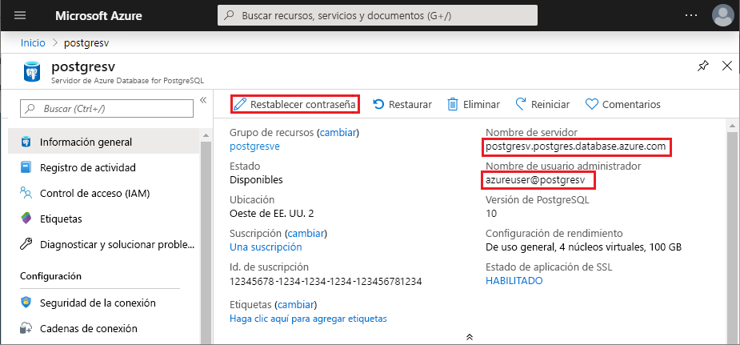

# <a name="quickstart-use-python-to-connect-and-query-data-in-azure-database-for-postgresql---single-server"></a>Inicio rápido: Uso de Python para conectarse y consultar datos en un servidor único Azure Database for PostgreSQL

En este inicio rápido se muestra cómo trabajar con una instancia de Azure Database for PostgreSQL mediante Python en macOS, Ubuntu Linux o Windows. En la guía de inicio rápido se muestra cómo conectarse a la base de datos y usar instrucciones SQL para consultar, insertar, actualizar y eliminar datos. En este artículo se da por hecho que está familiarizado con Python, pero que es nuevo para trabajar con Azure Database for PostgreSQL.

## <a name="prerequisites"></a>Prerequisites

- Una cuenta de Azure con una suscripción activa. [Cree una cuenta gratuita](https://azure.microsoft.com/free/?ref=microsoft.com&utm_source=microsoft.com&utm_medium=docs&utm_campaign=visualstudio).

- Finalización de [Inicio rápido: Cree un servidor de Azure Database for PostgreSQL en Azure Portal ](quickstart-create-server-database-portal.md)o [ en la guía de Inicio rápido de: Cree un Azure Database for PostgreSQL mediante la de CLI de Azure](quickstart-create-server-database-azure-cli.md).
  
- [Python](https://www.python.org/downloads/) 2.7.9+ o 3.4+.
  
- Instalador de paquetes [pip](https://pip.pypa.io/en/stable/installing/) más reciente.

## <a name="install-the-python-libraries-for-postgresql"></a>Instalación de las bibliotecas de Python para PostgreSQL
El módulo [psycopg2](https://pypi.python.org/pypi/psycopg2/) permite conectarse a una base de datos de PostgreSQL y realizar consultas, y está disponible como un paquete de Linux, macOS o Windows [wheel](https://pythonwheels.com/). Instale la versión binaria del módulo, incluidas todas las dependencias. Para más información sobre `psycopg2` instalación y requisitos, consulte [Instalación](http://initd.org/psycopg/docs/install.html). 

Para instalar `psycopg2`, abra un símbolo del sistema o de terminal y ejecute el comando`pip install psycopg2`.

## <a name="get-database-connection-information"></a>Obtener información de conexión de base de datos
La conexión a una base de datos Azure Database for PostgreSQL requiere el nombre completo del servidor y las credenciales de inicio de sesión. Puede obtener esta información en el Azure Portal.

1. En el [Azure Portal](https://portal.azure.com/), busque y seleccione el nombre del servidor de Azure Database for PostgreSQL. 
1. En la página de**Información general** del servidor, copie el nombre completo del **Servidor** y el **Nombre del usuario administrador**. El **nombre completo del servidor** siempre tiene el formato *\<my-server-name>.postgres.database.azure.com* y el **Nombre del usuario administrador** siempre tiene el formato *\<my-admin-username>@\<my-server-name>* . 
   
   También necesitará la contraseña de administrador. Si la olvida, puede restablecerla desde esta página. 
   
   

## <a name="how-to-run-the-python-examples"></a>Cómo ejecutar los ejemplos de Python

Para cada ejemplo de código de este artículo:

1. Cree un nuevo archivo en un editor de texto. 
   
1. Agregue el ejemplo de código al archivo. En el código, reemplace:
   - `<server-name>` y `<admin-username>` con los valores que copió del Azure Portal.
   - `<admin-password>` con la contraseña del servidor.
   - `<database-name>` con el nombre de la base de datos de Azure Database for PostgreSQL. Se creará automáticamente una base de datos predeterminada denominada *postgres* al crear el servidor. Puede cambiar el nombre de la base de datos o crear una nueva mediante comandos SQL. 
   
1. Guarde el archivo en la carpeta del proyecto con una extensión *.py*, como *postgres-insert.py*. En Windows, asegúrese de que la codificación UTF-8 está seleccionada al guardar el archivo. 
   
1. Para ejecutar el archivo, cambie a la carpeta del proyecto en una interfaz de línea de comandos y escriba `python`seguido del nombre de archivo, por ejemplo`python postgres-insert.py`.

## <a name="create-a-table-and-insert-data"></a>Crear una tabla e insertar datos
El siguiente ejemplo de código se conecta a la base de datos de Azure Database for PostgreSQL mediante la función [psycopg2.connect](http://initd.org/psycopg/docs/connection.html) y carga los datos con una instrucción SQL **INSERT**. La función [cursor.execute](http://initd.org/psycopg/docs/cursor.html#execute) ejecuta la consulta SQL en la base de datos. 

```Python
import psycopg2

# Update connection string information 
host = "<server-name>"
dbname = "<database-name>"
user = "<admin-username>"
password = "<admin-password>"
sslmode = "require"

# Construct connection string
conn_string = "host={0} user={1} dbname={2} password={3} sslmode={4}".format(host, user, dbname, password, sslmode)
conn = psycopg2.connect(conn_string) 
print("Connection established")

cursor = conn.cursor()

# Drop previous table of same name if one exists
cursor.execute("DROP TABLE IF EXISTS inventory;")
print("Finished dropping table (if existed)")

# Create a table
cursor.execute("CREATE TABLE inventory (id serial PRIMARY KEY, name VARCHAR(50), quantity INTEGER);")
print("Finished creating table")

# Insert some data into the table
cursor.execute("INSERT INTO inventory (name, quantity) VALUES (%s, %s);", ("banana", 150))
cursor.execute("INSERT INTO inventory (name, quantity) VALUES (%s, %s);", ("orange", 154))
cursor.execute("INSERT INTO inventory (name, quantity) VALUES (%s, %s);", ("apple", 100))
print("Inserted 3 rows of data")

# Clean up
conn.commit()
cursor.close()
conn.close()
```

Cuando el código se ejecuta correctamente, genera el siguiente resultado:


## <a name="read-data"></a>Lectura de datos
En el ejemplo de código siguiente se conecta a la base de datos de Azure Database for PostgreSQL y se usa [cursor.execute](http://initd.org/psycopg/docs/cursor.html#execute) con la instrucción SQL **SELECT** para leer datos. Esta función acepta una consulta y devuelve un conjunto de resultados para iterar mediante [cursor.fetchall()](http://initd.org/psycopg/docs/cursor.html#cursor.fetchall). 

```Python
import psycopg2

# Update connection string information
host = "<server-name>"
dbname = "<database-name>"
user = "<admin-username>"
password = "<admin-password>"
sslmode = "require"

# Construct connection string
conn_string = "host={0} user={1} dbname={2} password={3} sslmode={4}".format(host, user, dbname, password, sslmode)
conn = psycopg2.connect(conn_string) 
print("Connection established")

cursor = conn.cursor()

# Fetch all rows from table
cursor.execute("SELECT * FROM inventory;")
rows = cursor.fetchall()

# Print all rows
for row in rows:
    print("Data row = (%s, %s, %s)" %(str(row[0]), str(row[1]), str(row[2])))

# Cleanup
conn.commit()
cursor.close()
conn.close()
```

## <a name="update-data"></a>Actualización de datos
El siguiente ejemplo de código se conecta a la base de datos de Azure Database for PostgreSQL y usa [cursor.execute](http://initd.org/psycopg/docs/cursor.html#execute) con la instrucción SQL **UPDATE** para actualizar los datos. 

```Python
import psycopg2

# Update connection string information
host = "<server-name>"
dbname = "<database-name>"
user = "<admin-username>"
password = "<admin-password>"
sslmode = "require"

# Construct connection string
conn_string = "host={0} user={1} dbname={2} password={3} sslmode={4}".format(host, user, dbname, password, sslmode)
conn = psycopg2.connect(conn_string) 
print("Connection established")

cursor = conn.cursor()

# Update a data row in the table
cursor.execute("UPDATE inventory SET quantity = %s WHERE name = %s;", (200, "banana"))
print("Updated 1 row of data")

# Cleanup
conn.commit()
cursor.close()
conn.close()
```

## <a name="delete-data"></a>Eliminación de datos
En el ejemplo de código siguiente se conecta a la base de datos de Azure Database for PostgreSQL y se usa [cursor.execute](http://initd.org/psycopg/docs/cursor.html#execute) con la instrucción SQL **DELETE** para eliminar un elemento de inventario que se ha insertado previamente. 

```Python
import psycopg2

# Update connection string information
host = "<server-name>"
dbname = "<database-name>"
user = "<admin-username>"
password = "<admin-password>"
sslmode = "require"

# Construct connection string
conn_string = "host={0} user={1} dbname={2} password={3} sslmode={4}".format(host, user, dbname, password, sslmode)
conn = psycopg2.connect(conn_string) 
print("Connection established")

cursor = conn.cursor()

# Delete data row from table
cursor.execute("DELETE FROM inventory WHERE name = %s;", ("orange",))
print("Deleted 1 row of data")

# Cleanup
conn.commit()
cursor.close()
conn.close()
```

## <a name="next-steps"></a>Pasos siguientes
> [!div class="nextstepaction"]
> [Migración de una base de datos mediante exportación e importación](./howto-migrate-using-export-and-import.md)
