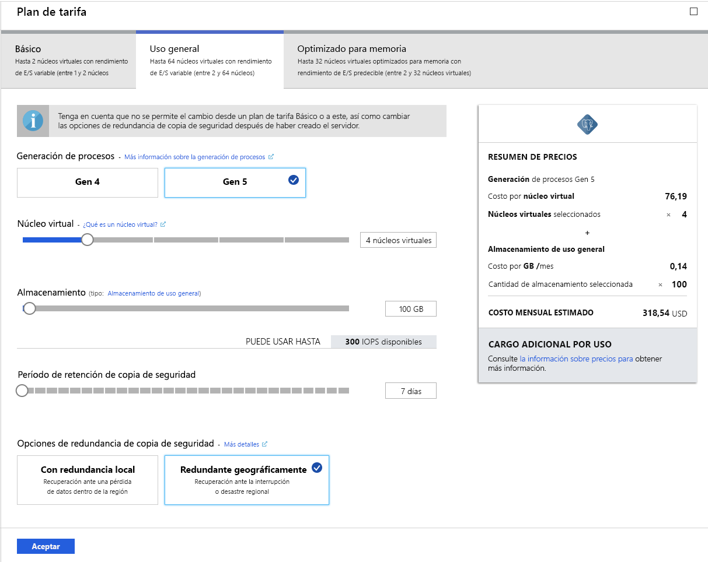

# <a name="tutorial-design-an-azure-database-for-postgresql---single-server-using-the-azure-portal"></a>Tutorial: Diseño de una instancia de Azure Database for PostgreSQL: servidor único con Azure Portal

Azure Database for PostgreSQL es un servicio administrado que le permite ejecutar, administrar y escalar bases de datos de PostgreSQL de alta disponibilidad en la nube. Con Azure Portal puede administrar fácilmente el servidor y diseñar una base de datos.

En este tutorial usará Azure Portal para aprender a hacer lo siguiente:
> [!div class="checklist"]
> * Creación de un servidor de Azure Database for PostgreSQL
> * Configuración del firewall del servidor
> * Uso de la utilidad [**psql**](https://www.postgresql.org/docs/9.6/static/app-psql.html) para crear una base de datos
> * Carga de datos de ejemplo
> * Datos de consulta
> * Actualización de datos
> * Restauración de datos

## <a name="prerequisites"></a>Requisitos previos
Si no tiene una suscripción a Azure, cree una cuenta [gratuita](https://azure.microsoft.com/free/) antes de empezar.

## <a name="create-an-azure-database-for-postgresql"></a>Creación de una instancia de Azure Database for PostgreSQL

Un servidor de Azure Database for PostgreSQL se crea con un conjunto definido de [recursos de proceso y almacenamiento](./concepts-compute-unit-and-storage.md). El servidor se crea dentro de un [grupo de recursos de Azure](../azure-resource-manager/resource-group-overview.md).

Para crear un servidor de Azure Database for PostgreSQL, siga estos pasos:
1. Haga clic en **Crear un recurso** de la esquina superior izquierda de Azure Portal.
2. En la página **Nuevo**, seleccione **Bases de datos** y, en la página **Bases de datos**, seleccione **Azure Database for PostgreSQL**.
   

3. Seleccione la opción de implementación de **servidor único**.

   

4. Complete el formulario de **aspectos básicos** con la información siguiente:

    

    Configuración|Valor sugerido|DESCRIPCIÓN
    ---|---|---
    Subscription|Nombre de la suscripción|La suscripción de Azure que desea usar para el servidor. Si tiene varias suscripciones, elija aquella en la que se factura el recurso.
    Grupos de recursos|*myresourcegroup*| Un nuevo nombre de grupo de recursos o uno existente de la suscripción.
    Nombre de servidor |*mydemoserver*|Un nombre único que identifique al servidor de Azure Database for PostgreSQL. El nombre de dominio *postgres.database.azure.com* se anexa al nombre del servidor proporcionado. El servidor solo puede contener letras minúsculas, números y el carácter de guion (-). Debe contener al menos entre tres y 63 caracteres.
    Origen de datos | *None* | Seleccione *None* para crear un servidor desde cero. (Seleccione *Copia de seguridad* si va a crear un servidor a partir de una copia de seguridad con redundancia geográfica de un servidor existente de Azure Database for PostgreSQL).
    Nombre de usuario administrador |*myadmin*| Su propia cuenta de inicio de sesión para usarla al conectarse al servidor. El nombre de inicio de sesión del administrador no puede ser **azure_superuser,** **azure_pg_admin,** **admin,** **administrator,** **root,** **guest,** ni **public**. No puede empezar por **pg_**.
    Contraseña |La contraseña| Una contraseña nueva para la cuenta de administrador del servidor. Debe tener entre 8 y 128 caracteres. La contraseña debe contener caracteres de tres de las siguientes categorías: Letras del alfabeto inglés mayúsculas y minúsculas, números (0 a 9) y caracteres no alfanuméricos (!, $, #, %, etc.).
    Ubicación|Región más cercana a los usuarios| La ubicación más cercana a los usuarios.
    Versión|La versión principal más reciente| La versión principal más reciente de PostgreSQL, a menos que tenga requisitos específicos.
    Proceso y almacenamiento | **Uso general**, **Gen 5**, **2 núcleos virtuales**, **5 GB**, **7 días**, **Redundancia geográfica** | Configuración de los recursos de proceso, almacenamiento y copia de seguridad para el nuevo servidor. Seleccione **Configurar servidor**. A continuación, seleccione la pestaña **Uso general**. *Gen 5*, *4 núcleos virtuales*, *100 GB* y *7 días* son los valores predeterminados de **Generación de procesos**, **Núcleos virtuales**, **Almacenamiento** y **Período de retención de copia de seguridad**. Puede dejar esos controles deslizantes tal como están o ajustarlos. Para habilitar las copias de seguridad del servidor en el almacenamiento con redundancia geográfica, seleccione **Redundancia geográfica** en **Opciones de redundancia de copia de seguridad**. Para guardar el plan de tarifa elegido, seleccione **Aceptar**. La captura de pantalla siguiente muestra estas opciones seleccionadas.

   > [!NOTE]
   > Considere la posibilidad de usar el plan de tarifa Básico si menos proceso y E/S resultan adecuados para su carga de trabajo. Tenga en cuenta que los servidores que creó en el plan de tarifa Básico no se podrán escalar más adelante a De uso general u Optimizada para memoria. Consulte la [página de precios](https://azure.microsoft.com/pricing/details/postgresql/) para más información.
   > 

    

5. Seleccione **Review + create** (Revisar y crear) para revisar las selecciones. Seleccione **Crear** para realizar el aprovisionamiento del servidor. Esta operación puede tardar algunos minutos.

6. En la barra de herramientas, seleccione el símbolo de **Notificaciones** (una campana) para supervisar el proceso de implementación. Una vez realizada la implementación, puede seleccionar **Anclar al panel** para crear un icono para este servidor en el panel de Azure Portal como un acceso directo a la página **Información general** del servidor. Al seleccionar **Ir al recurso**, se abre la página **Información general** del servidor.

    
   
   De forma predeterminada, una base de datos de **postgres** se crea en el servidor. La base de datos de [postgres](https://www.postgresql.org/docs/9.6/static/app-initdb.html) es una base de datos predeterminada pensada para que la usen los usuarios, las utilidades y aplicaciones de otros fabricantes. (La otra base de datos predeterminada es **azure_maintenance**. Su función consiste en separar los procesos de servicio administrados de las acciones del usuario. No se puede acceder esta base de datos).


## <a name="configure-a-server-level-firewall-rule"></a>Configuración de una regla de firewall de nivel de servidor

El servicio Azure Database for PostgreSQL usa un firewall en el nivel de servidor. De forma predeterminada, este firewall evita que herramientas y aplicaciones externas se conecten al servidor o a las bases de datos de este, a menos que se cree una regla de firewall que lo abra a un intervalo de direcciones IP concretas. 

1. Una vez finalizada la implementación, haga clic en **Todos los recursos** en el menú izquierdo y escriba el nombre **mydemoserver** para buscar el servidor recién creado. Haga clic en el nombre del servidor que aparece en el resultado de la búsqueda. Se abrirá la página **Introducción** del servidor, que proporciona opciones para continuar la configuración.

   

2. En la página del servidor, seleccione **Seguridad de la conexión**. 

3. Haga clic en el cuadro de texto de **Nombre de la regla,** y agregue una nueva regla de firewall para añadir el intervalo de IP de conectividad a la lista de permitidos. Escriba el intervalo IP. Haga clic en **Save**(Guardar).

   

4. Haga clic en **Guardar** y en la **X** para cerrar la página **Seguridad de las conexiones**.

   > [!NOTE]
   > El servidor Azure PostgreSQL se comunica a través de puerto 5432. Si intenta conectarse desde una red corporativa, es posible que el firewall de la red no permita el tráfico saliente a través del puerto 5432. En ese caso, no puede conectarse al servidor de Azure SQL Database, salvo que el departamento de TI abra el puerto 5432.
   >

## <a name="get-the-connection-information"></a>Obtención de la información de conexión

Al crear el servidor de Azure Database for PostgreSQL, también se creó la base de datos de **postgres** predeterminada. Para conectarse al servidor de bases de datos, debe proporcionar las credenciales de acceso y la información del host.

1. En el menú de la izquierda de Azure Portal, haga clic en **Todos los recursos** y busque el servidor que acaba de crear.

   

2. Haga clic en el nombre del servidor **mydemoserver**.

3. Seleccione la página **Introducción** del servidor. Tome nota del **Nombre del servidor** y del **Server admin login name** (Nombre de inicio de sesión del administrador del servidor).

   


## <a name="connect-to-postgresql-database-using-psql-in-cloud-shell"></a>Conexión a la base de datos de PostgreSQL mediante psql de Cloud Shell

Ahora vamos a usar la utilidad de línea de comandos [psql](https://www.postgresql.org/docs/9.6/static/app-psql.html) para conectarnos al servidor de Azure Database for PostgreSQL. 
1. Inicie Azure Cloud Shell desde el icono del terminal en el panel de navegación superior.

   

2. Azure Cloud Shell se abrirá en el explorador y podrá escribir comandos de Bash.

   

3. En el símbolo de sistema de Cloud Shell, conéctese al servidor de Azure Database for PostgreSQL con los comandos psql. El formato siguiente sirve para conectarse a un servidor de Azure Database for PostgreSQL con la utilidad [psql](https://www.postgresql.org/docs/9.6/static/app-psql.html):
   ```bash
   psql --host=<myserver> --port=<port> --username=<server admin login> --dbname=<database name>
   ```

   Por ejemplo, el siguiente comando se conecta a la base de datos predeterminada llamada **postgres** en el servidor PostgreSQL **mydemoserver.postgres.database.azure.com** con las credenciales de acceso. Escriba la contraseña de administrador del servidor cuando se le solicite.

   ```bash
   psql --host=mydemoserver.postgres.database.azure.com --port=5432 --username=myadmin@mydemoserver --dbname=postgres
   ```

## <a name="create-a-new-database"></a>Creación de una base de datos
Una vez conectado al servidor, cree una base de datos vacía en el símbolo del sistema.
```bash
CREATE DATABASE mypgsqldb;
```

En el símbolo del sistema, ejecute el siguiente comando para cambiar la conexión a la base de datos **mypgsqldb** recién creada.
```bash
\c mypgsqldb
```
## <a name="create-tables-in-the-database"></a>Creación de tablas en la base de datos
Ahora que sabe cómo conectarse a la base de datos de Azure Database for PostgreSQL, puede completar algunas tareas básicas:

En primer lugar, cree una tabla y cárguela con algunos datos. Se va a crear una tabla que haga un seguimiento de la información del inventario con este código de SQL:
```sql
CREATE TABLE inventory (
    id serial PRIMARY KEY, 
    name VARCHAR(50), 
    quantity INTEGER
);
```

Puede ver la tabla recién creada ahora en la lista de tablas si escribe lo siguiente:
```sql
\dt
```

## <a name="load-data-into-the-tables"></a>Carga de datos en las tablas
Ahora que tiene una tabla, inserte algunos datos en ella. En la ventana de símbolo del sistema abierta, ejecute la consulta siguiente para insertar algunas filas de datos.
```sql
INSERT INTO inventory (id, name, quantity) VALUES (1, 'banana', 150); 
INSERT INTO inventory (id, name, quantity) VALUES (2, 'orange', 154);
```

Ahora tiene dos filas de datos de ejemplo en la tabla de inventario que creó anteriormente.

## <a name="query-and-update-the-data-in-the-tables"></a>Consulta y actualización de los datos en las tablas
Ejecute la siguiente consulta para recuperar información de la tabla de la base de datos del inventario. 
```sql
SELECT * FROM inventory;
```

También puede actualizar los datos en la tabla.
```sql
UPDATE inventory SET quantity = 200 WHERE name = 'banana';
```

Igualmente, puede ver los valores actualizados cuando se recuperan los datos.
```sql
SELECT * FROM inventory;
```

## <a name="restore-data-to-a-previous-point-in-time"></a>Restauración de datos a un momento dado anterior
Imagine que eliminó accidentalmente esta tabla. No se puede recuperar con facilidad de esta situación. Azure Database for PostgreSQL permite volver a cualquier momento dado para el cual haya copias de seguridad del servidor (en función del período de retención de copia de seguridad que se configuró) y restaurar este momento dado en un nuevo servidor. Puede usar este servidor nuevo para recuperar los datos eliminados. En los pasos siguientes se restaura el servidor **mydemoserver** a un momento antes de que se agregara la tabla de inventario.

1. En la página **Información general** de Azure Database for PostgreSQL del servidor, haga clic en **Restaurar** en la barra de herramientas. Se abre la página de **restauración**.

   

2. Rellene el formulario de **restauración** con la información necesaria:

   

   - **Punto de restauración**: seleccione el momento antes de que se modificara el servidor.
   - **Servidor de destino:**: especifique el nombre del nuevo servidor donde desea restaurar.
   - **Ubicación**: no se puede seleccionar la región; de forma predeterminada, es la misma que la del servidor de origen
   - **Plan de tarifa**: no se puede cambiar este valor al restaurar un servidor. Es el mismo que el del servidor de origen. 
3. Haga clic en **Aceptar** para [restaurar el servidor a un momento dado](./howto-restore-server-portal.md) antes de que se eliminara la tabla. Restaurar un servidor a un momento dado distinto crea un servidor nuevo duplicado como el servidor original a partir del momento dado que especifique, siempre que se encuentre dentro del período de retención para el [plan de tarifa](./concepts-pricing-tiers.md).

## <a name="next-steps"></a>Pasos siguientes
En este tutorial, aprendió a usar Azure Portal y otras utilidades para hacer lo siguiente:
> [!div class="checklist"]
> * Creación de un servidor de Azure Database for PostgreSQL
> * Configuración del firewall del servidor
> * Uso de la utilidad [**psql**](https://www.postgresql.org/docs/9.6/static/app-psql.html) para crear una base de datos
> * Carga de datos de ejemplo
> * Datos de consulta
> * Actualización de datos
> * Restauración de datos

Después, para aprender a usar la CLI de Azure para realizar tareas similares, consulte este tutorial: [Diseño de la primera base de datos de Azure Database for PostgreSQL con la CLI de Azure](tutorial-design-database-using-azure-cli.md)
