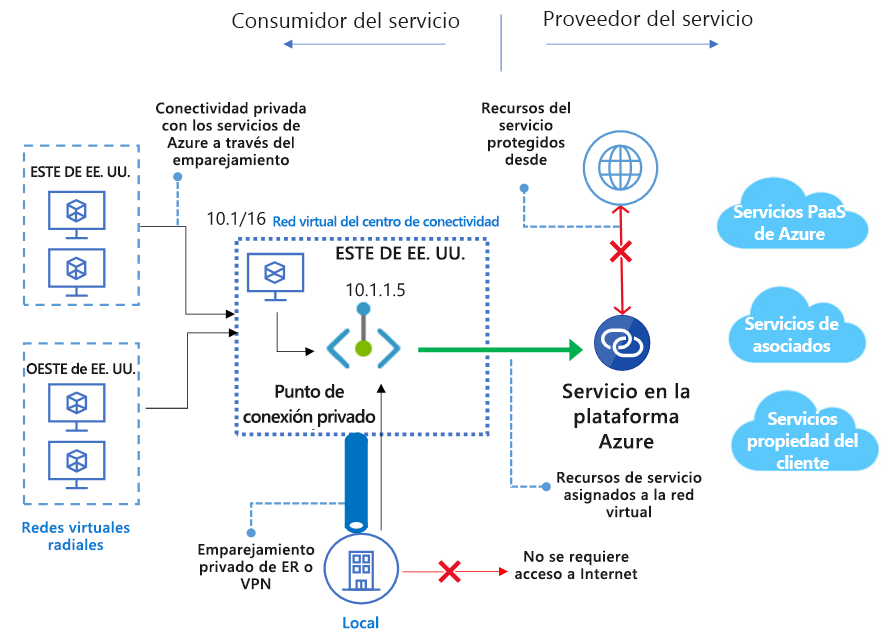

# ¿Qué es Azure Private Link? 
Azure Private Link permite acceder a los servicios PaaS de Azure, como:
 
 - **Almacenamiento de Azure**
 - **Azure Cosmos DB**
 - **Azure SQL Database**

Private Link permite el acceso a los servicios de clientes y asociados hospedados a través de un [punto de conexión privado](private-endpoint-overview.md) en la red virtual.

El tráfico entre la red virtual y el servicio viaja por la red troncal de Microsoft. Ya no es necesario exponer el servicio a la red pública de Internet. Puede crear su propio [servicio de vínculo privado](private-link-service-overview.md) en la red virtual y enviarlo a los clientes. La configuración y el consumo mediante Azure Private Link es coherente entre los servicios de asociados compartidos y propiedad del cliente de PaaS de Azure.

> [!IMPORTANT]
> Azure Private Link ya está disponible con carácter general. Tanto el punto de conexión privado como el servicio Private Link (servicio detrás del equilibrador de carga estándar) están disponibles con carácter general. La incorporación de los diferentes Azure PaaS a Azure Private Link se realizará en diferentes programaciones. Compruebe la sección [Disponibilidad](https://docs.microsoft.com/azure/private-link/private-link-overview#availability) que se encuentra más adelante, para conocer el estado preciso de PaaS de Azure en Private Link. Para obtener información sobre las limitaciones conocidas, consulte [Punto de conexión privado](private-endpoint-overview.md#limitations) y [Servicio Private Link](private-link-service-overview.md#limitations). 

## Ventajas principales
Azure Private Link proporciona las ventajas siguientes:  
- **Acceso privado a servicios en la plataforma Azure**: conecte la red virtual a los servicios de Azure sin una dirección IP pública en el origen o el destino. Los proveedores de servicios pueden representar los servicios en su propia red virtual y los consumidores pueden acceder a ellos en su red virtual local. La plataforma Private Link administrará la conectividad entre el consumidor y los servicios a través de la red troncal de Azure. 
 
- **Redes locales y emparejadas**: acceda a los servicios que se ejecutan en Azure desde el entorno local a través del emparejamiento privado de ExpressRoute, los túneles VPN y las redes virtuales emparejadas mediante puntos de conexión privados. No es necesario configurar el emparejamiento público ni atravesar Internet para llegar hasta el servicio. Private Link proporciona una manera segura de migrar cargas de trabajo a Azure.
 
- **Protección contra la pérdida de datos**: un punto de conexión privado se asigna a una instancia de un recurso de PaaS en lugar de al servicio entero. Los consumidores solo pueden conectarse al recurso específico. Se bloquea el acceso a cualquier otro recurso del servicio. Este mecanismo proporciona protección contra los riesgos de pérdida de datos. 
 
- **Alcance global**: conéctese de forma privada a los servicios que se ejecutan en otras regiones. La red virtual del consumidor podría estar en la región A y puede conectarse a los servicios que hay detrás de Private Link en la región B.  
 
- **Ampliación de los propios servicios**: habilite la misma experiencia y funcionalidad para representar su servicio de forma privada para los consumidores de Azure. Al colocar el servicio detrás de una instancia de Azure Load Balancer estándar, puede habilitarlo para Private Link. Después, el consumidor puede conectarse directamente al servicio mediante un punto de conexión privado en su propia red virtual. Puede administrar las solicitudes de conexión mediante un flujo de llamadas de aprobación. Azure Private Link funciona también para los consumidores y servicios que pertenecen a distintos inquilinos de Azure Active Directory. 

## Disponibilidad 
 En la tabla siguiente se enumeran los servicios de Private Link y las regiones en las que están disponibles. 

|Escenario  |Servicios admitidos  |Regiones disponibles | Status  |
|:---------|:-------------------|:-----------------|:--------|
|Private Link para servicios propiedad del cliente|Servicios de Private Link detrás de Azure Load Balancer estándar | Todas las regiones públicas  | GA   [Más información](https://docs.microsoft.com/azure/private-link/private-link-service-overview) |
|Private Link para los servicios PaaS de Azure   | Azure Storage        |  Todas las regiones públicas      | Vista previa   [Más información](/azure/storage/common/storage-private-endpoints)  |
|  | Azure Data Lake Storage Gen2        |  Todas las regiones públicas      | Vista previa   [Más información](/azure/storage/common/storage-private-endpoints)  |
|  |  Azure SQL Database         | Todas las regiones públicas      |   Vista previa   [Más información](https://docs.microsoft.com/azure/sql-database/sql-database-private-endpoint-overview)      |
||Azure SQL Data Warehouse| Todas las regiones públicas |Vista previa   [Más información](https://docs.microsoft.com/azure/sql-database/sql-database-private-endpoint-overview)|
||Azure Cosmos DB| Centro-oeste de EE. UU., Oeste de EE. UU., Centro-norte de EE. UU. |Vista previa   [Más información](https://docs.microsoft.com/azure/cosmos-db/how-to-configure-private-endpoints)|
|  |  Azure Database for PostgreSQL: servidor único         | Todas las regiones públicas      |   Vista previa   [Más información](https://docs.microsoft.com/azure/postgresql/concepts-data-access-and-security-private-link)      |
|  |  Azure Database for MySQL         | Todas las regiones públicas      |   Vista previa   [Más información](https://docs.microsoft.com/azure/mysql/concepts-data-access-security-private-link)     |
|  |  Azure Database for MariaDB         | Todas las regiones públicas      |   Vista previa   [Más información](https://docs.microsoft.com/azure/mariadb/concepts-data-access-security-private-link)      |
|  |  Azure Key Vault         | Todas las regiones públicas      |   Vista previa     [Más información](https://docs.microsoft.com/azure/key-vault/private-link-service)   |

Para conocer las notificaciones más actualizadas, consulte la página [Actualizaciones de Azure Virtual Network](https://azure.microsoft.com/updates/?product=virtual-network).

## Registro y supervisión

Azure Private Link está integrado con Azure Monitor. Esta combinación permite:

 - El archivado de registros en una cuenta de almacenamiento.
 - La transmisión de eventos al centro de eventos.
 - El registro de Azure Monitor.

Puede tener acceso a la siguiente información sobre Azure Monitor: 
- **Punto de conexión privado**: 
    - datos procesados por el punto de conexión privado (IN/OUT)
 
- **Servicio Private Link**:
    - datos procesados por el servicio Private Link (IN/OUT)
    - Disponibilidad del puerto NAT  
 
## Precios   
Para más información sobre los precios, consulte [Precios de Azure Private Link](https://azure.microsoft.com/pricing/details/private-link/).
 
## Preguntas más frecuentes  
Para ver las preguntas más frecuentes, consulte [Preguntas más frecuentes sobre Azure Private Link](private-link-faq.md).
 
## límites  
Para conocer los límites, consulte [Límites de Azure Private Link](../azure-resource-manager/management/azure-subscription-service-limits.md#private-link-limits).

## Acuerdo de Nivel de Servicio
Para ver el Acuerdo de Nivel de Servicio, consulte [SLA para Azure Private Link](https://azure.microsoft.com/support/legal/sla/private-link/v1_0/).

## Pasos siguientes

- [Inicio rápido: Creación de un punto de conexión privado mediante Azure Portal](create-private-endpoint-portal.md)
- [Inicio rápido: Creación de un servicio de Private Link mediante Azure Portal](create-private-link-service-portal.md)

 
