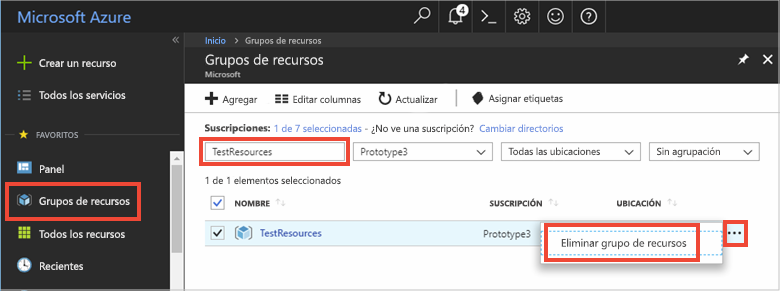

# <a name="quickstart-how-to-use-azure-redis-cache-with-java"></a>Guía de inicio rápido: Procedimiento para usar Azure Redis Cache con Java


Azure Redis Cache le proporciona acceso a una caché en Redis dedicada, administrada por Microsoft. Se puede obtener acceso a su caché desde cualquier aplicación dentro de Microsoft Azure.

Este artículo muestra cómo empezar a trabajar con Azure Redis Cache mediante el cliente de Redis Cache [Jedis](https://github.com/xetorthio/jedis) para Java.


Puede usar cualquier editor de código para realizar los pasos de esta guía de inicio rápido. Sin embargo, [Visual Studio Code](https://code.visualstudio.com/) es una excelente opción disponible en las plataformas Windows, macOS y Linux.

[!INCLUDE [quickstarts-free-trial-note](../../includes/quickstarts-free-trial-note.md)]


## <a name="prerequisites"></a>requisitos previos

[Apache Maven](http://maven.apache.org/)


## <a name="create-an-azure-redis-cache"></a>Creación de una instancia de Azure Redis Cache

[!INCLUDE [redis-cache-create](../../includes/redis-cache-create.md)]

[!INCLUDE [redis-cache-access-keys](../../includes/redis-cache-access-keys.md)]

Agregue variables de entorno para el **nombre de host** y la clave de acceso **Principal**. Utilizará estas variables desde el código en lugar de incluir la información confidencial directamente en el código.

```
set REDISCACHEHOSTNAME=contosoCache.redis.cache.windows.net
set REDISCACHEKEY=XXXXXXXXXXXXXXXXXXXXXXXXXXXXXXXXXXXXXXXXXXXX
```

## <a name="create-a-new-java-app"></a>Creación de una nueva aplicación Java

Con Maven, genere una nueva aplicación de inicio rápido:

```
mvn archetype:generate -DarchetypeGroupId=org.apache.maven.archetypes -DarchetypeArtifactId=maven-archetype-quickstart -DarchetypeVersion=1.3 -DgroupId=example.demo -DartifactId=redistest -Dversion=1.0
```

Cambie al nuevo directorio del proyecto *redistest*.

Abra el archivo *pom.xml* y agregue una dependencia para [Jedis](https://github.com/xetorthio/jedis):

```xml
    <dependency>
        <groupId>redis.clients</groupId>
        <artifactId>jedis</artifactId>
        <version>2.9.0</version>
        <type>jar</type>
        <scope>compile</scope>
    </dependency>
```

Guarde el archivo *pom.xml* .

Abra *App.java* y reemplace el código por el código siguiente:

```java
package example.demo;

import redis.clients.jedis.Jedis;
import redis.clients.jedis.JedisShardInfo;

/**
 * Redis test
 *
 */
public class App 
{
    public static void main( String[] args )
    {

        boolean useSsl = true;
        String cacheHostname = System.getenv("REDISCACHEHOSTNAME");
        String cachekey = System.getenv("REDISCACHEKEY");

        // Connect to the Redis cache over the SSL port using the key.
        JedisShardInfo shardInfo = new JedisShardInfo(cacheHostname, 6380, useSsl);
        shardInfo.setPassword(cachekey); /* Use your access key. */
        Jedis jedis = new Jedis(shardInfo);      

        // Perform cache operations using the cache connection object...

        // Simple PING command        
        System.out.println( "\nCache Command  : Ping" );
        System.out.println( "Cache Response : " + jedis.ping());

        // Simple get and put of integral data types into the cache
        System.out.println( "\nCache Command  : GET Message" );
        System.out.println( "Cache Response : " + jedis.get("Message"));

        System.out.println( "\nCache Command  : SET Message" );
        System.out.println( "Cache Response : " + jedis.set("Message", "Hello! The cache is working from Java!"));

        // Demostrate "SET Message" executed as expected...
        System.out.println( "\nCache Command  : GET Message" );
        System.out.println( "Cache Response : " + jedis.get("Message"));

        // Get the client list, useful to see if connection list is growing...
        System.out.println( "\nCache Command  : CLIENT LIST" );
        System.out.println( "Cache Response : " + jedis.clientList());

        jedis.close();
    }
}
```

Este código muestra cómo conectarse a una instancia de Azure Redis Cache usando las variables de entorno nombre de host de caché y clave. El código también almacena y recupera un valor de cadena en la memoria caché. También se ejecutan los comandos `PING` y `CLIENT LIST`. 

Guarde *App.java*.

## <a name="build-and-run-the-app"></a>Compilación y ejecución de la aplicación

Ejecute el siguiente comando de Maven para compilar y ejecutar la aplicación:

```
mvn exec:java -D exec.mainClass=example.demo.App
```

En el ejemplo siguiente, puede ver que la clave `Message` tenía anteriormente un valor almacenado en caché, que se estableció mediante la Consola de Redis en Azure Portal. La aplicación actualizó ese valor almacenado en caché. La aplicación también ejecutó los comandos `PING` y `CLIENT LIST`.


## <a name="clean-up-resources"></a>Limpieza de recursos

Si va a seguir con el tutorial siguiente, puede mantener los recursos creados en esta guía de inicio rápido y volverlos a utilizar.

En caso contrario, si ya ha terminado con la aplicación de ejemplo de la guía de inicio rápido, puede eliminar los recursos de Azure creados en este tutorial para evitar cargos. 

> [!IMPORTANT]
> La eliminación de un grupo de recursos es irreversible y el grupo de recursos y todos los recursos que contiene se eliminarán de forma permanente. Asegúrese de no eliminar por accidente el grupo de recursos o los recursos equivocados. Si ha creado los recursos para hospedar este ejemplo dentro de un grupo de recursos existente que contiene recursos que desea mantener, puede eliminar cada recurso individualmente de sus hojas respectivas, en lugar de eliminar el grupo de recursos.
>

Inicie sesión en [Azure Portal](https://portal.azure.com) y haga clic en **Grupos de recursos**.

Escriba el nombre del grupo de recursos en el cuadro de texto **Filtrar por nombre...**. En las instrucciones de este artículo se usa un grupo de recursos llamado *TestResources*. En el grupo de recursos de la lista de resultados, haga clic en **...** y, a continuación, en **Eliminar grupo de recursos**.



Se le pedirá que confirme la eliminación del grupo de recursos. Escriba el nombre del grupo de recursos para confirmar y haga clic en **Eliminar**.

Transcurridos unos instantes, el grupo de recursos y todos los recursos que contiene se eliminan.


## <a name="next-steps"></a>Pasos siguientes

En esta guía de inicio rápido, ha aprendido a usar Azure Redis Cache desde una aplicación Java. Continúe con la siguiente guía de inicio rápido para usar Redis Cache con una aplicación web ASP.NET.

> [!div class="nextstepaction"]
> [Creación de una aplicación web ASP.NET que usa Azure Redis Cache.](./cache-web-app-howto.md)


