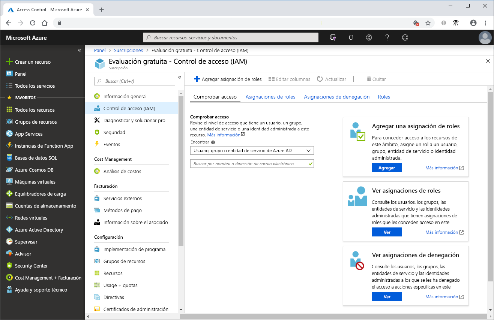
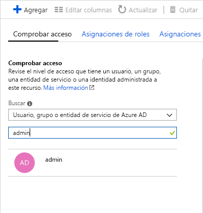
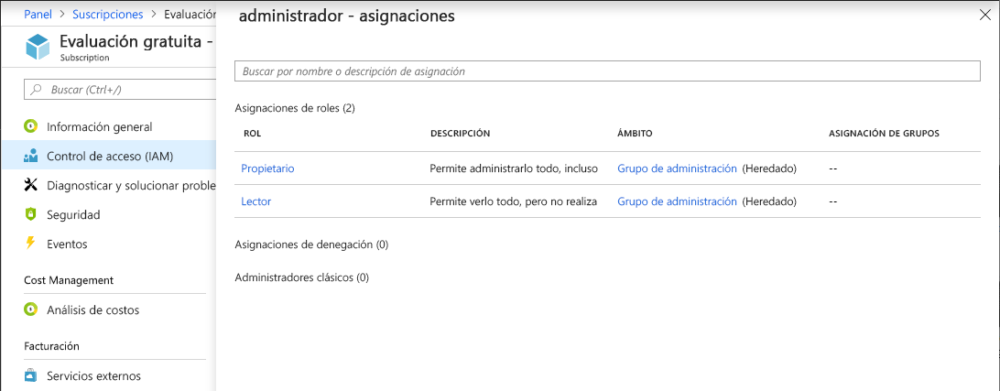

# Guía de inicio rápido: Visualización de los roles asignados a un usuario mediante Azure Portal

Puede usar la hoja **Control de acceso (IAM)** de [Control de acceso basado en rol (RBAC)](overview.md) para ver las asignaciones de roles para varios usuarios, grupos, entidades de servicio y identidades administradas, pero a veces basta con ver rápidamente las asignaciones de roles para un solo usuario, grupo, entidad de servicio o identidad administrada. La manera más fácil de hacerlo es usar la característica **Comprobar acceso** en Azure Portal.

## Visualización de asignaciones de roles

Siga estos pasos para ver las asignaciones de roles de un solo usuario, grupo, entidad de servicio o identidad administrada en el ámbito de la suscripción.

1. En Azure Portal, haga clic en **Todos los servicios** y luego en **Suscripciones**.

1. Haga clic en la suscripción.

1. Haga clic en **Control de acceso (IAM)**.

1. Haga clic en la pestaña **Comprobar acceso**.

    

1. En la lista **Buscar**, seleccione el tipo de entidad de seguridad cuyo acceso quiere comprobar.

1. En el cuadro de búsqueda, escriba una cadena para buscar nombres para mostrar, direcciones de correo electrónico o identificadores de objeto en el directorio.

    

1. Haga clic en la entidad de seguridad para abrir el panel **Asignaciones**.

    

    En este panel puede ver los roles asignados a la entidad de seguridad seleccionada y el ámbito. Si hay asignaciones denegadas en este ámbito o heredadas en este ámbito, se mostrarán.

## Pasos siguientes

> [!div class="nextstepaction"]
> [Tutorial: Concesión de acceso a un usuario mediante RBAC y Azure Portal](quickstart-assign-role-user-portal.md)
