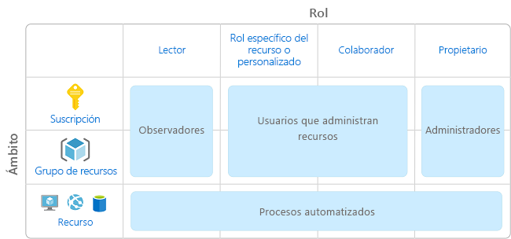
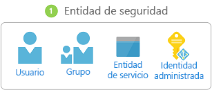
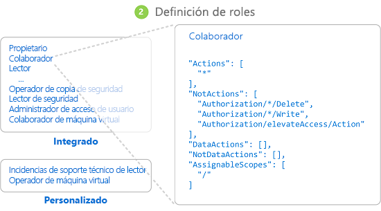
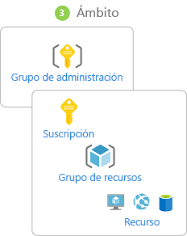
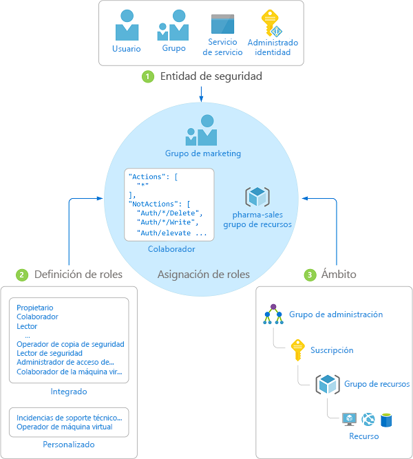

# ¿Qué es el control de acceso basado en rol (RBAC)?

La administración de acceso de los recursos en la nube es una función importantísima para cualquier organización que use la nube. El control de acceso basado en rol (RBAC) ayuda a administrar quién puede acceder a los recursos de Azure, qué pueden hacer con esos recursos y a qué áreas pueden acceder.

RBAC es un sistema de autorización basado en [Azure Resource Manager](../azure-resource-manager/resource-group-overview.md) que proporciona administración de acceso específico a los recursos de Azure.

## ¿Qué puedo hacer con RBAC?

Estos son algunos ejemplos de lo que puede hacer con RBAC:

- Permitir que un usuario administre las máquinas virtuales de una suscripción y que otro usuario administre las redes virtuales
- Permitir que un grupo de DBA administre bases de datos SQL en una suscripción
- Permitir que un usuario administre todos los recursos de un grupo de recursos, como las máquinas virtuales, los sitios web y las subredes
- Permitir que una aplicación acceda a todos los recursos de un grupo de recursos

## Procedimiento recomendado para el uso de RBAC

También podrá repartir las tareas entre el equipo y conceder a los usuarios únicamente el nivel de acceso que necesitan para realizar su trabajo. En lugar de proporcionar a todos los empleados permisos no restringidos en los recursos o la suscripción de Azure, puede permitir solo determinadas acciones en un ámbito concreto.

Al planear la estrategia de control de acceso, es recomendable conceder a los usuarios el privilegio mínimo para que realicen su trabajo. El siguiente diagrama muestra un patrón sugerido para la asignación de RBAC.

## Funcionamiento de RBAC

La manera en que se controla el acceso a los recursos mediante RBAC es mediante las asignaciones de roles. Este es un concepto clave que se debe entender: se trata de cómo se aplican los permisos. Una asignación de roles consta de tres elementos: entidad de seguridad, definición de rol y ámbito.

### Entidad de seguridad

Una *entidad de seguridad* es un objeto que representa a un usuario, un grupo o una entidad de servicio que solicita acceso a recursos de Azure.

- Usuario: individuo que tiene un perfil en Azure Active Directory. También puede asignar roles a usuarios de otros inquilinos. Para información sobre los usuarios de otras organizaciones, consulte el artículo sobre la [colaboración B2B de Azure Active Directory](/azure/active-directory/active-directory-b2b-what-is-azure-ad-b2b).
- Grupo: conjunto de usuarios creado en Azure Active Directory. Cuando se asigna un rol a un grupo, todos los usuarios dentro de ese grupo tienen ese rol. 
- Entidad de servicio: identidad de seguridad que las aplicaciones o los servicios usan para acceder a recursos específicos de Azure. Puede considerarla como una *identidad de usuario* (nombre de usuario y contraseña o certificado) de una aplicación.

### Definición de roles

Una *definición de roles* es una recopilación de permisos. A veces, se denomina *rol* simplemente. Una definición de roles enumera las operaciones que se pueden realizar, por ejemplo, de lectura, escritura y eliminación. Los roles pueden ser generales, como propietarios, o específicos, como lectores de máquina virtual.

Azure incluye varios [roles integrados](built-in-roles.md) que puede usar. A continuación se enumeran cuatros roles integrados fundamentales. Los tres primeros se aplican a todos los tipos de recursos.

- [Propietario](built-in-roles.md#owner): tiene acceso total a todos los recursos, incluido el derecho a delegar este acceso a otros.
- [Colaborador](built-in-roles.md#contributor): puede crear y administrar todos los tipos de recursos de Azure pero no puede conceder acceso a otros.
- [Lector](built-in-roles.md#reader): puede ver los recursos existentes de Azure.
- [Administrador de acceso de usuario](built-in-roles.md#user-access-administrator): permite administrar el acceso de los usuarios a los recursos de Azure.

Los demás roles integrados permiten la administración de recursos específicos de Azure. Por ejemplo, el rol [Colaborador de máquina virtual](built-in-roles.md#virtual-machine-contributor) permite al usuario crear y administrar máquinas virtuales. Si los roles integrados no cumplen las necesidades específicas de su organización, puede crear sus propios [roles personalizados](custom-roles.md).

Azure introdujo las operaciones de datos (actualmente en versión preliminar) que le permiten conceder acceso a los datos dentro de un objeto. Por ejemplo, si un usuario tiene acceso para leer datos de una cuenta de almacenamiento, puede leer los blobs o mensajes en esa cuenta de almacenamiento. Para más información, consulte [Descripción de definiciones de roles](role-definitions.md).

### Ámbito

*Ámbito* es el límite al que se aplica el acceso. Cuando se asigna un rol, es posible limitar aún más las acciones permitidas si se define un ámbito. Esto resulta útil si desea convertir a alguien en [Colaborador del sitio web](built-in-roles.md#website-contributor), pero solo para un grupo de recursos.

En Azure, puede especificar un ámbito en varios niveles: [grupo de administración](../azure-resource-manager/management-groups-overview.md), suscripción, grupo de recursos o recurso. Los ámbitos se estructuran en una relación de elementos primarios y secundarios.

Si otorga acceso a un ámbito primario, esos permisos se heredan en los ámbitos secundarios. Por ejemplo: 

- Si asigna el rol [Propietario](built-in-roles.md#owner) a un usuario del ámbito del grupo de administración, ese usuario puede administrar todo en todas las suscripciones del grupo de administración.
- Si asigna el rol [Lector](built-in-roles.md#reader) a un grupo en el ámbito de la suscripción, los miembros de ese grupo pueden ver cada grupo de recursos y cada recurso de la suscripción.
- Si asigna el rol [Colaborador](built-in-roles.md#contributor) a una aplicación en el ámbito del grupo de recursos, puede administrar recursos de todos los tipos en ese grupo de recursos, pero no otros grupo de recursos de la suscripción.

### Asignaciones de roles

Una *asignación de roles* es el proceso de enlazar una definición de roles a un usuario, grupo o entidad de servicio en un ámbito determinado con el fin de conceder acceso. El acceso se concede mediante la creación de una asignación de roles y se revoca al quitar una asignación de roles.

El diagrama siguiente muestra un ejemplo de una asignación de roles. En este ejemplo, al grupo de marketing se le asignó el rol [Colaborador](built-in-roles.md#contributor) del grupo de recursos de ventas farmacéuticas. Esto significa que los usuarios del grupo de marketing pueden crear o administrar cualquier recurso de Azure del grupo de recursos de ventas farmacéuticas. Los usuarios de marketing no tienen acceso a los recursos fuera del grupo de recursos de ventas farmacéuticas, a menos que sean parte de otra asignación de roles.

Puede crear asignaciones de roles mediante Azure Portal, la CLI de Azure, Azure PowerShell, los SDK de Azure o las API de REST. Puede tener hasta 2000 asignaciones de roles en cada suscripción. Para crear y quitar las asignación de roles, debe tener el permiso `Microsoft.Authorization/roleAssignments/*`. Este permiso se concede a través de los roles [Propietario](built-in-roles.md#owner) o [Administrador de acceso de usuario](built-in-roles.md#user-access-administrator).

## Asignaciones de denegación

Anteriormente, RBAC era un modelo solo de permiso sin denegación, pero ahora RBAC admite asignaciones de denegación de manera limitada. Al igual que una asignación de roles, una *asignación de denegación* enlaza un conjunto de acciones de denegación con un usuario, grupo o entidad de servicio en un ámbito determinado con el fin de denegar el acceso. Una asignación de roles define un conjunto de acciones que están *permitidas*, mientras que una asignación de denegación define un conjunto de acciones *no permitidas*. En otras palabras, denegar asignaciones impide que los usuarios realicen acciones especificadas, incluso si una asignación de roles les concede acceso. Las asignaciones de denegación tienen prioridad sobre las asignaciones de roles.

Actualmente, las asignaciones de denegación son de **solo lectura** y únicamente pueden establecerse mediante Azure. Aunque no se pueden crear asignaciones de denegación propias, se pueden enumerar, ya que pueden afectar a los permisos vigentes. Para obtener información sobre una asignación de denegación, debe tener el permiso `Microsoft.Authorization/denyAssignments/read`, que se incluye en la mayoría de los [roles integrados](built-in-roles.md#owner). Para más información, consulte [Descripción de las asignaciones de denegación](deny-assignments.md).

## Cómo determina RBAC si un usuario tiene acceso a un recurso

Los siguientes son los pasos de alto nivel que RBAC usa para determinar si tiene acceso a un recurso en el plano de administración. Esto resulta útil para saber si está intentando solucionar un problema de acceso.

1. Un usuario (o entidad de servicio) adquiere un token de Azure Resource Manager.

    El token incluye pertenencias de grupo del usuario (incluida la pertenencia a grupos transitivos).

1. El usuario realiza una llamada de API REST a Azure Resource Manager con el token adjunto.

1. Azure Resource Manager recupera todas las asignaciones de roles y de denegación aplicables al recurso en el que se está realizando la acción.

1. Azure Resource Manager limita las asignaciones de roles aplicables a este usuario o su grupo y determina los roles que tiene el usuario para este recurso.

1. Azure Resource Manager determina si la acción en la llamada de API se incluye en los roles que tiene el usuario para este recurso.

1. Si el usuario no tiene un rol con la acción en el ámbito solicitado, no se concede acceso. En caso contrario, Azure Resource Manager comprueba si se aplica una asignación de denegación.

1. Si se aplica una asignación de denegación, el acceso se bloquea. En caso contrario, se concede el acceso.

## Pasos siguientes

- [Inicio rápido: Concesión de acceso a un usuario mediante RBAC y Azure Portal](quickstart-assign-role-user-portal.md)
- [Administración del acceso mediante RBAC y Azure Portal](role-assignments-portal.md)
- [Descripción de los distintos roles en Azure](rbac-and-directory-admin-roles.md)
