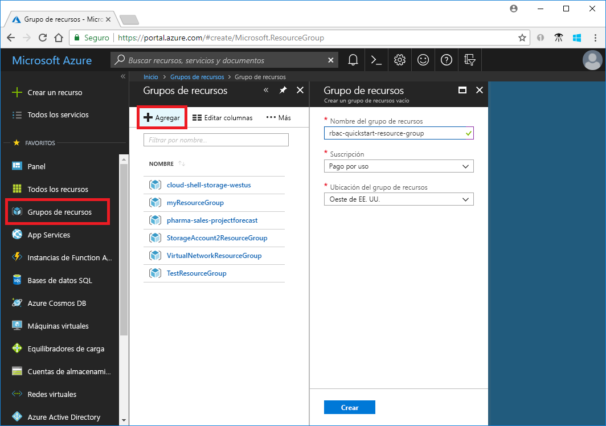
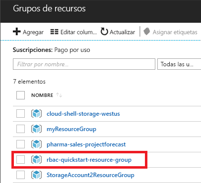
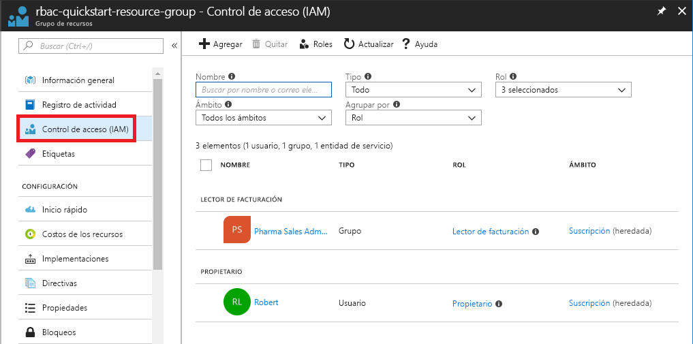
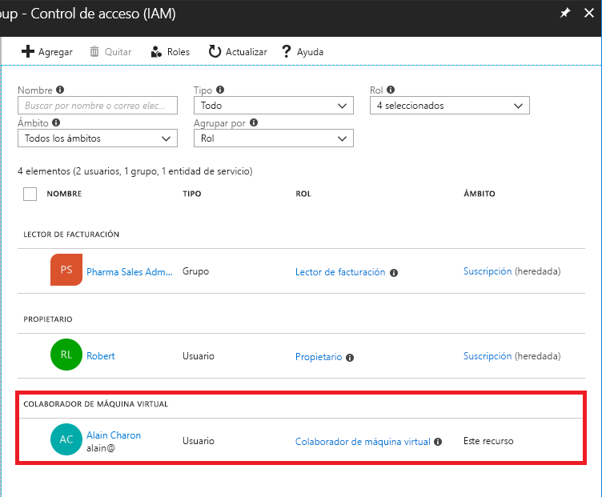
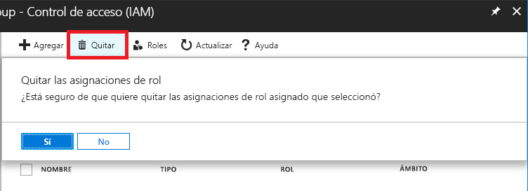
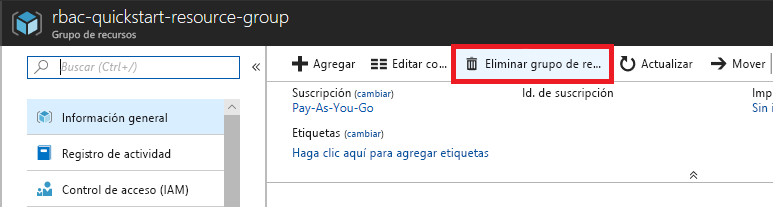

# Tutorial: Concesión de acceso de usuario a los recursos de Azure mediante RBAC y Azure Portal

El [control de acceso basado en rol (RBAC)](overview.md) es la forma en la que se administra el acceso a los recursos de Azure. En este tutorial, se concede acceso a un usuario para crear y administrar máquinas virtuales en un grupo de recursos.

En este tutorial, aprenderá a:

> [!div class="checklist"]
> * Conceder acceso a un usuario en el ámbito del grupo de recursos
> * Quitar acceso

Si no tiene una suscripción a Azure, cree una [cuenta gratuita](https://azure.microsoft.com/free/?WT.mc_id=A261C142F) antes de empezar.

## Inicio de sesión en Azure

Inicie sesión en Azure Portal en https://portal.azure.com.

## Crear un grupo de recursos

1. En la lista de navegación, haga clic en **Grupos de recursos**.

1. Haga clic en **Agregar** para abrir la hoja **Grupo de recursos**.

   

1. En **Nombre del grupo de recursos**, escriba **rbac-resource-group**.

1. Seleccione una suscripción y una ubicación.

1. Haga clic en **Crear** para crear el grupo de recursos.

1. Haga clic en **Actualizar** para actualizar la lista de grupos de recursos.

   El grupo de recursos nuevo aparece en la lista de grupos de recursos.

   

## Conceder acceso

En RBAC, para conceder acceso es preciso crear una asignación de roles.

1. En la lista de **Grupos de recursos**, haga clic en el nuevo grupo de recursos **rbac-resource-group**.

1. Haga clic en **Control de acceso (IAM).**

1. Haga clic en la pestaña **Asignaciones de roles** para ver la lista actual de asignaciones de roles.

   

1. Haga clic en **Agregar** > **Agregar asignación de roles** para abrir el panel Agregar asignación de roles.

   Si no tiene permisos para asignar roles, la opción Agregar asignación de roles se deshabilitará.

   

   

1. En la lista desplegable **Rol**, seleccione **Colaborador de la máquina virtual**.

1. En la lista **Seleccionar**, se puede seleccionar a usted mismo o a otro usuario.

1. Haga clic en **Guardar** para crear la asignación de roles.

   Transcurridos unos instantes, se asigna el rol Colaborador de la máquina virtual al usuario en el ámbito del grupo de recursos rbac-resource-group.

   

## Quitar acceso

En RBAC, para quitar el acceso hay que quitar una asignación de roles.

1. En la lista de asignaciones de roles, agregue una marca de verificación junto al usuario con el rol Colaborador de la máquina virtual.

1. Haga clic en **Quitar**.

   

1. En el mensaje de eliminación de asignación de roles que aparece, haga clic en **Sí**.

## Limpieza

1. En la lista de navegación, haga clic en **Grupos de recursos**.

1. Haga clic en **rbac-resource-group** para abrir el grupo de recursos.

1. Haga clic en **Eliminar grupo de recursos** para eliminar el grupo de recursos.

   

1. En la hoja **¿Está seguro de que desea eliminar?** , escriba el nombre del grupo de recursos: **rbac-resource-group**.

1. Haga clic en **Eliminar** para eliminar el grupo de recursos.

## Pasos siguientes

> [!div class="nextstepaction"]
> [Tutorial: Concesión de acceso de usuario a los recursos de Azure mediante RBAC y Azure PowerShell](tutorial-role-assignments-user-powershell.md)
