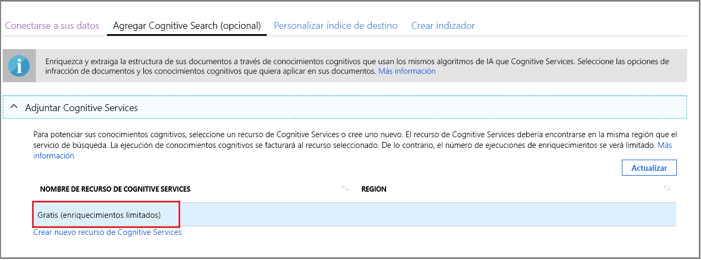
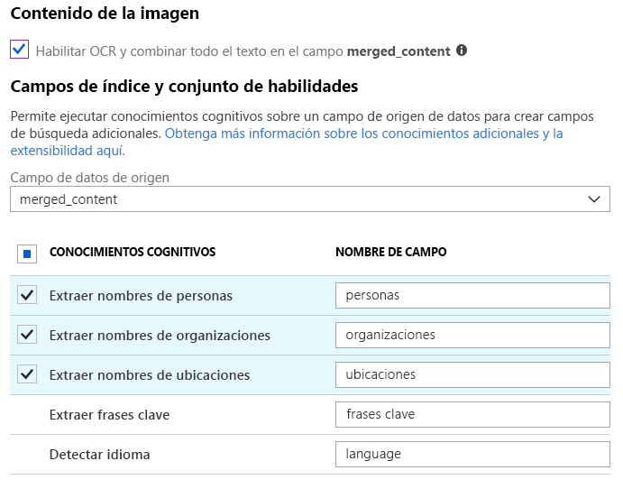
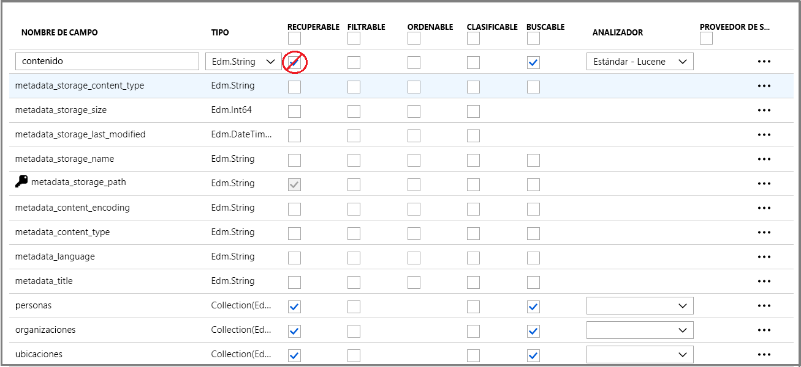
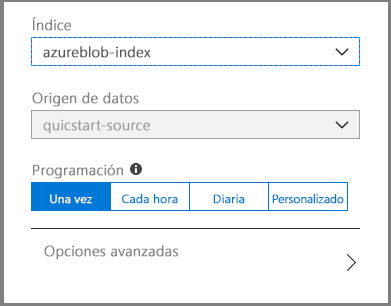
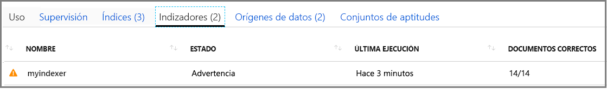
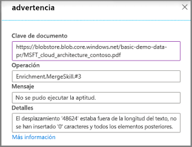
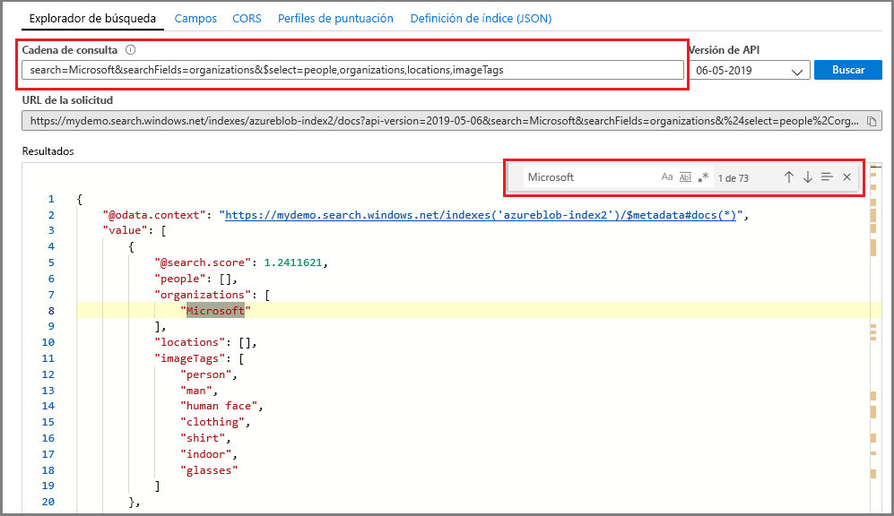

# Inicio rápido: Creación de un conjunto de aptitudes cognitivas de Azure Cognitive Search en Azure Portal

Un conjunto de aptitudes es una característica de inteligencia artificial que extrae la información y la estructura de grandes archivos de texto no diferenciados o de imágenes, y permite que se puedan indexar y realizar búsquedas con consultas de búsqueda de texto completo en Azure Cognitive Search. 

En este inicio rápido, combinará servicios y datos en la nube de Azure para crear el conjunto de aptitudes. Una vez que todo esté en su lugar, ejecutará el **Asistente para la importación de datos** en el portal para extraerlo todo junto. El resultado final es un índice en el que se pueden realizar búsquedas y que se ha rellenado con los datos creados con el procesamiento de inteligencia artificial que puede consultar en el portal ([Explorador de búsqueda](search-explorer.md)).

Si no tiene una suscripción a Azure, cree una [cuenta gratuita](https://azure.microsoft.com/free/?WT.mc_id=A261C142F) antes de empezar.

## Creación de servicios y carga de datos

Este inicio rápido utiliza Azure Cognitive Search, [Azure Blob Storage](https://docs.microsoft.com/azure/storage/blobs/) y [Azure Cognitive Services](https://azure.microsoft.com/services/cognitive-services/) para la inteligencia artificial. 

Dado que la carga de trabajo es tan pequeña, Cognitive Services se aprovecha en segundo plano para proporcionar el procesamiento gratuito de hasta 20 transacciones al día por indexador, cuando se invoca desde Azure Cognitive Search. Siempre que use los datos de ejemplo proporcionados, puede omitir la creación o la asociación de un recurso de Cognitive Services.

1. [Descargue los datos de ejemplo](https://1drv.ms/f/s!As7Oy81M_gVPa-LCb5lC_3hbS-4) que están formados por un pequeño conjunto de archivos de diferentes tipos. Descomprima los archivos.

1. [Cree una cuenta de Azure Storage](https://docs.microsoft.com/azure/storage/common/storage-quickstart-create-account?tabs=azure-portal) o [busque una cuenta existente](https://ms.portal.azure.com/#blade/HubsExtension/BrowseResourceBlade/resourceType/Microsoft.Storage%2storageAccounts/). 

   Elija la misma región de Azure Cognitive Search para evitar cargos de ancho de banda. 
   
   Elija el tipo de cuenta StorageV2 (de uso general V2) si desea probar la característica almacén de conocimiento más adelante, en otro tutorial. De lo contrario, elija cualquier tipo.

1. Abra las páginas de Blob service y cree un contenedor. Puede usar el nivel de acceso público predeterminado. 

1. En el contenedor, haga clic en **Cargar** para cargar los archivos de ejemplo que descargó en el primer paso. Tenga en cuenta que dispone de una amplia gama de tipos de contenido, como imágenes y archivos de aplicación, en los que no se pueden realizar búsquedas de texto completo en sus formatos nativos.

   

1. [Cree un servicio de Azure Cognitive Search](search-create-service-portal.md) o [busque un servicio existente](https://ms.portal.azure.com/#blade/HubsExtension/BrowseResourceBlade/resourceType/Microsoft.Search%2FsearchServices). Puede usar un servicio gratuito para este inicio rápido.

Ahora ya está preparado para continuar con el Asistente para la importación de datos.

## Ejecutar el Asistente para la importación de datos

En la página de información general del servicio de búsqueda, haga clic en **Importar datos** en la barra de comandos para configurar el enriquecimiento cognitivo en cuatro pasos.

  

### Paso 1: Creación de un origen de datos

1. En **Conectarse a los datos**, elija **Azure Blob Storage** y seleccione la cuenta de Storage y el contenedor que creó. Asigne un nombre al origen de datos y use los valores predeterminados para el resto. 

   

    Continúe en la siguiente página.

### Paso 2: Adición de aptitudes cognitivas

Después, configure el enriquecimiento de inteligencia artificial para invocar a OCR, el análisis de imágenes y el procesamiento de lenguaje natural. 

1. En este inicio rápido, se usará el recurso **Free** de Cognitive Services. Los datos de ejemplo se componen de 14 archivos, por lo que la cobertura gratuita de 20 transacciones de Cognitive Services es suficiente para este inicio rápido. 

   

1. Expanda **Agregar enriquecimientos** y realice cuatro selecciones. 

   Habilite el OCR para agregar aptitudes de análisis de imágenes a la página del asistente.

   Establezca la granularidad en las páginas para dividir el texto en fragmentos más pequeños. Varias aptitudes de texto se limitan a entradas de 5 KB.

   Elija el reconocimiento de entidades (personas, organizaciones o ubicaciones) y aptitudes de análisis de imágenes.

   

   Continúe en la siguiente página.

### Paso 3: Configuración del índice

Un índice incluye el contenido en el que se pueden realizar búsquedas y el Asistente para la **importación de datos** puede crear normalmente el esquema mediante el muestreo del origen de datos. En este paso, repase el esquema generado y revise la configuración. A continuación se ofrece el esquema predeterminado que se creó para el conjunto de datos de blob de demostración.

En esta guía de inicio rápido, el asistente realiza un trabajo remarcable a la hora de configurar valores predeterminados razonables:  

+ Los campos predeterminados se basan en las propiedades de los blobs existentes, además de los nuevos campos que contienen la salida de enriquecimiento (por ejemplo, `people`, `organizations`, `locations`). Los tipos de datos se deducen de los metadatos y del muestreo de datos.

+ La clave de documento predeterminada es *metadata_storage_path* (se ha seleccionado porque el campo contiene valores únicos).

+ Los atributos predeterminados son **Retrievable** (Recuperable) y **Searchable** (Permite búsquedas). El atributo **Searchable** (Permite búsqueda) permite buscar texto completo en un campo. El atributo **Retrievable** (Recuperable) indica que un valor puede aparecer en los resultados. El asistente da por supuesto que desea que estos campos se puedan recuperar y permitan búsquedas porque los creó a través de un conjunto de aptitudes.

  

Observe el tachado y el signo de interrogación en el atributo **Retrievable** del campo `content`. En el caso de los documentos blob con mucho texto, el campo `content` contiene la mayor parte del archivo, posiblemente con miles de líneas. Un campo como este no es manejable en los resultados de la búsqueda y se debe excluir para esta demostración. 

Sin embargo, si tiene que pasar el contenido del archivo al código de cliente, asegúrese de que el atributo **Retrievable** (Recuperable) sigue seleccionado. De lo contrario, considere la posibilidad de borrar este atributo en `content` si los elementos extraídos (como `people`, `organizations`, `locations`, etc.) son suficientes.

Marcar un campo como **Retrievable** no significa que el campo *debe* esté presente en los resultados de búsqueda. Puede controlar con precisión la composición de los resultados de búsqueda si usa el parámetro de consulta **$select** para especificar qué campos desea incluir. En el caso de campos con mucho texto como `content`, el parámetro **$select** es la solución para proporcionar resultados de búsqueda fáciles de administrar a los usuarios de la aplicación, al tiempo que se asegura de que el código de cliente tenga acceso a toda la información que necesita a través del atributo **Retrievable**.
  
Continúe en la siguiente página.

### Paso 4: Configuración del indexador

El indexador es un recurso de alto nivel que controla el proceso de indexación. Asimismo, especifica el nombre del origen de datos, un índice de destino y la frecuencia de ejecución. El Asistente para la **importación de datos** crea varios objetos y entre ellos hay siempre un indexador que se puede ejecutar repetidamente.

1. En la página **Indizador**, puede aceptar el nombre predeterminado y hacer clic en la opción de programación **Una vez** para ejecutarlo inmediatamente. 

   

1. Haga clic en **Enviar** para crear y ejecutar simultáneamente el indexador.

## Supervisión de estado

La indexación cognitiva de aptitudes tarda más en completarse que la indexación típica basada en texto, especialmente en OCR y análisis de imágenes. Para supervisar el progreso, vaya a la página de información general y haga clic en **Indizadores** en medio de la página.

  

Las advertencias son normales dada la amplia gama de tipos de contenido. Algunos tipos de contenido no son válidos para determinadas aptitudes y en los niveles inferiores son comunes para encontrar los [límites del indexador](search-limits-quotas-capacity.md#indexer-limits). Por ejemplo, las notificaciones de truncamiento de 32 000 caracteres son un límite del indexador en el nivel Gratis. Si ha ejecutado esta demostración en un nivel superior, desaparecerán muchas advertencias de truncamiento.

Para comprobar las advertencias o los errores, haga clic en el estado de advertencia en la lista de indexadores para abrir la página Historial de ejecución.

En esa página, vuelva a hacer clic en el estado de advertencia para ver la lista de advertencias similares a la que se muestra a continuación. 

  

Los detalles aparecen al hacer clic en una línea de estado específica. Esta advertencia indica que la combinación se detuvo después de alcanzar un umbral máximo (este PDF en particular es grande).

  

## Consulta en el Explorador de búsqueda

Después de crear un índice, puede ejecutar consultas para devolver los resultados. En el portal, use el **Explorador de búsqueda** del portal. 

1. En la página del panel del servicio de búsqueda, haga clic en el **Explorador de búsqueda** en la barra de comandos.

1. Seleccione **Cambiar índice** en la parte superior para seleccionar el índice que haya creado.

1. Escriba una cadena de búsqueda para consultar el índice como, por ejemplo, `search=Microsoft&$select=people,organizations,locations,imageTags`.

Los resultados se devuelven en formato JSON, que suele ser detallado y difícil de leer, especialmente si se trata de documentos de gran tamaño que se crean en los blobs de Azure. Algunas sugerencias para buscar en esta herramienta incluyen las siguientes técnicas:

+ Agregue `$select` para especificar qué campos quiere incluir en los resultados de búsqueda. 
+ Use CTRL-F para buscar en el JSON las propiedades o los términos específicos.

Las cadenas de consulta distinguen mayúsculas de minúsculas, por lo que si obtiene un mensaje de "campo desconocido", compruebe los **campos** o la **definición de índice (JSON)** para comprobar el nombre y el caso. 

  

## Puntos clave

Ahora ha creado su primer conjunto de aptitudes y ha aprendido conceptos importantes útiles para crear prototipos de una solución de búsqueda enriquecida mediante sus propios datos.

Algunos conceptos clave que esperamos que haya tenido en cuenta incluyen la dependencia de los orígenes de datos de Azure. Un conjunto de aptitudes está enlazado a un indexador y los indexadores son de Azure y específicos del origen. Aunque esta guía de inicio rápido usa Azure Blob Storage, también se pueden usar otros orígenes de datos de Azure. Para más información, consulte [Indexadores de Azure Cognitive Search](search-indexer-overview.md). 

Otro concepto importante es que las aptitudes operan sobre los tipos de contenido y, al trabajar con contenido heterogéneo, se omitirán algunas entradas. Además, los archivos o campos grandes pueden superar los límites del indexador de su nivel de servicio. Es normal ver las advertencias cuando se producen estos eventos. 

La salida se dirige a un índice de búsqueda y hay una asignación entre los pares nombre y valor que se crearon durante la indexación y los campos individuales del índice. De forma interna, el portal establece las [anotaciones ](cognitive-search-concept-annotations-syntax.md) y define un [conjunto de aptitudes](cognitive-search-defining-skillset.md) que establece el orden de las operaciones y el flujo general. Estos pasos están ocultos en el portal, pero recuerde que estos conceptos serán importantes cuando comience a escribir el código.

Por último, aprendió que se puede comprobar el contenido consultando el índice. Al final, lo que proporciona Azure Cognitive Search es un índice de búsqueda que puede consultar mediante la [sintaxis de consulta simple](https://docs.microsoft.com/rest/api/searchservice/simple-query-syntax-in-azure-search) o [totalmente extendida](https://docs.microsoft.com/rest/api/searchservice/lucene-query-syntax-in-azure-search). Un índice que contenga campos enriquecidos es como cualquier otro. Si desea incorporar [analizadores personalizados](search-analyzers.md) o estándar, [perfiles de puntuación](https://docs.microsoft.com/rest/api/searchservice/add-scoring-profiles-to-a-search-index), [sinónimos](search-synonyms.md), [filtros con facetas](search-filters-facets.md), búsquedas geográficas o cualquier otra característica de Azure Cognitive Search, puede hacerlo cuando quiera.

## Limpieza de recursos

Cuando trabaje con su propia suscripción, es una buena idea al final de un proyecto identificar si todavía se necesitan los recursos que ha creado. Los recursos que se dejan en ejecución pueden costarle mucho dinero. Puede eliminar los recursos de forma individual o eliminar el grupo de recursos para eliminar todo el conjunto de recursos.

Puede encontrar y administrar recursos en el portal, mediante el vínculo **Todos los recursos** o **Grupos de recursos** en el panel de navegación izquierdo.

Si está usando un servicio gratuito, recuerde que está limitado a tres índices, indexadores y orígenes de datos. Puede eliminar elementos individuales en el portal para mantenerse por debajo del límite. 

> [!Tip]
> Si desea repetir este ejercicio o probar otro tutorial de enriquecimiento con inteligencia artificial, elimine el indexador del portal. La eliminación del indexador restablece el contador de transacciones diarias gratis a cero para el procesamiento de Cognitive Services.

## Pasos siguientes

Para crear estos conjuntos de aptitudes, puede usar el portal, el SDK de .NET o la API REST. Para ampliar sus conocimientos, pruebe la API REST con Postman y más datos de ejemplo.

> [!div class="nextstepaction"]
> [Tutorial: Extracción de texto y estructura de blobs JSON mediante API REST ](cognitive-search-tutorial-blob.md)