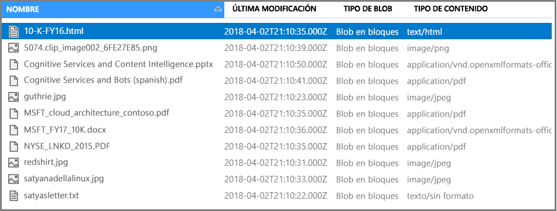

# <a name="tutorial-create-an-ai-enrichment-pipeline-using-rest-and-python"></a>Tutorial: Creación de una canalización de enriquecimiento de inteligencia artificial mediante REST y Python

En este tutorial, aprenderá la mecánica para programar el enriquecimiento de datos en Azure Cognitive Search mediante *aptitudes cognitivas*. Las aptitudes tienen el respaldo de las funcionalidades del procesamiento de lenguaje natural (NLP) y del análisis de imágenes de Cognitive Services. A través de la composición y configuración del conjunto de aptitudes puede extraer texto y representaciones de texto de un archivo con una imagen o con un documento digitalizado. También puede detectar el idioma, las entidades, las frases clave, etc. El resultado es un contenido adicional enriquecido en un índice de búsqueda, creado con enriquecimientos por inteligencia artificial en una canalización de indexación. 

En este tutorial, se usa Python para realizar las tareas siguientes:

> [!div class="checklist"]
> * Crear una canalización de indexación para enriquecer los datos de ejemplo en la ruta a un índice.
> * Aplicar las aptitudes integradas: reconocimiento de entidades, detección de idioma, manipulación de texto y extracción de frases clave.
> * Aprender a encadenar aptitudes mediante la asignación de las entradas a las salidas en conjunto de aptitudes.
> * Ejecutar solicitudes y revisar los resultados.
> * Restablecer el índice y los indexadores para su posterior desarrollo.

La salida es un índice que permite búsquedas de texto completo en Azure Cognitive Search. Puede mejorar el índice con otras funciones estándares, como [sinónimos](search-synonyms.md), [perfiles de puntuación](https://docs.microsoft.com/rest/api/searchservice/add-scoring-profiles-to-a-search-index), [analizadores](search-analyzers.md) y [filtros](search-filters.md). 

Este tutorial se ejecuta en el servicio Gratis, pero el número de transacciones gratuitas está limitado a 20 documentos por día. Si quiere ejecutar este tutorial más de una vez en el mismo día, elimine el indexador para restablecer el contador.

> [!NOTE]
> A medida que expanda el ámbito aumentando la frecuencia de procesamiento, agregando más documentos o agregando más algoritmos de IA, tendrá que [asociar un recurso facturable de Cognitive Services](cognitive-search-attach-cognitive-services.md). Los cargos se acumulan cuando se llama a las API de Cognitive Services y por la extracción de imágenes como parte de la fase de descifrado de documentos de Azure Cognitive Search. No hay ningún cargo por la extracción de texto de documentos.
>
> La ejecución de aptitudes integradas se cobra según los [precios de pago por uso de Cognitive Services](https://azure.microsoft.com/pricing/details/cognitive-services/) existentes. Los precios de la extracción de imágenes se describen en la [página de precios de Búsqueda cognitiva de Azure](https://go.microsoft.com/fwlink/?linkid=2042400).

Si no tiene una suscripción a Azure, cree una [cuenta gratuita](https://azure.microsoft.com/free/?WT.mc_id=A261C142F) antes de empezar.

## <a name="prerequisites"></a>Prerrequisitos

En este tutorial se usan los siguientes servicios, herramientas y datos. 

+ [Cree una cuenta de Azure Storage](https://docs.microsoft.com/azure/storage/common/storage-quickstart-create-account) para almacenar los datos de ejemplo. Asegúrese de que la cuenta de almacenamiento se encuentra en la misma región que Azure Cognitive Search.

+ [Anaconda 3.x](https://www.anaconda.com/distribution/#download-section), que proporciona Python 3.x e instancias de Jupyter Notebook.

+ Los [datos de ejemplo](https://1drv.ms/f/s!As7Oy81M_gVPa-LCb5lC_3hbS-4) están formados por un pequeño conjunto de archivos de tipos diferentes. 

+ [Cree un servicio Azure Cognitive Search](search-create-service-portal.md) o [busque uno existente](https://ms.portal.azure.com/#blade/HubsExtension/BrowseResourceBlade/resourceType/Microsoft.Search%2FsearchServices) en su suscripción actual. Puede usar un servicio gratuito para este tutorial.

## <a name="get-a-key-and-url"></a>Obtención de una clave y una dirección URL

Para interactuar con el servicio Azure Cognitive Search, necesitará la dirección URL del servicio y una clave de acceso. Con ambos se crea un servicio de búsqueda, por lo que, si ha agregado Azure Cognitive Search a su suscripción, siga estos pasos para obtener la información necesaria:

1. [Inicie sesión en Azure Portal](https://portal.azure.com/) y en la página **Introducción** del servicio de búsqueda, obtenga la dirección URL. Un punto de conexión de ejemplo podría ser similar a `https://mydemo.search.windows.net`.

1. En **Configuración** > **Claves**, obtenga una clave de administrador para tener derechos completos en el servicio. Se proporcionan dos claves de administrador intercambiables para lograr la continuidad empresarial, por si necesitara sustituir una de ellas. Puede usar la clave principal o secundaria en las solicitudes para agregar, modificar y eliminar objetos.


Todas las solicitudes requieren una clave de API en cada solicitud enviada al servicio. Una clave válida genera la confianza, solicitud a solicitud, entre la aplicación que la envía y el servicio que se encarga de ella.

## <a name="prepare-sample-data"></a>Preparación de datos de ejemplo

La canalización de enriquecimiento extrae los orígenes de datos de Azure. Los datos de origen deben proceder de un tipo de origen de datos compatible de un [indexador de Azure Cognitive Search](search-indexer-overview.md). Para realizar este ejercicio, usaremos Blob Storage para mostrar varios tipos de contenido.

1. [Inicie sesión en Azure Portal](https://portal.azure.com), vaya a su cuenta de Azure Storage, haga clic en **Blobs** y, después, en **+Contenedor**.

1. [Cree un contenedor de blobs](https://docs.microsoft.com/azure/storage/blobs/storage-quickstart-blobs-portal) que contenga los datos de ejemplo. Puede establecer el nivel de acceso público a cualquiera de sus valores válidos.

1. Una vez creado el contenedor, ábralo y seleccione **Cargar** en la barra de comandos para cargar los archivos de ejemplo que descargó en el paso anterior.

   

1. Una vez cargados los archivos de ejemplo, obtenga el nombre del contenedor y una cadena de conexión de Blob Storage. Para hacerlo puede navegar a la cuenta de almacenamiento en Azure Portal. Haga clic en **Claves de acceso** y copie el valor del campo **Cadena de conexión**.

La cadena de conexión tiene el siguiente formato: `DefaultEndpointsProtocol=https;AccountName=<YOUR-STORAGE-ACCOUNT-NAME>;AccountKey=<YOUR-STORAGE-ACCOUNT-KEY>;EndpointSuffix=core.windows.net`

Tenga a mano la cadena de conexión. La necesitará en un paso posterior.

Hay otras maneras de especificar la cadena de conexión, como proporcionar una firma de acceso compartido. Para obtener más información acerca de las credenciales del origen de datos, consulte [Indexación de Azure Blob Storage](search-howto-indexing-azure-blob-storage.md#Credentials).

## <a name="create-a-jupyter-notebook"></a>Creación de un cuaderno de Jupyter

> [!Note]
> Este artículo muestra cómo crear un origen de datos, índice, indexador y conjunto de aptitudes mediante una serie de scripts de Python. Para descargar el ejemplo completo del cuaderno, vaya al [repositorio Azure-Search-python-samples](https://github.com/Azure-Samples/azure-search-python-samples/tree/master/Tutorial-AI-Enrichment).

Utilice el navegador de Anaconda para iniciar Jupyter Notebook y crear un nuevo cuaderno de Python 3.

## <a name="connect-to-azure-cognitive-search"></a>Conexión a Azure Cognitive Search

En el cuaderno, ejecute este script para cargar las bibliotecas que usa para trabajar con JSON y formular las solicitudes HTTP.

```python
import json
import requests
from pprint import pprint
```

A continuación, defina los nombres para el origen de datos, índice, indexador y conjunto de aptitudes. Ejecute este script para configurar los nombres para este tutorial.

```python
# Define the names for the data source, skillset, index and indexer
datasource_name = "cogsrch-py-datasource"
skillset_name = "cogsrch-py-skillset"
index_name = "cogsrch-py-index"
indexer_name = "cogsrch-py-indexer"
```

> [!Tip]
> En un servicio gratuito, está limitado a tres índices, indexadores y orígenes de datos. En este tutorial se crea uno de cada uno. Antes de continuar, asegúrese de que hay espacio suficiente para crear nuevos objetos.

En el siguiente script, reemplace los marcadores de posición para el servicio de búsqueda (YOUR-SEARCH-SERVICE-NAME) y clave de API de administración (YOUR-ADMIN-API-KEY) y, a continuación, ejecútelo para configurar el punto de conexión del servicio de búsqueda.

```python
# Setup the endpoint
endpoint = 'https://<YOUR-SEARCH-SERVICE-NAME>.search.windows.net/'
headers = {'Content-Type': 'application/json',
           'api-key': '<YOUR-ADMIN-API-KEY>'}
params = {
    'api-version': '2019-05-06'
}
```

## <a name="create-a-data-source"></a>Creación de un origen de datos

Ahora que sus servicios y archivos de origen están preparados, comience a ensamblar los componentes de la canalización de indexación. Comience con un objeto de origen de datos que indique a Azure Cognitive Search cómo recuperar datos de orígenes externos.

En el siguiente script, reemplace el marcador de posición YOUR-BLOB-RESOURCE-CONNECTION-STRING con la cadena de conexión para el blob que creó en el paso anterior. A continuación, ejecute el script para crear un origen de datos denominado `cogsrch-py-datasource`.

```python
# Create a data source
datasourceConnectionString = "<YOUR-BLOB-RESOURCE-CONNECTION-STRING>"
datasource_payload = {
    "name": datasource_name,
    "description": "Demo files to demonstrate cognitive search capabilities.",
    "type": "azureblob",
    "credentials": {
        "connectionString": datasourceConnectionString
    },
    "container": {
        "name": "basic-demo-data-pr"
    }
}
r = requests.put(endpoint + "/datasources/" + datasource_name,
                 data=json.dumps(datasource_payload), headers=headers, params=params)
print(r.status_code)
```

La solicitud debe devolver un código de estado 201 que confirme el éxito de la operación.

En Azure Portal, en la página del panel de información del servicio de búsqueda, compruebe que cogsrch-py-datasource aparece en la lista **Orígenes de datos**. Haga clic en **Actualizar**  para actualizar la página.


## <a name="create-a-skillset"></a>Creación de un conjunto de aptitudes

En este paso, definirá un conjunto de pasos de enriquecimiento para aplicar a los datos. Llamará a cada paso de enriquecimiento una *aptitud* y al conjunto de pasos de enriquecimiento, un *conjunto de aptitudes*. Este tutorial usa un conjunto de [aptitudes cognitivas integradas](cognitive-search-predefined-skills.md):

+ [Detección de idioma](cognitive-search-skill-language-detection.md) para identificar el idioma del contenido.

+ [División de texto](cognitive-search-skill-textsplit.md) para dividir contenido de gran tamaño en fragmentos más pequeños antes de llamar a la aptitud de extracción de frases clave. La extracción de frases clave acepta entradas de 50 000 caracteres o menos. Algunos de los archivos de ejemplo deben dividirse para no superar este límite.

+ [Reconocimiento de entidades](cognitive-search-skill-entity-recognition.md) para extraer los nombres de las organizaciones del contenido del contenedor de blobs.

+ [Extracción de frases clave](cognitive-search-skill-keyphrases.md) para extraer las frases clave principales. 

### <a name="python-script"></a>Script de Python
Ejecute el siguiente script para crear un conjunto de aptitudes denominado `cogsrch-py-skillset`.

```python
# Create a skillset
skillset_payload = {
    "name": skillset_name,
    "description":
    "Extract entities, detect language and extract key-phrases",
    "skills":
    [
        {
            "@odata.type": "#Microsoft.Skills.Text.EntityRecognitionSkill",
            "categories": ["Organization"],
            "defaultLanguageCode": "en",
            "inputs": [
                {
                    "name": "text", "source": "/document/content"
                }
            ],
            "outputs": [
                {
                    "name": "organizations", "targetName": "organizations"
                }
            ]
        },
        {
            "@odata.type": "#Microsoft.Skills.Text.LanguageDetectionSkill",
            "inputs": [
                {
                    "name": "text", "source": "/document/content"
                }
            ],
            "outputs": [
                {
                    "name": "languageCode",
                    "targetName": "languageCode"
                }
            ]
        },
        {
            "@odata.type": "#Microsoft.Skills.Text.SplitSkill",
            "textSplitMode": "pages",
            "maximumPageLength": 4000,
            "inputs": [
                {
                    "name": "text",
                    "source": "/document/content"
                },
                {
                    "name": "languageCode",
                    "source": "/document/languageCode"
                }
            ],
            "outputs": [
                {
                    "name": "textItems",
                    "targetName": "pages"
                }
            ]
        },
        {
            "@odata.type": "#Microsoft.Skills.Text.KeyPhraseExtractionSkill",
            "context": "/document/pages/*",
            "inputs": [
                {
                    "name": "text", "source": "/document/pages/*"
                },
                {
                    "name": "languageCode", "source": "/document/languageCode"
                }
            ],
            "outputs": [
                {
                    "name": "keyPhrases",
                    "targetName": "keyPhrases"
                }
            ]
        }
    ]
}

r = requests.put(endpoint + "/skillsets/" + skillset_name,
                 data=json.dumps(skillset_payload), headers=headers, params=params)
print(r.status_code)
```

La solicitud debe devolver un código de estado 201 que confirme el éxito de la operación.

La aptitud de extracción de frases clave se aplica a cada página. Al establecer el contexto en `"document/pages/*"`, se ejecuta este enriquecedor para cada miembro de la matriz de documentos o páginas (para cada página del documento).

Cada aptitud se ejecuta en el contenido del documento. Durante el procesamiento, Azure Cognitive Search extrae cada documento para leer el contenido de diferentes formatos de archivo. El texto encontrado en el archivo de origen se coloca en un campo `content`, uno para cada documento. Por lo tanto, establezca la entrada como `"/document/content"`.

A continuación se muestra una representación gráfica del conjunto de aptitudes.


Las salidas se pueden asignar a un índice, usar como entrada para una aptitud de bajada, o ambas cosas como sucede con el código de idioma. En el índice, un código de idioma es útil para el filtrado. Como entrada, el código de idioma se usa en las aptitudes de análisis de texto para informar a las reglas lingüísticas de la separación de palabras.

Para obtener más información sobre los conceptos básicos del conjunto de aptitudes, consulte el tema sobre la [definición de un conjunto de aptitudes](cognitive-search-defining-skillset.md).

## <a name="create-an-index"></a>Creación de un índice

En esta sección, se define el esquema de índice. Para ello, se especifican los campos que se incluirán en el índice que permite búsquedas y se establecen los atributos de búsqueda de cada campo. Los campos tienen un tipo y pueden tener atributos que determinen cómo se utiliza el campo (si permite búsquedas, se puede ordenar, etc.). Los nombres de campos de un índice no tienen que coincidir exactamente con los nombres de campo del origen. En un paso posterior, agregará asignaciones de campos en un indexador para conectar los campos de origen y destino. Para este paso, defina el índice con convenciones de nomenclatura de campos adecuadas para la aplicación de búsqueda.

En este ejercicio se utilizan los siguientes campos y tipos de campos:

| field-names: | id         | content   | languageCode | keyPhrases         | organizations     |
|--------------|----------|-------|----------|--------------------|-------------------|
| field-types: | Edm.String|Edm.String| Edm.String| List<Edm.String>  | List<Edm.String>  |

Ejecute este script para crear el índice denominado `cogsrch-py-index`.

```python
# Create an index
index_payload = {
    "name": index_name,
    "fields": [
        {
            "name": "id",
            "type": "Edm.String",
            "key": "true",
            "searchable": "true",
            "filterable": "false",
            "facetable": "false",
            "sortable": "true"
        },
        {
            "name": "content",
            "type": "Edm.String",
            "sortable": "false",
            "searchable": "true",
            "filterable": "false",
            "facetable": "false"
        },
        {
            "name": "languageCode",
            "type": "Edm.String",
            "searchable": "true",
            "filterable": "false",
            "facetable": "false"
        },
        {
            "name": "keyPhrases",
            "type": "Collection(Edm.String)",
            "searchable": "true",
            "filterable": "false",
            "facetable": "false"
        },
        {
            "name": "organizations",
            "type": "Collection(Edm.String)",
            "searchable": "true",
            "sortable": "false",
            "filterable": "false",
            "facetable": "false"
        }
    ]
}

r = requests.put(endpoint + "/indexes/" + index_name,
                 data=json.dumps(index_payload), headers=headers, params=params)
print(r.status_code)
```

La solicitud debe devolver un código de estado 201 que confirme el éxito de la operación.

Para más información acerca de cómo definir un índice, consulte [Creación de un índice (API REST de Azure Cognitive Search)](https://docs.microsoft.com/rest/api/searchservice/create-index).

## <a name="create-an-indexer-map-fields-and-execute-transformations"></a>Creación de un indexador, asignación de campos y ejecución de transformaciones

Hasta ahora, ha creado un origen de datos, un conjunto de aptitudes y un índice. Estos tres componentes pasan a formar parte de un [indexador](search-indexer-overview.md) que extrae todas las piezas juntas en una sola operación de varias fases. Para unir estos objetos en un indexador, tiene que definir las asignaciones de campos.

+ Los campos fieldMappings se procesan antes que el conjunto de aptitudes, lo que asigna los campos de origen del origen de datos a los campos de destino de un índice. Si los tipos y nombres de campo son los mismos en ambos extremos, no se requiere ninguna asignación.

+ Los campos outputFieldMappings se procesan después que el conjunto de aptitudes y hacen referencia a las asignaciones sourceFieldNames que no existen hasta que el descifrado o enriquecimiento de documentos las crean. targetFieldName es un campo de un índice.

Además de enlazar las entradas a las salidas, también puede usar las asignaciones de campos para aplanar las estructuras de datos. Para más información, consulte [Asignación de campos enriquecidos a un índice de búsqueda](cognitive-search-output-field-mapping.md).

Ejecute este script para crear un indexador denominado `cogsrch-py-indexer`.

```python
# Create an indexer
indexer_payload = {
    "name": indexer_name,
    "dataSourceName": datasource_name,
    "targetIndexName": index_name,
    "skillsetName": skillset_name,
    "fieldMappings": [
        {
            "sourceFieldName": "metadata_storage_path",
            "targetFieldName": "id",
            "mappingFunction":
            {"name": "base64Encode"}
        },
        {
            "sourceFieldName": "content",
            "targetFieldName": "content"
        }
    ],
    "outputFieldMappings":
    [
        {
            "sourceFieldName": "/document/organizations",
            "targetFieldName": "organizations"
        },
        {
            "sourceFieldName": "/document/pages/*/keyPhrases/*",
            "targetFieldName": "keyPhrases"
        },
        {
            "sourceFieldName": "/document/languageCode",
            "targetFieldName": "languageCode"
        }
    ],
    "parameters":
    {
        "maxFailedItems": -1,
        "maxFailedItemsPerBatch": -1,
        "configuration":
        {
            "dataToExtract": "contentAndMetadata",
            "imageAction": "generateNormalizedImages"
        }
    }
}

r = requests.put(endpoint + "/indexers/" + indexer_name,
                 data=json.dumps(indexer_payload), headers=headers, params=params)
print(r.status_code)
```

La solicitud debe devolver rápidamente un código de estado 201, sin embargo, el proceso puede tardar varios minutos en completarse. Aunque el conjunto de datos es pequeño, las aptitudes analíticos, como el análisis de imágenes, son intensivas y tardarán tiempo.

Use el script de [Comprobación del estado del indexador](#check-indexer-status) en la sección siguiente para determinar cuándo se ha completado el proceso de indexación.

> [!TIP]
> La creación de un indexador invoca la canalización. Si hay problemas para acceder a los datos, las entradas y salidas de asignación o el orden de las operaciones, se muestran en esta fase. Para volver a ejecutar la canalización con los cambios de código o script, tendrá que quitar primero los objetos. Para más información, consulte [Restablecer y volver a ejecutar](#reset).

#### <a name="explore-the-request-body"></a>Exploración del cuerpo de la solicitud

El script establece `"maxFailedItems"` en -1, que indica al motor de indexación que ignore los errores durante la importación de datos. Esto es útil porque hay muy pocos documentos en el origen de datos de demostración. Para un origen de datos mayor, debería establecer un valor mayor que 0.

Observe también la instrucción `"dataToExtract":"contentAndMetadata"` en los parámetros de configuración. Esta instrucción indica al indexador que extraiga el contenido de diferentes formatos de archivo, y los metadatos relacionados con cada archivo.

Una vez extraído el contenido, puede establecer `imageAction` para que se extraiga el texto de las imágenes que se encuentran en el origen de datos. La configuración de `"imageAction":"generateNormalizedImages"`, en combinación con OCR Skill y Text Merge Skill, le dice al indexador que extraiga texto de las imágenes (por ejemplo, la palabra "stop" de una señal de Stop de tráfico) y lo inserte como parte del campo de contenido. Este comportamiento se aplica a las imágenes insertadas en los documentos (piense en una imagen de un archivo PDF), así como a las imágenes que se encuentran en el origen de datos, como un archivo JPG.

<a name="check-indexer-status"></a>

## <a name="check-indexer-status"></a>Comprobación del estado del indexador

Una vez definido el indexador, se ejecuta automáticamente cuando se envía la solicitud. Dependiendo de las aptitudes cognitivas definidas, la indexación puede tardar más de lo esperado. Para averiguar si el procesamiento del indexador está completo, ejecute el siguiente script.

```python
# Get indexer status
r = requests.get(endpoint + "/indexers/" + indexer_name +
                 "/status", headers=headers, params=params)
pprint(json.dumps(r.json(), indent=1))
```

En la respuesta, supervise en "lastResult" sus valores de "status" y "endTime". Ejecute el script de forma periódica para comprobar el estado. Cuando haya finalizado el indexador el estado se establecerá en "success", se especificará un "endTime", y la respuesta incluirá cualquier error o advertencia que se produjera durante el enriquecimiento.


Las advertencias son comunes con algunas combinaciones de aptitudes y archivos de origen y no siempre indican un problema. En este tutorial, las advertencias son benignas. Por ejemplo, uno de los archivos JPEG que no tiene texto mostrará la advertencia que se ve en esta captura de pantalla.


## <a name="query-your-index"></a>Consulta del índice

Una vez finalizada la indexación, ejecute consultas que devuelvan el contenido de los campos individuales. De forma predeterminada, Azure Cognitive Search devuelve los primeros 50 resultados. Los datos de ejemplo tiene un tamaño reducido, por lo que la configuración predeterminada funciona bien. Sin embargo, si trabaja con conjuntos de datos más grandes, deberá incluir parámetros en la cadena de consulta para que se devuelvan más resultados. Para ver las instrucciones, consulte [Cómo paginar los resultados de la búsqueda en Azure Cognitive Search](search-pagination-page-layout.md).

Como paso de verificación, consulte el índice para todos los campos.

```python
# Query the index for all fields
r = requests.get(endpoint + "/indexes/" + index_name,
                 headers=headers, params=params)
pprint(json.dumps(r.json(), indent=1))
```

Los resultados deben tener un aspecto similar al del siguiente ejemplo. La captura de pantalla muestra solo una parte de la respuesta.


La salida es el esquema de índice, con el nombre, el tipo y los atributos de cada campo.

Envíe una segunda consulta para `"*"` a fin de devolver todo el contenido de un campo único, como `organizations`.

```python
# Query the index to return the contents of organizations
r = requests.get(endpoint + "/indexes/" + index_name +
                 "/docs?&search=*&$select=organizations", headers=headers, params=params)
pprint(json.dumps(r.json(), indent=1))
```

Los resultados deben tener un aspecto similar al del siguiente ejemplo. La captura de pantalla muestra solo una parte de la respuesta.


Repita el proceso para otros campos: contenido, languageCode, keyPhrases y organizaciones del ejercicio. Puede devolver varios campos a través de `$select` con una lista delimitada por comas.

Puede usar GET o POST, según la longitud y la complejidad de la cadena de consulta. Para más información, consulte la [Realización de una consulta al índice de Azure Search con la API de REST](https://docs.microsoft.com/rest/api/searchservice/search-documents).

<a name="reset"></a>

## <a name="reset-and-rerun"></a>Restablecer y volver a ejecutar

En las primeras etapas experimentales del desarrollo de canalizaciones, el enfoque más práctico para las iteraciones de diseño es eliminar los objetos de Azure Cognitive Search y permitir que el código vuelva a generarlos. Los nombres de los recursos son únicos. La eliminación de un objeto permite volver a crearlo con el mismo nombre.

Para volver a indexar los documentos con las nuevas definiciones:

1. Elimine el índice para quitar los datos persistentes. Elimine el indexador para volver a crearlo en su servicio.
2. Modifique el conjunto de aptitudes y la definición del índice.
3. Vuelva a crear un índice y un indexador en el servicio para ejecutar la canalización.

Puede usar el portal para eliminar los índices, los indexadores y los conjuntos de aptitudes. Al eliminar el indexador, puede opcionalmente, de forma selectiva elimina el índice, aptitudes y datos de origen al mismo tiempo.


También puede eliminarlos mediante un script. El siguiente script eliminará el conjunto de aptitudes que se ha creado. Puede modificar fácilmente la solicitud para eliminar el índice, indexador y origen de datos.

```python
# delete the skillset
r = requests.delete(endpoint + "/skillsets/" + skillset_name,
                    headers=headers, params=params)
pprint(json.dumps(r.json(), indent=1))
```

A medida que el código evoluciona, puede refinar una estrategia de regeneración. Para más información, consulte el artículo sobre cómo [recompilar un índice](search-howto-reindex.md).

## <a name="takeaways"></a>Puntos clave

Este tutorial muestra los pasos básicos para la creación de una canalización de indexación enriquecida a través de la creación de componentes: un origen de datos, un conjunto de aptitudes, un índice y un indexador.

Las [aptitudes integradas](cognitive-search-predefined-skills.md) se presentan, junto con las definiciones del conjunto de aptitudes y una forma de encadenamiento de aptitudes, mediante entradas y salidas. También aprendió que `outputFieldMappings` en la definición del indexador es necesario para enrutar los valores enriquecidos de la canalización a un índice que permita búsquedas en un servicio Azure Cognitive Search.

Por último, ha aprendido cómo probar los resultados y restablecer el sistema para otras iteraciones. Ha aprendido que emitir consultas en el índice devuelve la salida creada por la canalización de indexación enriquecida. En esta versión, existe un mecanismo para ver las construcciones internas (documentos enriquecidos creados por el sistema). También ha aprendido cómo comprobar el estado del indexador y qué objetos se tienen que eliminar antes de volver a ejecutar una canalización.

## <a name="clean-up-resources"></a>Limpieza de recursos

La manera más rápida de borrar el contenido después de un tutorial es eliminar el grupo de recursos que contenga el servicio de Azure Cognitive Search y Azure Blob service. Si decide colocar ambos servicios en el mismo grupo, elimine el grupo de recursos para eliminar de manera permanente todo lo que contiene, incluyendo los servicios y cualquier contenido almacenado que haya creado para este tutorial. En el portal, el nombre del grupo de recursos está en la página Información general de cada servicio.

## <a name="next-steps"></a>Pasos siguientes

Personalice o extienda la canalización con aptitudes personalizadas. Al crear una aptitud personalizada y agregarla a un conjunto de aptitudes, puede incorporar texto o análisis de imágenes que escriba usted mismo.

> [!div class="nextstepaction"]
> [Ejemplo: Creación de una aptitud personalizada para el enriquecimiento con inteligencia artificial](cognitive-search-create-custom-skill-example.md)
