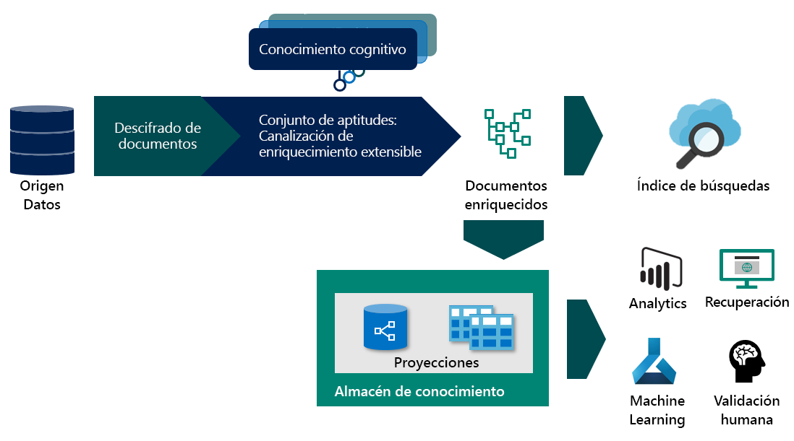

# <a name="skillset-concepts-and-composition-in-azure-cognitive-search"></a>Conceptos de conjunto de aptitudes y composición de consultas en Azure Cognitive Search

Este artículo está dirigido a desarrolladores que necesitan una comprensión más profunda de cómo funciona la canalización de enriquecimiento, que ya disponen de un conocimiento conceptual del proceso de enriquecimiento con inteligencia artificial. Si no está familiarizado con este concepto, empiece por:
+ [Enriquecimiento con inteligencia artificial en Azure Cognitive Search](cognitive-search-concept-intro.md)
+ [Almacén de conocimiento (versión preliminar)](knowledge-store-concept-intro.md)

## <a name="specify-the-skillset"></a>Especificación del conjunto de aptitudes
Un conjunto de aptitudes es un recurso reutilizable en Azure Cognitive Search que especifica una colección de aptitudes cognitivas que se usan para analizar, transformar y enriquecer el contenido de texto o imagen durante la indexación. La creación de un conjunto de aptitudes le permite adjuntar enriquecimientos de texto e imagen en la fase de ingesta de datos, extrayendo y creando nueva información y estructuras a partir de contenido sin procesar.

Un conjunto de aptitudes tiene tres propiedades:

+   ```skills```, una colección sin ordenar de aptitudes para los que la plataforma determina la secuencia de ejecución en función de las entradas necesarias para cada aptitud.
+   ```cognitiveServices```, la clave de Cognitive Services necesaria para la facturación de las aptitudes cognitivas invocadas.
+   ```knowledgeStore```, la cuenta de almacenamiento en la que se proyectarán los documentos enriquecidos.


Los conjuntos de aptitudes se crean en JSON. Puede compilar conjuntos de aptitudes complejos con bucles y [ramificaciones](https://docs.microsoft.com/azure/search/cognitive-search-skill-conditional) mediante el [lenguaje de expresiones](https://docs.microsoft.com/azure/search/cognitive-search-skill-conditional). El lenguaje de expresiones utiliza la notación de ruta de acceso [puntero JSON](https://tools.ietf.org/html/rfc6901) con algunas modificaciones para identificar los nodos del árbol de enriquecimiento. ```"/"``` atraviesa un nivel inferior en el árbol y ```"*"``` actúa como un operador for-each en el contexto. Estos conceptos se describen mejor con un ejemplo. Para ilustrar algunos de los conceptos y funcionalidades, recorreremos paso a paso el conjunto de aptitudes de [ejemplo de reseñas de hotel](knowledge-store-connect-powerbi.md). Para ver el conjunto de aptitudes una vez que haya seguido el flujo de trabajo de importación de datos, deberá usar un cliente de API REST para [obtener el conjunto de aptitudes](https://docs.microsoft.com/rest/api/searchservice/get-skillset).

### <a name="enrichment-tree"></a>Árbol de enriquecimiento

Para imaginar cómo un conjunto de aptitudes enriquece gradualmente el documento, veremos primero el aspecto del documento antes de cualquier enriquecimiento. La salida del descifrado de documentos depende del origen de datos y del modo de análisis específico seleccionado. Este es también el estado del documento desde el que las [asignaciones de campo](search-indexer-field-mappings.md) pueden originar contenido al agregar datos al índice de búsqueda.


Una vez que un documento se encuentra en la canalización de enriquecimiento, se representa como un árbol de contenido y enriquecimientos asociados. Como salida del descifrado de documentos, se crea una instancia de este árbol. El formato de árbol de enriquecimiento permite que la canalización de enriquecimiento adjunte metadatos incluso a tipos de datos primitivos; no es un objeto JSON válido, pero se puede proyectar en un formato JSON válido. En la tabla siguiente se muestra el estado de un documento que entra en la canalización de enriquecimiento:

|Origen de datos\Modo de análisis|Valor predeterminado|JSON, líneas JSON y CSV|
|---|---|---|
|Blob Storage|/document/content<br>/document/normalized_images/*<br>…|/document/{key1}<br>/document/{key2}<br>…|
|SQL|/document/{column1}<br>/document/{column2}<br>…|N/D |
|Cosmos DB|/document/{key1}<br>/document/{key2}<br>…|N/D|

 A medida que se ejecutan las aptitudes, agregan nuevos nodos al árbol de enriquecimiento. Estos nuevos nodos se pueden usar como entradas para aptitudes de bajada, proyectándose en el almacén de conocimiento o asignándose a campos de índice. Los enriquecimientos no son mutables: una vez creados, los nodos no se pueden editar. A medida que los conjuntos de aptitudes se vuelven más complejos, también lo hará el árbol de enriquecimiento, pero no todos los nodos del árbol de enriquecimiento deben asignarse al índice o al almacén de conocimiento. 

Puede conservar de forma selectiva solo un subconjunto de enriquecimientos en el índice o el almacén de conocimiento.
En el resto de este documento, se asume que estamos trabajando con el [ejemplo de reseñas de hotel](https://docs.microsoft.com/azure/search/knowledge-store-connect-powerbi), pero los mismos conceptos se aplican al enriquecimiento de documentos de todos los demás orígenes de datos.

### <a name="context"></a>Context
Cada aptitud requiere un contexto. Un contexto determina:
+   El número de veces que se ejecuta la aptitud, basado en los nodos seleccionados. En el caso de valores de contexto de colección de tipos, agregar ```/*``` al final hará que se invoque la aptitud una vez para cada instancia de la colección. 
+   Dónde se agregan las salidas de la aptitud en el árbol de enriquecimiento. Las salidas siempre se agregan al árbol como elementos secundarios del nodo de contexto. 
+   La forma de las entradas. En el caso de colecciones de varios niveles, el establecimiento del contexto en la colección primaria afectará a la forma de la entrada de la aptitud. Por ejemplo, si tiene un árbol de enriquecimiento con una lista de países, cada uno de ellos enriquecido con una lista de estados que contiene una lista de códigos postales.

|Context|Entrada|Forma de la entrada|Invocación de la aptitud|
|---|---|---|---|
|```/document/countries/*``` |```/document/countries/*/states/*/zipcodes/*``` |Una lista de todos los códigos postales del país |Una vez por país |
|```/document/countries/*/states/*``` |```/document/countries/*/states/*/zipcodes/*``` |Una lista de todos los códigos postales del estado | Una vez por combinación de país y estado|

### <a name="sourcecontext"></a>SourceContext

`sourceContext` solo se utiliza en [proyecciones](knowledge-store-projection-overview.md) y entradas de aptitudes. Se utiliza para construir objetos anidados de varios niveles. Es posible que tenga que crear un nuevo objeto para pasarlo como una entrada a una aptitud o proyecto en el almacén de conocimiento. Dado que los nodos de enriquecimiento pueden no ser un objeto JSON válido en el árbol de enriquecimiento y que la referencia a un nodo del árbol solo devuelve el estado del nodo cuando se creó, el uso de enriquecimientos como proyecciones o entradas de aptitudes requiere la creación de un objeto JSON bien formado. `sourceContext` permite construir un objeto de tipo anónimo y jerárquico, que requeriría varias aptitudes si solo usara el contexto. El uso de `sourceContext` se muestra en la siguiente sección. Observe la salida de aptitud que generó un enriquecimiento para determinar si es un objeto JSON válido y no un tipo primitivo.

### <a name="projections"></a>Proyecciones

La proyección es el proceso de selección de los nodos del árbol de enriquecimiento que se van a guardar en el almacén de conocimiento. Las proyecciones son formas personalizadas del documento (contenido y enriquecimientos) que se pueden generar como proyecciones de tabla u objeto. Para más información sobre cómo trabajar con proyecciones, consulte [Trabajar con proyecciones](knowledge-store-projection-overview.md).


En el diagrama anterior se describe el selector con el que trabaja en función de dónde se encuentra en la canalización de enriquecimiento.

## <a name="generate-enriched-data"></a>Generación de datos enriquecidos 

Ahora vamos a examinar paso a paso el conjunto de aptitudes de reseñas de hotel. Puede seguir el [tutorial](knowledge-store-connect-powerbi.md) para crear el conjunto de aptitudes o [ver](https://github.com/Azure-Samples/azure-search-postman-samples/blob/master/samples/skillset.json) el conjunto de aptitudes. Qué vamos a ver:

* Cómo evoluciona el árbol de enriquecimiento con la ejecución de cada aptitud. 
* Cómo funcionan el contexto y las entradas para determinar el número de veces que se ejecuta una aptitud. 
* Qué forma tiene la entrada según el contexto. 

Dado que estamos usando el modo de análisis de texto delimitado para el indexador, un documento dentro del proceso de enriquecimiento representa una sola fila en el archivo CSV.

### <a name="skill-1-split-skill"></a>Aptitud 1: aptitud de división 


Con el contexto de aptitud de ```"/document/reviews_text"```, esta aptitud se ejecutará una vez para `reviews_text`. La salida de la aptitud es una lista donde `reviews_text` se fragmenta en segmentos de 5000 caracteres. La salida de la aptitud de división se denomina `pages` y se agrega al árbol de enriquecimiento. La característica `targetName` permite cambiar el nombre de una salida de aptitud antes de agregarla al árbol de enriquecimiento.

El árbol enriquecimiento tiene ahora un nuevo nodo colocado en el contexto de la aptitud. Este nodo está disponible para cualquier aptitud, proyección o asignación de campos de salida.


El nodo raíz de todos los enriquecimientos es `"/document"`. Al trabajar con indexadores de blobs, el nodo `"/document"` tendrá nodos secundarios de `"/document/content"` y `"/document/normalized_images"`. Cuando se trabaja con datos CSV, como en este ejemplo, los nombres de columna se asignan a los nodos situados debajo de `"/document"`. Para acceder a cualquiera de los enriquecimientos agregados a un nodo mediante una aptitud, se necesita la ruta de acceso completa para el enriquecimiento. Por ejemplo, si desea utilizar el texto del nodo ```pages``` como una entrada a otra aptitud, deberá especificarlo como ```"/document/reviews_text/pages/*"```.
 
 

### <a name="skill-2-language-detection"></a>Aptitud 2: detección de idioma
 Aunque la aptitud de detección de idioma es la tercera (aptitud 3) definida en el conjunto de aptitudes, es la siguiente aptitud que se ejecuta. Dado que no se bloquea al no requerir entradas, se ejecutará en paralelo con la aptitud anterior. Al igual que la aptitud de división que la precedía, la aptitud de detección de idioma también se invoca una vez para cada documento. El árbol de enriquecimiento tiene ahora un nuevo nodo para Language.
 
 
 ### <a name="skill-3-key-phrases-skill"></a>Aptitud 3: aptitud de frases clave 

Dado el contexto de ```/document/reviews_text/pages/*```, la aptitud de frases clave se invocará una vez para cada uno de los elementos de la colección `pages`. La salida de la aptitud será un nodo bajo el elemento de página asociado. 

 Ahora deberá poder observar el resto de las aptitudes del conjunto y visualizar cómo seguirá creciendo el árbol de enriquecimientos con la ejecución de cada una de las aptitudes. Algunas aptitudes, como la aptitud de combinación y la aptitud de conformador, también crean nuevos nodos, pero solo usan datos de los nodos existentes y no crean nuevos enriquecimientos netos.


Los colores de los conectores en el árbol anterior indican que los enriquecimientos se crearon mediante distintas aptitudes y que los nodos deben abordarse de forma individual y no formarán parte del objeto devuelto al seleccionar el nodo primario.

## <a name="save-enrichments-in-a-knowledge-store"></a>Guardar enriquecimientos en el almacén de conocimiento 

Los conjuntos de aptitudes también definen un almacén de conocimiento en el que los documentos enriquecidos se pueden proyectar como tablas u objetos. Para guardar los datos enriquecidos en el almacén de conocimiento, debe definir un conjunto de proyecciones del documento enriquecido. Para más información sobre el almacén de conocimiento, consulte la [información general del almacén de conocimiento](knowledge-store-concept-intro.md).

### <a name="slicing-projections"></a>Segmentación de proyecciones

Al definir un grupo de proyecciones de tabla, se puede segmentar un solo nodo del árbol de enriquecimiento en varias tablas relacionadas. Si agrega una tabla con una ruta de acceso de origen que sea un elemento secundario de una proyección de tabla existente, el nodo secundario resultante no será un elemento secundario de la proyección de tabla existente, sino que se proyectará en la nueva tabla relacionada. Esta técnica de segmentación permite definir un único nodo en una aptitud de conformador que puede ser el origen de todas sus proyecciones de tabla. 

### <a name="shaping-projections"></a>Modelado de proyecciones

Hay dos maneras de definir una proyección. Puede usar una aptitud de conformador para crear un nuevo nodo que sea el nodo raíz para todos los enriquecimientos que proyecta. Después, en las proyecciones, solo haría referencia a la salida de la aptitud de conformador. También puede modelar en línea una proyección en la propia definición de la proyección.

El método del conformador es más detallado que la forma en línea, pero garantiza que todas las mutaciones del árbol de enriquecimiento estén contenidas en las aptitudes y que la salida sea un objeto que se pueda volver a usar. La forma en línea le permite crear la forma que necesita, pero es un objeto anónimo y solo está disponible para la proyección para la que se define. Estos enfoques se pueden usar juntos o por separado. El conjunto de aptitudes creado en el flujo de trabajo del portal contiene ambos. Usa una aptitud de conformador para las proyecciones de tabla, pero también utiliza la forma en línea para proyectar la tabla de frases clave.

Para ampliar el ejemplo, puede optar por quitar la forma en línea y usar una aptitud de conformador para crear un nuevo nodo para las frases clave. Para crear una forma proyectada en tres tablas, es decir `hotelReviewsDocument`, `hotelReviewsPages`, y `hotelReviewsKeyPhrases`, se describen las dos opciones en las secciones siguientes.


#### <a name="shaper-skill-and-projection"></a>Aptitud de conformador y proyección 

> [!Note]
> Algunas de las columnas de la tabla de documentos se han quitado de este ejemplo para mayor simplicidad.
>
```json
{
    "@odata.type": "#Microsoft.Skills.Util.ShaperSkill",
    "name": "#5",
    "description": null,
    "context": "/document",
    "inputs": [        
        {
            "name": "reviews_text",
            "source": "/document/reviews_text",
            "sourceContext": null,
            "inputs": []
        },
        {
            "name": "reviews_title",
            "source": "/document/reviews_title",
            "sourceContext": null,
            "inputs": []
        },
        {
            "name": "AzureSearch_DocumentKey",
            "source": "/document/AzureSearch_DocumentKey",
            "sourceContext": null,
            "inputs": []
        },  
        {
            "name": "pages",
            "source": null,
            "sourceContext": "/document/reviews_text/pages/*",
            "inputs": [
                {
                    "name": "SentimentScore",
                    "source": "/document/reviews_text/pages/*/Sentiment",
                    "sourceContext": null,
                    "inputs": []
                },
                {
                    "name": "LanguageCode",
                    "source": "/document/Language",
                    "sourceContext": null,
                    "inputs": []
                },
                {
                    "name": "Page",
                    "source": "/document/reviews_text/pages/*",
                    "sourceContext": null,
                    "inputs": []
                },
                {
                    "name": "keyphrase",
                    "sourceContext": "/document/reviews_text/pages/*/Keyphrases/*",
                    "inputs": [
                        {
                            "source": "/document/reviews_text/pages/*/Keyphrases/*",
                            "name": "Keyphrases"
                        }
                    ]
                }
            ]
        }
    ],
    "outputs": [
        {
            "name": "output",
            "targetName": "tableprojection"
        }
    ]
}
```

Con el nodo `tableprojection` definido en la sección `outputs` anterior, ahora podemos usar la característica de segmentación para proyectar partes del nodo `tableprojection` en tablas diferentes:

> [!Note]
> Este es solo un fragmento de la proyección dentro de la configuración del almacén de conocimiento.
>
```json
"projections": [
    {
        "tables": [
            {
                "tableName": "hotelReviewsDocument",
                "generatedKeyName": "Documentid",
                "source": "/document/tableprojection"
            },
            {
                "tableName": "hotelReviewsPages",
                "generatedKeyName": "Pagesid",
                "source": "/document/tableprojection/pages/*"
            },
            {
                "tableName": "hotelReviewsKeyPhrases",
                "generatedKeyName": "KeyPhrasesid",
                "source": "/document/tableprojection/pages/*/keyphrase/*"
            }
        ]
    }
]
```

#### <a name="inline-shaping-projections"></a>Modelado de proyecciones en línea

El método de modelado en línea no requiere una aptitud de conformador, ya que todas las formas necesarias para las proyecciones se crean en el momento en que se necesitan. Para proyectar los mismos datos que en el ejemplo anterior, la opción de proyección en línea tendría el siguiente aspecto:

```json
"projections": [
    {
        "tables": [
            {
                "tableName": "hotelReviewsInlineDocument",
                "generatedKeyName": "Documentid",
                "sourceContext": "/document",     
                "inputs": [
                    {
                        "name": "reviews_text",
                        "source": "/document/reviews_text"
                    },
                    {
                        "name": "reviews_title",
                        "source": "/document/reviews_title"
                    },
                    {
                        "name": "AzureSearch_DocumentKey",
                        "source": "/document/AzureSearch_DocumentKey"
                    }                             
                ]
            },
            {
                "tableName": "hotelReviewsInlinePages",
                "generatedKeyName": "Pagesid",
                "sourceContext": "/document/reviews_text/pages/*",
                "inputs": [
                        {
                    "name": "SentimentScore",
                    "source": "/document/reviews_text/pages/*/Sentiment"
                    },
                    {
                        "name": "LanguageCode",
                        "source": "/document/Language"
                    },
                    {
                        "name": "Page",
                        "source": "/document/reviews_text/pages/*"
                    }
                ]
            },
            {
                "tableName": "hotelReviewsInlineKeyPhrases",
                "generatedKeyName": "KeyPhraseId",
                "sourceContext": "/document/reviews_text/pages/*/Keyphrases/*",
                "inputs": [
                    {
                        "name": "Keyphrases",
                        "source": "/document/reviews_text/pages/*/Keyphrases/*"
                    }
                ]
            }
        ]
    }
]
```
  
Un ejemplo de ambos enfoques es la proyección de los valores de `"Keyphrases"` mediante `"sourceContext"`. El nodo `"Keyphrases"`, que contiene una colección de cadenas, es en sí mismo un elemento secundario del texto de la página. Sin embargo, dado que las proyecciones requieren un objeto JSON y la página es primitiva (cadena), `"sourceContext"` se usa para encapsular la frase clave en un objeto con una propiedad con nombre. Esta técnica permite que incluso se proyecten primitivas de forma independiente.

## <a name="next-steps"></a>Pasos siguientes

Como paso siguiente, cree su primer conjunto de aptitudes con aptitudes cognitivas.

> [!div class="nextstepaction"]
> [Cree su primer conjunto de aptitudes](cognitive-search-defining-skillset.md).
