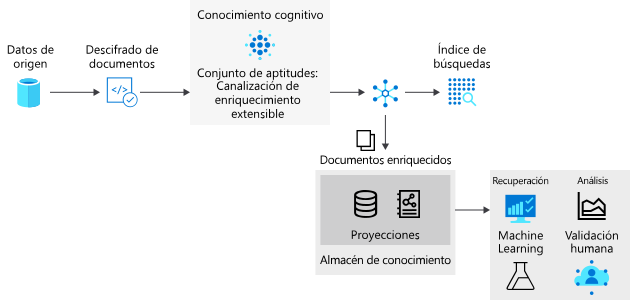

# <a name="introduction-to-knowledge-stores-in-azure-cognitive-search"></a>Introducción a los almacenes de conocimiento de Azure Cognitive Search

> [!IMPORTANT] 
> El almacén de conocimiento está actualmente en versión preliminar pública. La funcionalidad de versión preliminar se ofrece sin un Acuerdo de Nivel de Servicio y no es aconsejable usarla para cargas de trabajo de producción. Para más información, consulte [Términos de uso complementarios de las Versiones Preliminares de Microsoft Azure](https://azure.microsoft.com/support/legal/preview-supplemental-terms/). En la [API REST versión 2019-05-06-Preview](search-api-preview.md) se proporcionan características en versión preliminar. Actualmente hay compatibilidad limitada con el portal y no la hay con el SDK de .NET.

El almacén de conocimiento es una característica de Azure Cognitive Search que conserva la salida de una [canalización de enriquecimiento con IA](cognitive-search-concept-intro.md) para realizar análisis independientes o procesos de nivel inferior. Un *documento enriquecido* es la salida de una canalización creada a partir del contenido que se ha extraído, estructurado y analizado mediante procesos de inteligencia artificial. En una canalización estándar de inteligencia artificial, los documentos enriquecidos son transitorios, solo se usan durante la indexación y después se descartan. Los documentos enriquecidos se conservan mediante el almacén de conocimiento. 

Si ha usado aptitudes cognitivas anteriormente, ya sabe que los *conjuntos de aptitudes* se usan para mover un documento por una secuencia de enriquecimientos. El resultado puede ser un índice de búsqueda o (una novedad de esta versión preliminar) proyecciones en un almacén de conocimientos. Las dos salidas, el índice de búsqueda y el almacén de conocimiento, son productos de la misma canalización. Aunque se obtienen de las mismas entradas, se genera una salida estructurada y almacenada, que se emplea de maneras muy distintas.

Físicamente, un almacén de conocimiento es como [Azure Storage](https://docs.microsoft.com/azure/storage/common/storage-account-overview), ya sea Azure Table Storage, Azure Blob Storage o ambos. Cualquier herramienta o proceso que pueda conectarse a Azure Storage puede consumir el contenido de un almacén de conocimiento.



## <a name="benefits-of-knowledge-store"></a>Ventajas de Knowledge Store

Un almacén de conocimiento proporciona estructura, contexto y contenido real, recopilados a partir de archivos de datos no estructurados y semiestructurados, como blobs, archivos de imagen que se han sometido a análisis o, incluso, datos estructurados cuya forma ha cambiado. En una [guía paso a paso](knowledge-store-create-rest.md), puede ver de primera mano cómo un documento JSON denso se particiona en subestructuras, se reconstituye en nuevas estructuras y, además, se pone a disposición para procesos de nivel inferior, como cargas de trabajo de ciencia de datos y aprendizaje automático.

Aunque es útil ver lo que puede producir una canalización de enriquecimiento con IA, la verdadera ventaja del almacén de conocimiento radica en la capacidad de remodelar los datos. Puede comenzar con un conjunto de aptitudes básico y, luego, iterarlo para agregar niveles crecientes de estructura que luego se pueden combinar en nuevas estructuras, y que pueden consumirse en otras aplicaciones, además de Azure Cognitive Search.

Entre las ventajas de Knowledge Store, se incluyen las siguientes:

+ Consumir documentos enriquecidos en [herramientas de informes y análisis](#tools-and-apps), además de buscar. Power BI con Power Query es una opción atractiva, pero cualquier herramienta o aplicación que se pueda conectar a Azure Storage puede beneficiarse de un almacén de conocimiento que cree.

+ Refinar una canalización de indexación de IA durante la depuración de pasos y definiciones de conjuntos de aptitudes. Un almacén de conocimientos le muestra el producto de la definición de un conjunto de aptitudes en una canalización de indexación de IA. Puede usar estos resultados para diseñar un mejor conjunto de aptitudes, ya que puede ver exactamente la apariencia de los enriquecimientos. Puede usar el [Explorador de Storage](https://docs.microsoft.com/azure/vs-azure-tools-storage-manage-with-storage-explorer?tabs=windows) en Azure Storage para ver el contenido de un almacén de conocimiento.

+ Cambiar la forma de los datos. El cambio de formas se codifica en conjuntos de aptitudes, pero la idea es que ahora un conjunto de aptitudes puede proporcionar esta funcionalidad. La [aptitud Conformador](cognitive-search-skill-shaper.md) de Azure Cognitive Search se ha ampliado para dar cabida a esta tarea. Cambiar la forma le permite definir una proyección que se alinee con el uso previsto de los datos, al tiempo que conserva las relaciones.

> [!Note]
> ¿No tiene experiencia en las aptitudes cognitivas y en el enriquecimiento de inteligencia artificial? Azure Cognitive Search se integra en las características Vision y Language de Cognitive Services para extraer y enriquecer los datos de origen mediante el reconocimiento óptico de caracteres (OCR) en archivos de imágenes, el reconocimiento de entidades y la extracción de frases clave de archivos de texto, etc. Para más información, consulte [Enriquecimiento con inteligencia artificial en Azure Cognitive Search](cognitive-search-concept-intro.md).

## <a name="physical-storage"></a>Almacenamiento físico

La expresión física de un almacén de conocimiento se articula a través del elemento `projections` de una definición de `knowledgeStore` en un conjunto de aptitudes. La proyección define una estructura de la salida para que coincida con el uso previsto.

Las proyecciones se pueden articular como objetos, tablas o archivos.

```json
"knowledgeStore": { 
    "storageConnectionString": "<YOUR-AZURE-STORAGE-ACCOUNT-CONNECTION-STRING>", 
    "projections": [ 
        { 
            "tables": [ ], 
            "objects": [ ], 
            "files": [ ]
        },
                { 
            "tables": [ ], 
            "objects": [ ], 
            "files": [ ]
        }
```

El tipo de proyección que especifique en esta estructura determina el tipo de almacenamiento que usará el almacén de conocimiento.

+ El almacenamiento de tablas se utiliza al definir `tables`. Defina una proyección de tabla cuando necesite estructuras de informes tabulares para escribir entradas en herramientas analíticas o realizar exportaciones de tramas de datos en otros almacenes de datos. Puede especificar varios elementos `tables` para obtener un subconjunto o una sección transversal de documentos enriquecidos. Dentro del mismo grupo de proyección, las relaciones entre las tablas se conservan para que pueda trabajar con todas ellas.

+ El almacenamiento de blobs se usa cuando se define `objects` o `files`. La representación física de un elemento `object` es una estructura JSON jerárquica que representa un documento enriquecido. Un elemento `file` es una imagen extraída de un documento, que se transfiere sin cambios al almacenamiento de blobs.

Un único objeto de proyección contiene un conjunto de `tables`, `objects` y `files`. En muchos escenarios, puede bastar con crear una proyección. 

Sin embargo, es posible crear varios conjuntos de proyecciones de `table`-`object`-`file`; de hecho, se recomienda si se desean diferentes relaciones de datos. Dentro de un conjunto, los datos están relacionados, si se da por sentado que las relaciones existen y se pueden detectar. Si crea más conjuntos, los documentos de cada grupo nunca estarán relacionados. Un ejemplo de uso de varios grupos de proyección podría ser el siguiente. Quiere usar los mismos datos proyectados en el sistema en línea y deben representarse de una forma específica, y también quiere que los mismos datos proyectados se utilicen en una canalización de ciencia de datos que se representa de otra forma.

## <a name="requirements"></a>Requisitos 

Se requiere [Azure Storage](https://docs.microsoft.com/azure/storage/). Proporciona almacenamiento físico. Puede usar el almacenamiento de tablas o de blobs, o ambos. El almacenamiento de blobs se usa para documentos enriquecidos sin cambios, normalmente cuando la salida va a los procesos de nivel inferior. El almacenamiento de tablas se utiliza para segmentos de documentos enriquecidos, que se suelen usar para tareas de análisis y generación de informes.

Se requiere un [conjunto de aptitudes](cognitive-search-working-with-skillsets.md). Contiene la definición de `knowledgeStore` y determina la estructura y composición de un documento enriquecido. No se puede crear un almacén de conocimiento mediante un conjunto de aptitudes vacío. Un conjunto de aptitudes debe tener al menos una aptitud.

Se requiere un [indizador](search-indexer-overview.md). Un indizador invoca un conjunto de aptitudes, que controla la ejecución. Los indizadores cuentan con su propio conjunto de requisitos y atributos. Algunos de estos atributos repercuten directamente en un almacén de conocimiento:

+ Los indizadores requieren un [origen de datos de Azure compatible](search-indexer-overview.md#supported-data-sources) (la canalización que, en última instancia, crea el almacén de conocimiento se inicia mediante la extracción de datos de un origen admitido en Azure). 

+ Los indizadores requieren un índice de búsqueda. Un indizador necesita que se proporcione un esquema de índice, incluso si no se tiene previsto usar. Un índice mínimo tiene un campo de cadena, que se designa como la clave.

+ Los indizadores proporcionan asignaciones de campos opcionales, que se usan para asignar un alias de un campo de origen a un campo de destino. Si es necesario modificar una asignación de campos predeterminada (para usar otro nombre o tipo), puede crear una [asignación de campos](search-indexer-field-mappings.md) dentro de un indizador. Para la salida del almacén de conocimiento, el destino puede ser un campo en una tabla o en un objeto de blobs.

+ Los indizadores tienen programaciones y otras propiedades, como los mecanismos de detección de cambios que proporcionan varios orígenes de datos, y también se pueden aplicar a un almacén de conocimiento. Por ejemplo, puede [programar](search-howto-schedule-indexers.md) el enriquecimiento a intervalos periódicos para actualizar el contenido. 

## <a name="how-to-create-a-knowledge-store"></a>Creación de un almacén de conocimiento

Para crear el almacén de conocimiento, use el portal o la versión preliminar de la API REST (`api-version=2019-05-06-Preview`).

### <a name="use-the-azure-portal"></a>Uso de Azure Portal

El Asistente para **importar datos** incluye opciones para crear un almacén de conocimiento. Para la exploración inicial, [cree un primer almacén de conocimiento siguiendo cuatro pasos](knowledge-store-connect-power-bi.md).

1. Seleccione un origen de datos compatible.

1. Especifique el enriquecimiento: asocie un recurso, seleccione aptitudes y especifique un almacén de conocimiento. 

1. Cree un esquema de índice. El asistente lo necesita y puede inferir uno automáticamente.

1. Ejecute el asistente. La extracción, el enriquecimiento y el almacenamiento se producen en este último paso.

### <a name="use-create-skillset-and-the-preview-rest-api"></a>Uso de Create Skillset y la versión preliminar de la API REST

Un elemento `knowledgeStore` se define dentro de un [conjunto de aptitudes](cognitive-search-working-with-skillsets.md) que, a su vez, se invoca mediante un [indizador](search-indexer-overview.md). Durante el enriquecimiento, Azure Cognitive Search crea un espacio en la cuenta de Azure Storage y proyecta los documentos enriquecidos como blobs o en tablas, según la configuración.

Actualmente, la versión preliminar de la API REST es el único mecanismo por el que puede crear un almacén de conocimiento mediante programación. Una manera fácil de explorar es [crear un primer almacén de conocimiento mediante Postman y la API REST](knowledge-store-create-rest.md).

El contenido de referencia de esta característica en versión preliminar se encuentra en la sección [Referencia de API](#kstore-rest-api) de este artículo. 

<a name="tools-and-apps"></a>

## <a name="how-to-connect-with-tools-and-apps"></a>Conexión con herramientas y aplicaciones

Una vez que el enriquecimiento existe en el almacenamiento, puede usarse cualquier herramienta o tecnología que se conecte a Azure Blob o Table Storage para explorar, analizar o consumir el contenido. La lista siguiente es un comienzo:

+ El [Explorador de Storage](knowledge-store-view-storage-explorer.md) para ver la estructura y el contenido de los documentos enriquecidos. Considere esto como la herramienta de base de referencia para ver el contenido del almacén de conocimientos.

+ [Power BI](knowledge-store-connect-power-bi.md) para crear informes y realizar análisis. 

+ [Azure Data Factory](https://docs.microsoft.com/azure/data-factory/) para manipulación adicional.

<a name="kstore-rest-api"></a>

## <a name="api-reference"></a>Referencia de API

La versión de la API REST `2019-05-06-Preview` proporciona el almacén de conocimiento mediante definiciones adicionales en conjuntos de aptitudes. Además de la referencia, consulte [Creación de un almacén de conocimiento mediante Postman](knowledge-store-create-rest.md) para más información sobre cómo llamar a las API.

+ [Crear conjunto de aptitudes (api-version=2019-05-06-Preview)](https://docs.microsoft.com/rest/api/searchservice/2019-05-06-preview/create-skillset) 
+ [Actualizar conjunto de aptitudes (api-version=2019-05-06-Preview)](https://docs.microsoft.com/rest/api/searchservice/2019-05-06-preview/update-skillset) 


## <a name="next-steps"></a>Pasos siguientes

El almacén de conocimiento ofrece persistencia de documentos enriquecidos, lo cual resulta útil al diseñar un conjunto de aptitudes o durante la creación de nuevas estructuras y contenido para su consumo por parte de cualquier aplicación cliente capaz de acceder a una cuenta de Azure Storage.

El enfoque más sencillo para crear documentos enriquecidos es [mediante el portal](knowledge-store-create-portal.md), pero también puede usar Postman y la API REST, que resulta más útil si desea obtener conclusiones cognitivas sobre cómo se crean objetos y se hace referencia a ellos.

> [!div class="nextstepaction"]
> [Creación de un almacén de conocimiento mediante Postman y REST](knowledge-store-create-rest.md)
