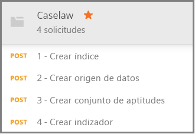

# <a name="how-to-get-started-with-knowledge-store-in-azure-search"></a>Introducción a Knowledge Store (versión preliminar) en Azure Search

> [!Note]
> Knowledge Store se encuentra en versión preliminar y no está pensado para su uso en producción. En la [API REST, versión 2019-05-06-Preview](search-api-preview.md) se proporciona esta característica. Por el momento, no hay compatibilidad con .NET SDK.
>
El [almacén de conocimiento](knowledge-store-concept-intro.md) guarda todos los documentos enriquecidos con IA creados durante la indexación en la cuenta de almacenamiento de Azure con el fin de aprovechar los datos de bajada en otras aplicaciones. También puede usar enriquecimientos guardados para comprender y refinar una canalización de indexación de Azure Search. 

Un almacén de conocimiento se define mediante un *conjunto de aptitudes* y se crea mediante un *indizador*. La expresión física de un almacén de conocimiento se especifica mediante *proyecciones* que determinan las estructuras de datos en el almacenamiento. Al acabar esta guía, habrá creado todos estos objetos y sabrá cómo funcionan juntos. 

En este ejercicio, comience con datos, servicios y herramientas de ejemplo para conocer el flujo de trabajo básico para crear y usar su primer almacén de conocimientos, con énfasis en la definición del conjunto de aptitudes.

## <a name="prerequisites"></a>Requisitos previos

El almacén de conocimiento se encuentra en el epicentro de varios servicios, como Azure Blob Storage y Azure Table Storage, que ofrecen almacenamiento físico, y Azure Search y Cognitive Services para la creación de objetos y las actualizaciones. El conocimiento de la [arquitectura básica](knowledge-store-concept-intro.md) es un requisito previo para esta guía.

En este inicio rápido se usan los siguientes servicios y herramientas. 

+ [Obtenga la aplicación de escritorio Postman](https://www.getpostman.com/), que se usa para enviar solicitudes HTTP a Azure Search.

+ [Cree una cuenta de Azure Storage](https://docs.microsoft.com/azure/storage/common/storage-quickstart-create-account) para almacenar datos de ejemplo y el almacén de conocimiento. El almacén de conocimientos existirá en Azure Storage.

+ [Cree un recurso de Cognitive Services](https://docs.microsoft.com/azure/cognitive-services/cognitive-services-apis-create-account) en el nivel de servicio de pago por uso S0 para un acceso exhaustivo a la gama completa de aptitudes usadas en los enriquecimientos de IA. Es preciso que Cognitive Services y el servicio Azure Search estén en la misma región.

+ [Cree un servicio Azure Search](search-create-service-portal.md) o [busque un servicio existente](https://ms.portal.azure.com/#blade/HubsExtension/BrowseResourceBlade/resourceType/Microsoft.Search%2FsearchServices) en su suscripción actual. Puede usar un servicio gratuito para este tutorial. 

También se requieren documentos JSON de ejemplo y un archivo de colección de Postman. En la sección [Preparación de datos de ejemplo](#prepare-sample-data) se proporcionan instrucciones para localizar y cargar los archivos complementarios.

## <a name="get-a-key-and-url"></a>Obtención de una clave y una dirección URL

Las llamadas de REST requieren la dirección URL del servicio y una clave de acceso en cada solicitud. Con ambos se crea un servicio de búsqueda, por lo que si ha agregado Azure Search a su suscripción, siga estos pasos para obtener la información necesaria:

1. [Inicie sesión en Azure Portal](https://portal.azure.com/) y en la página **Introducción** del servicio de búsqueda, obtenga la dirección URL. Un punto de conexión de ejemplo podría ser similar a `https://mydemo.search.windows.net`.

1. En **Configuración** > **Claves**, obtenga una clave de administrador para tener derechos completos en el servicio. Se proporcionan dos claves de administrador intercambiables para lograr la continuidad empresarial, por si necesitara sustituir una de ellas. Puede usar la clave principal o secundaria en las solicitudes para agregar, modificar y eliminar objetos.

    

Todas las solicitudes requieren una clave de API en cada solicitud enviada al servicio. Deberá proporcionar el nombre del servicio y la clave de API en cada solicitud HTTP en las secciones siguientes.

<a name="prepare-sample-data"></a>

## <a name="prepare-sample-data"></a>Preparación de datos de ejemplo

Un almacén de conocimiento contiene la salida de una canalización de enriquecimiento. Las salidas se componen de datos "no utilizables" que posteriormente se convierten en "utilizables" a medida que avanzan por la canalización. Entre los ejemplos de datos no utilizables se encuentran archivos de imagen que se analizan para obtener características de la imagen o texto, o archivos de texto de gran densidad que se pueden analizar para detectar entidades, frases clave u opiniones. 

En este ejercicio se utilizan archivos de texto de gran densidad (información sobre precedentes legales) procedente de la página de descarga masiva de datos públicos [Caselaw Access Project](https://case.law/bulk/download/). Para este ejercicio, hemos cargado un ejemplo de 10 documentos en GitHub. 

En esta tarea, creará un contenedor de blobs de Azure para estos documentos que se usará como entrada en la canalización. 

1. Descargue y extraiga el repositorio de [datos de ejemplo de Azure Search](https://github.com/Azure-Samples/azure-search-sample-data/tree/master/caselaw) para obtener el [conjunto de datos de Caselaw](https://github.com/Azure-Samples/azure-search-sample-data/tree/master/caselaw). 

1. [Inicie sesión en Azure Portal](https://portal.azure.com), vaya a su cuenta de Azure Storage, haga clic en **Blobs** y, después, en **+Contenedor**.

1. [Cree un contenedor de blobs](https://docs.microsoft.com/azure/storage/blobs/storage-quickstart-blobs-portal) que contenga los datos de ejemplo: 

   1. Asigne al contenedor el nombre `caselaw-test`. 
   
   1. Establezca el nivel de acceso público en cualquiera de sus valores válidos.

1. Una vez creado el contenedor, ábralo y seleccione **Cargar** en la barra de comandos.

   

1. Vaya a la carpeta que contiene el archivo de ejemplo **caselaw-sample.json**. Seleccione el archivo y, luego, haga clic en **Cargar**.

1. Mientras está en Azure Storage, obtenga la cadena de conexión y el nombre del contenedor.  Necesitará estas dos cadenas en [Creación de un origen de datos](#create-data-source):

   1. En la página de introducción, haga clic en **Claves de acceso** y copie una *cadena de conexión*. Comienza por `DefaultEndpointsProtocol=https;` y termina con `EndpointSuffix=core.windows.net`. En medio, están el nombre de su cuenta y la clave. 

   1. El nombre del contenedor debe ser `caselaw-test` u otro nombre que le haya asignado.


## <a name="set-up-postman"></a>Configuración de Postman

Postman es la aplicación cliente que usará para enviar solicitudes y documentos JSON a Azure Search. Algunas de las solicitudes se pueden formular mediante la información de este artículo. Sin embargo, dos de las solicitudes más grandes (creación de un índice y creación de un conjunto de aptitudes) incluyen JSON detallado, que es demasiado grande para insertarlo en un artículo. 

Para que todos los documentos JSON y las solicitudes estén totalmente disponibles, hemos creado un archivo de colección de Postman. La primera tarea para configurar el cliente es descargar e importar este archivo.

1. Descargue y descomprima el repositorio de [ejemplos de Postman para Azure Search](https://github.com/Azure-Samples/azure-search-postman-samples).

1. Inicie Postman e importe la colección de Postman Caselaw:

   1. Haga clic en **Import** > **Import files** > **Choose files** (Importar > Importar archivos > Elegir archivos). 

   1. Vaya a la carpeta \azure-search-postman-samples-master\azure-search-postman-samples-master\Caselaw.

   1. Seleccione **Caselaw.postman_collection_v2.json**. Debería ver cuatro solicitudes **POST** en la colección.

   
   

## <a name="create-an-index"></a>Creación de un índice
    
La primera solicitud usa [Create Index API](https://docs.microsoft.com/rest/api/searchservice/create-data-source), que crea un índice de Azure Search que almacena todos los datos en los que se pueden realizar búsquedas. Un índice especifica todos los campos, parámetros y atributos.

No es necesario un índice para la minería de conocimientos, pero un indexador no se ejecutará a menos que se proporcione un índice. 

1. En la dirección URL `https://YOUR-AZURE-SEARCH-SERVICE-NAME.search.windows.net/indexes?api-version=2019-05-06-Preview`, reemplace `YOUR-AZURE-SEARCH-SERVICE-NAME` por el nombre del servicio de búsqueda. 

1. En la sección del encabezado, reemplace `<YOUR AZURE SEARCH ADMIN API-KEY>` por una clave de API de administración de Azure Search.

1. En la sección del cuerpo, el documento JSON es un esquema de índice. El shell exterior de un índice, contraído para facilitar la visibilidad, consta de los siguientes elementos. La colección fields corresponde a los campos del conjunto de datos caselaw.

   ```json
   {
      "name": "caselaw",
      "defaultScoringProfile": null,
      "fields": [],
      "scoringProfiles": [],
      "corsOptions": null,
      "suggesters": [],
      "analyzers": [],
      "tokenizers": [],
      "tokenFilters": [],
      "charFilters": [],
      "encryptionKey": null
   }
   ```

1. Expanda la colección `fields`. Contiene la mayor parte de la definición del índice, compuesta de campos simples, [campos complejos](search-howto-complex-data-types.md) con subestructuras anidadas y colecciones.

   Dedique un momento a revisar la definición de campo del campo complejo `casebody` en las líneas 302-384. Tenga en cuenta que un campo complejo puede contener otros campos complejos cuando se necesitan representaciones jerárquicas. Las estructuras jerárquicas se pueden modelar en un índice, como se muestra aquí, y también como una proyección en un conjunto de aptitudes, creando así una estructura de datos anidada en el almacén de conocimiento.

   ```json
   {
    "name": "casebody",
    "type": "Edm.ComplexType",
    "fields": [
        {
            "name": "status",
            "type": "Edm.String",
            "searchable": true,
            "filterable": true,
            "retrievable": true,
            "sortable": true,
            "facetable": true,
            "key": false,
            "indexAnalyzer": null,
            "searchAnalyzer": null,
            "analyzer": null,
            "synonymMaps": []
        },
        {
            "name": "data",
            "type": "Edm.ComplexType",
            "fields": [
                {
                    "name": "head_matter",
                    "type": "Edm.String",
                    "searchable": true,
                    "filterable": false,
                    "retrievable": true,
                    "sortable": false,
                    "facetable": false,
                    "key": false,
                    "indexAnalyzer": null,
                    "searchAnalyzer": null,
                    "analyzer": null,
                    "synonymMaps": []
                },
                {
                    "name": "opinions",
                    "type": "Collection(Edm.ComplexType)",
                    "fields": [
                        {
                            "name": "author",
                            "type": "Edm.String",
                            "searchable": true,
                            "filterable": true,
                            "retrievable": true,
                            "sortable": false,
                            "facetable": true,
                            "key": false,
                            "indexAnalyzer": null,
                            "searchAnalyzer": null,
                            "analyzer": null,
                            "synonymMaps": []
                        },
                        {
                            "name": "text",
                            "type": "Edm.String",
                            "searchable": true,
                            "filterable": false,
                            "retrievable": true,
                            "sortable": false,
                            "facetable": false,
                            "key": false,
                            "indexAnalyzer": null,
                            "searchAnalyzer": null,
                            "analyzer": null,
                            "synonymMaps": []
                        },
                        {
                            "name": "type",
                            "type": "Edm.String",
                            "searchable": true,
                            "filterable": true,
                            "retrievable": true,
                            "sortable": false,
                            "facetable": true,
                            "key": false,
                            "indexAnalyzer": null,
                            "searchAnalyzer": null,
                            "analyzer": null,
                            "synonymMaps": []
                        }
                    ]
                },
    . . .
   ```

1. Haga clic en **Enviar** para ejecutar la solicitud.  Se mostrará el mensaje **Estado: 201 - Creado** como respuesta.

<a name="create-data-source"></a>

## <a name="create-a-data-source"></a>Creación de un origen de datos

La segunda solicitud usa [Create Data Source API](https://docs.microsoft.com/rest/api/searchservice/create-data-source) para conectarse a Azure Blob Storage. 

1. En la dirección URL `https://YOUR-AZURE-SEARCH-SERVICE-NAME.search.windows.net/datasources?api-version=2019-05-06-Preview`, reemplace `YOUR-AZURE-SEARCH-SERVICE-NAME` por el nombre del servicio de búsqueda. 

1. En la sección del encabezado, reemplace `<YOUR AZURE SEARCH ADMIN API-KEY>` por una clave de API de administración de Azure Search.

1. En la sección del cuerpo, el documento JSON incluye la cadena de conexión de la cuenta de almacenamiento y el nombre del contenedor de blobs. Encontrará la cadena de conexión en Azure Portal, en la sección **Claves de acceso** de la cuenta de almacenamiento. 

    ```json
    {
        "name": "caselaw-ds",
        "description": null,
        "type": "azureblob",
        "subtype": null,
        "credentials": {
            "connectionString": "DefaultEndpointsProtocol=https;AccountName=<YOUR-STORAGE-ACCOUNT>;AccountKey=<YOUR-STORAGE-KEY>;EndpointSuffix=core.windows.net"
        },
        "container": {
            "name": "<YOUR-BLOB-CONTAINER-NAME>",
            "query": null
        },
        "dataChangeDetectionPolicy": null,
        "dataDeletionDetectionPolicy": null
    }
    ```

1. Haga clic en **Enviar** para ejecutar la solicitud.  Se mostrará el mensaje **Estado: 201 - Creado** como respuesta.


<a name="create-skillset"></a>

## <a name="create-a-skillset-and-knowledge-store"></a>Crear un conjunto de aptitudes y un almacén de conocimientos

La tercera solicitud usa [Create Skillset API](https://docs.microsoft.com/rest/api/searchservice/create-skillset) para crear un objeto de Azure Search que especifica a qué aptitudes cognitivas se llamará, cómo encadenar aptitudes y, lo más importante para esta guía, cómo especificar un almacén de conocimientos.

1. En la dirección URL `https://YOUR-AZURE-SEARCH-SERVICE-NAME.search.windows.net/skillsets?api-version=2019-05-06-Preview`, reemplace `YOUR-AZURE-SEARCH-SERVICE-NAME` por el nombre del servicio de búsqueda. 

1. En la sección del encabezado, reemplace `<YOUR AZURE SEARCH ADMIN API-KEY>` por una clave de API de administración de Azure Search.

1. En la sección del cuerpo, el documento JSON es una definición del conjunto de aptitudes. El shell exterior de un conjunto de aptitudes, contraído para facilitar la visibilidad, consta de los siguientes elementos. La colección `skills` define los enriquecimientos en memoria, pero la definición `knowledgeStore` especifica cómo se almacena la salida. La definición `cognitiveServices` es la conexión a los motores de enriquecimiento de IA.

   ```json
   {
    "name": "caselaw-ss",
    "description": null,
    "skills": [],
    "cognitiveServices": [],
    "knowledgeStore": []
   }
   ```

1. Expanda `cognitiveServices` y `knowledgeStore` para poder proporcionar información de conexión. En el ejemplo, estas cadenas se encuentran después de la definición del conjunto de aptitudes, hacia el final del cuerpo de la solicitud. 

   Para `cognitiveServices`, aprovisione un recurso en el nivel S0, ubicado en la misma región que Azure Search. Puede obtener el nombre y la clave de cognitiveServices de la misma página en Azure Portal. 
   
   Para `knowledgeStore`, puede usar la misma cadena de conexión usada para el contenedor de blobs caselaw.

    ```json
    "cognitiveServices": {
        "@odata.type": "#Microsoft.Azure.Search.CognitiveServicesByKey",
        "description": "YOUR-SAME-REGION-S0-COGNITIVE-SERVICES-RESOURCE",
        "key": "YOUR-COGNITIVE-SERVICES-KEY"
    },
    "knowledgeStore": {
        "storageConnectionString": "YOUR-STORAGE-ACCOUNT-CONNECTION-STRING",
    ```

1. Expanda la colección de aptitudes, en particular las aptitudes de Conformador en las líneas 85 y 179, respectivamente. La aptitud Conformador es importante porque reúne las estructuras de datos que quiere para minería de conocimientos. Durante la ejecución del conjunto de aptitudes, estas estructuras solo están en memoria, pero conforme avanza al siguiente paso, verá cómo se puede guardar esta salida en un almacén de conocimientos para una exploración más a fondo.

   El siguiente fragmento de código es de la línea 217. 

    ```json
    "name": "Opinions",
    "source": null,
    "sourceContext": "/document/casebody/data/opinions/*",
    "inputs": [
        {
            "name": "Text",
            "source": "/document/casebody/data/opinions/*/text"
        },
        {
            "name": "Author",
            "source": "/document/casebody/data/opinions/*/author"
        },
        {
            "name": "Entities",
            "source": null,
            "sourceContext": "/document/casebody/data/opinions/*/text/pages/*/entities/*",
            "inputs": [
                {
                    "name": "Entity",
                    "source": "/document/casebody/data/opinions/*/text/pages/*/entities/*/value"
                },
                {
                    "name": "EntityType",
                    "source": "/document/casebody/data/opinions/*/text/pages/*/entities/*/category"
                }
            ]
        }
    ]
   . . .
   ```

1. Expanda el elemento `projections` de `knowledgeStore`, que empieza en la línea 262. Las proyecciones especifican la composición del almacén de conocimientos. Las proyecciones se especifican en pares de tablas-objetos, pero actualmente solo una a la vez. Como puede ver en la primera proyección, se especifica `tables`, pero no `objects`. En la segunda, sucede lo contrario.

   En Azure Storage, las tablas se crearán en el almacenamiento de tablas para cada tabla que cree, y cada objeto obtiene un contenedor en el almacenamiento de blobs.

   Los objetos BLOB normalmente contienen la expresión completa de un enriquecimiento. Normalmente, las tablas contienen enriquecimientos parciales, en combinaciones que usted organiza para fines específicos. Este ejemplo muestra una tabla Cases y una tabla Opinions, pero no se muestran otras como Entities, Attorneys, Judges y Parties.

    ```json
    "projections": [
        {
            "tables": [
                {
                    "tableName": "Cases",
                    "generatedKeyName": "CaseId",
                    "source": "/document/Case"
                },
                {
                    "tableName": "Opinions",
                    "generatedKeyName": "OpinionId",
                    "source": "/document/Case/OpinionsSnippets/*"
                }
            ],
            "objects": []
        },
        {
            "tables": [],
            "objects": [
                {
                    "storageContainer": "enrichedcases",
                    
                    "source": "/document/CaseFull"
                }
            ]
        }
    ]
    ```

1. Haga clic en **Enviar** para ejecutar la solicitud. La respuesta debe ser **201** y tener un aspecto similar al ejemplo siguiente; se muestran la primera parte de la respuesta.

    ```json
    {
    "name": "caselaw-ss",
    "description": null,
    "skills": [
        {
            "@odata.type": "#Microsoft.Skills.Text.SplitSkill",
            "name": "SplitSkill#1",
            "description": null,
            "context": "/document/casebody/data/opinions/*/text",
            "defaultLanguageCode": "en",
            "textSplitMode": "pages",
            "maximumPageLength": 5000,
            "inputs": [
                {
                    "name": "text",
                    "source": "/document/casebody/data/opinions/*/text
                }
            ],
            "outputs": [
                {
                    "name": "textItems",
                    "targetName": "pages"
                }
            ]
        },
        . . .
    ```

## <a name="create-and-run-an-indexer"></a>Creación y ejecución de un indexador

La cuarta solicitud usa [Create Indexer API](https://docs.microsoft.com/rest/api/searchservice/create-indexer), que crea un indizador de Azure Search. Un indizador es el motor de ejecución de la canalización de indexación. Todas las definiciones que ha creado hasta ahora comienzan a moverse con este paso.

1. En la dirección URL `https://YOUR-AZURE-SEARCH-SERVICE-NAME.search.windows.net/indexers?api-version=2019-05-06-Preview`, reemplace `YOUR-AZURE-SEARCH-SERVICE-NAME` por el nombre del servicio de búsqueda. 

1. En la sección del encabezado, reemplace `<YOUR AZURE SEARCH ADMIN API-KEY>` por una clave de API de administración de Azure Search.

1. En la sección del cuerpo, el documento JSON especifica el nombre del indizador. El indexador requiere el origen de datos y el índice. Un conjunto de aptitudes es opcional para un indexador, pero es obligatorio para el enriquecimiento de IA.

    ```json
    {
        "name": "caselaw-idxr",
        "description": null,
        "dataSourceName": "caselaw-ds",
        "skillsetName": "caselaw-ss",
        "targetIndexName": "caselaw",
        "disabled": null,
        "schedule": null,
        "parameters": { },
        "fieldMappings": [],
        "outputFieldMappings": [ ]
    ```

1. Expanda outputFieldMappings. A diferencia de fieldMappings, que se usa para la asignación personalizada entre los campos de un origen de datos y los campos de un índice, outputFieldMappings se usa para asignar campos enriquecidos, creados y rellenados por la canalización, a campos de salida de un índice o una proyección.

    ```json
    "outputFieldMappings": [
        {
            "sourceFieldName": "/document/casebody/data/opinions/*/text/pages/*/people/*",
            "targetFieldName": "people",
            "mappingFunction": null
        },
        {
            "sourceFieldName": "/document/casebody/data/opinions/*/text/pages/*/organizations/*",
            "targetFieldName": "orginizations",
            "mappingFunction": null
        },
        {
            "sourceFieldName": "/document/casebody/data/opinions/*/text/pages/*/locations/*",
            "targetFieldName": "locations",
            "mappingFunction": null
        },
        {
            "sourceFieldName": "/document/Case/OpinionsSnippets/*/Entities/*",
            "targetFieldName": "entities",
            "mappingFunction": null
        },
        {
            "sourceFieldName": "/document/casebody/data/opinions/*/text/pages/*/keyPhrases/*",
            "targetFieldName": "keyPhrases",
            "mappingFunction": null
        }
    ]
    ```

1. Haga clic en **Enviar** para ejecutar la solicitud. La respuesta debe ser **201**, y el cuerpo de la respuesta debe ser casi idéntico a la carga de la solicitud proporcionada (recortada para abreviar).

    ```json
    {
        "name": "caselaw-idxr",
        "description": null,
        "dataSourceName": "caselaw-ds",
        "skillsetName": "caselaw-ss",
        "targetIndexName": "caselaw",
        "disabled": null,
        "schedule": null,
        "parameters": { },
        "fieldMappings": [],
        "outputFieldMappings": [ ]
    }
    ```

## <a name="explore-knowledge-store"></a>Explorar el almacén de conocimientos

Puede empezar a explorar en cuanto se importe el primer documento. Para esta tarea, use el [**Explorador de Storage**](https://docs.microsoft.com/azure/storage/blobs/storage-quickstart-blobs-storage-explorer) en el portal.

Es importante tener en cuenta que un almacén de conocimientos está totalmente separado de Azure Search. El índice de Azure Search y el almacén de conocimientos contienen la representación de datos y el contenido, pero de manera independiente. Use el índice para búsqueda de texto completo, búsqueda filtrada y todos los escenarios admitidos en Azure Search. O bien, avance solo con el almacén de conocimientos y asocie otras herramientas para analizar el contenido.

## <a name="takeaways"></a>Puntos clave

Ahora ha creado su primer almacén de conocimientos en Azure Storage y ha usado el Explorador de Storage para ver los enriquecimientos. Esta es la experiencia fundamental para trabajar con enriquecimientos almacenados. 

## <a name="next-steps"></a>Pasos siguientes

La aptitud Conformador hace el trabajo pesado de creación de formularios de datos pormenorizados que se pueden combinar de formas nuevas. Como paso siguiente, revise la página de referencia para esta habilidad para obtener más información sobre cómo se usa.

> [!div class="nextstepaction"]
> [Referencia de la aptitud Conformador](cognitive-search-skill-shaper.md)


<!---
## Keep This

How to convert unformatted JSON into an indented JSON document structure that allows you to quickly identify nested structures. Useful for creating an index that includes complex types.

1. Use Visual Studio Code.
2. Open data.jsonl
--->
