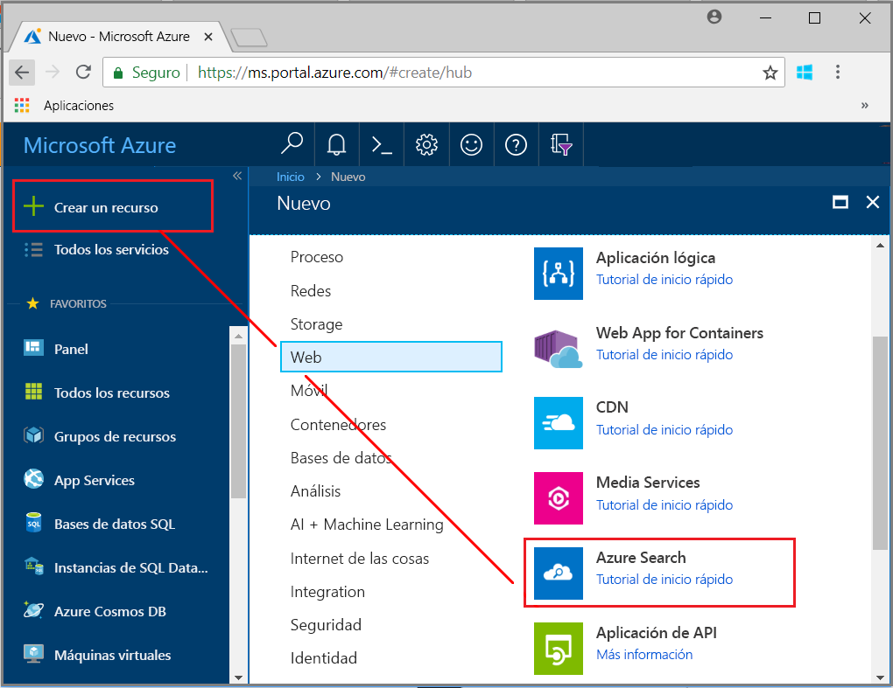
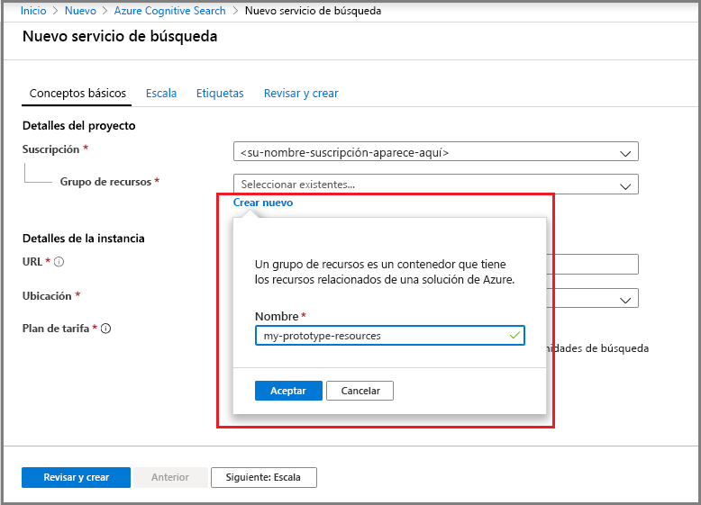
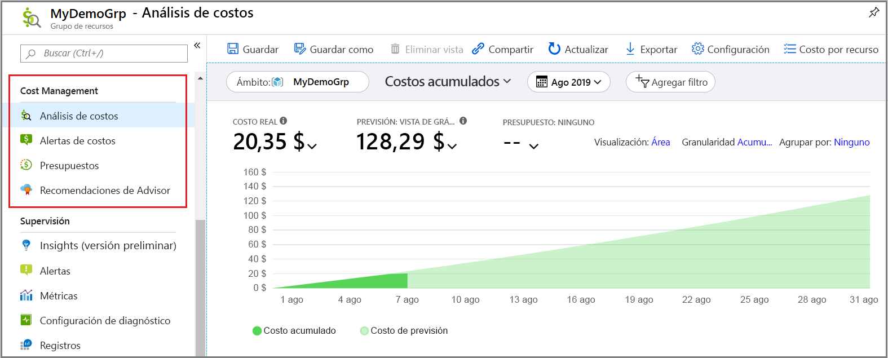
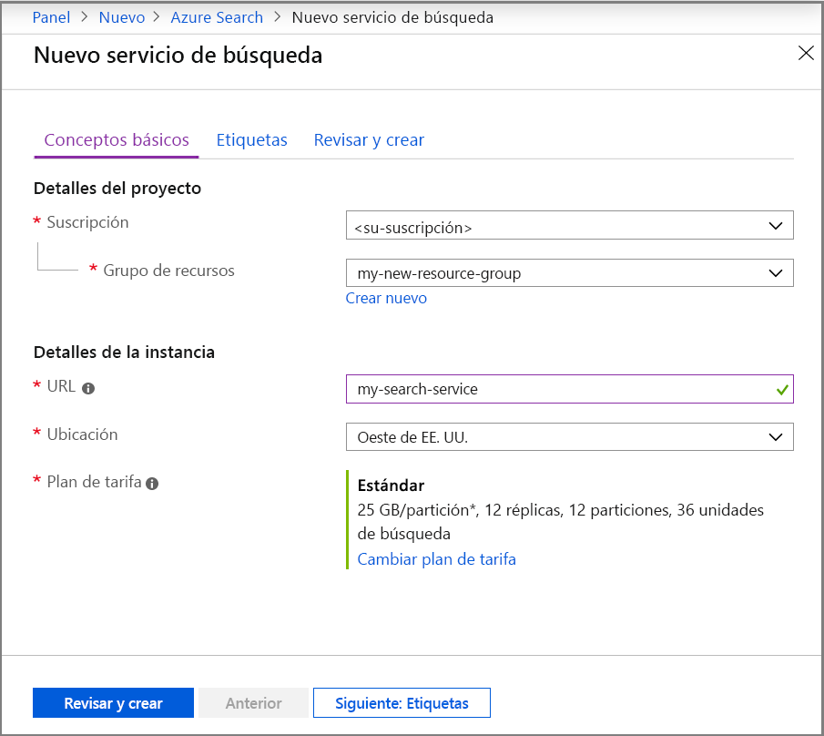
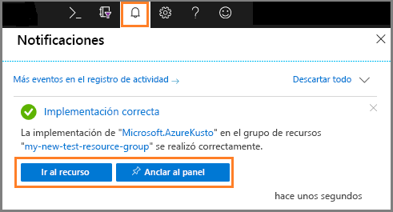
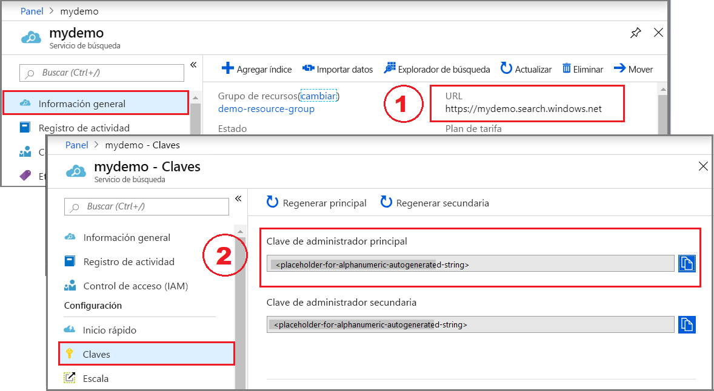
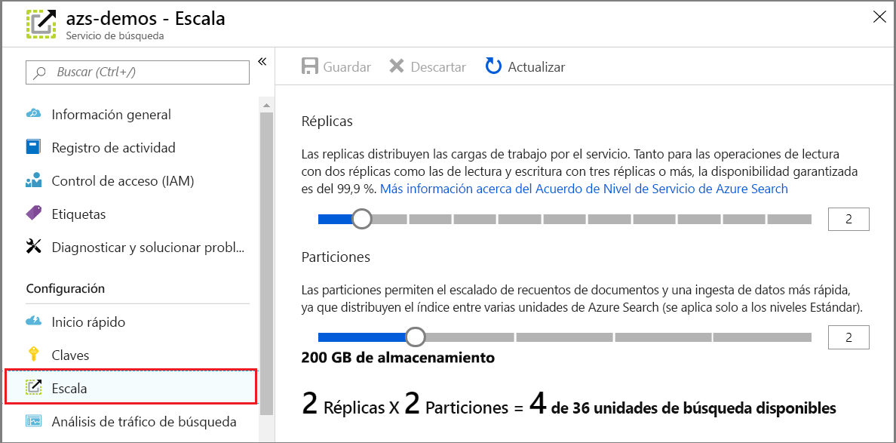

# Inicio rápido: Creación de un servicio Azure Cognitive Search en el portal

Azure Cognitive Search es un recurso independiente que se usa para agregar una experiencia de búsqueda a las aplicaciones personalizadas. Se integra fácilmente con otros servicios de Azure, con aplicaciones de servidores de red o con software que se ejecuta en otras plataformas de la nube.

En este artículo, aprenderá a crear un recurso en [Azure Portal](https://portal.azure.com/).

¿Prefiere PowerShell? Use la [plantilla de servicio](https://azure.microsoft.com/resources/templates/101-azure-search-create/) de Azure Resource Manager. Para obtener ayuda para empezar, consulte [Administración de Azure Cognitive Search con PowerShell](search-manage-powershell.md).

## Suscripción (gratuita o de pago)

[Abra una cuenta gratuita de Azure ](https://azure.microsoft.com/pricing/free-trial/?WT.mc_id=A261C142F) y use créditos gratuitos para probar servicios de pago de Azure. Cuando se consuman los créditos, mantenga la cuenta y siga usando servicios de Azure gratuitos, como Websites. No se le realizará ningún cargo en su tarjeta de crédito a menos que cambie explícitamente la configuración y lo solicite.

Opcionalmente, [puede activar los beneficios de suscriptores de MSDN](https://azure.microsoft.com/pricing/member-offers/msdn-benefits-details/?WT.mc_id=A261C142F). Una suscripción a MSDN le proporciona créditos todos los meses que puede usar para servicios de Azure de pago. 

## Búsqueda de Azure Cognitive Search

1. Inicie sesión en [Azure Portal](https://portal.azure.com/).
2. Haga clic en el signo más ("+ Crear recurso") en la esquina superior izquierda.
3. Escriba "Azure Cognitive Search" en la barra de búsqueda o vaya al recurso a través de **Web** > **Azure Cognitive Search**.

## Elija una suscripción

Si tiene más de una suscripción, elija una para el servicio de búsqueda.

## Configuración de un grupo de recursos

Un grupo de recursos es un contenedor que almacena los recursos relacionados con una solución de Azure. Es obligatorio para el servicio de búsqueda. También es útil para administrar todos los recursos, incluidos los costos. Un grupo de recursos puede estar formado por un servicio, o bien por varios servicios que se usen de forma conjunta. Por ejemplo, si usa Azure Cognitive Search para indexar una base de datos de Azure Cosmos DB, puede hacer que ambos servicios formen parte de un mismo grupo de recursos con fines de administración. 

Si no combina recursos para formar un solo grupo o si los grupos de recursos existentes se rellenan con los recursos usados en soluciones no relacionadas, cree un grupo de recursos solo para su recurso de Azure Cognitive Search. 

Con el tiempo, puede realizar un seguimiento de todos los costos actuales y previstos, o bien puede ver los cargos de los recursos individuales. En la captura de pantalla siguiente se muestra el tipo de información de costos que puede esperar ver al combinar varios recursos en un solo grupo.

> [!TIP]
> Los grupos de recursos simplifican la limpieza porque, al eliminar uno de ellos, se eliminan también todos los servicios que contiene. En el caso de proyectos de prototipo que usan muchos servicios, si se ponen todos ellos en el mismo grupo de recursos, la limpieza resulta más fácil después de que el proyecto ha finalizado.

## Asignación de un nombre al servicio

En Detalles de la instancia, proporcione un nombre de servicio en el campo **URL**. Un nombre de servicio forma parte del punto de conexión de la dirección URL con que se emiten llamadas API: `https://your-service-name.search.windows.net`. Por ejemplo, si quiere que el punto de conexión sea `https://myservice.search.windows.net`, debe escribir `myservice`.

Requisitos de nombre de servicio:

* Debe ser único dentro del espacio de nombres search.windows.net.
* Debe tener una longitud que oscile entre 2 y 60 caracteres.
* Se deben usar letras minúsculas, números o guiones ("-").
* No se deben usar guiones ("-") en los dos primeros caracteres ni en el último.
* No se pueden usar guiones consecutivos ("--").

> [!TIP]
> Si piensa que va a usar varios servicios, le recomendamos que incluya la región (o ubicación) en el nombre del servicio como una convención de nomenclatura. Los servicios que estén en la misma región pueden intercambiar datos sin costo alguno; por lo que, si Azure Cognitive Search se encuentra en la región Oeste de EE. UU. y tiene otros servicios en esta misma región, si usa un nombre como `mysearchservice-westus`, no tendrá que ir a la página de propiedades al decidir cómo combinar o conectar recursos.

## Selección de una ubicación

Al ser un servicio de Azure, Azure Cognitive Search se puede hospedar en centros de datos de todo el mundo. Se puede encontrar la lista de regiones admitidas en la [página de precios](https://azure.microsoft.com/pricing/details/search/). 

Para minimizar o evitar los cargos por uso de ancho de banda, seleccione la misma ubicación para varios servicios. Por ejemplo, si indexa los datos que proporciona otro servicio de Azure (Azure Storage, Azure Cosmos DB o Azure SQL Database), al crear el servicio Azure Cognitive Search en la misma región, evitará los cargos por uso de ancho de banda (no se producen cargos por datos de salida cuando los servicios se encuentran en la misma región).

Si usa el enriquecimiento con IA, cree el servicio de búsqueda en la misma región que Cognitive Services. *La coubicación de Azure Cognitive Search y Cognitive Services en la misma región es un requisito para el enriquecimiento con inteligencia artificial*.

> [!Note]
> Los nuevos servicios no están disponibles actualmente en Centro de la India. En el caso de los servicios que ya están en Centro de la India, puede escalar verticalmente sin restricciones, y el servicio se admite completamente en dicha región. La restricción en esta región es temporal y se limita solo a los nuevos servicios. Se eliminará esta nota cuando ya no se aplique la restricción.

## Selección de un plan de tarifa (SKU)

[Azure Cognitive Search se ofrece actualmente en varios planes de tarifa](https://azure.microsoft.com/pricing/details/search/): Gratis, Básico o Estándar. Cada plan tiene su propia [capacidad y sus propios límites](search-limits-quotas-capacity.md). Consulte [Selección SKU o plan de tarifa](search-sku-tier.md) para obtener instrucciones.

Básico y Estándar son las opciones más comunes para las cargas de trabajo de producción, pero la mayoría de los clientes empiezan con el servicio gratuito. Las diferencias principales entre los niveles son el tamaño y la velocidad de las particiones, así como los límites en el número de objetos que se pueden crear.

Recuerde que una vez que se crea el servicio, el plan de tarifa no se puede cambiar. Si necesita un nivel superior o inferior, deberá volver a crear el servicio.

## Creación del servicio

Después de proporcionar los datos necesarios, ya puede crear el servicio. 

El servicio se implementa en cuestión de minutos. El progreso se puede supervisar mediante las notificaciones de Azure. Considere la posibilidad de anclar el servicio al panel para facilitar el acceso en el futuro.

## Obtención de una clave y un punto de conexión de dirección URL

Excepto en el caso de que use el portal, para acceder mediante programación al nuevo servicio, tendrá que especificar el punto de conexión de la dirección URL y una clave de API de autenticación.

1. En la página **Información general**, busque y copie el punto de conexión de dirección URL en el lado derecho de la página.

2. En la página **Claves**, copie una de las claves de administración (son equivalentes). Las claves de API de administrador son necesarias para crear, actualizar y eliminar objetos en el servicio. Por el contrario, las claves de consulta proporcionan acceso de lectura al contenido del índice.

   

Para las tareas basadas en el portal, no se necesita un punto de conexión y una clave. El portal ya está vinculado a un recurso de Azure Cognitive Search con derechos de administrador. Para un tutorial del portal, empiece por [Inicio rápido: Creación de un índice de Azure Cognitive Search en el portal](search-get-started-portal.md).

## Escalar el servicio

Después de aprovisionado el servicio, se puede escalar para satisfacer sus necesidades. Si ha elegido el nivel Estándar para el servicio Azure Cognitive Search, puede escalar el servicio en dos dimensiones: réplicas y particiones. Si ha elegido el nivel Básico, solo puede agregar réplicas. Si ha aprovisionado el servicio gratuito, el escalado no está disponible.

Las ***particiones*** permiten que el servicio almacene y busque en más documentos.

Las ***réplicas*** permiten al servicio administrar una carga más elevada de consultas de búsqueda.

La incorporación de recursos aumenta la factura mensual. La [calculadora de precios](https://azure.microsoft.com/pricing/calculator/) puede ayudarle a entender cómo repercute la incorporación de recursos en la facturación. Recuerde que puede ajustar los recursos en base a la carga. Por ejemplo, puede aumentar los recursos para crear un índice inicial completo y luego reducir los recursos más adelante a un nivel más adecuado para la indexación incremental.

> [!Important]
> Un servicio debe tener [2 réplicas para SLA de solo lectura y 3 réplicas para SLA de lectura y escritura](https://azure.microsoft.com/support/legal/sla/search/v1_0/).

1. Vaya a la página del servicio de búsqueda de Azure Portal.
2. En el panel de navegación de la izquierda, seleccione **Configuración** > **Escala**.
3. Use la barra deslizante para agregar recursos de cualquier tipo.

> [!Note]
> El almacenamiento y velocidad por partición aumenta en los niveles más altos. Para más información, consulte [capacidad y límites](search-limits-quotas-capacity.md).

## Cuándo se debe agregar un segundo servicio

La mayoría de los clientes usan un solo servicio aprovisionado en un nivel que proporciona el [equilibrio de recursos adecuado](search-sku-tier.md). Un servicio puede hospedar varios índices en función de los [límites máximos de la capa que seleccione](search-capacity-planning.md), con cada índice aislado del otro. En Azure Cognitive Search, las solicitudes solo se podrán dirigir a un índice, lo que reduce al máximo la posibilidad de que se recuperen datos de forma voluntaria o involuntaria d otros índices en el mismo servicio.

Aunque la mayoría de los clientes usan un solo servicio, la redundancia de servicios puede ser necesaria si los requisitos operativos son los siguientes:

* Recuperación ante desastres (interrupción del centro de datos). Azure Cognitive Search no proporciona conmutación por error instantánea si se produce una interrupción del servicio. Para obtener recomendaciones e instrucciones, consulte el artículo sobre [administración de servicios](search-manage.md).
* La investigación del modelado de la arquitectura multiempresa ha determinado que los servicios adicionales es el diseño óptimo. Para obtener más información, consulte el artículo sobre [diseño para multiempresa](search-modeling-multitenant-saas-applications.md).
* Para las aplicaciones implementadas globalmente, es posible que necesite una instancia de Azure Cognitive Search en varias regiones para minimizar la latencia del tráfico internacional de la aplicación.

> [!NOTE]
> En Azure Cognitive Search, no es posible separar las operaciones de indexación y consulta; por consiguiente, no cree varios servicios para cargas de trabajo separadas. Un índice siempre se consulta en el servicio donde se creó (no se puede crear un índice en un servicio y copiar en otro).

No se requiere un segundo servicio para lograr alta disponibilidad. La alta disponibilidad en las consultas se logra al usar 2 o más réplicas en el mismo servicio. Las actualizaciones de réplicas son secuenciales, lo que significa que, al menos, una es operativa cuando se implementa una actualización de servicio. Para obtener más información, consulte [Acuerdos de Nivel de Servicio](https://azure.microsoft.com/support/legal/sla/search/v1_0/).

## Pasos siguientes

Después de aprovisionar un servicio, puede continuar en el portal para crear el primer índice.

> [!div class="nextstepaction"]
> [Inicio rápido: Creación de un índice de Azure Cognitive Search en el portal](search-get-started-portal.md)
