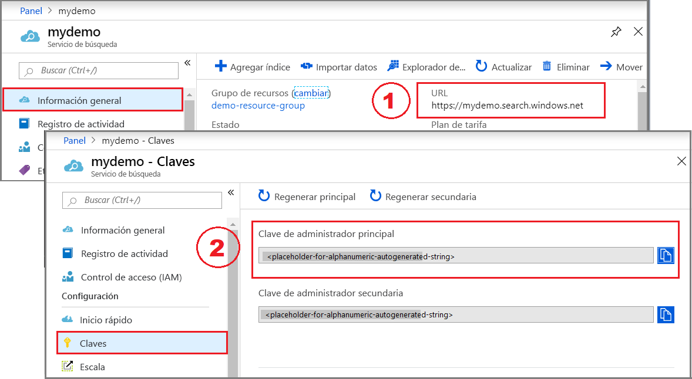

# <a name="quickstart-create-an-azure-cognitive-search-index-in-c-using-the-net-sdk"></a>Inicio rápido: Creación de un índice de Azure Cognitive Search en C# mediante el SDK de .NET
> [!div class="op_single_selector"]
> * [C#](search-get-started-dotnet.md)
> * [Portal](search-get-started-portal.md)
> * [PowerShell](search-create-index-rest-api.md)
> * [Python](search-get-started-python.md)
> * [Postman](search-get-started-postman.md)
>*

Cree una aplicación de consola en C# de .NET Core que cree, cargue y consulte un índice de Azure Cognitive Search mediante Visual Studio y el [SDK de .NET de Azure Cognitive Search](https://aka.ms/search-sdk). En este artículo se explica cómo crear la aplicación paso a paso. Como alternativa, puede [descargar y ejecutar la aplicación completa](https://github.com/Azure-Samples/azure-search-dotnet-samples/tree/master/Quickstart).

Si no tiene una suscripción a Azure, cree una [cuenta gratuita](https://azure.microsoft.com/free/?WT.mc_id=A261C142F) antes de empezar.

> [!NOTE]
> En aras de la simplicidad, el código de demostración de este artículo usa los métodos sincrónicos del SDK de .NET de Azure Cognitive Search. De todas formas, para escenarios de producción en sus propias aplicaciones, se recomienda que use métodos asincrónicos para mantener su escalabilidad y capacidad de respuesta. Por ejemplo, podría utilizar `CreateAsync` y `DeleteAsync` en lugar de `Create` y `Delete`.

## <a name="prerequisites"></a>Prerrequisitos

Para este inicio rápido, se requieren los siguientes servicios y herramientas.

+ [Visual Studio](https://visualstudio.microsoft.com/downloads/), cualquier edición. Se han probado código de ejemplo e instrucciones en la edición Community Edition gratuita.

+ [Cree un servicio Azure Cognitive Search](search-create-service-portal.md) o [busque uno existente](https://ms.portal.azure.com/#blade/HubsExtension/BrowseResourceBlade/resourceType/Microsoft.Search%2FsearchServices) en su suscripción actual. Puede usar un servicio gratuito para este inicio rápido.

<a name="get-service-info"></a>

## <a name="get-a-key-and-url"></a>Obtención de una clave y una dirección URL

Las llamadas al servicio requieren un punto de conexión de URL y una clave de acceso en cada solicitud. Con ambos se crea un servicio de búsqueda, por lo que, si ha agregado Azure Cognitive Search a su suscripción, siga estos pasos para obtener la información necesaria:

1. [Inicie sesión en Azure Portal](https://portal.azure.com/) y en la página **Introducción** del servicio de búsqueda, obtenga la dirección URL. Un punto de conexión de ejemplo podría ser similar a `https://mydemo.search.windows.net`.

2. En **Configuración** > **Claves**, obtenga una clave de administrador para tener derechos completos en el servicio. Se proporcionan dos claves de administrador intercambiables para lograr la continuidad empresarial, por si necesitara sustituir una de ellas. Puede usar la clave principal o secundaria en las solicitudes para agregar, modificar y eliminar objetos.

   Obtenga también la clave de consulta. Es una práctica recomendada emitir solicitudes de consulta con acceso de solo lectura.



Todas las solicitudes requieren una clave de API en cada solicitud enviada al servicio. Tener una clave válida genera la confianza, solicitud a solicitud, entre la aplicación que envía la solicitud y el servicio que se encarga de ella.

## <a name="set-up-your-environment"></a>Configurar el entorno

Para comenzar, abra Visual Studio y cree un nuevo proyecto de Aplicación de consola que pueda ejecutarse en .NET Core.

### <a name="install-nuget-packages"></a>Instalación de paquetes NuGet

El [SDK de .NET de Azure Cognitive Search](https://aka.ms/search-sdk) consta de varias bibliotecas cliente que se distribuyen como paquetes de NuGet.

Para este proyecto, utilice la versión 9 del `Microsoft.Azure.Search`paquete NuGet y la versión más reciente del `Microsoft.Extensions.Configuration.Json` paquete NuGet.

1. En **Herramientas** > **Administrador de paquetes NuGet** seleccione **Administrar paquetes NuGet para la solución....** . 

1. Haga clic en **Examinar**.

1. Busque `Microsoft.Azure.Search` y seleccione la versión 9.0.1 o posterior.

1. Haga clic a la derecha en **Instalar**para agregar el ensamblado al proyecto y la solución.

1. Repita el proceso para `Microsoft.Extensions.Configuration.Json`, seleccione la versión 2.2.0 o posterior.


### <a name="add-azure-cognitive-search-service-information"></a>Incorporación de información del servicio Azure Cognitive Search

1. En el Explorador de soluciones, haga clic con el botón derecho en el proyecto y seleccione **Agregar** > **Nuevo elemento...** 

1. En Agregar nuevo elemento, busque "JSON" para que se devuelva una lista relacionada con JSON de tipos de elemento.

1. Elija **archivo JSON**, asigne el nombre "appsettings.json" y haga clic en **Agregar**. 

1. Agregue el archivo al directorio de salida. Haga clic con el botón derecho en appsettings.json y seleccione **Propiedades**. En **Copiar en el directorio de salida** seleccione **Copiar si es posterior**.

1. Copie el siguiente JSON en el nuevo archivo JSON. Reemplace el nombre del servicio de búsqueda (YOUR-SEARCH-SERVICE-NAME) y la clave de API de administración (YOUR-ADMIN-API-KEY) por los valores apropiados. Si el punto de conexión de servicio es `https://mydemo.search.windows.net`, el nombre del servicio será "mydemo".

```json
{
  "SearchServiceName": "<YOUR-SEARCH-SERVICE-NAME>",
  "SearchServiceAdminApiKey": "<YOUR-ADMIN-API-KEY>",
  "SearchIndexName": "hotels-quickstart"
}
```

### <a name="add-class-method-files-to-your-project"></a>Incorporación de los archivos ".Method" de clase al proyecto

Al imprimir los resultados de la ventana de consola, los campos individuales del objeto Hotel tienen que devolverse como cadenas. Puede implementar [ToString()](https://docs.microsoft.com/dotnet/api/system.object.tostring?view=netframework-4.8) para realizar esta tarea, mediante la copia del código necesario en dos nuevos archivos.

1. Agregue dos definiciones de clase vacías al proyecto: Address.Methods.cs, Hotel.Methods.cs

1. En Address.Methods.cs, sobrescriba el contenido predeterminado con el código que encontrará en las [líneas 1-32](https://github.com/Azure-Samples/azure-search-dotnet-samples/blob/master/Quickstart/AzureSearchQuickstart/Address.Methods.cs/#L1-L32).

1. En Hotel.Methods.cs, copie las [líneas 1-66](https://github.com/Azure-Samples/azure-search-dotnet-samples/blob/master/Quickstart/AzureSearchQuickstart/Hotel.Methods.cs/#L1-L66).


## <a name="1---create-index"></a>1 - Creación de un índice

El índice de hoteles se compone de campos sencillos y complejos, donde un campo sencillo es "HotelName" o "Description" y un campo complejo es una dirección con subcampos, o una colección de habitaciones. Cuando un índice incluye tipos complejos, aísle las definiciones de campo complejas en clases independientes.

1. Agregue dos definiciones de clase vacías al proyecto: Address.cs, Hotel.cs

1. En Address.Methods.cs, sobrescriba el contenido predeterminado con el código siguiente:

    ```csharp
    using System;
    using Microsoft.Azure.Search;
    using Microsoft.Azure.Search.Models;
    using Newtonsoft.Json;

    namespace AzureSearchQuickstart
    {
        public partial class Address
        {
            [IsSearchable]
            public string StreetAddress { get; set; }

            [IsSearchable, IsFilterable, IsSortable, IsFacetable]
            public string City { get; set; }

            [IsSearchable, IsFilterable, IsSortable, IsFacetable]
            public string StateProvince { get; set; }

            [IsSearchable, IsFilterable, IsSortable, IsFacetable]
            public string PostalCode { get; set; }

            [IsSearchable, IsFilterable, IsSortable, IsFacetable]
            public string Country { get; set; }
        }
    }
    ```

1. En Hotel.cs, la clase define la estructura general del índice, incluidas las referencias a la clase de dirección.

    ```csharp
    namespace AzureSearchQuickstart
    {
        using System;
        using Microsoft.Azure.Search;
        using Microsoft.Azure.Search.Models;
        using Newtonsoft.Json;

        public partial class Hotel
        {
            [System.ComponentModel.DataAnnotations.Key]
            [IsFilterable]
            public string HotelId { get; set; }

            [IsSearchable, IsSortable]
            public string HotelName { get; set; }

            [IsSearchable]
            [Analyzer(AnalyzerName.AsString.EnMicrosoft)]
            public string Description { get; set; }

            [IsSearchable]
            [Analyzer(AnalyzerName.AsString.FrLucene)]
            [JsonProperty("Description_fr")]
            public string DescriptionFr { get; set; }

            [IsSearchable, IsFilterable, IsSortable, IsFacetable]
            public string Category { get; set; }

            [IsSearchable, IsFilterable, IsFacetable]
            public string[] Tags { get; set; }

            [IsFilterable, IsSortable, IsFacetable]
            public bool? ParkingIncluded { get; set; }

            [IsFilterable, IsSortable, IsFacetable]
            public DateTimeOffset? LastRenovationDate { get; set; }

            [IsFilterable, IsSortable, IsFacetable]
            public double? Rating { get; set; }

            public Address Address { get; set; }
        }
    }
    ```

    Los atributos del campo determinan cómo se utilizan en una aplicación. Por ejemplo, el atributo `IsSearchable` se debe asignar a todos los campos que deben incluirse en una búsqueda de texto completo. 
    
    > [!NOTE]
    > En el SDK de .NET, los campos se deben atribuir explícitamente como [`IsSearchable`](https://docs.microsoft.com/dotnet/api/microsoft.azure.search.models.field.issearchable?view=azure-dotnet), [`IsFilterable`](https://docs.microsoft.com/dotnet/api/microsoft.azure.search.models.field.isfilterable?view=azure-dotnet), [`IsSortable`](https://docs.microsoft.com/dotnet/api/microsoft.azure.search.models.field.issortable?view=azure-dotnet) y [`IsFacetable`](https://docs.microsoft.com/dotnet/api/microsoft.azure.search.models.field.isfacetable?view=azure-dotnet). Este comportamiento contrasta con la API REST que habilita implícitamente la atribución basada en el tipo de datos (por ejemplo, los campos de cadena sencilla se pueden buscar automáticamente).

    Solamente un campo en el tipo de índice `string` tiene que ser el campo *clave* que identifica de forma exclusiva cada documento. En este esquema, la clave es `HotelId`.

    En este índice, los campos de descripción usan la propiedad opcional [`analyzer`](https://docs.microsoft.com/dotnet/api/microsoft.azure.search.models.field.analyzer?view=azure-dotnet) que se especifica cuando quiere reemplazar el analizador de Lucene estándar predeterminado. El campo `description_fr` está usando el analizador de Lucene de francés ([FrLucene](https://docs.microsoft.com/dotnet/api/microsoft.azure.search.models.analyzername.frlucene?view=azure-dotnet)) ya que almacena el texto en francés. `description` está usando el analizador de idioma de Microsoft opcional ([EnMicrosoft](https://docs.microsoft.com/dotnet/api/microsoft.azure.search.models.analyzername.enmicrosoft?view=azure-dotnet)).

1. En Program.cs, cree una instancia de la clase [`SearchServiceClient`](https://docs.microsoft.com/dotnet/api/microsoft.azure.search.searchserviceclient?view=azure-dotnet) para conectarse al servicio, con los valores que están almacenados en el archivo de configuración de la aplicación (appsettings.json). 

   `SearchServiceClient` tiene una propiedad [`Indexes`](https://docs.microsoft.com/dotnet/api/microsoft.azure.search.searchserviceclient.indexes?view=azure-dotnet), lo que proporciona todos los métodos necesarios para crear, enumerar, actualizar o eliminar índices de Azure Cognitive Search. 

    ```csharp
    using System;
    using System.Linq;
    using System.Threading;
    using Microsoft.Azure.Search;
    using Microsoft.Azure.Search.Models;
    using Microsoft.Extensions.Configuration;

    namespace AzureSearchQuickstart
    {
        class Program
            // Demonstrates index delete, create, load, and query
            // Commented-out code is uncommented in later steps
            static void Main(string[] args)
            {
                IConfigurationBuilder builder = new ConfigurationBuilder().AddJsonFile("appsettings.json");
                IConfigurationRoot configuration = builder.Build();

                SearchServiceClient serviceClient = CreateSearchServiceClient(configuration);

                string indexName = configuration["SearchIndexName"];

                Console.WriteLine("{0}", "Deleting index...\n");
                DeleteIndexIfExists(indexName, serviceClient);

                Console.WriteLine("{0}", "Creating index...\n");
                CreateIndex(indexName, serviceClient);

                // Uncomment next 3 lines in "2 - Load documents"
                // ISearchIndexClient indexClient = serviceClient.Indexes.GetClient(indexName);
                // Console.WriteLine("{0}", "Uploading documents...\n");
                // UploadDocuments(indexClient);

                // Uncomment next 2 lines in "3 - Search an index"
                // Console.WriteLine("{0}", "Searching index...\n");
                // RunQueries(indexClient);

                Console.WriteLine("{0}", "Complete.  Press any key to end application...\n");
                Console.ReadKey();
            }

            // Create the search service client
            private static SearchServiceClient CreateSearchServiceClient(IConfigurationRoot configuration)
            {
                string searchServiceName = configuration["SearchServiceName"];
                string adminApiKey = configuration["SearchServiceAdminApiKey"];

                SearchServiceClient serviceClient = new SearchServiceClient(searchServiceName, new SearchCredentials(adminApiKey));
                return serviceClient;
            }

            // Delete an existing index to reuse its name
            private static void DeleteIndexIfExists(string indexName, SearchServiceClient serviceClient)
            {
                if (serviceClient.Indexes.Exists(indexName))
                {
                    serviceClient.Indexes.Delete(indexName);
                }
            }

            // Create an index whose fields correspond to the properties of the Hotel class.
            // The Address property of Hotel will be modeled as a complex field.
            // The properties of the Address class in turn correspond to sub-fields of the Address complex field.
            // The fields of the index are defined by calling the FieldBuilder.BuildForType() method.
            private static void CreateIndex(string indexName, SearchServiceClient serviceClient)
            {
                var definition = new Index()
                {
                    Name = indexName,
                    Fields = FieldBuilder.BuildForType<Hotel>()
                };

                serviceClient.Indexes.Create(definition);
            }
        }
    }    
    ```

    Debe intentar, si es posible, compartir una única instancia de `SearchServiceClient` en la aplicación para evitar la apertura de un número excesivo de conexiones. Los métodos de clase son seguros para subprocesos lo que permite habilitar este tipo de uso compartido.

   Esta clase tiene varios constructores. El que desea tiene el nombre del servicio de búsqueda y un objeto `SearchCredentials` como parámetros. `SearchCredentials` incluye su clave de API.

    En la definición de índice, la manera más fácil de crear los objetos `Field` es mediante la llamada al método `FieldBuilder.BuildForType`, pasando una clase de modelo para el parámetro de tipo. Una clase de modelo tiene propiedades que se asignan a los campos del índice. Esta asignación le permite enlazar documentos del índice de búsqueda con las instancias de la clase de modelo.

    > [!NOTE]
    > Si no tiene pensado usar una clase de modelo, todavía puede definir el índice mediante la creación de objetos `Field` directamente. Puede proporcionar el nombre del campo en el constructor, junto con el tipo de datos (o el analizador de campos de cadena). También puede establecer otras propiedades, como `IsSearchable` o `IsFilterable`, por nombrar algunas.
    >

1. Presione F5 para compilar la aplicación y crear el índice. 

    Si el proyecto se compila correctamente, se abre una ventana de consola, que escribe mensajes de estado en la pantalla para eliminar y crear el índice. 

<a name="load-documents"></a>

## <a name="2---load-documents"></a>2 - Carga de documentos

En Azure Cognitive Search, los documentos son estructuras de datos que se pueden usar como entradas para la indexación y como salidas de las consultas. Tal como se obtienen del origen de datos externo, las entradas de documento pueden ser las filas de una base de datos, los blobs en Blob Storage o documentos JSON en el disco. En este ejemplo vamos a atajar e insertaremos los documentos JSON para cuatro hoteles en el propio código. 

Al cargar documentos, tiene que usar un objeto [`IndexBatch`](https://docs.microsoft.com/dotnet/api/microsoft.azure.search.models.indexbatch?view=azure-dotnet). `IndexBatch` contiene una colección de objetos [`IndexAction`](https://docs.microsoft.com/dotnet/api/microsoft.azure.search.models.indexaction?view=azure-dotnet), cada uno de los cuales contiene un documento y una propiedad que indica a Azure Cognitive Search la acción que debe realizar ([carga, combinación, eliminación y mergeOrUpload](search-what-is-data-import.md#indexing-actions)).

1. En Program.cs, cree una matriz de documentos y las acciones de índice y, a continuación, pase la matriz a `IndexBatch`. Los siguientes documentos se ajustan al índice hotel-quickstart, tal como se define mediante las clases de hotel y dirección.

    ```csharp
    // Upload documents as a batch
    private static void UploadDocuments(ISearchIndexClient indexClient)
    {
        var actions = new IndexAction<Hotel>[]
        {
            IndexAction.Upload(
                new Hotel()
                {
                    HotelId = "1",
                    HotelName = "Secret Point Motel",
                    Description = "The hotel is ideally located on the main commercial artery of the city in the heart of New York. A few minutes away is Time's Square and the historic centre of the city, as well as other places of interest that make New York one of America's most attractive and cosmopolitan cities.",
                    DescriptionFr = "L'hôtel est idéalement situé sur la principale artère commerciale de la ville en plein cœur de New York. A quelques minutes se trouve la place du temps et le centre historique de la ville, ainsi que d'autres lieux d'intérêt qui font de New York l'une des villes les plus attractives et cosmopolites de l'Amérique.",
                    Category = "Boutique",
                    Tags = new[] { "pool", "air conditioning", "concierge" },
                    ParkingIncluded = false,
                    LastRenovationDate = new DateTimeOffset(1970, 1, 18, 0, 0, 0, TimeSpan.Zero),
                    Rating = 3.6,
                    Address = new Address()
                    {
                        StreetAddress = "677 5th Ave",
                        City = "New York",
                        StateProvince = "NY",
                        PostalCode = "10022",
                        Country = "USA"
                    }
                }
            ),
            IndexAction.Upload(
                new Hotel()
                {
                    HotelId = "2",
                    HotelName = "Twin Dome Motel",
                    Description = "The hotel is situated in a  nineteenth century plaza, which has been expanded and renovated to the highest architectural standards to create a modern, functional and first-class hotel in which art and unique historical elements coexist with the most modern comforts.",
                    DescriptionFr = "L'hôtel est situé dans une place du XIXe siècle, qui a été agrandie et rénovée aux plus hautes normes architecturales pour créer un hôtel moderne, fonctionnel et de première classe dans lequel l'art et les éléments historiques uniques coexistent avec le confort le plus moderne.",
                    Category = "Boutique",
                    Tags = new[] { "pool", "free wifi", "concierge" },
                    ParkingIncluded = false,
                    LastRenovationDate =  new DateTimeOffset(1979, 2, 18, 0, 0, 0, TimeSpan.Zero),
                    Rating = 3.60,
                    Address = new Address()
                    {
                        StreetAddress = "140 University Town Center Dr",
                        City = "Sarasota",
                        StateProvince = "FL",
                        PostalCode = "34243",
                        Country = "USA"
                    }
                }
            ),
            IndexAction.Upload(
                new Hotel()
                {
                    HotelId = "3",
                    HotelName = "Triple Landscape Hotel",
                    Description = "The Hotel stands out for its gastronomic excellence under the management of William Dough, who advises on and oversees all of the Hotel’s restaurant services.",
                    DescriptionFr = "L'hôtel est situé dans une place du XIXe siècle, qui a été agrandie et rénovée aux plus hautes normes architecturales pour créer un hôtel moderne, fonctionnel et de première classe dans lequel l'art et les éléments historiques uniques coexistent avec le confort le plus moderne.",
                    Category = "Resort and Spa",
                    Tags = new[] { "air conditioning", "bar", "continental breakfast" },
                    ParkingIncluded = true,
                    LastRenovationDate = new DateTimeOffset(2015, 9, 20, 0, 0, 0, TimeSpan.Zero),
                    Rating = 4.80,
                    Address = new Address()
                    {
                        StreetAddress = "3393 Peachtree Rd",
                        City = "Atlanta",
                        StateProvince = "GA",
                        PostalCode = "30326",
                        Country = "USA"
                    }
                }
            ),
            IndexAction.Upload(
                new Hotel()
                {
                    HotelId = "4",
                    HotelName = "Sublime Cliff Hotel",
                    Description = "Sublime Cliff Hotel is located in the heart of the historic center of Sublime in an extremely vibrant and lively area within short walking distance to the sites and landmarks of the city and is surrounded by the extraordinary beauty of churches, buildings, shops and monuments. Sublime Cliff is part of a lovingly restored 1800 palace.",
                    DescriptionFr = "Le sublime Cliff Hotel est situé au coeur du centre historique de sublime dans un quartier extrêmement animé et vivant, à courte distance de marche des sites et monuments de la ville et est entouré par l'extraordinaire beauté des églises, des bâtiments, des commerces et Monuments. Sublime Cliff fait partie d'un Palace 1800 restauré avec amour.",
                    Category = "Boutique",
                    Tags = new[] { "concierge", "view", "24-hour front desk service" },
                    ParkingIncluded = true,
                    LastRenovationDate = new DateTimeOffset(1960, 2, 06, 0, 0, 0, TimeSpan.Zero),
                    Rating = 4.6,
                    Address = new Address()
                    {
                        StreetAddress = "7400 San Pedro Ave",
                        City = "San Antonio",
                        StateProvince = "TX",
                        PostalCode = "78216",
                        Country = "USA"
                    }
                }
            ),
        };

        var batch = IndexBatch.New(actions);

        try
        {
            indexClient.Documents.Index(batch);
        }
        catch (IndexBatchException e)
        {
            // When a service is under load, indexing might fail for some documents in the batch. 
            // Depending on your application, you can compensate by delaying and retrying. 
            // For this simple demo, we just log the failed document keys and continue.
            Console.WriteLine(
                "Failed to index some of the documents: {0}",
                String.Join(", ", e.IndexingResults.Where(r => !r.Succeeded).Select(r => r.Key)));
        }

        // Wait 2 seconds before starting queries 
        Console.WriteLine("Waiting for indexing...\n");
        Thread.Sleep(2000);
    }
    ```

    Una vez que ha inicializado el objeto `IndexBatch`, puede enviarlo al índice, para lo que debe realizar una llamada a [`Documents.Index`](https://docs.microsoft.com/dotnet/api/microsoft.azure.search.documentsoperationsextensions.index?view=azure-dotnet) en el objeto [`SearchIndexClient`](https://docs.microsoft.com/dotnet/api/microsoft.azure.search.searchindexclient?view=azure-dotnet). `Documents` es una propiedad de `SearchIndexClient` que proporciona métodos para agregar, modificar, eliminar o consultar documentos en el índice.

    El `try`/`catch` que rodea la llamada al método `Index` captura errores de indexación que pueden producirse si el servicio está soportando una carga intensa. En el código de producción, puede retrasar la indexación de los documentos que dieron error y volver a intentarlo, o puede crear un registro y continuar, como hace el ejemplo, o también puede adoptar otro enfoque que cumpla con los requisitos de coherencia de datos de la aplicación.

    El retraso de 2 segundos compensa por la indexación, que es asincrónica, por lo que todos los documentos se pueden indexar antes de que se ejecutan las consultas. La codificación en un retraso solo suele ser necesaria en las pruebas, demostraciones y aplicaciones de ejemplo.

1. En Program.cs, en el cuerpo principal, quite la marca de comentario de las líneas de "2 - Load documents". 

    ```csharp
    // Uncomment next 3 lines in "2 - Load documents"
    ISearchIndexClient indexClient = serviceClient.Indexes.GetClient(indexName);
    Console.WriteLine("{0}", "Uploading documents...\n");
    UploadDocuments(indexClient);
    ```
1. Presione F5 para recompilar la aplicación. 

    Si el proyecto se compila correctamente, se abre una ventana de consola, que escribe mensajes de estado, esta vez con un mensaje sobre la carga de documentos. En Azure Portal, en la página de **información general** del servicio de búsqueda, el índice de hoteles-quickstart debería tener ahora 4 documentos.

Para más información acerca del procesamiento de documentos, consulte ["Gestión de documentos del SDK de .NET"](search-howto-dotnet-sdk.md#how-dotnet-handles-documents).

## <a name="3---search-an-index"></a>3 - Búsqueda en un índice

Puede obtener resultados de consulta tan pronto como se indexe el primer documento, pero las pruebas reales del índice deben esperar hasta que todos los documentos estén indexados. 

Esta sección agrega dos funcionalidades: la lógica de consulta y los resultados. Para las consultas, utilice el método [`Search`](https://docs.microsoft.com/dotnet/api/microsoft.azure.search.documentsoperationsextensions.search?view=azure-dotnet
). Este método requiere texto de búsqueda demás de otros [parámetros](https://docs.microsoft.com/dotnet/api/microsoft.azure.search.models.searchparameters?view=azure-dotnet). 

La clase [`DocumentsSearchResult`](https://docs.microsoft.com/dotnet/api/microsoft.azure.search.models.documentsearchresult-1?view=azure-dotnet) representa los resultados.


1. En Program.cs, cree un método WriteDocuments que imprime los resultados de la búsqueda en la consola.

    ```csharp
    private static void WriteDocuments(DocumentSearchResult<Hotel> searchResults)
    {
        foreach (SearchResult<Hotel> result in searchResults.Results)
        {
            Console.WriteLine(result.Document);
        }

        Console.WriteLine();
    }
    ```

1. Cree un método RunQueries para ejecutar consultas y devolver los resultados. Los resultados son objetos de Hotel. Puede usar el parámetro select para exponer campos individuales. Si un campo no se incluye en el parámetro select, su propiedad de Hotel correspondiente será null.

    ```csharp
    private static void RunQueries(ISearchIndexClient indexClient)
    {
        SearchParameters parameters;
        DocumentSearchResult<Hotel> results;

        // Query 1 
        Console.WriteLine("Query 1: Search for term 'Atlanta' with no result trimming");
        parameters = new SearchParameters();
        results = indexClient.Documents.Search<Hotel>("Atlanta", parameters);
        WriteDocuments(results);

        // Query 2
        Console.WriteLine("Query 2: Search on the term 'Atlanta', with trimming");
        Console.WriteLine("Returning only these fields: HotelName, Tags, Address:\n");
        parameters =
            new SearchParameters()
            {
                Select = new[] { "HotelName", "Tags", "Address" },
            };
        results = indexClient.Documents.Search<Hotel>("Atlanta", parameters);
        WriteDocuments(results);

        // Query 3
        Console.WriteLine("Query 3: Search for the terms 'restaurant' and 'wifi'");
        Console.WriteLine("Return only these fields: HotelName, Description, and Tags:\n");
        parameters =
            new SearchParameters()
            {
                Select = new[] { "HotelName", "Description", "Tags" }
            };
        results = indexClient.Documents.Search<Hotel>("restaurant, wifi", parameters);
        WriteDocuments(results);

        // Query 4 -filtered query
        Console.WriteLine("Query 4: Filter on ratings greater than 4");
        Console.WriteLine("Returning only these fields: HotelName, Rating:\n");
        parameters =
            new SearchParameters()
            {
                Filter = "Rating gt 4",
                Select = new[] { "HotelName", "Rating" }
            };
        results = indexClient.Documents.Search<Hotel>("*", parameters);
        WriteDocuments(results);

        // Query 5 - top 2 results
        Console.WriteLine("Query 5: Search on term 'boutique'");
        Console.WriteLine("Sort by rating in descending order, taking the top two results");
        Console.WriteLine("Returning only these fields: HotelId, HotelName, Category, Rating:\n");
        parameters =
            new SearchParameters()
            {
                OrderBy = new[] { "Rating desc" },
                Select = new[] { "HotelId", "HotelName", "Category", "Rating" },
                Top = 2
            };
        results = indexClient.Documents.Search<Hotel>("boutique", parameters);
        WriteDocuments(results);
    }
    ```

    Hay dos [formas de hacer coincidir los términos en una consulta](search-query-overview.md#types-of-queries): búsqueda de texto completo y filtros. Una consulta de búsqueda de texto completo realiza búsquedas de uno o más términos en los campos `IsSearchable` en el índice. Un filtro es una expresión booleana que se evalúa en campos `IsFilterable` en un índice. Puede usar la búsqueda de texto completo y los filtros conjuntamente o por separado.

    Tanto los filtros como las búsquedas se realizan con el método `Documents.Search` . Se puede pasar una consulta de búsqueda en el parámetro `searchText`, mientras que una expresión de filtro se puede pasar en la propiedad `Filter` de la clase `SearchParameters`. Para filtrar sin buscar, solo tiene que pasar `"*"` al parámetro `searchText`. Para buscar sin filtrar, simplemente deje la propiedad `Filter` sin establecer, o no pase ninguna instancia de `SearchParameters`.

1. En Program.cs, en el cuerpo principal, quite la marca de comentario de las líneas de "3 - Search". 

    ```csharp
    // Uncomment next 2 lines in "3 - Search an index"
    Console.WriteLine("{0}", "Searching documents...\n");
    RunQueries(indexClient);
    ```
1. La solución ya está terminada. Presione F5 para recompilar la aplicación y ejecutar el programa en su totalidad. 

    La salida incluye los mismos mensajes que antes, a los que se suman la información de la consulta y los resultados.

## <a name="clean-up-resources"></a>Limpieza de recursos

Cuando trabaje con su propia suscripción, es una buena idea al final de un proyecto identificar si todavía se necesitan los recursos que ha creado. Los recursos que se dejan en ejecución pueden costarle mucho dinero. Puede eliminar los recursos de forma individual o eliminar el grupo de recursos para eliminar todo el conjunto de recursos.

Puede encontrar y administrar recursos en el portal, mediante el vínculo **Todos los recursos** o **Grupos de recursos** en el panel de navegación izquierdo.

Si está usando un servicio gratuito, recuerde que está limitado a tres índices, indexadores y orígenes de datos. Puede eliminar elementos individuales en el portal para mantenerse por debajo del límite. 

## <a name="next-steps"></a>Pasos siguientes

En este inicio rápido de C#, ha realizado una serie de tareas para crear un índice, cargar documentos en él y ejecutar consultas. En diferentes fases, hemos atajado para simplificar el código y mejorar la legibilidad y la comprensión. Si ya se ha familiarizado con los conceptos básicos, se recomienda el siguiente artículo para realizar una exploración de conceptos y enfoques alternativos que le permitirán profundizar en sus conocimientos. 

El código de ejemplo y el índice son versiones expandidas de este. El ejemplo siguiente agrega una colección de habitaciones, utiliza distintas clases y acciones y echa un vistazo más de cerca a cómo funciona el procesamiento.

> [!div class="nextstepaction"]
> [Procedimientos de desarrollo en .NET](search-howto-dotnet-sdk.md)