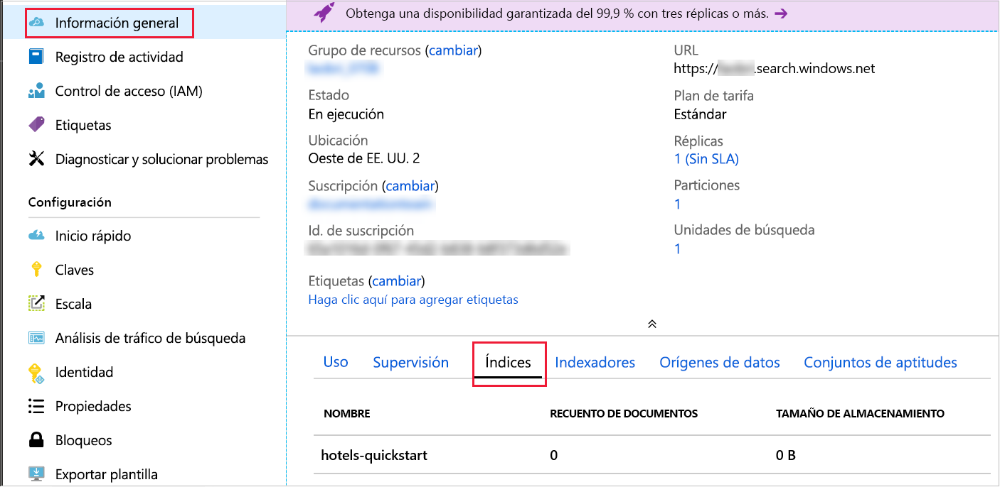

# <a name="quickstart-create-an-azure-cognitive-search-index-in-nodejs-using-rest-apis"></a>Inicio rápido: Creación de un índice de Azure Cognitive Search en Node.js mediante las API REST
> [!div class="op_single_selector"]
> * [JavaScript](search-get-started-nodejs.md)
> * [C#](search-get-started-dotnet.md)
> * [Portal](search-get-started-portal.md)
> * [PowerShell](search-create-index-rest-api.md)
> * [Python](search-get-started-python.md)
> * [Postman](search-get-started-postman.md)

Cree una aplicación de Node.js que cree, cargue y realice consultas en un índice de Azure Cognitive Search. En este artículo, se muestra cómo crear la aplicación paso a paso. También puede [descargar el código fuente y los datos](https://github.com/Azure-Samples/azure-search-javascript-samples/tree/master/quickstart/) y ejecutar la aplicación desde la línea de comandos.

Si no tiene una suscripción a Azure, cree una [cuenta gratuita](https://azure.microsoft.com/free/?WT.mc_id=A261C142F) antes de empezar.

## <a name="prerequisites"></a>Prerrequisitos

Hemos usado el software y servicios siguientes para compilar y probar este inicio rápido:

+ [Node.js](https://nodejs.org)

+ [NPM](https://www.npmjs.com) tiene que instalarse mediante Node.js

+ En este artículo, se proporcionan una estructura de índice de ejemplo y documentos coincidentes; que también se pueden obtener en el directorio [**quickstart** del repositorio](https://github.com/Azure-Samples/azure-search-javascript-samples/)

+ [Cree un servicio Azure Cognitive Search](search-create-service-portal.md) o [busque uno existente](https://ms.portal.azure.com/#blade/HubsExtension/BrowseResourceBlade/resourceType/Microsoft.Search%2FsearchServices) en su suscripción actual. Puede usar un servicio gratuito para este inicio rápido.

Se recomienda:

* [Visual Studio Code](https://code.visualstudio.com)

* Extensiones [Prettier](https://marketplace.visualstudio.com/items?itemName=esbenp.prettier-vscode) y [ESLint](https://marketplace.visualstudio.com/items?itemName=dbaeumer.vscode-eslint) para VS Code.

<a name="get-service-info"></a>

## <a name="get-keys-and-urls"></a>Obtención de claves y direcciones URL

Las llamadas al servicio requieren un punto de conexión de URL y una clave de acceso en cada solicitud. Con ambos se crea un servicio de búsqueda, por lo que, si ha agregado Azure Cognitive Search a su suscripción, siga estos pasos para obtener la información necesaria:

1. [Inicie sesión en Azure Portal](https://portal.azure.com/) y, en la página **Información general** del servicio de búsqueda, obtenga el nombre del servicio de búsqueda. Para confirmar el nombre del servicio, revise la dirección URL del punto de conexión. Si la dirección URL del punto de conexión fuera `https://mydemo.search.windows.net`, el nombre del servicio sería `mydemo`.

2. En **Configuración** > **Claves**, obtenga una clave de administrador para tener derechos completos en el servicio. Se proporcionan dos claves de administrador intercambiables para lograr la continuidad empresarial, por si necesitara sustituir una de ellas. Puede usar la clave principal o secundaria en las solicitudes para agregar, modificar y eliminar objetos.

    Obtenga también la clave de consulta. Es una práctica recomendada emitir solicitudes de consulta con acceso de solo lectura.


Todas las solicitudes enviadas al servicio necesitan una clave de API en el encabezado. Una clave válida genera la confianza, solicitud a solicitud, entre la aplicación que la envía y el servicio que se encarga de ella.

## <a name="set-up-your-environment"></a>Configurar el entorno

Para empezar, abra una consola de PowerShell u otro entorno en el que haya instalado Node.js.

1. Cree un directorio de desarrollo y asígnele el nombre `quickstart`:

    ```powershell
    mkdir quickstart
    cd quickstart
    ```

2. Ejecute `npm init` para inicializar un proyecto vacío con NPM. Acepte los valores predeterminados, excepto la licencia, que tiene que establecerse en “MIT”. 

1. Agregue los paquetes necesarios para el código y la ayuda en el desarrollo:

    ```powershell
    npm install nconf node-fetch
    npm install --save-dev eslint eslint-config-prettier eslint-config-airbnb-base eslint-plugin-import prettier
    ```

4. Para confirmar que ha configurado los proyectos y sus dependencias, asegúrese de que el archivo **package.json** sea similar al siguiente:

    ```json
    {
      "name": "quickstart",
      "version": "1.0.0",
      "description": "Azure Cognitive Search Quickstart",
      "main": "index.js",
      "scripts": {
        "test": "echo \"Error: no test specified\" && exit 1"
      },
      "keywords": [
        "Azure",
        "Azure_Search"
      ],
      "author": "Your Name",
      "license": "MIT",
      "dependencies": {
        "nconf": "^0.10.0",
        "node-fetch": "^2.6.0"
      },
      "devDependencies": {
        "eslint": "^6.1.0",
        "eslint-config-airbnb-base": "^13.2.0",
        "eslint-config-prettier": "^6.0.0",
        "eslint-plugin-import": "^2.18.2",
        "prettier": "^1.18.2"
      }
    }
    ```

5. Cree un archivo **azure_search_config.json** para guardar los datos del servicio de búsqueda:

    ```json
    {
        "serviceName" : "[SEARCH_SERVICE_NAME]",
        "adminKey" : "[ADMIN_KEY]",
        "queryKey" : "[QUERY_KEY]",
        "indexName" : "hotels-quickstart"
    }
    ```

Reemplace el valor `[SERVICE_NAME]` por el nombre del servicio de búsqueda. Reemplace `[ADMIN_KEY]` y `[QUERY_KEY]` por los valores de clave que anotó anteriormente. 

## <a name="1---create-index"></a>1 - Creación de un índice 

Cree el archivo **hotels_quickstart_index.json**.  Este archivo define la forma en que Azure Cognitive Search funciona con los documentos que cargará en el paso siguiente. Cada campo se identificará mediante un elemento `name` y tendrá un elemento especificado `type`. Cada campo también tiene una serie de atributos del índice que especifican si Azure Cognitive Search puede buscar, filtrar, ordenar y cambiar las facetas del campo. La mayoría de los campos son tipos de datos simples; pero algunos, como `AddressType`, son tipos complejos que le permiten crear estructuras de datos enriquecidos en el índice.  Puede obtener más información sobre los [tipos de datos admitidos](https://docs.microsoft.com/rest/api/searchservice/supported-data-types) y los [atributos del índice](https://docs.microsoft.com/azure/search/search-what-is-an-index#index-attributes). 

Agregue lo siguiente a **hotels_quickstart_index.json**, o bien [descargue el archivo](https://github.com/Azure-Samples/azure-search-javascript-samples/blob/master/quickstart/hotels_quickstart_index.json). 

```json
{
    "name": "hotels-quickstart",
    "fields": [
        {
            "name": "HotelId",
            "type": "Edm.String",
            "key": true,
            "filterable": true
        },
        {
            "name": "HotelName",
            "type": "Edm.String",
            "searchable": true,
            "filterable": false,
            "sortable": true,
            "facetable": false
        },
        {
            "name": "Description",
            "type": "Edm.String",
            "searchable": true,
            "filterable": false,
            "sortable": false,
            "facetable": false,
            "analyzer": "en.lucene"
        },
        {
            "name": "Description_fr",
            "type": "Edm.String",
            "searchable": true,
            "filterable": false,
            "sortable": false,
            "facetable": false,
            "analyzer": "fr.lucene"
        },
        {
            "name": "Category",
            "type": "Edm.String",
            "searchable": true,
            "filterable": true,
            "sortable": true,
            "facetable": true
        },
        {
            "name": "Tags",
            "type": "Collection(Edm.String)",
            "searchable": true,
            "filterable": true,
            "sortable": false,
            "facetable": true
        },
        {
            "name": "ParkingIncluded",
            "type": "Edm.Boolean",
            "filterable": true,
            "sortable": true,
            "facetable": true
        },
        {
            "name": "LastRenovationDate",
            "type": "Edm.DateTimeOffset",
            "filterable": true,
            "sortable": true,
            "facetable": true
        },
        {
            "name": "Rating",
            "type": "Edm.Double",
            "filterable": true,
            "sortable": true,
            "facetable": true
        },
        {
            "name": "Address",
            "type": "Edm.ComplexType",
            "fields": [
                {
                    "name": "StreetAddress",
                    "type": "Edm.String",
                    "filterable": false,
                    "sortable": false,
                    "facetable": false,
                    "searchable": true
                },
                {
                    "name": "City",
                    "type": "Edm.String",
                    "searchable": true,
                    "filterable": true,
                    "sortable": true,
                    "facetable": true
                },
                {
                    "name": "StateProvince",
                    "type": "Edm.String",
                    "searchable": true,
                    "filterable": true,
                    "sortable": true,
                    "facetable": true
                },
                {
                    "name": "PostalCode",
                    "type": "Edm.String",
                    "searchable": true,
                    "filterable": true,
                    "sortable": true,
                    "facetable": true
                },
                {
                    "name": "Country",
                    "type": "Edm.String",
                    "searchable": true,
                    "filterable": true,
                    "sortable": true,
                    "facetable": true
                }
            ]
        }
    ],
    "suggesters": [
        {
            "name": "sg",
            "searchMode": "analyzingInfixMatching",
            "sourceFields": [
                "HotelName"
            ]
        }
    ]
}
```
    

Le recomendamos que separe los detalles de un escenario particular del código que se aplicará de forma generalizada. La clase `AzureSearchClient` definida en el archivo **AzureSearchClient.js** sabrá cómo crear las direcciones URL solicitadas, realizar una solicitud mediante la API de captura y reaccionar ante el código de estado de la respuesta.

Para empezar a trabajar en **AzureSearchClient.js**, importe el paquete **node-fetch** y cree una clase sencilla. Para aislar las partes que pueden cambiarse de la clase `AzureSearchClient`, pase al constructor los distintos valores de configuración:

```javascript
const fetch = require('node-fetch');

class AzureSearchClient {
    constructor(searchServiceName, adminKey, queryKey, indexName) {
        this.searchServiceName = searchServiceName;
        this.adminKey = adminKey;
        // The query key is used for read-only requests and so can be distributed with less risk of abuse.
        this.queryKey = queryKey;
        this.indexName = indexName;
        this.apiVersion = '2019-05-06';
    }

    // All methods go inside class body here!
}

module.exports = AzureSearchClient;
```

La primera responsabilidad de la clase es conocer cómo crear direcciones URL a las que enviar las distintas solicitudes. Cree estas direcciones URL con métodos de instancia que usen los datos de configuración pasados al constructor de clases. Tenga en cuenta que la URL que creen es específica de una versión de la API y necesitan tener un argumento en el que se especifique esa versión (en esta aplicación, `2019-05-06`). 

El primero de estos métodos devolverá la dirección URL del índice en sí. Agregue el método siguiente en el cuerpo de la clase:

```javascript
getIndexUrl() { return `https://${this.searchServiceName}.search.windows.net/indexes/${this.indexName}?api-version=${this.apiVersion}`; }

```

La siguiente responsabilidad de `AzureSearchClient` es crear una solicitud asincrónica con la API de captura. El método estático asincrónico `request` usa una URL, una cadena que especifica el método HTTP (“GET”, “PUT”, “POST”, “DELETE”), la clave que se usará en la solicitud y, de forma opcional, un objeto JSON. La variable `headers` asigna el elemento `queryKey` (ya sea una clave de administrador o la clave de consultas de solo lectura) al encabezado de la solicitud HTTP “api-key”. Las opciones de la solicitud siempre contienen el elemento `method` que se usará y el elemento `headers`. Si `bodyJson` no es `null`, el cuerpo de la solicitud HTTP se establecerá en la representación de cadena de `bodyJson`. El método `request` devuelve la promesa de la API de captura para ejecutar la solicitud HTTP.

```javascript
static async request(url, method, apiKey, bodyJson = null) {
    // Uncomment the following for request details:
    /*
    console.log(`\n${method} ${url}`);
    console.log(`\nKey ${apiKey}`);
    if (bodyJson !== null) {
        console.log(`\ncontent: ${JSON.stringify(bodyJson, null, 4)}`);
    }
    */

    const headers = {
        'content-type' : 'application/json',
        'api-key' : apiKey
    };
    const init = bodyJson === null ?
        { 
            method, 
            headers
        }
        : 
        {
            method, 
            headers,
            body : JSON.stringify(bodyJson)
        };
    return fetch(url, init);
}
```

Con fines de demostración, simplemente genere una excepción si la solicitud HTTP no se realiza correctamente. En una aplicación real, probablemente realizaría acciones de registro y diagnóstico del código de estado HTTP en el elemento `response` de la solicitud del servicio de búsqueda. 
    
```javascript
static throwOnHttpError(response) {
    const statusCode = response.status;
    if (statusCode >= 300){
        console.log(`Request failed: ${JSON.stringify(response, null, 4)}`);
        throw new Error(`Failure in request. HTTP Status was ${statusCode}`);
    }
}
```

Por último, agregue los métodos para detectar, eliminar y crear el índice de Azure Cognitive Search. Todos estos métodos tienen la misma estructura:

* Obtenga el punto de conexión en el que se realizará la solicitud.
* Genere la solicitud con la información correspondiente: punto de conexión, verbo HTTP, clave de API y, si corresponde, cuerpo JSON. `indexExistsAsync()` y `deleteIndexAsync()` no tienen un cuerpo JSON, pero `createIndexAsync(definition)` sí que lo tiene.
* `await` la respuesta a la solicitud.  
* Actúe según el código de estado de la respuesta.
* Devuelva una promesa de un valor adecuado (un valor booleano, `this`, o bien los resultados de la consulta). 

```javascript
async indexExistsAsync() { 
    console.log("\n Checking if index exists...");
    const endpoint = this.getIndexUrl();
    const response = await AzureSearchClient.request(endpoint, "GET", this.adminKey);
    // Success has a few likely status codes: 200 or 204 (No Content), but accept all in 200 range...
    const exists = response.status >= 200 && response.status < 300;
    return exists;
}

async deleteIndexAsync() {
    console.log("\n Deleting existing index...");
    const endpoint = this.getIndexUrl();
    const response = await AzureSearchClient.request(endpoint, "DELETE", this.adminKey);
    AzureSearchClient.throwOnHttpError(response);
    return this;
}

async createIndexAsync(definition) {
    console.log("\n Creating index...");
    const endpoint = this.getIndexUrl();
    const response = await AzureSearchClient.request(endpoint, "PUT", this.adminKey, definition);
    AzureSearchClient.throwOnHttpError(response);
    return this;
}
```

Confirme que los métodos estén dentro de la clase y que esté exportando la clase. El ámbito exterior de **AzureSearchClient.js** tiene que ser:

```javascript
const fetch = require('node-fetch');

class AzureSearchClient {
    // ... code here ...
}

module.exports = AzureSearchClient;
```

Una clase orientada a objetos era una buena opción para el módulo **AzureSearchClient.js**, ya que podía reutilizarse, pero no es necesaria para el programa principal, que tiene que colocarse en un archivo denominado **index.js**. 

Cree el archivo **index.js** y, para empezar, obtenga lo siguiente:

* El paquete **nconf**, que le proporciona flexibilidad para especificar la configuración con JSON, variables de entorno o argumentos de la línea de comandos.
* Los datos del archivo **hotels_quickstart_index.json**.
* El módulo `AzureSearchClient`.

```javascript
const nconf = require('nconf');

const indexDefinition = require('./hotels_quickstart_index.json');
const AzureSearchClient = require('./AzureSearchClient.js');
```

El [paquete **nconf**](https://github.com/indexzero/nconf) le permite especificar datos de configuración en una amplia variedad de formatos, como variables de entorno de la línea de comandos. En este ejemplo, se usa **nconf** de forma básica para leer el archivo **azure_search_config.json** y devolver el contenido de este como un diccionario. Si usa la función `get(key)` de **nconf**, puede comprobar rápidamente que la información de la configuración se ha personalizado correctamente. Por último, la función devuelve la configuración:

```javascript
function getAzureConfiguration() {
    const config = nconf.file({ file: 'azure_search_config.json' });
    if (config.get('serviceName') === '[SEARCH_SERVICE_NAME]' ) {
        throw new Error("You have not set the values in your azure_search_config.json file. Change them to match your search service's values.");
    }
    return config;
}
```

La función `sleep` crea un elemento `Promise` que se resuelve después de una cantidad de tiempo específica. Si usa esta función, las aplicaciones pueden pausarse mientras esperan hasta que se completen las operaciones de indexación asincrónicas y están disponibles. Agregar dicho retraso solo suele ser necesario en demostraciones, pruebas y aplicaciones de ejemplo.

```javascript
function sleep(ms) {
    return(
        new Promise(function(resolve, reject) {
            setTimeout(function() { resolve(); }, ms);
        })
    );
}
```

Por último, especifique y realice una llamada a la función asincrónica principal `run`. La función llama al resto de las funciones en orden y espera según sea necesario para resolver los elementos `Promise`.

* Recupere la configuración con el elemento `getAzureConfiguration()` especificado anteriormente.
* Cree una instancia `AzureSearchClient` y pase a esta los valores de la configuración.
* Compruebe si existe el índice y, si es así, elimínelo.
* Cree un índice con el elemento `indexDefinition` cargado desde **hotels_quickstart_index.json**.

```javascript
const run = async () => {
    try {
        const cfg = getAzureConfiguration();
        const client = new AzureSearchClient(cfg.get("serviceName"), cfg.get("adminKey"), cfg.get("queryKey"), cfg.get("indexName));
        
        const exists = await client.indexExistsAsync();
        await exists ? client.deleteIndexAsync() : Promise.resolve();
        // Deleting index can take a few seconds
        await sleep(2000);
        await client.createIndexAsync(indexDefinition);
    } catch (x) {
        console.log(x);
    }
}

run();
```

No se olvide de la llamada final a `run()`. Será el punto de entrada al programa cuando ejecute `node index.js` en el paso siguiente.

Tenga en cuenta que los elementos `AzureSearchClient.indexExistsAsync()` y `AzureSearchClient.deleteIndexAsync()` no admiten parámetros. Estas funciones llaman al elemento `AzureSearchClient.request()` sin un argumento `bodyJson`. En `AzureSearchClient.request()`, como `bodyJson === null` es `true`, la estructura de `init` se establece para que sea simplemente el verbo HTTP (“GET” para `indexExistsAsync()` y “DELETE” para `deleteIndexAsync()`) y los encabezados, que especifican la clave de la solicitud.  

En cambio, el método `AzureSearchClient.createIndexAsync(indexDefinition)`_sí_ que admite un parámetro. La función `run` en `index.js` pasa el contenido del archivo **hotels_quickstart_index.json** al método `AzureSearchClient.createIndexAsync(indexDefinition)`. El método `createIndexAsync()` pasa esta definición a `AzureSearchClient.request()`. En `AzureSearchClient.request()`, como `bodyJson === null` es ahora `false`, en la estructura de `init` no solo se incluyen el verbo HTTP (“PUT”) y los encabezados, sino que también se establece el elemento `body` en los datos de definición del índice.

### <a name="prepare-and-run-the-sample"></a>Preparación y ejecución del ejemplo

Ejecute los comandos siguientes desde una ventana de terminal.

1. Navegue hasta la carpeta que contenga el archivo **package.json** y el resto del código.
1. Instale los paquetes para el ejemplo con `npm install`.  Este comando descargará los paquetes que necesite el código.
1. Ejecute el programa con `node index.js`.

Verá una serie de mensajes en los que se describen las acciones realizadas por el programa. Para ver más detalles de las solicitudes, quite la marca de comentario de las [líneas al principio del método `AzureSearchClient.request()`]https://github.com/Azure-Samples/azure-search-javascript-samples/blob/master/quickstart/AzureSearchClient.js#L21-L27) en **AzureSearchClient.js**. 

Abra la página **Información general** del servicio de búsqueda en Azure Portal. Seleccione la pestaña **Índices**. Debe ver algo parecido a lo siguiente:



En el paso siguiente, agregará datos al índice. 

## <a name="2---load-documents"></a>2 - Carga de documentos 

En Azure Cognitive Search, los documentos son estructuras de datos que se pueden usar como entradas para la indexación y como salidas de las consultas. Necesita enviar dichos datos al índice. Esto usa un punto de conexión distinto al de las operaciones realizadas en el paso anterior. Abra **AzureSearchClient.js** y agregue el método siguiente después de `getIndexUrl()`:

```javascript
 getPostDataUrl() { return `https://${this.searchServiceName}.search.windows.net/indexes/${this.indexName}/docs/index?api-version=${this.apiVersion}`;  }
```

Al igual que `AzureSearchClient.createIndexAsync(definition)`, necesita una función que llame a `AzureSearchClient.request()` y pase los datos de hoteles para que estén en el cuerpo. En **AzureSearchClient.js**, agregue `postDataAsync(hotelsData)` después de `createIndexAsync(definition)`:

```javascript
async postDataAsync(hotelsData) {
    console.log("\n Adding hotel data...");
    const endpoint = this.getPostDataUrl();
    const response = await AzureSearchClient.request(endpoint,"POST", this.adminKey, hotelsData);
    AzureSearchClient.throwOnHttpError(response);
    return this;
}
```

 Las entradas de documentos pueden ser filas de una base de datos, blobs en Blob Storage o, como en este ejemplo, documentos JSON en el disco. Puede descargar [hotels.json](https://github.com/Azure-Samples/azure-search-javascript-samples/blob/master/quickstart/hotels.json), o bien puede crear su propio archivo **hotels.json** con el contenido siguiente:

```json
{
    "value": [
        {
            "HotelId": "1",
            "HotelName": "Secret Point Motel",
            "Description": "The hotel is ideally located on the main commercial artery of the city in the heart of New York. A few minutes away is Time's Square and the historic centre of the city, as well as other places of interest that make New York one of America's most attractive and cosmopolitan cities.",
            "Description_fr": "L'hôtel est idéalement situé sur la principale artère commerciale de la ville en plein cœur de New York. A quelques minutes se trouve la place du temps et le centre historique de la ville, ainsi que d'autres lieux d'intérêt qui font de New York l'une des villes les plus attractives et cosmopolites de l'Amérique.",
            "Category": "Boutique",
            "Tags": ["pool", "air conditioning", "concierge"],
            "ParkingIncluded": false,
            "LastRenovationDate": "1970-01-18T00:00:00Z",
            "Rating": 3.6,
            "Address": {
                "StreetAddress": "677 5th Ave",
                "City": "New York",
                "StateProvince": "NY",
                "PostalCode": "10022"
            }
        },
        {
            "HotelId": "2",
            "HotelName": "Twin Dome Motel",
            "Description": "The hotel is situated in a  nineteenth century plaza, which has been expanded and renovated to the highest architectural standards to create a modern, functional and first-class hotel in which art and unique historical elements coexist with the most modern comforts.",
            "Description_fr": "L'hôtel est situé dans une place du XIXe siècle, qui a été agrandie et rénovée aux plus hautes normes architecturales pour créer un hôtel moderne, fonctionnel et de première classe dans lequel l'art et les éléments historiques uniques coexistent avec le confort le plus moderne.",
            "Category": "Boutique",
            "Tags": ["pool", "free wifi", "concierge"],
            "ParkingIncluded": "false",
            "LastRenovationDate": "1979-02-18T00:00:00Z",
            "Rating": 3.6,
            "Address": {
                "StreetAddress": "140 University Town Center Dr",
                "City": "Sarasota",
                "StateProvince": "FL",
                "PostalCode": "34243"
            }
        },
        {
            "HotelId": "3",
            "HotelName": "Triple Landscape Hotel",
            "Description": "The Hotel stands out for its gastronomic excellence under the management of William Dough, who advises on and oversees all of the Hotel’s restaurant services.",
            "Description_fr": "L'hôtel est situé dans une place du XIXe siècle, qui a été agrandie et rénovée aux plus hautes normes architecturales pour créer un hôtel moderne, fonctionnel et de première classe dans lequel l'art et les éléments historiques uniques coexistent avec le confort le plus moderne.",
            "Category": "Resort and Spa",
            "Tags": ["air conditioning", "bar", "continental breakfast"],
            "ParkingIncluded": "true",
            "LastRenovationDate": "2015-09-20T00:00:00Z",
            "Rating": 4.8,
            "Address": {
                "StreetAddress": "3393 Peachtree Rd",
                "City": "Atlanta",
                "StateProvince": "GA",
                "PostalCode": "30326"
            }
        },
        {
            "HotelId": "4",
            "HotelName": "Sublime Cliff Hotel",
            "Description": "Sublime Cliff Hotel is located in the heart of the historic center of Sublime in an extremely vibrant and lively area within short walking distance to the sites and landmarks of the city and is surrounded by the extraordinary beauty of churches, buildings, shops and monuments. Sublime Cliff is part of a lovingly restored 1800 palace.",
            "Description_fr": "Le sublime Cliff Hotel est situé au coeur du centre historique de sublime dans un quartier extrêmement animé et vivant, à courte distance de marche des sites et monuments de la ville et est entouré par l'extraordinaire beauté des églises, des bâtiments, des commerces et Monuments. Sublime Cliff fait partie d'un Palace 1800 restauré avec amour.",
            "Category": "Boutique",
            "Tags": ["concierge", "view", "24-hour front desk service"],
            "ParkingIncluded": true,
            "LastRenovationDate": "1960-02-06T00:00:00Z",
            "Rating": 4.6,
            "Address": {
                "StreetAddress": "7400 San Pedro Ave",
                "City": "San Antonio",
                "StateProvince": "TX",
                "PostalCode": "78216"
            }
        }
    ]
}

```

Para cargar estos datos en el programa, modifique el archivo **index.js**; para hacerlo, agregue la línea que hace referencia a `hotelData` cerca de la parte superior:

```javascript
const nconf = require('nconf');

const hotelData = require('./hotels.json');
const indexDefinition = require('./hotels_quickstart_index.json');
```

Ahora, modifique la función `run()` en **index.js**. El índice puede tardar unos segundos en estar disponible; por lo tanto, agregue una pausa de 2 segundos antes de llamar a `AzureSearchClient.postDataAsync(hotelData)`:

```javascript
const run = async () => {
    try {
        const cfg = getAzureConfiguration();
        const client = new AzureSearchClient(cfg.get("serviceName"), cfg.get("adminKey"), cfg.get("queryKey"), cfg.get("indexName"));
        
        const exists = await client.indexExistsAsync();
        await exists ? client.deleteIndexAsync() : Promise.resolve();
        // Deleting index can take a few seconds
        await sleep(2000);
        await client.createIndexAsync(indexDefinition);
        // Index availability can take a few seconds
        await sleep(2000);
        await client.postDataAsync(hotelData);
    } catch (x) {
        console.log(x);
    }
}
```

Vuelva a ejecutar el programa con `node index.js`. Verá un conjunto de mensajes ligeramente distintos de los que ha visto en el paso 1. Esta vez, el índice _sí_ que existe, y verá un mensaje sobre su eliminación antes de que la aplicación cree el nuevo índice y publique datos en este. 

## <a name="3---search-an-index"></a>3 - Búsqueda en un índice

Vuelva a la pestaña **Índices** de la página **Información general** del servicio de búsqueda, en Azure Portal. Verá que el índice ahora contiene cuatro documentos y usa espacio de almacenamiento (puede que la interfaz de usuario tarde unos minutos en reflejar correctamente el estado subyacente del índice). Haga clic en el nombre del índice para abrir el **Explorador de búsquedas**. Esta página le permite experimentar con consultas de datos. Puede buscar una cadena de consulta de `*&$count=true`; se mostrarán todos los documentos y el número de resultados. Pruebe con la cadena de consulta `historic&highlight=Description&$filter=Rating gt 4`; se mostrará un único documento, con la palabra “historic” entre las etiquetas `<em></em>`. Obtenga más información sobre [cómo crear una consulta en Azure Cognitive Search](https://docs.microsoft.com/azure/search/search-query-overview). 

Reproduzca estas consultas en código; para hacerlo, abra **index.js** y agregue este código cerca de la parte superior:

```javascript
const queries = [
    "*&$count=true",
    "historic&highlight=Description&$filter=Rating gt 4&"
];
```

En el mismo archivo **index.js**, escriba la función `doQueriesAsync()` que se muestra a continuación. Esta función admite un objeto `AzureSearchClient` y aplica el método `AzureSearchClient.queryAsync` en cada uno de los valores de la matriz `queries`. Usa la función `Promise.all()` para devolver un único elemento `Promise`, que solo se resolverá cuando se hayan resuelto todas las consultas. La llamada a `JSON.stringify(body, null, 4)` cambia el formato del resultado de la consulta para facilitar su lectura.

```javascript
async function doQueriesAsync(client) {
    return Promise.all(
        queries.map( async query => {
            const result = await client.queryAsync(query);
            const body = await result.json();
            const str = JSON.stringify( body, null, 4);
            console.log(`Query: ${query} \n ${str}`);
        })
    );
}
```

Modifique la función `run()` de forma que se pause el tiempo suficiente para que funcione el indexador y, después, realice una llamada a la función `doQueriesAsync(client)`:

```javascript
const run = async () => {
    try {
        const cfg = getAzureConfiguration();
        const client = new AzureSearchClient(cfg.get("serviceName"), cfg.get("adminKey"), cfg.get("queryKey"), cfg.get("indexName"));
        
        const exists = await client.indexExistsAsync();
        await exists ? client.deleteIndexAsync() : Promise.resolve();
        // Deleting index can take a few seconds
        await sleep(2000);
        await client.createIndexAsync(indexDefinition);
        // Index availability can take a few seconds
        await sleep(2000);
        await client.postDataAsync(hotelData);
        // Data availability can take a few seconds
        await sleep(5000);
        await doQueriesAsync(client);
    } catch (x) {
        console.log(x);
    }
}
```

Para implementar `AzureSearchClient.queryAsync(query)`, edite el archivo **AzureSearchClient.js**. La búsqueda necesita otro punto de conexión, y los términos de búsqueda se convertirán en argumentos de URL; por lo tanto, agregue la función `getSearchUrl(searchTerm)`, además de los métodos `getIndexUrl()` y `getPostDataUrl()` que ya ha escrito.

```javascript
getSearchUrl(searchTerm) { return `https://${this.searchServiceName}.search.windows.net/indexes/${this.indexName}/docs?api-version=${this.apiVersion}&search=${searchTerm}&searchMode=all`; }
 ```

La función `queryAsync(searchTerm)` también se incluye en **AzureSearchClient.js** y sigue la misma estructura que `postDataAsync(data)` y el resto de las funciones de consultas: 

```javascript
async queryAsync(searchTerm) {
    console.log("\n Querying...")
    const endpoint = this.getSearchUrl(searchTerm);
    const response = await AzureSearchClient.request(endpoint, "GET", this.queryKey);
    AzureSearchClient.throwOnHttpError(response);
    return response;
}
```

La búsqueda se realiza con el verbo “GET” sin cuerpo, y el término de búsqueda forma parte de la dirección URL. Tenga en cuenta que `queryAsync(searchTerm)` usa `this.queryKey`, al contrario que el resto de las funciones usadas por la clave de administrador. Las claves de consulta, como su nombre implica, solo pueden usarse para realizar consultas en el índice, y no pueden usarse para modificar el índice de ningún modo. Por lo tanto, las claves de consulta son más seguras en el caso de distribuir las aplicaciones cliente.

Ejecute el programa con `node index.js`. Ahora, además de los pasos anteriores, se enviarán las consultas y los resultados se escribirán en la consola.

### <a name="about-the-sample"></a>Sobre el ejemplo

En este ejemplo, se usa una pequeña cantidad de datos de hoteles, la suficiente para mostrar los conceptos básicos de la creación y realización de consultas en un índice de Azure Cognitive Search.

La clase **AzureSearchClient** encapsula la configuración, las direcciones URL y las solicitudes HTTP básicas del servicio de búsqueda. El archivo **index.js** carga los datos de configuración del servicio Azure Cognitive Search, los datos de hoteles que se cargarán para su indexación y, en la función `run`, ordena y ejecuta las distintas operaciones.

El comportamiento general de la función `run` es eliminar el índice de Azure Cognitive Search (si existe), crear el índice, agregar datos y realizar consultas.  

## <a name="clean-up-resources"></a>Limpieza de recursos

Cuando trabaje con su propia suscripción, es una buena idea al final de un proyecto identificar si todavía se necesitan los recursos que ha creado. Los recursos que se dejan en ejecución pueden costarle mucho dinero. Puede eliminar los recursos de forma individual o eliminar el grupo de recursos para eliminar todo el conjunto de recursos.

Puede encontrar y administrar recursos en el portal, mediante el vínculo **Todos los recursos** o **Grupos de recursos** en el panel de navegación izquierdo.

Si está usando un servicio gratuito, recuerde que está limitado a tres índices, indexadores y orígenes de datos. Puede eliminar elementos individuales en el portal para mantenerse por debajo del límite. 

## <a name="next-steps"></a>Pasos siguientes

En este inicio rápido de Node.js, ha realizado una serie de tareas para crear un índice, cargar documentos en este y ejecutar consultas. Realizamos algunos pasos, como leer la configuración y definir las consultas, de la forma más sencilla posible. En una aplicación real, le recomendamos que coloque los elementos en módulos separados que proporcionen flexibilidad y encapsulado. 
 
Si ya tiene conocimientos sobre Azure Cognitive Search, puede usar este ejemplo como trampolín para probar proveedores de sugerencias (escritura automática o autocompletar consultas), filtros y navegación por facetas. Si es la primera vez que usa Azure Cognitive Search, le recomendamos que vea otros tutoriales para comprender mejor lo que puede crear. Visite nuestra [página de documentación](https://azure.microsoft.com/documentation/services/search/) para encontrar más recursos. 

> [!div class="nextstepaction"]
> [Llamada a Azure Cognitive Search desde una página web mediante JavaScript](https://github.com/liamca/azure-search-javascript-samples)
