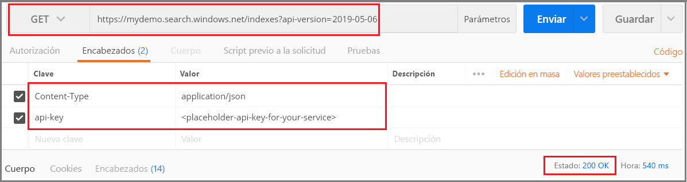
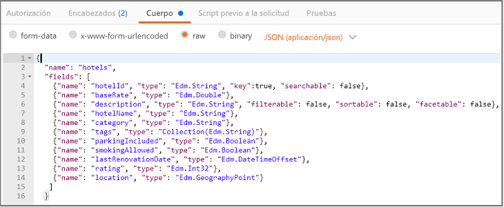
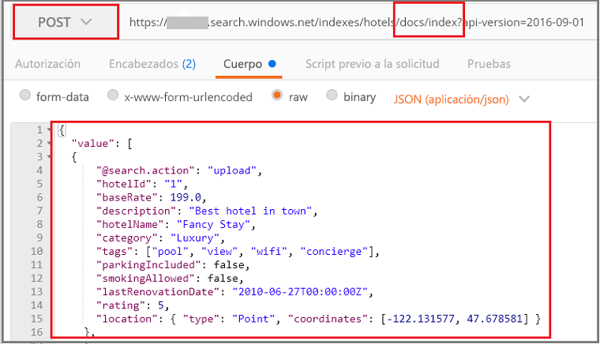
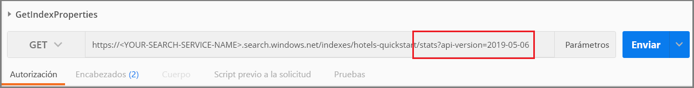

# <a name="quickstart-create-an-azure-cognitive-search-index-in-postman-using-rest-apis"></a>Inicio rápido: Creación de un índice de Azure Cognitive Search en Postman mediante las API REST
> [!div class="op_single_selector"]
> * [Postman](search-get-started-postman.md)
> * [C#](search-create-index-dotnet.md)
> * [Python](search-get-started-python.md)
> * [Portal](search-get-started-portal.md)
> * [PowerShell](search-howto-dotnet-sdk.md)
>*

Una de las formas más sencillas de explorar las [API REST de Azure Cognitive Search](https://docs.microsoft.com/rest/api/searchservice) es usar Postman, o cualquier otra herramienta de pruebas web, para formular solicitudes HTTP e inspeccionar las respuestas. Con las herramientas adecuadas y estas instrucciones, puede enviar solicitudes y ver las respuestas antes de escribir ningún código.

En este artículo se explica cómo formular solicitudes de manera interactiva. Como alternativa, puede [descargar e importar una colección Postman](https://github.com/Azure-Samples/azure-search-postman-samples/tree/master/Quickstart) para usar solicitudes predefinidas.

Si no tiene una suscripción a Azure, cree una [cuenta gratuita](https://azure.microsoft.com/free/?WT.mc_id=A261C142F) antes de empezar.

## <a name="prerequisites"></a>Prerrequisitos

Para este inicio rápido, se requieren los siguientes servicios y herramientas. 

+ La [aplicación de escritorio Postman](https://www.getpostman.com/) se usa para enviar solicitudes a Azure Cognitive Search.

+ [Cree un servicio Azure Cognitive Search](search-create-service-portal.md) o [busque uno existente](https://ms.portal.azure.com/#blade/HubsExtension/BrowseResourceBlade/resourceType/Microsoft.Search%2FsearchServices) en su suscripción actual. Puede usar un servicio gratuito para este inicio rápido. 

## <a name="get-a-key-and-url"></a>Obtención de una clave y una dirección URL

Las llamadas de REST requieren la dirección URL del servicio y una clave de acceso en cada solicitud. Con ambos se crea un servicio de búsqueda, por lo que, si ha agregado Azure Cognitive Search a su suscripción, siga estos pasos para obtener la información necesaria:

1. [Inicie sesión en Azure Portal](https://portal.azure.com/) y en la página **Introducción** del servicio de búsqueda, obtenga la dirección URL. Un punto de conexión de ejemplo podría ser similar a `https://mydemo.search.windows.net`.

1. En **Configuración** > **Claves**, obtenga una clave de administrador para tener derechos completos en el servicio. Se proporcionan dos claves de administrador intercambiables para lograr la continuidad empresarial, por si necesitara sustituir una de ellas. Puede usar la clave principal o secundaria en las solicitudes para agregar, modificar y eliminar objetos.


Todas las solicitudes requieren una clave de API en cada solicitud enviada al servicio. Tener una clave válida genera la confianza, solicitud a solicitud, entre la aplicación que envía la solicitud y el servicio que se encarga de ella.

## <a name="connect-to-azure-cognitive-search"></a>Conexión a Azure Cognitive Search

En esta sección, utilice la herramienta web que prefiera para configurar las conexiones a Azure Cognitive Search. Cada herramienta conserva la información de encabezado de solicitud durante la sesión, lo que significa que solo hay que especificar api-key y content-type una vez.

Para cualquiera de las herramientas, tiene que elegir un comando (GET, POST, PUT, etc.), proporcionar un punto de conexión de dirección URL y, para algunas tareas, proporcionar JSON en el cuerpo de la solicitud. Reemplace el nombre de servicio de búsqueda (YOUR-SEARCH-SERVICE-NAME) por un valor válido. Agregue `$select=name` para devolver solo el nombre de cada índice. 

    https://<YOUR-SEARCH-SERVICE-NAME>.search.windows.net/indexes?api-version=2019-05-06&$select=name

Tenga en cuenta el prefijo HTTPS, el nombre del servicio, el nombre de un objeto (en este caso, la colección de índices) y el valor de [api-version](search-api-versions.md). La versión de la API es una cadena obligatoria en minúsculas, que se especifica como `?api-version=2019-05-06` para la versión actual. Las versiones de la API se actualizan periódicamente. La inclusión de api-version en todas las solicitudes proporciona un control total sobre la que se usa.  

La composición del encabezado de solicitud incluye dos elementos, el tipo de contenido y el valor de api-key que se usa para autenticarse en Azure Cognitive Search. Reemplace la clave de la API de administración (YOUR-AZURE-SEARCH-ADMIN-API-KEY) por un valor válido. 

    api-key: <YOUR-AZURE-SEARCH-ADMIN-API-KEY>
    Content-Type: application/json

En Postman, formule una solicitud similar a la de la siguiente captura de pantalla. Elija **GET** como verbo, proporcione la dirección URL y haga clic en **Enviar**. Este comando se conecta a Azure Cognitive Search, lee la colección de índices y devuelve el código de estado HTTP 200 si la conexión es correcta. Si el servicio ya tiene índices, la respuesta incluirá también las definiciones de índice.



## <a name="1---create-an-index"></a>1 - Creación de un índice

En Azure Cognitive Search, lo habitual es crear el índice antes de cargarlo con datos. Para esta tarea se usa la [API REST Create Index](https://docs.microsoft.com/rest/api/searchservice/create-index) (Crear índice). 

La dirección URL se extiende para que incluya el nombre del índice `hotels`.

Para hacer esto en Postman:

1. Cambie el verbo a **PUT**.

2. Copie esta dirección URL `https://<YOUR-SEARCH-SERVICE-NAME>.search.windows.net/indexes/hotels-quickstart?api-version=2019-05-06`.

3. Proporcione la definición del índice (a continuación se incluye el código listo para copiar) en el cuerpo de la solicitud.

4. Haga clic en **Enviar**.



### <a name="index-definition"></a>Definición de índice

La colección de campos define la estructura del documento. Cada documento debe tener estos campos y cada campo debe tener un tipo de datos. Los campos de cadena se utilizan en la búsqueda de texto completo, por lo que puede convertir los datos numéricos en cadenas si necesita que se puedan realizar búsquedas en dicho contenido.

Los atributos del campo determinan la acción que se permite. Las API de REST permiten muchas acciones de forma predeterminada. Por ejemplo, de manera predeterminada es posible realizar búsquedas en todas las cadenas, se pueden recuperar, crear filtros y se pueden clasificar. A menudo, basta con establecer los atributos cuando haya que desactivar un comportamiento.

```json
{
    "name": "hotels-quickstart",  
    "fields": [
        {"name": "HotelId", "type": "Edm.String", "key": true, "filterable": true},
        {"name": "HotelName", "type": "Edm.String", "searchable": true, "filterable": false, "sortable": true, "facetable": false},
        {"name": "Description", "type": "Edm.String", "searchable": true, "filterable": false, "sortable": false, "facetable": false, "analyzer": "en.lucene"},
        {"name": "Category", "type": "Edm.String", "searchable": true, "filterable": true, "sortable": true, "facetable": true},
        {"name": "Tags", "type": "Collection(Edm.String)", "searchable": true, "filterable": true, "sortable": false, "facetable": true},
        {"name": "ParkingIncluded", "type": "Edm.Boolean", "filterable": true, "sortable": true, "facetable": true},
        {"name": "LastRenovationDate", "type": "Edm.DateTimeOffset", "filterable": true, "sortable": true, "facetable": true},
        {"name": "Rating", "type": "Edm.Double", "filterable": true, "sortable": true, "facetable": true},
        {"name": "Address", "type": "Edm.ComplexType", 
        "fields": [
        {"name": "StreetAddress", "type": "Edm.String", "filterable": false, "sortable": false, "facetable": false, "searchable": true},
        {"name": "City", "type": "Edm.String", "searchable": true, "filterable": true, "sortable": true, "facetable": true},
        {"name": "StateProvince", "type": "Edm.String", "searchable": true, "filterable": true, "sortable": true, "facetable": true},
        {"name": "PostalCode", "type": "Edm.String", "searchable": true, "filterable": true, "sortable": true, "facetable": true},
        {"name": "Country", "type": "Edm.String", "searchable": true, "filterable": true, "sortable": true, "facetable": true}
        ]
     }
  ]
}
```

Al enviar esta solicitud, debería aparece una respuesta HTTP 201, que indica que el índice se creó correctamente. Esta acción se puede comprobar esta acción en el portal, pero tenga en cuenta que la página del portal se actualiza periódicamente, por lo que puede tardar un minuto o dos en ponerse al día.

> [!TIP]
> Si obtiene HTTP 504, compruebe que la URL especifique HTTPS. Si se muestra el error HTTP 400 o 404, compruebe el cuerpo de la solicitud para verificar que no haya errores al copiar/pegar. Un HTTP 403 indica normalmente que hay un problema con la clave de API (es una clave no válida o un problema de sintaxis sobre cómo se específica la clave de API).

## <a name="2---load-documents"></a>2 - Carga de documentos

La creación del índice y su rellenado son pasos independientes. En Azure Cognitive Search, el índice contiene todos los datos en que se pueden realizar búsquedas, que se pueden proporcionar como documentos JSON. La API REST [Add, Update, or Delete Documents](https://docs.microsoft.com/rest/api/searchservice/addupdate-or-delete-documents) (Agregar, actualizar o eliminar documentos) se usa para esta tarea. 

La dirección URL se extiende para que incluya las colecciones de `docs` y la operación `index`.

Para hacer esto en Postman:

1. Cambie el verbo a **POST**.

2. Copie esta dirección URL `https://<YOUR-SEARCH-SERVICE-NAME>.search.windows.net/indexes/hotels-quickstart/docs/index?api-version=2019-05-06`.

3. Proporcione los documentos JSON (a continuación se incluye el código listo para copiar) en el cuerpo de la solicitud.

4. Haga clic en **Enviar**.



### <a name="json-documents-to-load-into-the-index"></a>Documentos JSON para cargar en el índice

El cuerpo de la solicitud contiene cuatro documentos que se van agregar al índice de hoteles.

```json
{
    "value": [
    {
    "@search.action": "upload",
    "HotelId": "1",
    "HotelName": "Secret Point Motel",
    "Description": "The hotel is ideally located on the main commercial artery of the city in the heart of New York. A few minutes away is Time's Square and the historic centre of the city, as well as other places of interest that make New York one of America's most attractive and cosmopolitan cities.",
    "Category": "Boutique",
    "Tags": [ "pool", "air conditioning", "concierge" ],
    "ParkingIncluded": false,
    "LastRenovationDate": "1970-01-18T00:00:00Z",
    "Rating": 3.60,
    "Address": 
        {
        "StreetAddress": "677 5th Ave",
        "City": "New York",
        "StateProvince": "NY",
        "PostalCode": "10022",
        "Country": "USA"
        } 
    },
    {
    "@search.action": "upload",
    "HotelId": "2",
    "HotelName": "Twin Dome Motel",
    "Description": "The hotel is situated in a  nineteenth century plaza, which has been expanded and renovated to the highest architectural standards to create a modern, functional and first-class hotel in which art and unique historical elements coexist with the most modern comforts.",
    "Category": "Boutique",
    "Tags": [ "pool", "free wifi", "concierge" ],
    "ParkingIncluded": false,
    "LastRenovationDate": "1979-02-18T00:00:00Z",
    "Rating": 3.60,
    "Address": 
        {
        "StreetAddress": "140 University Town Center Dr",
        "City": "Sarasota",
        "StateProvince": "FL",
        "PostalCode": "34243",
        "Country": "USA"
        } 
    },
    {
    "@search.action": "upload",
    "HotelId": "3",
    "HotelName": "Triple Landscape Hotel",
    "Description": "The Hotel stands out for its gastronomic excellence under the management of William Dough, who advises on and oversees all of the Hotel’s restaurant services.",
    "Category": "Resort and Spa",
    "Tags": [ "air conditioning", "bar", "continental breakfast" ],
    "ParkingIncluded": true,
    "LastRenovationDate": "2015-09-20T00:00:00Z",
    "Rating": 4.80,
    "Address": 
        {
        "StreetAddress": "3393 Peachtree Rd",
        "City": "Atlanta",
        "StateProvince": "GA",
        "PostalCode": "30326",
        "Country": "USA"
        } 
    },
    {
    "@search.action": "upload",
    "HotelId": "4",
    "HotelName": "Sublime Cliff Hotel",
    "Description": "Sublime Cliff Hotel is located in the heart of the historic center of Sublime in an extremely vibrant and lively area within short walking distance to the sites and landmarks of the city and is surrounded by the extraordinary beauty of churches, buildings, shops and monuments. Sublime Cliff is part of a lovingly restored 1800 palace.",
    "Category": "Boutique",
    "Tags": [ "concierge", "view", "24-hour front desk service" ],
    "ParkingIncluded": true,
    "LastRenovationDate": "1960-02-06T00:00:00Z",
    "Rating": 4.60,
    "Address": 
        {
        "StreetAddress": "7400 San Pedro Ave",
        "City": "San Antonio",
        "StateProvince": "TX",
        "PostalCode": "78216",
        "Country": "USA"
        }
    }
  ]
}
```

En unos pocos segundos, debería ver una respuesta HTTP 201 en la lista de sesiones. Esto indica que los documentos se crearon correctamente. 

Si obtiene un 207, al menos un documento no pudo cargarse. Si aparece el error 404, significa que se ha producido un error de sintaxis en el encabezado o en el cuerpo de la solicitud: compruebe que ha cambiado el punto de conexión para que incluya `/docs/index`.

> [!Tip]
> Para los orígenes de datos seleccionados, puede elegir el enfoque de *indizador* alternativo, que simplifica y reduce la cantidad de código necesario para la indexación. Para más información, consulte [Indexer operations](https://docs.microsoft.com/rest/api/searchservice/indexer-operations)(Operaciones del indexador).


## <a name="3---search-an-index"></a>3 - Búsqueda en un índice

Ahora que se han cargado el índice y los documentos, puede emitir consultas con ellos mediante la API REST [Search Documents](https://docs.microsoft.com/rest/api/searchservice/search-documents) (Buscar documentos).

La dirección URL se extiende para que incluya una expresión de consulta que se especifica mediante el operador de búsqueda.

Para hacer esto en Postman:

1. Cambie el verbo a **GET**.

2. Copie esta dirección URL `https://<YOUR-SEARCH-SERVICE-NAME>.search.windows.net/indexes/hotels-quickstart/docs?search=*&$count=true&api-version=2019-05-06`.

3. Haga clic en **Enviar**.

Esta consulta está vacía y devuelve un número de documentos en los resultados de la búsqueda. La solicitud y respuesta deben ser similares a las de la siguiente captura de pantalla de Postman tras hacer clic en **Send** (Enviar). El código de estado debe ser 200.

 

Pruebe con algunos otros ejemplos de consultas para hacerse una idea de la sintaxis. Puede efectuar una búsqueda de cadena, realizar consultas $filter textuales, limitar el conjunto de resultados, definir el ámbito de la búsqueda a campos específicos, etc.

Cambie la dirección URL actual por las que se indican a continuación y haga clic en **Enviar** cada vez para ver los resultados.

```
# Query example 1 - Search on restaurant and wifi
# Return only the HotelName, Description, and Tags fields
https://<YOUR-SEARCH-SERVICE>.search.windows.net/indexes/hotels-quickstart/docs?search=restaurant wifi&$count=true&$select=HotelName,Description,Tags&api-version=2019-05-06

# Query example 2 - Apply a filter to the index to find hotels rated 4 or highter
# Returns the HotelName and Rating. Two documents match
https://<YOUR-SEARCH-SERVICE>.search.windows.net/indexes/hotels-quickstart/docs?search=*&$filter=Rating gt 4&$select=HotelName,Rating&api-version=2019-05-06

# Query example 3 - Take the top two results, and show only HotelName and Category in the results
https://<YOUR-SEARCH-SERVICE>.search.windows.net/indexes/hotels-quickstart/docs?search=boutique&$top=2&$select=HotelName,Category&api-version=2019-05-06

# Query example 4 - Sort by a specific field (Address/City) in ascending order
https://<YOUR-SEARCH-SERVICE>.search.windows.net/indexes/hotels-quickstart/docs?search=pool&$orderby=Address/City asc&$select=HotelName, Address/City, Tags, Rating&api-version=2019-05-06
```

## <a name="get-index-properties"></a>Obtención de las propiedades del índice
También puede usar [Obtener estadísticas](https://docs.microsoft.com/rest/api/searchservice/get-index-statistics) para consultar los recuentos de documentos y el tamaño del índice: 

```
https://<YOUR-SEARCH-SERVICE-NAME>.search.windows.net/indexes/hotels-quickstart/stats?api-version=2019-05-06
```

Agregar `/stats` a la dirección URL devuelve información de índice. En Postman, la solicitud debe ser similar al siguiente y la respuesta incluye el número de documentos y el espacio utilizado, en bytes.

 

Observe que la sintaxis de api-version es distinta. En esta solicitud, utilice `?` para anexar api-version. `?` separa la ruta de acceso de la dirección URL de la cadena de consulta, mientras que & separa cada par " nombre = valor " par en la cadena de consulta. En esta consulta, api-version es el primer y único elemento de la cadena de consulta.

## <a name="clean-up-resources"></a>Limpieza de recursos

Cuando trabaje con su propia suscripción, es una buena idea al final de un proyecto identificar si todavía se necesitan los recursos que ha creado. Los recursos que se dejan en ejecución pueden costarle mucho dinero. Puede eliminar los recursos de forma individual o eliminar el grupo de recursos para eliminar todo el conjunto de recursos.

Puede encontrar y administrar recursos en el portal, mediante el vínculo **Todos los recursos** o **Grupos de recursos** en el panel de navegación izquierdo.

Si está usando un servicio gratuito, recuerde que está limitado a tres índices, indexadores y orígenes de datos. Puede eliminar elementos individuales en el portal para mantenerse por debajo del límite. 

## <a name="next-steps"></a>Pasos siguientes

Ahora que ya sabe cómo realizar las tareas básicas, puede continuar con las llamadas API REST para características más avanzadas, como indexadores o la [configuración de una canalización de búsqueda cognitiva](cognitive-search-tutorial-blob.md). Para realizar el paso siguiente, le recomendamos que vea este vínculo:

> [!div class="nextstepaction"]
> [Tutorial de REST: Indexación y búsqueda de datos semiestructurados (blobs JSON) en Azure Cognitive Search](search-semi-structured-data.md)
