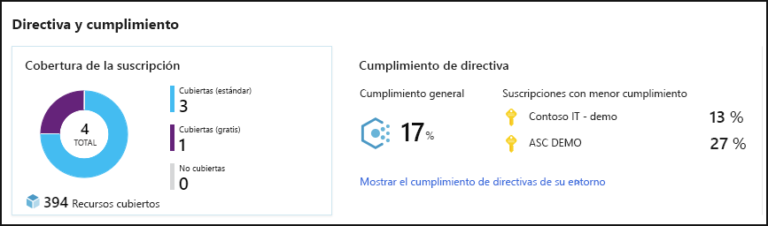
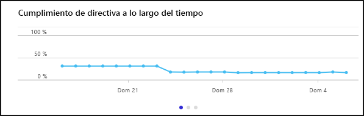
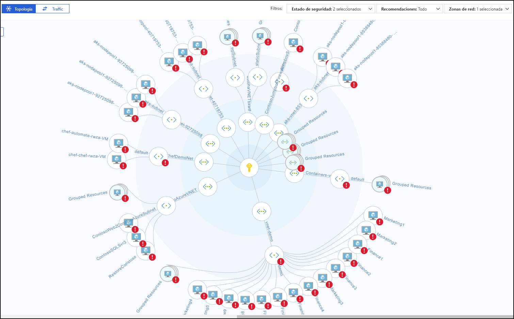
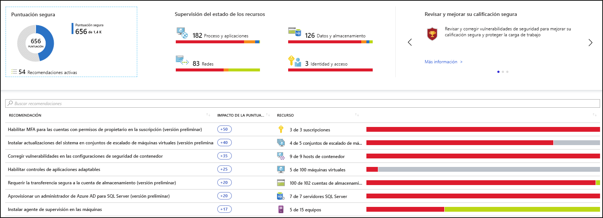
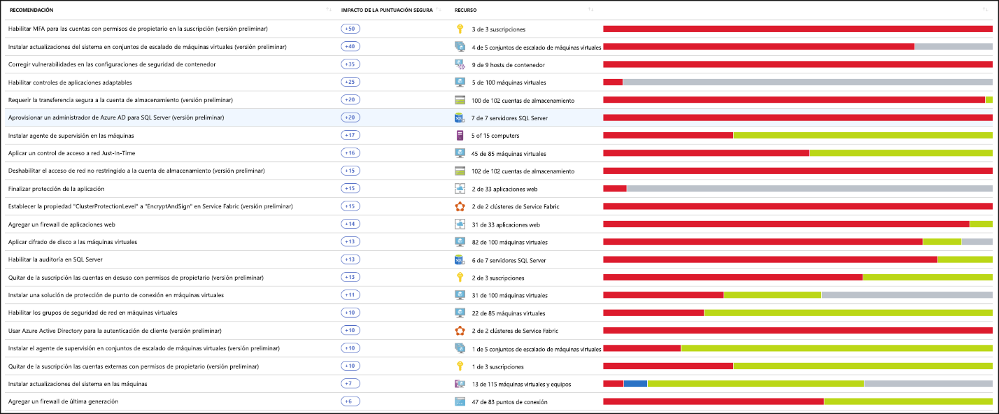
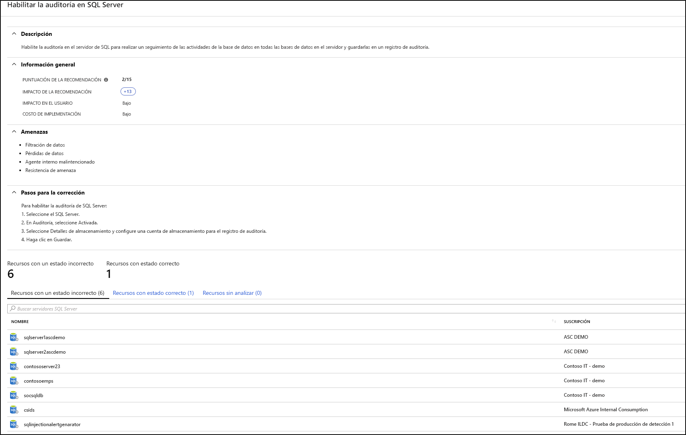
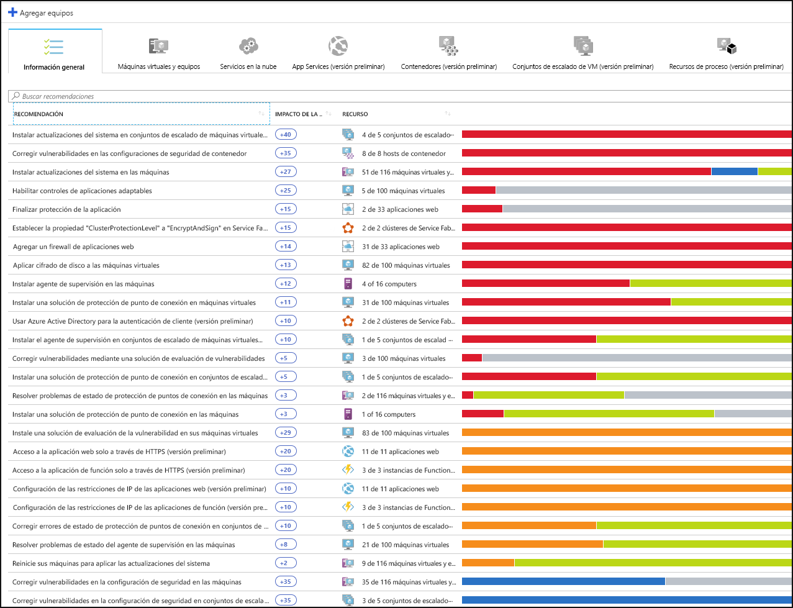
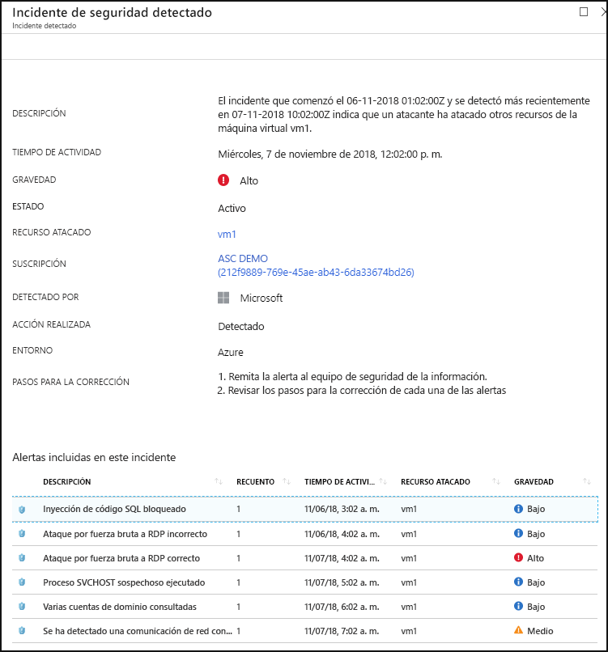

# ¿Qué es el Centro de seguridad de Azure?

Azure Security Center es un sistema unificado de administración de seguridad de la infraestructura que fortalece la posición de seguridad de los centros de datos y proporciona una protección contra amenazas avanzada de todas las cargas de trabajo híbridas que se encuentran en la nube, ya sea que estén en Azure o no, así como también en el entorno local.

Proteger los recursos es un esfuerzo conjunto entre el proveedor de nube, Azure y usted, el cliente. Cuando migra a la nube, debe asegurarse de que las cargas de trabajo estén seguras y, al mismo tiempo, cuando se migra a IaaS (infraestructura como servicio), el cliente tiene una responsabilidad mayor que cuando se encontraba en PaaS (plataforma como servicio) y SaaS (software como servicio). Azure Security Center le brinda las herramientas necesarias para fortalecer la red, proteger los servicios y garantizar que tiene la mejor posición de seguridad.

Azure Security Center aborda los tres desafíos de seguridad más urgentes:

-   **Cargas de trabajo que cambian con rapidez**: se trata tanto de una fortaleza como de un desafío de la nube. Por un lado, los usuarios finales pueden hacer más cosas pero, por el otro, ¿cómo puede asegurarse de que los servicios en constante evolución que los usuarios utilizan y crean se rigen según los estándares de seguridad y siguen los procedimientos recomendados de seguridad?

-   **Ataques cada vez más sofisticados**: no importa dónde ejecute las cargas de trabajo, los ataques son cada vez más sofisticados. Debe proteger las cargas de trabajo de la nube pública que son, en realidad, una carga de trabajo con conexión a Internet que puede dejarlo incluso más vulnerable si no sigue los procedimientos recomendados de seguridad.

-   **Las aptitudes de seguridad son escasas**: el número de alertas de seguridad y de sistemas de alertas sobrepasa considerablemente la cantidad de administradores con la experiencia y los antecedentes necesarios para garantizar que los entornos estén protegidos. Mantenerse actualizado respecto de los ataques más recientes es un desafío constante, lo que no permiten quedarse donde mismo mientras el mundo de la seguridad es un frente en continuo cambio.

Para ayudarlo a protegerse contra estos desafíos, Security Center le brinda las herramientas para que haga lo siguiente:

-   **Reforzamiento de la posición de seguridad**: Security Center evalúa el entorno y le permite entender el estado de los recursos y si son seguros.

-   **Protección frente a amenazas**: Security Center evalúa las cargas de trabajo y genera alertas de seguridad y recomendaciones para la prevención de amenazas.

-   **Protección con mayor rapidez**: En Security Center, todo se hace a la velocidad de la nube. Dado que se integra de manera nativa, la implementación de Security Center es sencilla y le proporciona aprovisionamiento automático y protección con los servicios de Azure.

[!INCLUDE [azure-lighthouse-supported-service](../../includes/azure-lighthouse-supported-service.md)]

## Architecture

Como Security Center forma parte nativa de Azure, los servicios de PaaS en Azure (como Service Fabric, bases de datos SQL y cuentas de almacenamiento) los supervisa y protege Security Center sin necesidad de realizar ninguna implementación.

Además, Security Center protege las máquinas virtuales y los servidores que no son de Azure en la nube y en el entorno local, tanto servidores Windows como Linux, al instalar en ellos Microsoft Monitoring Agent. Las máquinas virtuales de Azure se aprovisionan automáticamente en Security Center.

Los eventos recopilado de los agentes y de Azure se correlacionan en el motor de análisis de seguridad para brindarle recomendaciones a medida (tareas de protección) que debe seguir para garantizar que las cargas de trabajo sean seguras, y alertas de seguridad. Debe investigar estas alertas tan pronto como sea posible para asegurarse de que no haya ataques malintencionados en sus cargas de trabajo.

Al habilitar Security Center, la directiva de seguridad integrada en Security Center se refleja en Azure Policy como una iniciativa integrada en la categoría de Security Center. La iniciativa integrada se asigna automáticamente a todas las suscripciones registradas de Security Center (niveles Gratis o Estándar). La iniciativa integrada contiene solo las directivas de auditoría. Para más información acerca de las directivas de Security Center en Azure Policy, consulte [Uso de directivas de seguridad](tutorial-security-policy.md).

## Reforzamiento de la posición de seguridad

Azure Security Center le permite reforzar su posición de seguridad. Esto significa que lo ayuda a identificar y a llevar a cabo las tareas de protección recomendadas como procedimientos recomendados de seguridad e implementarlas en todas sus máquinas, servicios de datos y aplicaciones. Esto incluye administrar y aplicar las directivas de seguridad y asegurarse de que sus máquinas virtuales de Azure, los servidores que no son de Azure y los servicios PaaS de Azure cumplen con estas directivas. Security Center proporciona las herramientas que necesita para tener una visión global de las cargas de trabajo, centrando la visibilidad en el estado de la seguridad de la red. 

### Administración de la directiva de seguridad y del cumplimiento de la organización

En lo que respecta a la seguridad, resulta fundamental saber que las cargas de trabajo están protegidas y asegurarse de ello, y todo esto comienza con la implementación de directivas de seguridad a la medida. Como todas las directivas de Security Center se basan en los controles de directivas de Azure, el usuario obtiene toda la variedad y flexibilidad de una **solución de directivas de primer nivel**. En Security Center, puede establecer que las directivas se ejecuten en grupos de administración, entre distintas suscripciones e, incluso, en un inquilino completo.

Security Center ayuda a **identificar las suscripciones de shadow IT**. Si echa un vistazo a las suscripciones con la etiqueta **not covered** (no cubierta) en el panel, puede saber de inmediato cuando hay suscripciones recién creadas y asegurarse de que estén cubiertas por las directivas, además de protegidas por Azure Security Center.

Las funciones avanzadas de supervisión de Security Center también le permiten **hacer un seguimiento del cumplimiento y el gobierno, y administrarlos a lo largo del tiempo**. El **cumplimiento general** le permite medir la compatibilidad de las suscripciones en relación con las directivas asociadas a la carga de trabajo. 

### Evaluaciones continuas

Security Center siempre está detectando los recursos nuevos que se implementan en las cargas de trabajo y evalúa si están configurados según los procedimientos recomendados de seguridad. Si no es así, se marcan y el usuario recibe una lista de recomendaciones clasificadas por orden de prioridad de lo que debe corregir con el fin de proteger las máquinas.

Una de las herramientas más avanzadas que proporciona Security Center para la supervisión continua del estado de la seguridad de la red es el **Mapa de red**. El mapa le permite ver la topología de las cargas de trabajo para que pueda notar si cada nodo está configurado correctamente. Ahora puede ver cómo están conectados los nodos, lo que le permite bloquear las conexiones no deseadas que podrían facilitar que un atacante se deslice por la red.

Security Center facilita la mitigación de las alertas de seguridad al agregar una **Puntuación de seguridad**. Las puntuaciones de seguridad ahora están asociadas con cada recomendación que recibe para ayudarle a comprender la importancia que cada una de ellas tiene para la posición de seguridad general. Esto resulta esencial para permitirle **clasificar por orden de prioridad el trabajo de seguridad**.

### Optimice y mejore la seguridad mediante la configuración de controles recomendados

Lo fundamental del valor de Azure Security Center está en sus recomendaciones. Las recomendaciones se adaptan a las preocupaciones de seguridad determinadas que se encuentran en las cargas de trabajo y Security Center realiza el trabajo de administración de la seguridad en lugar del usuario, no solo mediante la detección de las vulnerabilidades, sino también al brindarle instrucciones específicas sobre cómo eliminarlas.

De este modo, Security Center le permite no solo establecer las directivas de seguridad, sino también aplicar los estándares de seguridad en todos los recursos.

Las recomendaciones lo ayudan a disminuir la superficie expuesta a ataques en cada uno de los recursos. Aquí se incluyen las máquinas virtuales de Azure, los servidores que no son de Azure y los servicios de PaaS de Azure, como cuentas de SQL y Storage, etc., donde cada tipo de recurso se evalúa de manera distinta y tiene sus propios estándares.

## Protección frente a amenazas

La protección contra amenazas de Security Center permite detectar y prevenir las amenazas en el nivel de Infraestructura como servicio (IaaS), los servidores que no son de Azure y en las Plataformas como servicio (PaaS) de Azure.

La protección contra amenazas de Security Center incluye el análisis de la cadena de destrucción de fusión, que correlaciona de manera automática las alertas del entorno en función del análisis de la cadena de destrucción cibernética, para ayudarlo a entender mejor la historia completa de una campaña de ataque, dónde empezó y qué tipo de impacto tuvo en los recursos.

### Integración con Advanced Threat Protection de Microsoft Defender

Security Center incluye integración nativa automática con Advanced Threat Protection de Microsoft Defender. Esto significa que, sin ninguna configuración, los servidores y las máquinas virtuales Windows y Linux están completamente integrados con las recomendaciones y evaluaciones de Security Center.

Además, Security Center le permite automatizar las directivas de control de las aplicaciones en los entornos de servidor. Los controles de aplicaciones adaptables de Security Center permiten la creación de una lista blanca de aplicaciones integral en todos los servidores Windows. No necesita crear reglas ni comprobar las infracciones: todo se hace de manera automática.

### Protección de PaaS

Security Center lo ayuda a detectar amenazas en los servicios de PaaS de Azure. Puede detectar amenazas dirigidas a servicios de Azure como Azure App Service, Azure SQL, cuenta de Azure Storage y otros servicios de datos. También puede aprovechar la integración nativa con el análisis de comportamiento de usuarios y entidades (UEBA) de Microsoft Cloud App Security para realizar la detección de anomalías en los registros de actividad de Azure.

### Bloqueo de ataques por fuerza bruta

Security Center lo ayuda a limitar la exposición a los ataques por fuerza bruta. Si reduce el acceso a los puertos de las máquinas virtuales mediante el acceso de máquina virtual Just-In-Time, puede proteger la red al prevenir el acceso innecesario. Puede establecer directivas de acceso seguro en los puertos seleccionados, solo para usuarios autorizados, direcciones IP o intervalos de direcciones IP de origen permitidos y durante un período limitado.

### Protección de los servicios de datos

Security Center incluye funcionalidades que le permiten llevar a cabo la clasificación automática de los datos en Azure SQL. También puede obtener evaluaciones de las posibles vulnerabilidades en los servicios de Azure SQL y Azure Storage, además de recomendaciones sobre cómo mitigarlas.

### Protección de las cargas de trabajo de IoT y de la nube híbrida

Azure Security Center for IoT (Internet de las cosas) simplifica la protección de las cargas de trabajo híbridas al ofrecer visibilidad y control unificados, prevención de amenazas adaptable y detección y respuesta inteligentes a amenazas en todas las cargas de trabajo que se ejecutan en el perímetro, de forma local, en Azure y en otras nubes. Para más información, consulte [Azure Security Center para IoT](https://docs.microsoft.com/azure/asc-for-iot/).

## Protección con mayor rapidez

La integración nativa de Azure (que incluye Azure Policy y los registros de Azure Monitor), en combinación con la integración perfecta con otras soluciones de seguridad de Microsoft, como Microsoft Cloud App Security y Protección contra amenazas avanzada de Windows Defender, lo ayudan a garantizar que la solución de seguridad es completa y sencilla de incorporar e implementar.

Además, puede extender toda la solución más allá de Azure a las cargas de trabajo que se ejecutan en otras nubes y en centros de datos locales.

### Detección e incorporación automática de recursos de Azure

Security Center ofrece una integración nativa y perfecta con Azure y recursos de Azure. Esto significa que puede unir toda una historia de seguridad relativa a Azure Policy y las directivas integradas de Security Center en todos los recursos de Azure y asegurarse de que todo esto se aplique automáticamente a los recursos recién detectados cuando se crean en Azure.

Recopilación extensiva de registros: los registros de Windows y Linux se usan en el motor de análisis de seguridad y se usan para crear recomendaciones y alertas.

## Pasos siguientes

- Para empezar a trabajar con el Centro de seguridad, necesita una suscripción a Microsoft Azure. Si no tiene una suscripción, puede registrarse para obtener una [evaluación gratuita](https://azure.microsoft.com/free/).
- Con la suscripción a Azure se habilita el plan de tarifa gratis de Security Center. Para aprovechar las funcionalidades avanzadas de administración de seguridad y protección frente a amenazas, debe actualizar al plan de tarifa estándar. Dicho plan se puede probar de forma gratuita durante 30 días. Para más información, vea la [página de precios de Security Center](https://azure.microsoft.com/pricing/details/security-center/).
- Si está listo para habilitar ahora el nivel estándar de Security Center, el [Inicio rápido: Incorporación de su suscripción de Azure al nivel Estándar de Security Center](security-center-get-started.md) lo guía a través de los pasos.