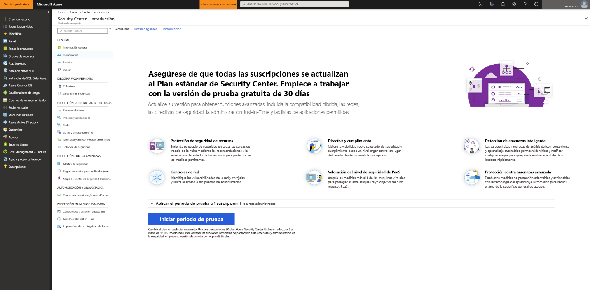
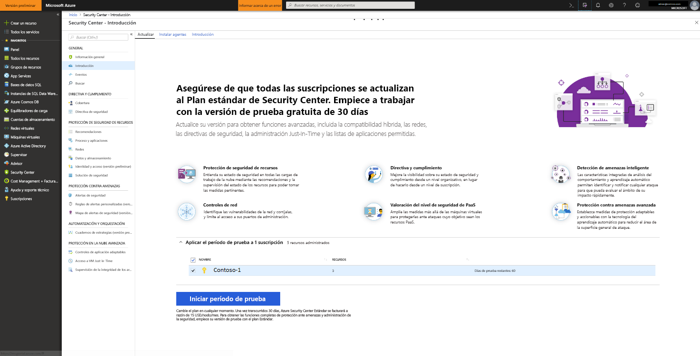

# Incorporación a Azure Security Center Estándar para una seguridad mejorada
Actualice a Security Center Estándar para sacar partido de la administración de seguridad mejorada y protección contra amenazas en las cargas de trabajo de la nube híbrida. Puede probar la versión Estándar de forma gratuita. Para más información, consulte la [página de precios](https://azure.microsoft.com/pricing/details/security-center/) de Security Center.

El nivel estándar de Security Center incluye:

- **Seguridad híbrida**: Obtenga una vista unificada de la seguridad de todas sus cargas de trabajo locales y en la nube. Aplique directivas de seguridad y evalúe constantemente la seguridad de las cargas de trabajo de nube híbrida para garantizar el cumplimiento normativo con los estándares de seguridad. Recopile, busque y analice datos de seguridad de una gran variedad de orígenes, incluidos firewalls y otras soluciones de asociados.
- **Alertas de seguridad**: use análisis avanzado y Microsoft Intelligent Security Graph para adelantarse a los ciberataques en constante cambio. Aproveche la funcionalidad integrada de análisis del comportamiento y aprendizaje automático para identificar ataques y vulnerabilidades de seguridad de día cero. Supervise las redes, las máquinas y los servicios en la nube para detectar ataques entrantes y actividad posterior a una infracción de seguridad. Optimice la investigación con herramientas interactivas e inteligencia de amenazas contextual.
- **Controles de acceso y de aplicación**: bloquee el malware y otras aplicaciones no deseadas aplicando recomendaciones de inclusión en lista blanca adaptadas a sus cargas de trabajo específicas y basadas en el aprendizaje automático. Reduzca la superficie expuesta a ataques de red con el acceso controlado Just-In-Time a los puertos de administración de las máquinas virtuales de Azure, lo que reducirá drásticamente la exposición a ataques por fuerza bruta y otros tipos de ataques de red.

## Detectar recursos sin proteger
Security Center detecta automáticamente las áreas de trabajo o suscripciones a Azure que no están habilitadas para Security Center Estándar. Esto engloba las suscripciones a Azure que usan Security Center gratis y las áreas de trabajo que no tiene la solución de Security habilitada.

Puede actualizar una suscripción a Azure entera al nivel Estándar, que heredarán todos los recursos admitidos dentro de la suscripción. La aplicación del nivel Estándar a un área de trabajo se aplica a todos los recursos que dependen del área de trabajo.

> [!NOTE]
> Quizá quiera administrar los costos y limitar la cantidad de datos recopilados para una solución mediante la limitación a un conjunto determinado de agentes. La [selección de destino de solución](../operations-management-suite/operations-management-suite-solution-targeting.md) permite aplicar un ámbito a la solución y tener como destino un subconjunto de equipos en el área de trabajo. Si usa la selección de destino de solución, Security Center muestra el área de trabajo como si no tuviera una solución.
>
>

## Actualización de un área de trabajo o suscripción a Azure
Para actualizar un área de trabajo o una suscripción al nivel estándar:
1. En el menú principal de Security Center, seleccione **Introducción**.
  
2. En **Actualizar**, Security Center muestra las suscripciones y áreas de trabajo aptas para la incorporación. 
   - Puede hacer clic en el expandible **Apply your trial** (Aplicar prueba) para ver una lista de todas las suscripciones y áreas de trabajo con el estado de elegibilidad de prueba.
   -    Puede actualizar las suscripciones y áreas de trabajo que no sean aptas para la versión de prueba.
   -    Puede seleccionar las áreas de trabajo y las suscripciones aptas para iniciar la versión de prueba.
3.  Haga clic en **Iniciar período de prueba** para iniciar la evaluación de las suscripciones seleccionadas.
  

   > [!NOTE]
   > Las funcionalidades gratuitas de Security Center se aplican solo a los VMSS y las VM de Azure. Estas funciones gratuitas no se aplicarán a los equipos que no sean de Azure. Si selecciona Estándar, las funciones de ese nivel se aplicarán a todas las máquinas virtuales de Azure, a los conjunto de escalado de máquina virtual y a los equipos que no sean de Azure que dependan del área de trabajo. Se recomienda aplicar el nivel Estándar para proporcionar seguridad avanzada para los recursos tanto de Azure como distintos de Azure.
   >

## Incorporar equipos que no son de Azure
Security Center puede supervisar la situación de seguridad de los equipos que no son de Azure, pero para ello antes hay que incorporar esos recursos. Los equipos que no son de Azure se pueden agregar desde las hojas **Introducción** o **Proceso**. Veremos ambos métodos.

### Adición de nuevos equipos que no son de Azure desde **Introducción**

1. Vuelva a **Introducción**.
2. Seleccione la pestaña **Introducción**.

   

3. Haga clic en **Configurar** en **Agregar nuevos equipos que no son de Azure**. Aparecerá una lista de las áreas de trabajo de Log Analytics. La lista incluye, si procede, el área de trabajo predeterminada que Security Center crea automáticamente si el aprovisionamiento automático está habilitado. Seleccione esta área de trabajo u otra que desee usar.

   ![Agregar un equipo que no es de Azure][7]

Si tiene áreas de trabajo existentes, se enumerarán en **Add new Non-Azure computers** (Agregar nuevos equipos que no son de Azure). Puede agregar equipos a un área de trabajo existente o crear un área de trabajo. Para crear un área de trabajo, seleccione el vínculo **add a new workspace** (agregar una nueva área de trabajo).

### Adición de nuevos equipos que no son de Azure desde **Proceso**

**Crear un área de trabajo y agregar un equipo**

1. En **Add new non-Azure computers** (Agregar nuevos equipos que no son de Azure), seleccione **add a new workspace** (agregar una nueva área de trabajo).

   ![Agregar una nueva área de trabajo][4]

2. En **Security and Audit**, seleccione **Área de trabajo de OMS** para crear un área de trabajo.
   > [!NOTE]
   > Las áreas de trabajo de OMS ahora se conocen como áreas de trabajo de Log Analytics.
3. En **Área de trabajo de OMS**, escriba la información del área de trabajo.
4. En **Área de trabajo de OMS**, haga clic en **Aceptar**. Tras hacer clic en Aceptar, obtendrá un vínculo para descargar un agente de Windows o de Linux, y las claves de su identificador de área de trabajo que usará para configurar el agente.
5. En **Seguridad y auditoría**, haga clic en **Aceptar**.

**Seleccionar un área de trabajo y agregar un equipo**

Puede agregar un equipo con el flujo de trabajo de **Incorporación** descrito anteriormente. Pero un equipo también se puede agregar con el flujo de trabajo de **Proceso**. En este ejemplo, usaremos **Proceso**.

1. Vuelva al menú principal de Security Center y al panel **Introducción**.

   ![Información general][5]

2. Seleccione **Compute & apps** (Proceso y aplicaciones).
3. En **Compute & apps**, seleccione **Agregar equipos**.

   ![Hoja Proceso][6]

4. En **Add new non-Azure computers** (Agregar nuevos equipos que no son de Azure), seleccione un área de trabajo a la que conectar el equipo y haga clic en **Agregar equipos**.

   ![Agregar equipos][7]

   En la hoja **Agente directo** encontrará un vínculo para descargar un agente de Windows o de Linux, así como las claves y el identificador de área de trabajo para configurar el agente.

## Pasos siguientes
En este artículo ha obtenido información sobre cómo incorporar recursos de Azure y que no son de Azure para beneficiarse de la seguridad avanzada de Security Center. Para hacer más cosas con los recursos incorporados, vea:

- [Habilitación de recolección de datos](security-center-enable-data-collection.md)
- [Informe de inteligencia de amenazas](security-center-threat-report.md)
- [Acceso de máquina virtual Just-In-Time](security-center-just-in-time.md)

<!--Image references-->
[1]: ./media/security-center-onboarding/onboard.png
[2]: ./media/security-center-onboarding/onboard-subscription.png
[3]: ./media/security-center-onboarding/get-started.png
[4]: ./media/security-center-onboarding/create-workspace.png
[5]: ./media/security-center-onboarding/overview.png
[6]: ./media/security-center-onboarding/compute-blade.png
[7]: ./media/security-center-onboarding/add-computer.png
[8]: ./media/security-center-onboarding/onboard-workspace.png
