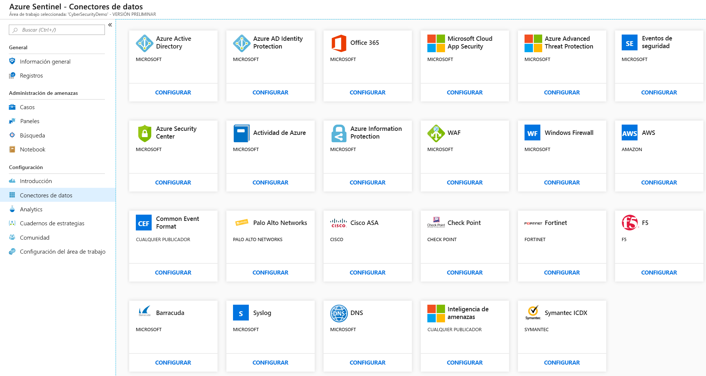
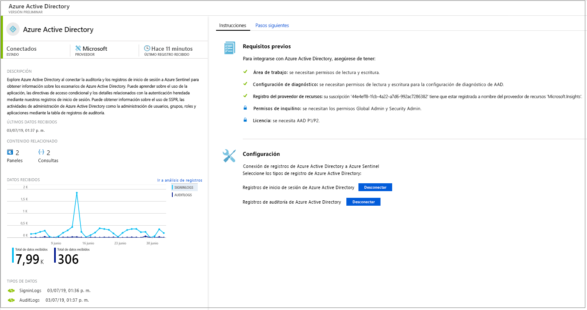
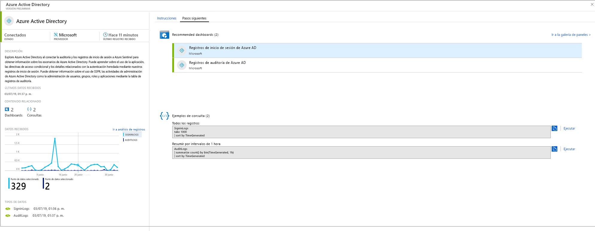
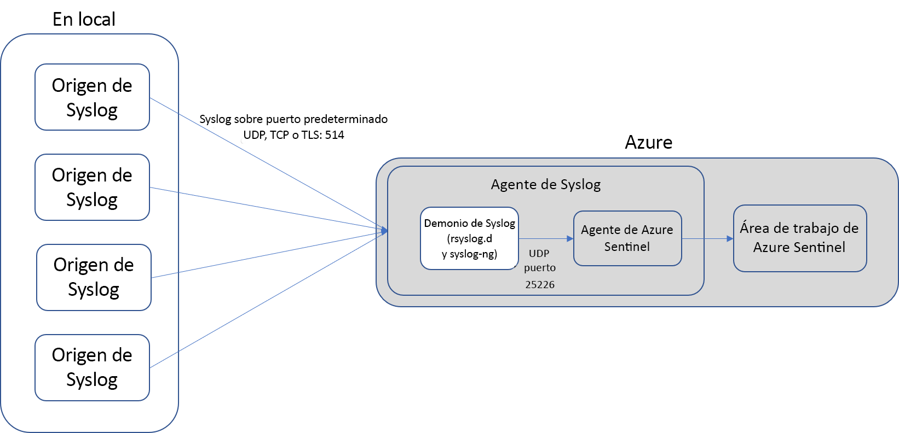
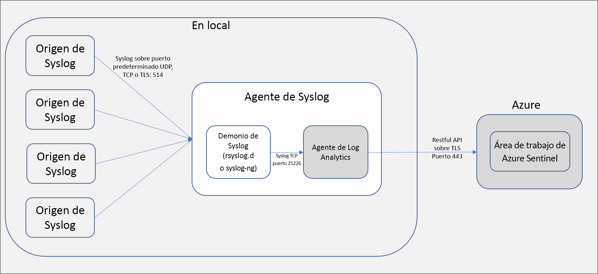

# Conexión con orígenes de datos

Para incorporar Azure Sentinel, primero debe conectarse a sus orígenes de datos. Azure Sentinel llega con varios conectores para soluciones de Microsoft que están disponibles inmediatamente y proporcionan integración en tiempo real; por ejemplo, para soluciones de Microsoft Threat Protection y orígenes de Microsoft 365, como Office 365, Azure AD, Azure ATP y Microsoft Cloud App Security, entre muchos otros. Además, hay conectores integrados al amplio ecosistema de seguridad para soluciones que no son de Microsoft. También puede usar el formato de evento común, Syslog o las API de REST para conectar los orígenes de datos con Azure Sentinel.  

1. En el menú, seleccione **Data connectors** (Conectores de datos). Esta página permite ver la lista completa de los conectores que Azure Sentinel proporciona, y su estado. Seleccione el conector al que desea conectarse y seleccione **Open connector page** (Abrir la página del conector). 

   

1. En la página específica del conector, asegúrese de que cumple todos los requisitos previos y siga las instrucciones para conectar los datos a Azure Sentinel. Los registros pueden tardar algún tiempo en iniciar la sincronización con Azure Sentinel. Después de conectarse, verá un resumen de los datos en el gráfico **Datos recibidos**, y el estado de conectividad de los tipos de datos.

   
  
1. Haga clic en la pestaña **Siguientes pasos** para obtener una lista del contenido que Azure Sentinel proporciona para el tipo de datos específico.

   
 

## Métodos de conexión de datos

Los siguientes métodos de conexión de datos son compatibles con Azure Sentinel:

- **Integración de servicio a servicio**:  Algunos servicios se conectan de forma nativa, como los servicios de AWS y Microsoft, y aprovechan la base de Azure de la integración lista para usar. Con solo unos clics, se pueden conectar las soluciones siguientes:
    - [Amazon Web Services: CloudTrail](connect-aws.md)
    - [Azure Activity](connect-azure-activity.md) (Actividad de Azure)
    - [Azure AD audit logs and sign-ins](connect-azure-active-directory.md) (Inicios de sesión y pistas de auditoría de Azure AD)
    - [Azure AD Identity Protection](connect-azure-ad-Identity-protection.md)
    - [Azure Advanced Threat Protection](connect-azure-atp.md)
    - [Azure Information Protection](connect-azure-information-protection.md)
    - [Azure Security Center](connect-azure-security-center.md)
    - [Cloud App Security](connect-cloud-app-security.md)
    - [Servidor de nombres de dominio](connect-dns.md)
    - [Office 365](connect-office-365.md)
    - [ATP de Microsoft Defender](connect-microsoft-defender-advanced-threat-protection.md)
    - [Firewall de aplicaciones web de Microsoft](connect-microsoft-waf.md)
    - [Eventos de seguridad de Windows](connect-windows-security-events.md) 
    - [Firewall de Windows](connect-windows-firewall.md)
    - [Eventos de seguridad de Windows](connect-windows-security-events.md)

- **Soluciones externas mediante API**: algunos orígenes de datos se conectan mediante las API proporcionadas por el origen de datos conectado. Normalmente, la mayoría de las tecnologías de seguridad proporcionan un conjunto de API a través del cual se pueden recuperar registros de eventos. Las API se conectan a Azure Sentinel y recopilan y envían tipos de datos específicos a Azure Log Analytics. Entre los dispositivos conectados mediante API se incluyen:
    - [Barracuda](connect-barracuda.md)
    - [Barracuda CloudGen Firewall](connect-barracuda-cloudgen-firewall.md)
    - [Citrix Analytics (Security)](connect-citrix-analytics.md)
    - [F5 BIG-IP](connect-f5-big-ip.md)
    - [Forcepoint DLP](connect-forcepoint-dlp.md)
    - [Squadra Technologies secRMM](connect-squadra-secrmm.md)
    - [Symantec ICDX](connect-symantec.md)
    - [Zimperium](connect-zimperium-mtd.md)

- **Soluciones externas mediante agente**: Azure Sentinel se puede conectar a todos los demás orígenes de datos que pueden realizar secuencias de registro en tiempo real mediante el protocolo de Syslog, a través de un agente.  La mayoría de las aplicaciones usan el protocolo de Syslog para enviar mensajes de eventos que incluyen el propio registro y datos sobre este. El formato de los registros varía, pero la mayoría de los dispositivos admiten el formato basado en Common Event Format (CEF) para los datos de registro.  El agente de Azure Sentinel, que se basa en el agente de Log Analytics, convierte los registros con formato CEF a un formato que Log Analytics puede ingerir. Dependiendo del tipo de dispositivo, el agente se instala directamente en el dispositivo o en un servidor Linux dedicado. El agente para Linux recibe eventos del demonio de Syslog a través de UDP; sin embargo,si se espera que una máquina Linux recopile un gran volumen de eventos Syslog, se envían a través de TCP desde el demonio de Syslog al agente y desde allí a Log Analytics.
    - Firewalls, proxies y puntos de conexión:
        - [Check Point](connect-checkpoint.md)
        - [Cisco ASA](connect-cisco.md)
        - [Reveal(x) de ExtraHop](connect-extrahop.md)
        - [F5](connect-f5.md)
        - [Productos de Forcepoint](connect-forcepoint-casb-ngfw.md)
        - [Fortinet](connect-fortinet.md)
        - [Palo Alto Networks](connect-paloalto.md)
        - [One Identity Safeguard](connect-one-identity.md)
        - [Other CEF appliances](connect-common-event-format.md) (Otros dispositivos CEF)
        - [Other Syslog appliances](connect-syslog.md) (Otros dispositivos de Syslog)
        - [Trend Micro Deep Security](connect-trend-micro.md)
        - [Zscaler](connect-zscaler.md)
    - Soluciones de DLP
    - [Threat intelligence providers](connect-threat-intelligence.md) (Proveedores de información sobre amenazas)
    - [DNS machines](connect-dns.md) (Máquinas DNS): agente instalado directamente en la máquina DNS
    - Servidores Linux
    - Otras nubes
    
## Opciones de conexión del agente

Para conectar su dispositivo externo a Azure Sentinel, el agente debe implementarse en una máquina dedicada (máquina virtual o local) para admitir la comunicación entre el dispositivo y Azure Sentinel. Puede implementar el agente automáticamente o de forma manual. La implementación automática solo está disponible si su máquina dedicada es una nueva máquina virtual que crea en Azure. 

También puede implementar el agente manualmente en una máquina virtual existente, en una máquina virtual en otra nube o en una máquina local.

## Asignación de tipos de datos con opciones de conexión de Azure Sentinel

| **Tipo de datos** | **Conexión** | **¿Conector de datos?** | **Comentarios** |
|------|---------|-------------|------|
| AWSCloudTrail | [Conexión de AWS](connect-aws.md) | V | |
| AzureActivity | [Conexión del registro de actividad de Azure](connect-azure-activity.md) e [Introducción a los registros de actividad](../azure-monitor/platform/platform-logs-overview.md)| V | |
| AuditLogs | [Conexión de Azure AD](connect-azure-active-directory.md)  | V | |
| SigninLogs | [Conexión de Azure AD](connect-azure-active-directory.md)  | V | |
| AzureFirewall |[Diagnóstico de Azure](../firewall/tutorial-diagnostics.md) | V | |
| InformationProtectionLogs_CL  | [Informes de Azure Information Protection](https://docs.microsoft.com/azure/information-protection/reports-aip) [Conexión de Azure Information Protection](connect-azure-information-protection.md)  | V | Normalmente usa la función **InformationProtectionEvents** además del tipo de datos. Para más información, consulte [Modificación de informes y creación de consultas personalizadas](https://docs.microsoft.com/azure/information-protection/reports-aip#how-to-modify-the-reports-and-create-custom-queries)|
| AzureNetworkAnalytics_CL  | [Esquema de análisis de tráfico](../network-watcher/traffic-analytics.md) [Análisis de tráfico](../network-watcher/traffic-analytics.md)  | | |
| CommonSecurityLog  | [Conexión de CEF](connect-common-event-format.md)  | V | |
| OfficeActivity | [Conexión de Office 365](connect-office-365.md) | V | |
| SecurityEvents | [Conexión de eventos de seguridad de Windows](connect-windows-security-events.md)  | V | Para los libros de protocolos poco seguros, vea [Configuración de libros de protocolos poco seguros](/azure/sentinel/quickstart-get-visibility#use-built-in-workbooks)  |
| syslog | [Conexión de Syslog](connect-syslog.md) | V | |
| Firewall de aplicaciones web (WAF) de Microsoft: (AzureDiagnostics) |[Conexión del firewall de aplicaciones web de Microsoft](connect-microsoft-waf.md) | V | |
| SymantecICDx_CL | [Conexión de Symantec](connect-symantec.md) | V | |
| ThreatIntelligenceIndicator  | [Conexión de Inteligencia sobre amenazas](connect-threat-intelligence.md)  | V | |
| VMConnection   ServiceMapComputer_CL  ServiceMapProcess_CL|  [Mapa de servicio de Azure Monitor](../azure-monitor/insights/service-map.md) [Incorporación de VM Insights de Azure Monitor](../azure-monitor/insights/vminsights-onboard.md)   [Habilitación de VM Insights de Azure Monitor](../azure-monitor/insights/vminsights-enable-overview.md)   [Uso de la incorporación de una máquina virtual individual](../azure-monitor/insights/vminsights-enable-single-vm.md)   [Uso de la incorporación mediante Policy](../azure-monitor/insights/vminsights-enable-at-scale-policy.md)| X | Libro de VM Insights  |
| DnsEvents | [Conexión de DNS](connect-dns.md) | V | |
| W3CIISLog | [Conexión de registros de IIS](../azure-monitor/platform/data-sources-iis-logs.md)  | X | |
| WireData | [Conexión de Wire Data](../azure-monitor/insights/wire-data.md) | X | |
| WindowsFirewall | [Conexión de Firewall de Windows](connect-windows-firewall.md) | V | |
| AADIP SecurityAlert  | [Conexión de Azure AD Identity Protection](connect-azure-ad-identity-protection.md)  | V | |
| AATP SecurityAlert  | [Conexión de Azure Advanced Threat Protection](connect-azure-atp.md) | V | |
| ASC SecurityAlert  | [Conexión de Azure Security Center](connect-azure-security-center.md)  | V | |
| MCAS SecurityAlert  | [Conexión de Microsoft Cloud App Security](connect-cloud-app-security.md)  | V | |
| SecurityAlert | | | |
| Sysmon (evento) | [Conexión de Sysmon](https://azure.microsoft.com/blog/detecting-in-memory-attacks-with-sysmon-and-azure-security-center)  [Conexión de eventos de Windows](../azure-monitor/platform/data-sources-windows-events.md)   [Obtención del analizador de Sysmon](https://github.com/Azure/Azure-Sentinel/blob/master/Parsers/SysmonParser.txt)| X | La colección de Sysmon no se instala de forma predeterminada en máquinas virtuales. Para más información sobre cómo instalar el agente Sysmon, consulte [Sysmon](https://docs.microsoft.com/sysinternals/downloads/sysmon). |
| ConfigurationData  | [Automatización del inventario de máquinas virtuales](../automation/automation-vm-inventory.md)| X | |
| ConfigurationChange  | [Automatización del seguimiento de VM](../automation/change-tracking.md) | X | |
| F5 BIG-IP | [Conexión de F5 BIG-IP](https://devcentral.f5.com/s/articles/Integrating-the-F5-BIGIP-with-Azure-Sentinel)  | X | |
| McasShadowItReporting  |  | X | |
| Barracuda_CL | [Conexión de Barracuda](connect-barracuda.md) | V | |

## Pasos siguientes

- Para empezar a trabajar con Azure Sentinel, necesita una suscripción a Microsoft Azure. Si no tiene una suscripción, puede registrarse para obtener una [evaluación gratuita](https://azure.microsoft.com/free/).
- Aprenda a [incorporar los datos en Azure Sentinel](quickstart-onboard.md), [obtenga visibilidad sobre ellos y aprenda a defenderse de posibles amenazas](quickstart-get-visibility.md).
