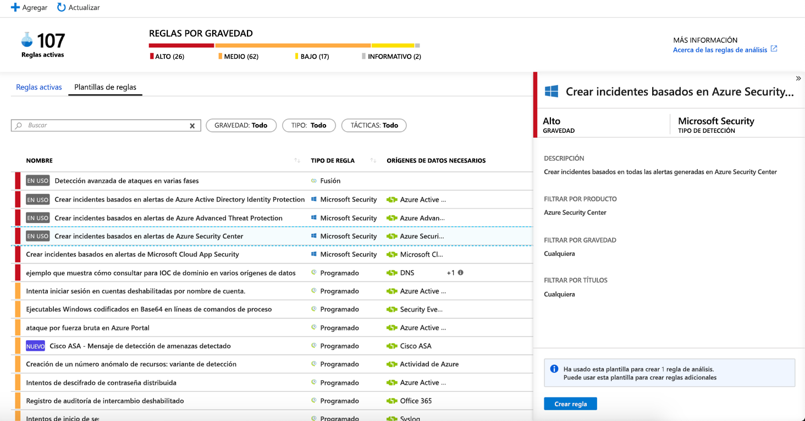
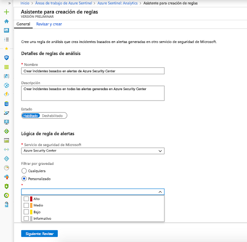
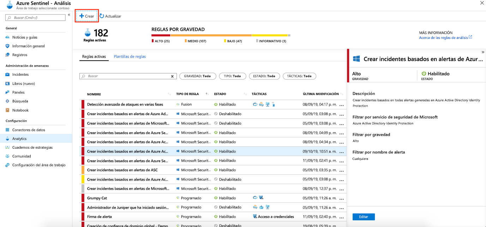
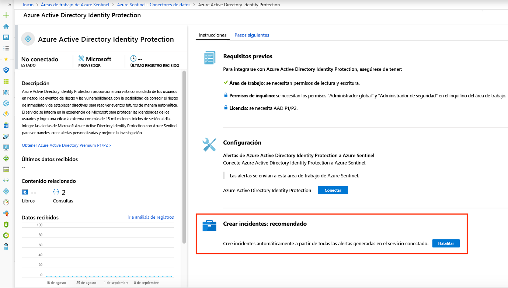

# Creación automática de incidentes a partir de alertas de seguridad de Microsoft

Las alertas desencadenadas en las soluciones de seguridad de Microsoft que están conectadas a Azure Sentinel, como Microsoft Cloud App Security y Azure Advanced Threat Protection, no crean automáticamente incidentes en Azure Sentinel. De forma predeterminada, cuando se conecta una solución de Microsoft a Azure Sentinel, todas las alertas que se generen en ese servicio se almacenarán como datos sin procesar en Azure Sentinel, en la tabla Alerta de seguridad del área de trabajo de Azure Sentinel. Después, puede usar esos datos como cualquier otro dato sin procesar que conecte a Sentinel.

Si sigue las instrucciones de este artículo, puede configurar fácilmente Azure Sentinel para crear automáticamente incidentes cada vez que se desencadene una alerta en una solución de seguridad de Microsoft conectada.

## Prerrequisitos
Debe [conectar las soluciones de seguridad de Microsoft](connect-data-sources.md#data-connection-methods) para habilitar la creación de incidentes a partir de alertas del servicio de seguridad.

## Uso de reglas de análisis de creación de incidentes de seguridad de Microsoft

Use las reglas integradas disponibles en Azure Sentinel para elegir qué soluciones de seguridad de Microsoft deben crear incidentes de Azure Sentinel automáticamente en tiempo real. También puede editar las reglas para definir opciones más específicas para filtrar cuáles de las alertas generadas por la solución de seguridad de Microsoft deben crear incidentes en Azure Sentinel. Por ejemplo, puede elegir crear automáticamente incidentes de Azure Sentinel solo a partir de alertas de Azure Security Center de alta gravedad.

1. En Azure Portal en Azure Sentinel, seleccione **Analytics**.

1. Seleccione la pestaña **Rule templates** (Plantillas de reglas) para ver todas las reglas de análisis integradas.

    

1. Seleccione la plantilla de la regla de análisis de **seguridad de Microsoft** que quiere usar y haga clic en **Crear regla**.

    

1. Puede modificar los detalles de la regla y elegir filtrar las alertas que van a crear incidentes por gravedad de alerta o por el texto del nombre de la alerta.  
      
    Por ejemplo, si elige **Azure Security Center** en el campo **Microsoft security service** (Servicio de seguridad de Microsoft) y elija **High** (Alta) en el campo **Filter by severity** (Filtrar por gravedad); las alertas de Azure Security Center de alta gravedad son las únicas que crearán incidentes en Azure Sentinel.  

    

1. También puede crear una nueva regla de **seguridad de Microsoft** que filtre las alertas de diferentes servicios de seguridad de Microsoft haciendo clic en **+Create** (+Crear) y seleccionando **Microsoft incident creation rule** (Regla de creación de incidentes de Microsoft).

    

  Puede crear más de una regla de análisis de la **seguridad de Microsoft** por tipo de **servicio de seguridad de Microsoft**. Así no se crean incidentes duplicados, ya que cada regla se utiliza como filtro. Aunque una alerta coincida con más de una regla de análisis de **Microsoft Security**, creara solo un incidente de Azure Sentinel.

## Habilitación de la generación de incidentes automáticamente durante la conexión
 Al conectar una solución de seguridad de Microsoft, puede seleccionar si desea que las alertas de la solución de seguridad generen automáticamente incidentes en Azure Sentinel automáticamente.

1. Conecte el origen de datos de una solución de seguridad de Microsoft. 

   

1. En **Creación de incidentes** seleccione **Habilitar** para habilitar la regla analítica predeterminada que crea incidentes automáticamente a partir de alertas generadas en el servicio de seguridad conectado. Luego, puede editar esta regla en **Analytics** (Análisis) y **Active rules** (Reglas activas).

## Pasos siguientes

- Para empezar a trabajar con Azure Sentinel, necesita una suscripción a Microsoft Azure. Si no tiene una suscripción, puede registrarse para obtener una [evaluación gratuita](https://azure.microsoft.com/free/).
- Aprenda a [incorporar los datos en Azure Sentinel](quickstart-onboard.md), [obtenga visibilidad sobre ellos y aprenda a defenderse de posibles amenazas](quickstart-get-visibility.md).
