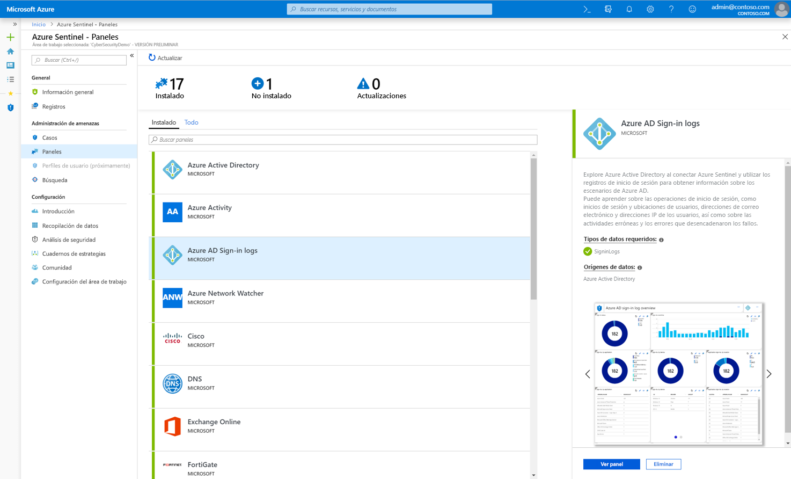
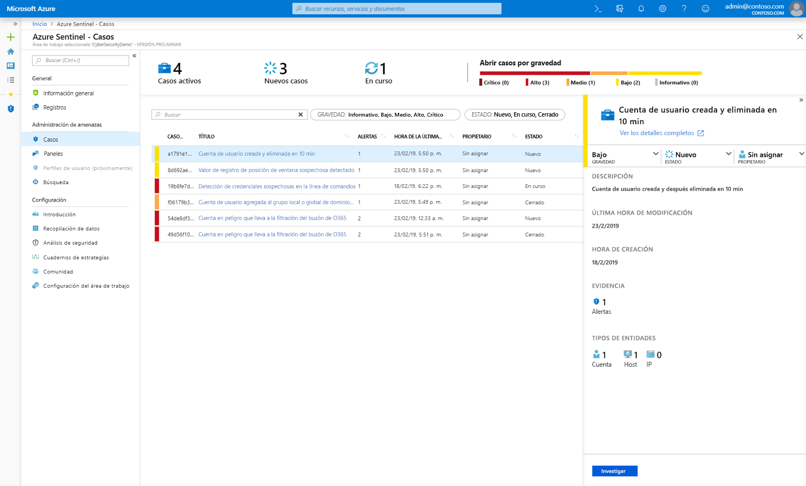
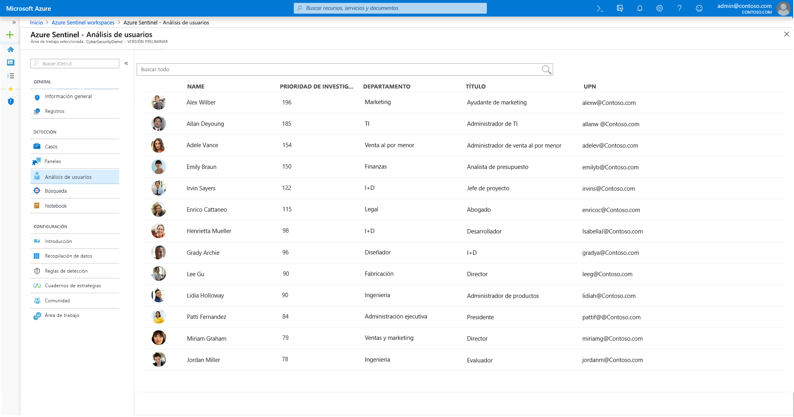
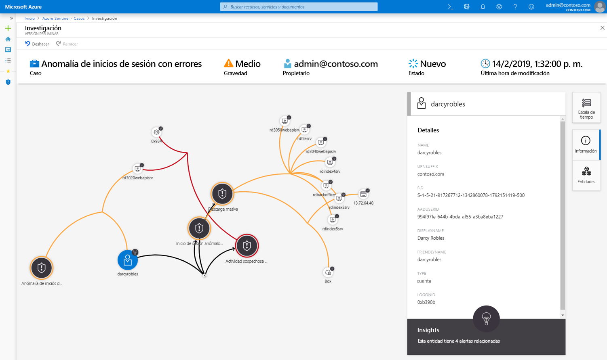
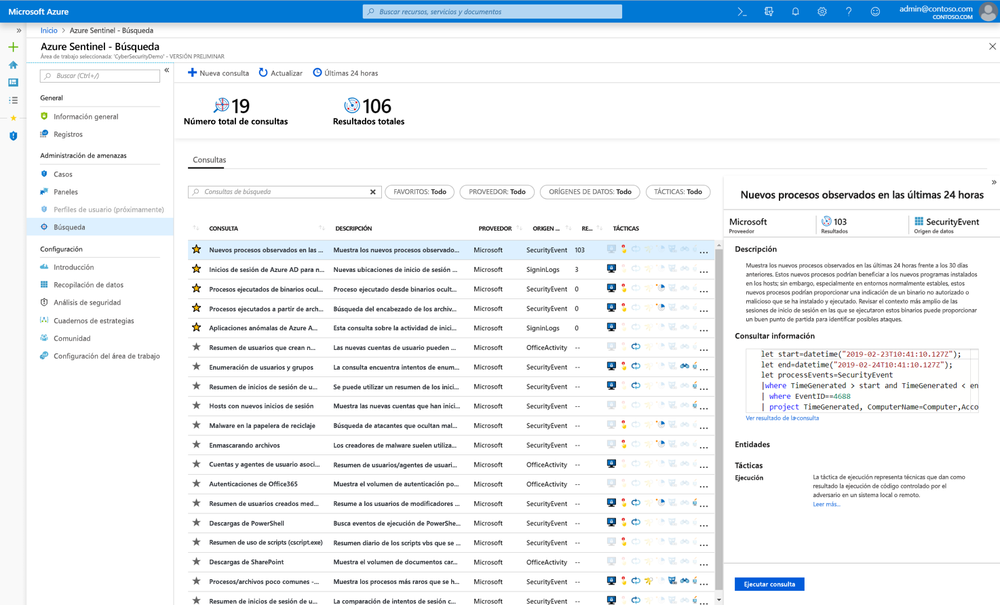

# ¿Qué es Azure Sentinel (versión preliminar)?

> [!IMPORTANT]
> Azure Sentinel se encuentra actualmente en versión preliminar pública.
> Esta versión preliminar se ofrece sin Acuerdo de Nivel de Servicio y no se recomienda para cargas de trabajo de producción. Es posible que algunas características no sean compatibles o que tengan sus funcionalidades limitadas. Para más información, consulte [Términos de uso complementarios de las Versiones Preliminares de Microsoft Azure](https://azure.microsoft.com/support/legal/preview-supplemental-terms/).

Microsoft Azure Sentinel es una solución de **administración de eventos de información de seguridad (SIEM)** y **respuesta automatizada de orquestación de seguridad (SOAR)** que es escalable y nativa de la nube. Azure Sentinel ofrece análisis de seguridad inteligente e inteligencia frente a amenazas en toda la empresa, de forma que proporciona una única solución para la detección de alertas, la visibilidad de amenazas, la búsqueda proactiva y la respuesta a amenazas. 

Azure Sentinel permite obtener una vista aérea de toda la empresa, lo que suaviza la tensión de ataques cada vez más sofisticados, volúmenes de alertas cada vez mayores y plazos de resolución largos.

- **Recopile datos a escala de nube** de todos los usuarios, dispositivos, aplicaciones y de toda la infraestructura, tanto en el entorno local como en diversas nubes. 

- **Detecte amenazas que antes no se detectaban** y reduzca los falsos positivos mediante el análisis y la inteligencia de amenazas sin precedentes de Microsoft. 

- **Investigue amenazas con inteligencia artificial** y busque actividades sospechosas a escala, aprovechando el trabajo de ciberseguridad que ha llevado a cabo Microsoft durante décadas. 

- **Responda a los incidentes con rapidez** con la orquestación y la automatización de tareas comunes integradas.

Creado sobre la gama completa de servicios de Azure existentes, Azure Sentinel incorpora de forma nativa bases contrastadas, como Log Analytics y Logic Apps. Azure Sentinel enriquece la investigación y la detección con AI al proporcionar el flujo de inteligencia de amenazas de Microsoft y permitirle aportar su propia inteligencia de amenazas. 

 
## Conexión a todos sus datos

Para incorporar Azure Sentinel, primero debe [conectarse a sus orígenes de seguridad](connect-data-sources.md). Azure Sentinel llega con varios conectores para soluciones de Microsoft que están disponibles inmediatamente y proporcionan integración en tiempo real; por ejemplo, para soluciones de Microsoft Threat Protection y orígenes de Microsoft 365, como Office 365, Azure AD, Azure ATP y Microsoft Cloud App Security, entre muchos otros. Además, hay conectores integrados al amplio ecosistema de seguridad para soluciones que no son de Microsoft. También puede usar el formato de evento común, Syslog o las API de REST para conectar los orígenes de datos con Azure Sentinel.  

## Paneles

Después de conectar los orígenes de datos, puede elegir de una galería de [paneles creados de forma experta](quickstart-get-visibility.md#dashboards) que exponen conclusiones cognitivas de los orígenes de datos. Cada panel es totalmente personalizable: puede agregar su propia lógica o modificar las consultas, o puede crear un panel desde cero.

Los paneles proporcionan visualización interactiva mediante análisis avanzado que ayuda a los analistas de seguridad a comprender mejor lo que sucede durante un ataque. Las herramientas de investigación le permiten explorar en profundidad cualquier campo, desde cualquier dato, para desarrollar rápidamente contexto de amenazas. 

## Análisis

Para reducir el ruido y minimizar el número de alertas que tiene que revisar e investigar, Azure Sentinel usa [análisis para correlacionar las alertas con los casos](tutorial-detect-threats.md). Los **casos** son grupos de alertas relacionadas que, juntas, crean una posible amenaza procesable que se puede investigar y resolver. Use las reglas de correlación integrada tal cual, o úselas como punto de partida para crear las suyas propias. Azure Sentinel también proporciona reglas de aprendizaje automático para asignar el comportamiento de red y buscar luego anomalías en los recursos. Estos análisis conectan los puntos, al combinar alertas de baja fidelidad sobre distintas entidades en posibles incidentes de seguridad de alta fidelidad.

## Análisis de usuario

Con la integración nativa del aprendizaje automático (ML) y el [análisis de usuario](user-analytics.md), Azure Sentinel puede ayudar a detectar rápidamente las amenazas. Azure Sentinel se integra perfectamente con Azure Advanced Threat Protection para analizar el comportamiento del usuario y dar prioridad a los usuarios que se deben investigar primero, según sus alertas, y los patrones de actividad sospechosa en Azure Sentinel y Microsoft 365.

## Automatización y orquestación de la seguridad

Automatice las tareas comunes y [simplifique la orquestación de la seguridad con cuadernos de estrategias](tutorial-respond-threats-playbook.md) que se integran con servicios de Azure, así como con las herramientas existentes. Construida sobre la base de Azure Logic Apps, la solución de automatización y orquestación de Azure Sentinel proporciona una arquitectura muy extensible que permite la automatización escalable a medida que emergen nuevas tecnologías y amenazas. Para crear cuadernos de estrategias con Azure Logic Apps, puede elegir de una galería creciente de cuadernos de estrategias integrados. Estos incluyen [más de 200 conectores](https://docs.microsoft.com/azure/connectors/apis-list) para servicios, como Azure Functions. Los conectores permiten aplicar cualquier lógica personalizada en el código, ServiceNow, Jira, Zendesk, solicitudes HTTP, Microsoft Teams, Slack, Windows Defender ATP y Cloud App Security.

Por ejemplo, si usa el sistema de vales de ServiceNow, puede usar las herramientas proporcionadas para usar Azure Logic Apps para automatizar los flujos de trabajo y abrir un vale en ServiceNow cada vez que se detecta un evento determinado.

## Investigación

Las herramientas de [investigación profunda](tutorial-investigate-cases.md) de Azure Sentinel le ayudan a comprender el ámbito y a encontrar la causa principal de una posible amenaza de seguridad. Puede elegir una entidad en el gráfico interactivo para hacer preguntas interesantes sobre ella y explorar en profundidad esa entidad y sus conexiones para llegar a la causa principal de la amenaza. 

## Búsqueda

Use las [eficaces herramientas de búsqueda y consulta](hunting.md) de Azure Sentinel, basadas en el marco MITRE, que le permiten buscar de forma proactiva amenazas de seguridad en todos los orígenes de datos de la organización, antes de que se desencadene una alerta. Una vez que ha descubierto qué consulta de búsqueda proporciona las conclusiones más valiosas sobre posibles ataques, también puede crear reglas de detección personalizadas basadas en la consulta y exponer esas conclusiones como alertas para los respondedores a los incidentes de seguridad. Durante la búsqueda, puede crear marcadores de los eventos más interesantes, para así poder volver a ellos más tarde, compartirlos con otros usuarios y agruparlos con otros eventos correlacionados para crear un caso de investigación convincente.

## Comunidad

La comunidad Azure Sentinel es un recurso muy eficaz para la detección y la automatización de amenazas. Nuestros analistas de seguridad de Microsoft crean y agregan constantemente nuevos paneles, cuadernos de estrategias, consultas de búsqueda, etc. y los publican en la comunidad para que los pueda usar en su entorno. Puede descargar contenido de ejemplo del [repositorio](https://aka.ms/asicommunity) de GitHub privado de la comunidad para crear paneles personalizados, consultas de búsqueda, cuadernos y cuadernos de estrategias Azure Sentinel. 

## Pasos siguientes

- Para empezar a trabajar con Azure Sentinel, necesita una suscripción a Microsoft Azure. Si no tiene una suscripción, puede registrarse para obtener una [evaluación gratuita](https://azure.microsoft.com/free/).
- Aprenda a [incorporar los datos en Azure Sentinel](quickstart-onboard.md), [obtenga visibilidad sobre ellos y aprenda a defenderse de posibles amenazas](quickstart-get-visibility.md).
