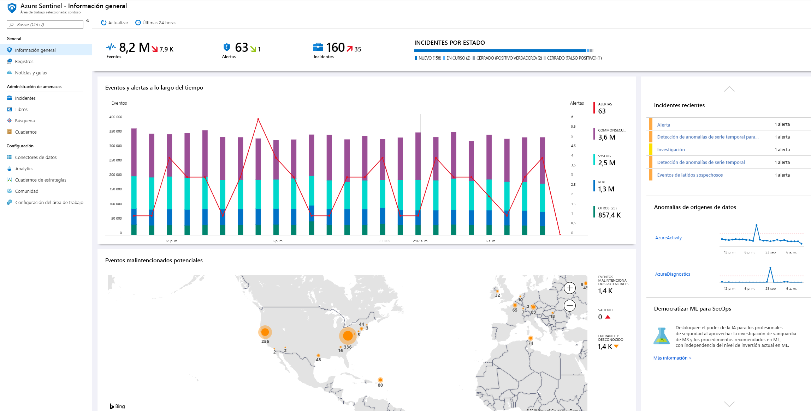
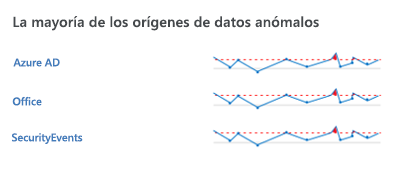
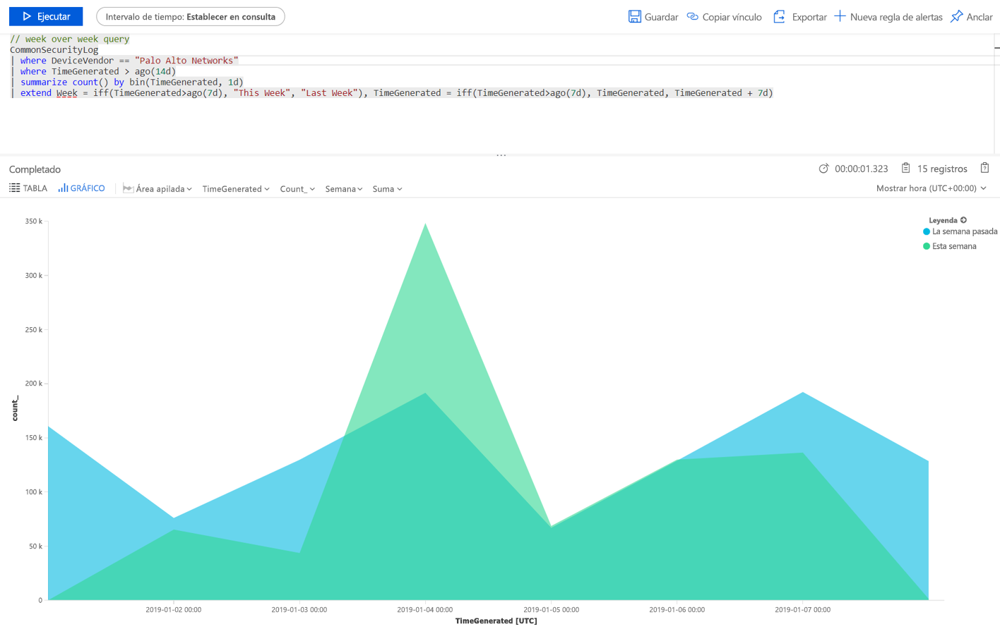
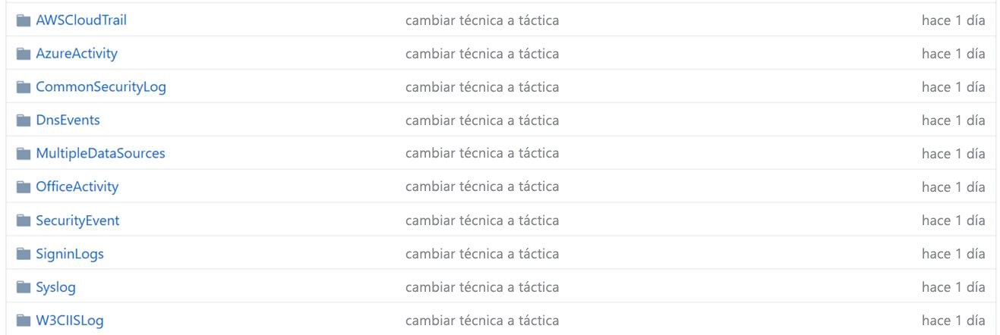
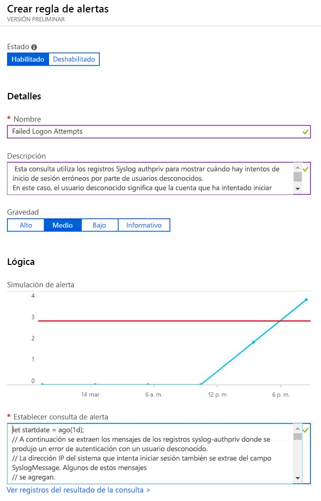

# Inicio rápido: Introducción a Azure Sentinel (versión preliminar)

> [!IMPORTANT]
> Azure Sentinel se encuentra actualmente en versión preliminar pública.
> Esta versión preliminar se ofrece sin Acuerdo de Nivel de Servicio y no se recomienda para cargas de trabajo de producción. Es posible que algunas características no sean compatibles o que tengan sus funcionalidades limitadas. Para más información, consulte [Términos de uso complementarios de las Versiones Preliminares de Microsoft Azure](https://azure.microsoft.com/support/legal/preview-supplemental-terms/).

En este inicio rápido, aprenderá a ver y supervisar rápidamente lo que sucede en su entorno mediante Azure Sentinel. Después de conectar los orígenes de datos a Azure Sentinel, obtendrá una visualización y un análisis instantáneos de los datos, así sabrá lo que sucede en todos los orígenes de datos conectados. Azure Sentinel ofrece paneles que le proporcionan todo el poder de las herramientas que ya están disponibles en Azure, así como tablas y gráficos que están integrados para ofrecerle análisis de sus registros y consultas. Puede usar paneles integrados o crear un panel fácilmente desde cero o a partir de un panel ya existente. 

## Obtener visualización

Para visualizar y obtener análisis de lo que sucede en su entorno, primero eche un vistazo al panel de información general para hacerse una idea de la posición de seguridad de su organización. Puede hacer clic en cada elemento de estos iconos para explorar en profundidad los datos sin procesar desde los que se crean. Para ayudar a reducir el ruido y minimizar el número de alertas que tiene que revisar e investigar, Azure Sentinel emplea una técnica de fusión para correlacionar alertas con casos. Los **casos** son grupos de alertas relacionadas que, juntas, crean una incidencia procesable que se puede investigar y resolver.

- En Azure Portal, seleccione Azure Sentinel y, luego, seleccione el área de trabajo que quiere supervisar.

  

- La barra de herramientas de la parte superior le indica cuántos eventos obtuvo durante el período de tiempo seleccionado y lo compara con las 24 horas anteriores. A partir de estos eventos, la barra de herramientas le indica las alertas que se desencadenaron (el número pequeño representa los cambios en las últimas 24 horas) y, luego, le indica cuántos de esos eventos están abiertos, en curso y cerrados. Compruebe que no haya un ascenso o descenso destacables en el número de eventos. Si se produce un descenso, es posible que una de las conexiones haya dejado de informar a Azure Sentinel. Si hay un ascenso, puede que haya ocurrido algo sospechoso. Vea si tiene nuevas alertas.

   

El cuerpo principal de la página de información general ofrece conclusiones de un vistazo sobre el estado de seguridad del área de trabajo:

- **Eventos y alertas con el tiempo**: muestra el número de eventos y cuántas alertas se crearon a partir de ellos. Si observa un pico inusual, examine las alertas al respecto; si hay algo raro donde hay un pico en los eventos, pero no hay alertas, podría ser motivo de preocupación.

- **Posibles eventos malintencionados**: cuando se detecta tráfico desde orígenes que se sabe que son malintencionados, Azure Sentinel le avisa en el mapa. Si la alerta es naranja, se trata del tráfico entrante: alguien está intentando acceder a su organización desde una dirección IP malintencionada conocida. Si observa actividad saliente (rojo), significa que los datos de la red se están transmitiendo fuera de la organización a una dirección IP malintencionada conocida.

   

- **Casos recientes**: para ver los casos recientes, su gravedad y el número de alertas asociadas con el caso. Si observa como un pico repentino en un tipo de alerta específico, podría significar que hay un ataque activado actualmente en ejecución. Por ejemplo, si tiene un pico repentino de 20 eventos Pass-the-hash procedentes de Azure ATP, es posible que alguien esté intentando atacarle.

- **Anomalías del origen de datos**: los analistas de datos de Microsoft crean modelos que examinan constantemente los datos de los orígenes de datos en busca de anomalías. Si no hay ninguna anomalía, no se muestra nada. Si se detectan anomalías, debe analizarlas a fondo para ver lo que ha sucedido. Por ejemplo, haga clic en el pico de actividad de Azure. Puede hacer clic en **Chart** (Gráfico) para ver el pico que ha ocurrido y, luego, filtrar por las actividades que se han producido durante ese período de tiempo para ver la causa.

   

## Uso de los paneles integrados

Los paneles integrados proporcionan datos integrados procedentes de orígenes de datos conectados y le permiten analizar en profundidad los eventos generados en esos servicios. Los paneles integrados incluyen el de Azure AD, eventos de actividad de Azure y locales, que pueden ser datos de eventos de Windows de servidores, de alertas de primera entidad o de terceros, incluidos los registros de tráfico, Office 365 y protocolos poco seguros basados en eventos de Windows.

1. En **Settings** (Configuración), seleccione **Dashboards** (Paneles). En **Installed** (Instalado), puede ver todos los paneles instalados. En **All** (Todos), puede ver la galería entera de paneles integrados que están disponibles para su instalación. 
2. Busque un panel específico ver la lista completa y una descripción de lo que ofrece cada uno. 
3. Suponiendo que usa Azure AD, para comenzar a trabajar con Azure Sentinel, se recomienda que instale al menos los paneles siguientes:
   - **Azure AD**: use uno de estos paneles o ambos:
       - **Inicios de sesión de Azure AD**: analiza los inicios de sesión con el tiempo para ver si hay anomalías. Este panel proporciona los errores de inicio de sesión de las aplicaciones, los dispositivos y las ubicaciones de forma que pueda advertir de un vistazo si sucede algo inusual. Preste atención cuando se producen varios errores de inicio de sesión. 
       - **Registros de auditoría de Azure AD**: analiza las actividades de administración, como los cambios en los usuarios (agregar, quitar, etc.), la creación de grupos y las modificaciones.  

   - Agregue un panel para su firewall. Por ejemplo, agregar el panel Palo Alto. El panel analiza el tráfico de firewall, proporciona correlaciones entre los datos de firewall y los eventos de amenazas y resalta los eventos sospechosos entre entidades. Los paneles proporcionan información sobre las tendencias en el tráfico y le permite explorar en profundidad los resultados y filtrarlos. 

      

Puede personalizar los paneles mediante la edición del  de la consulta principal. Puede hacer clic en el  para ir a [Log Analytics y editar ahí la consulta](../azure-monitor/log-query/get-started-portal.md); y puede seleccionar el botón de puntos suspensivos (...) y seleccionar **Customize tile data** (Personalizar los datos del icono), que le permite editar el filtro de tiempo principal, o quitar determinados iconos del panel.

Para más información sobre cómo trabajar con consultas, consulte [Tutorial: Visualización de datos en Log Analytics](../azure-monitor/learn/tutorial-logs-dashboards.md)

### Agregar un nuevo icono

Si quiere agregar un nuevo icono, puede agregarlo a un panel existente (uno que haya creado o uno integrado de Azure Sentinel). 
1. En Log Analytics, cree un icono mediante las instrucciones que encontrará en [Tutorial: Visualización de datos en Log Analytics](../azure-monitor/learn/tutorial-logs-dashboards.md). 
2. Después de crear el icono, en **Pin** (Anclar), seleccione el panel en el que quiere que aparezca el icono.

## Creación de paneles
Puede crear un panel desde cero o usar un panel integrado como base para un nuevo panel.

1. Para crear un panel desde cero, seleccione **Dashboards** (Paneles) y, a continuación, **+New dashboard** (+Nuevo panel).
2. Seleccione la suscripción en la que se crea el panel y asígnele un nombre descriptivo. Cada panel es como cualquier otro recurso de Azure, y puede asignarle roles (RBAC) para definir y limitar quién puede tener acceso. 
3. Para habilitarlo y mostrarlo en los paneles a los que anclar las visualizaciones, debe compartirlo. Haga clic en **Share** (Compartir) y, luego, en **Manage users** (Administrar usuarios). 
 
1. Use **Check access** (Comprobar acceso) y **Role assignments** (Asignaciones de roles) como haría con cualquier otro recurso de Azure. Para más información, consulte [Uso compartido de paneles de Azure mediante el control de acceso basado en rol](../azure-portal/azure-portal-dashboard-share-access.md).

## Ejemplos de nuevos paneles

La siguiente consulta de ejemplo le permite comparar las tendencias del tráfico entre semanas. Puede cambiar fácilmente en el proveedor de dispositivos y el origen de datos en que se ejecutará la consulta. En este ejemplo se usa SecurityEvent de Windows, pero puede cambiarlo por AzureActivity, CommonSecurityLog o cualquier otro firewall.

     |where DeviceVendor = = "Palo Alto Networks":
      // week over week query
      SecurityEvent
      | where TimeGenerated > ago(14d)
      | summarize count() by bin(TimeGenerated, 1d)
      | extend Week = iff(TimeGenerated>ago(7d), "This Week", "Last Week"), TimeGenerated = iff(TimeGenerated>ago(7d), TimeGenerated, TimeGenerated + 7d)

Puede que quiera crear una consulta que incorpore datos de varios orígenes. Puede crear una consulta que examine los registros de auditoría de Azure Active Directory de los nuevos usuarios que acaba de crear y que luego compruebe los registros de Azure para ver si el usuario comenzó a realizar cambios en la asignación de roles al cabo de 24 horas de la creación. En este panel aparecería esa actividad sospechosa:

    AuditLogs
    | where OperationName == "Add user"
    | project AddedTime = TimeGenerated, user = tostring(TargetResources[0].userPrincipalName)
    | join (AzureActivity
    | where OperationName == "Create role assignment"
    | project OperationName, RoleAssignmentTime = TimeGenerated, user = Caller) on user
    | project-away user1

Puede crear distintos paneles según el rol de la persona que examina los datos y lo que busca. Por ejemplo, puede crear un panel para el administrador de red que incluya los datos del firewall. También puede crear paneles según la frecuencia con la que quiera verlos, si hay cosas que quiera revisar diariamente, y otros elementos que quiera comprobar una vez cada hora; por ejemplo, podría querer examinar sus inicios de sesión de Azure AD cada hora para detectar anomalías. 

## Creación de nuevas detecciones

Genere detecciones en los [orígenes de datos que ha conectado a Azure Sentinel](connect-data-sources.md) para investigar las amenazas de su organización.

Cuando cree una nueva detección, aproveche las detecciones integradas diseñadas por los investigadores de seguridad de Microsoft que se adapten a los orígenes de datos que ha conectado.

1. [En la Comunidad de GitHub](https://github.com/Azure/Azure-Sentinel/tree/master/Detections) vaya a la carpeta de **detecciones** y seleccione las carpetas pertinentes.
   
 
3.  Vaya a la pestaña **Analytics** y seleccione **Agregar**.
   

3.  Copie todos los parámetros en la regla y haga clic en **Crear**.
   

 
## Pasos siguientes
En este inicio rápido, ha aprendido cómo empezar a usar Azure Sentinel. Siga con el tutorial sobre [cómo detectar amenazas](tutorial-detect-threats.md).
> [!div class="nextstepaction"]
> [Detecte amenazas](tutorial-detect-threats.md) para automatizar sus respuestas a estas.

