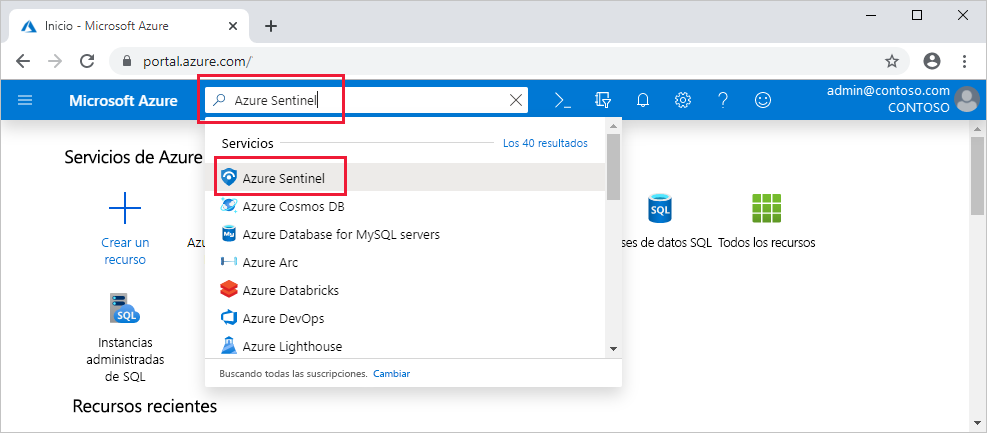

# Inicio rápido: Incorporación de Azure Sentinel

En este tutorial de inicio rápido, aprenderá cómo incorporar Azure Sentinel. 

Para incorporarse a Azure Sentinel, primero debe habilitarlo y, después, conectar sus orígenes de datos. Azure Sentinel llega con varios conectores para soluciones de Microsoft que están disponibles inmediatamente y proporcionan integración en tiempo real; por ejemplo, para soluciones de Microsoft Threat Protection y orígenes de Microsoft 365, como Office 365, Azure AD, Azure ATP y Microsoft Cloud App Security, entre muchos otros. Además, hay conectores integrados al amplio ecosistema de seguridad para soluciones que no son de Microsoft. También puede usar el formato de evento común, Syslog o las API de REST para conectar los orígenes de datos con Azure Sentinel.  

Después de conectar los orígenes de datos, puede elegir de una galería de libros creados de forma experta que exponen información basada en los datos. Estos libros se pueden personalizar fácilmente en función de sus necesidades.

>[!IMPORTANT] 
> Para obtener información sobre los cargos que se producen al usar Azure Sentinel, consulte los [precios de Azure Sentinel](https://azure.microsoft.com/pricing/details/azure-sentinel/).
  

## Requisitos previos globales

- Suscripción activa de Azure. Si no tiene una, cree una [cuenta gratuita](https://azure.microsoft.com/free/?WT.mc_id=A261C142F) antes de comenzar.

- Área de trabajo de Log Analytics. Aprenda a [crear un área de trabajo de Log Analytics](../log-analytics/log-analytics-quick-create-workspace.md). Para obtener más información sobre las áreas de trabajo de Log Analytics, consulte [Diseño de su implementación de Azure Monitor Logs](../azure-monitor/platform/design-logs-deployment.md).

- Para habilitar Azure Sentinel, necesita permisos de colaborador en la suscripción en la que reside el área de trabajo de Azure Sentinel. 
- Para usar Azure Sentinel, necesita permisos de colaborador o lector en el grupo de recursos al que pertenece el área de trabajo.
- Es posible que se necesiten permisos adicionales para conectarse a orígenes de datos específicos.
- Azure Sentinel es un servicio de pago. Para más información sobre precios, consulte [Acerca de Azure Sentinel](https://go.microsoft.com/fwlink/?linkid=2104058).
 
## Habilitar Azure Sentinel 

1. Inicie sesión en Azure Portal. Asegúrese de que la suscripción en la que se crea Azure Sentinel está seleccionada.

1. Busque y seleccione **Azure Sentinel**.

   

1. Seleccione **Agregar**.

1. Seleccione el área de trabajo que quiere usar o cree una nueva. Puede ejecutar Azure Sentinel en más de un área de trabajo, pero los datos se aíslan en un área de trabajo.

   

   >[!NOTE] 
   > - Las áreas de trabajo predeterminadas creadas por Azure Security Center no aparecerán en la lista; no puede instalar Azure Sentinel en ellas.
   > - Azure Sentinel se puede ejecutar en áreas de trabajo de cualquier [región con disponibilidad general de Log Analytics](https://azure.microsoft.com/global-infrastructure/services/?products=monitor), excepto en las regiones de China, Alemania y Azure Government. Los datos generados por Azure Sentinel (como incidentes, marcadores y reglas de alertas, que pueden contener algunos datos de clientes procedentes de estas áreas de trabajo) se guardan en la región Oeste de Europa (para las áreas de trabajo ubicadas en Europa) o en la de Este de EE. UU. (para todas las áreas de trabajo ubicadas en Estados Unidos, así como en cualquier otra región excepto Europa).

1. Seleccione **Agregar Azure Sentinel**.
  

## Conexión con orígenes de datos

Azure Sentinel crea la conexión a aplicaciones y servicios al conectar con el servicio y reenviar los eventos y registros a Azure Sentinel. Para equipos y máquinas virtuales, puede instalar el agente de Azure Sentinel que recopila los registros y los reenvía a Azure Sentinel. Para los firewalls y servidores proxy, Azure Sentinel usa un servidor Linux Syslog. El agente está instalado en él y, desde él, recopila los archivos de registro y los reenvía a Azure Sentinel. 
 
1. Haga clic en **Recopilación de datos**.
2. Hay un icono para cada origen de datos al que puede conectarse. 
Por ejemplo, haga clic en **Azure Active Directory**. Si se conecta a este origen de datos, transmitirá todos los registros de Azure AD a Azure Sentinel. Puede seleccionar qué tipo de registros quiere obtener: de inicio de sesión o de auditoría.  
En la parte inferior, Azure Sentinel proporciona recomendaciones sobre qué libros debería instalar para cada conector, para que pueda obtener información interesante de los datos.   Siga las instrucciones de instalación o [consulte la guía de conexión relevante](connect-data-sources.md) para obtener más información. Para obtener información acerca de los conectores de datos, vea [Conexión de servicios de Microsoft](connect-data-sources.md).

Una vez conectados los orígenes de datos, los datos comienzan a transmitirse a Azure Sentinel y podrá comenzar a trabajar con ellos. Puede ver los registros en los [paneles integrados](quickstart-get-visibility.md) y comenzar a crear consultas en Log Analytics para [investigar los datos](tutorial-investigate-cases.md).

## Pasos siguientes
En este documento, ha aprendido cómo conectarse a orígenes de datos de Azure Sentinel. Para más información sobre Azure Sentinel, consulte los siguientes artículos:
- Aprenda a [obtener visibilidad de los datos y de posibles amenazas](quickstart-get-visibility.md).
- Empiece a [detectar amenazas con Azure Sentinel](tutorial-detect-threats-built-in.md).
- Transmita datos desde [dispositivos de formato de evento común](connect-common-event-format.md) a Azure Sentinel.
