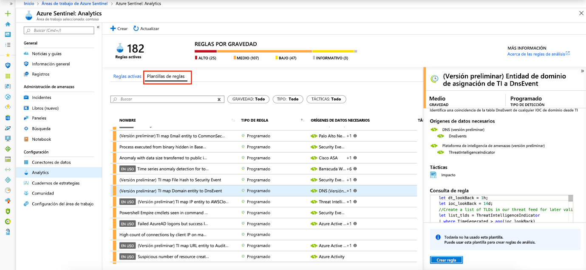

# Tutorial: Detección de amenazas integrada

> [!IMPORTANT]
> La detección de amenazas integrada se encuentra actualmente en versión preliminar pública.
> Esta característica se ofrece sin contrato de nivel de servicio y no se recomienda para cargas de trabajo de producción.
> Para más información, consulte [Términos de uso complementarios de las Versiones Preliminares de Microsoft Azure](https://azure.microsoft.com/support/legal/preview-supplemental-terms/).

Después de  [conectar los orígenes de datos](quickstart-onboard.md) a Azure Sentinel, querrá recibir una notificación cuando suceda algo sospechoso. Para que pueda hacer esto, Azure Sentinel le proporciona plantillas integradas listas para usarse. Estas plantillas fueron diseñadas por un equipo de expertos y analistas en seguridad de Microsoft basándose en amenazas conocidas, vectores de ataque habituales y cadenas de escalado de actividades sospechosas. Después de habilitar estas plantillas, ellas se encargarán de buscar automáticamente las actividades que parezcan sospechosas en el entorno. Muchas de las plantillas se pueden personalizar para buscar o filtrar actividades, según sus necesidades. Las alertas generadas por estas plantillas crean incidentes que puede asignar e investigar en su entorno.

Este tutorial ayuda a detectar amenazas con Azure Sentinel:

> [!div class="checklist"]
> * Usar detecciones integradas
> * Automatizar las respuestas frente a amenazas

## Acerca de las detecciones integradas

Para ver todas las detecciones estándar, vaya a **Análisis** y, después, a **Rule templates** (Plantillas de reglas). Esta pestaña contiene todas las reglas integradas de Azure Sentinel.

   

Están disponibles los siguientes tipos de plantilla:

- **Seguridad de Microsoft**: las plantillas de seguridad de Microsoft crean automáticamente incidentes de Azure Sentinel a partir de las alertas generadas en otras soluciones de seguridad de Microsoft, en tiempo real. Puede usar las reglas de seguridad de Microsoft como plantilla para crear nuevas reglas con una lógica parecida. Para más información sobre las reglas de seguridad, consulte [Creación automática de incidentes a partir de alertas de seguridad de Microsoft](create-incidents-from-alerts.md).
- **Fusión**: basadas en la tecnología de fusión y detección avanzada de ataques de varias fases de Azure Sentinel, usa algoritmos de aprendizaje automático escalables que pueden correlacionar muchas alertas y eventos de baja fidelidad de varios productos con incidentes útiles y de alta fidelidad. La fusión está habilitada de manera predeterminada. Dado que la lógica está oculta, no se puede usar esta como plantilla para crear más de una regla.
- **Análisis de comportamiento de aprendizaje automático**: estas plantillas se basan en algoritmos de aprendizaje automático de Microsoft, por lo que no puede ver la lógica interna de cómo funcionan y cuándo se ejecutan. Dado que la lógica está oculta, no se puede usar esta como plantilla para crear más de una regla.
-   **Programadas**: las reglas analíticas programadas son consultas programadas escritas por expertos de seguridad de Microsoft. Puede ver la lógica de consulta y realizar cambios en ella. Puede usar las reglas programadas como plantilla para crear nuevas reglas con una lógica parecida.

## Usar detecciones integradas

1. Para usar una plantilla integrada, haga clic en **Crear regla** para crear una nueva regla activa basada en esa plantilla. Cada entrada incluye una lista de los orígenes de datos necesarios que se comprueban automáticamente y esto puede dar lugar a que se deshabilite la opción **Crear regla**.
  
   
 
1. Se abre el Asistente para crear reglas, según la plantilla seleccionada. Todos los detalles se rellenan automáticamente y, en el caso de las **reglas programadas** o las **reglas de seguridad de Microsoft**, puede personalizar la lógica para que se adapte mejor a su organización o crear reglas adicionales basadas en la plantilla integrada. Después de seguir los pasos del Asistente para crear reglas y terminar de crear una regla basada en la plantilla, la nueva regla aparece en la pestaña **Active rules** (Reglas activas).

Para más información sobre los campos del asistente, consulte [Tutorial: Creación de reglas de análisis personalizadas para detectar amenazas sospechosas](tutorial-detect-threats-custom.md).

## Pasos siguientes
En este tutorial ha aprendido a detectar amenazas casos mediante Azure Sentinel. 

Para aprender a automatizar las respuestas a las amenazas, consulte [Configuración de respuestas automatizadas frente a amenazas en Azure Sentinel](tutorial-respond-threats-playbook.md).

