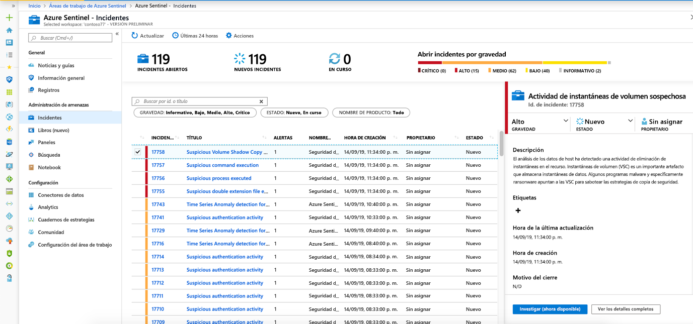
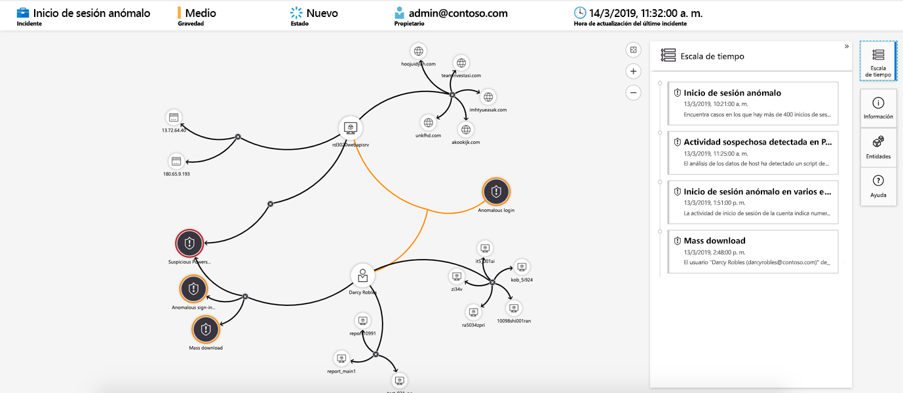

# Tutorial: Investigación de incidentes con Azure Sentinel

> [!IMPORTANT]
> El gráfico de investigación está actualmente en versión preliminar pública.
> Esta característica se ofrece sin contrato de nivel de servicio y no se recomienda para cargas de trabajo de producción.
> Para más información, consulte [Términos de uso complementarios de las Versiones Preliminares de Microsoft Azure](https://azure.microsoft.com/support/legal/preview-supplemental-terms/).

Este tutorial le ayuda a investigar incidentes con Azure Sentinel. Después de conectar los orígenes de datos a Azure Sentinel, querrá recibir una notificación cuando suceda algo sospechoso. Para ello, Azure Sentinel le permite crear reglas de alerta avanzadas, que generan incidentes que se pueden asignar e investigar.

En este artículo se describe:
> [!div class="checklist"]
> * Investigación de incidentes
> * Uso del gráfico de investigación
> * Respuesta a amenazas

Un incidente puede incluir varias alertas, a modo de agregado de todas las pruebas relevantes en una investigación en concreto. Los incidentes se crearán en función de las reglas de análisis que haya creado en la página **Analytics** (Análisis). Las propiedades relacionadas con alertas, como la gravedad y el estado, se establecen en el nivel de incidente. Después de indicar a Azure Sentinel qué tipos de amenazas está buscando y cómo detectarlas, puede supervisar las amenazas que se detecten investigando cada incidente.

## Prerrequisitos
Solo podrá investigar el incidente si ha usado los campos de asignación de entidades al configurar la regla de análisis. El gráfico de investigación requiere que el incidente original incluya entidades.

## Investigación de incidentes

1. Seleccione **Incidentes**. La página **Incidentes** le permite saber cuántos incidentes tiene, cuántos están abiertos, cuántos están establecidos en **En curso** y cuántos se han cerrado. De cada incidente puede ver la hora a la que tuvo lugar y su estado. Valore la gravedad para decidir qué incidentes abordar primero.

    

1. Puede filtrar los incidentes según sea necesario, por ejemplo, por estado o gravedad.

1. Para iniciar una investigación, seleccione un incidente específico. A la derecha, puede ver información detallada del incidente, como la gravedad o un resumen del número de entidades implicadas, los eventos sin procesar que desencadenaron este incidente y el identificador único del mismo.

1. Para ver más detalles sobre las alertas y las entidades del incidente, seleccione **View full details** (Ver detalles completos) en la página del incidente y revise las pestañas correspondientes donde se resume la información del incidente. En la pestaña **Alertas**, revise la alerta en sí. Puede ver toda la información relevante sobre la alerta: la consulta que la ha desencadenado, el número de resultados devueltos por consulta y la capacidad de ejecutar cuadernos de estrategias en las alertas. Para explorar el incidente más en profundidad, seleccione el número de **eventos**. Esto abre la consulta que ha generado los resultados y los eventos que han desencadenado la alerta en Log Analytics. En la pestaña **Entities** (Entidades), puede ver todas las entidades que ha asignado como parte de la definición de regla de alerta.

    

1. Si está investigando un incidente de manera activa, una buena idea consiste en establecer el estado del incidente en **En curso** hasta que lo cierre.

1. Los incidentes se pueden asignar a un usuario específico. Para asignar un propietario a un incidente, hay que establecer el campo **Incident owner** (Propietario del incidente). Todos los incidentes se inician sin tener un propietario asignado. También puede agregar comentarios para que otros analistas puedan comprender lo que ha investigado y sus preocupaciones en torno al incidente.

    

1. Seleccione **Investigar** para ver el mapa de investigación.

## Uso del gráfico de investigación para un análisis en profundidad

El gráfico de investigación permite a los analistas formular las preguntas adecuadas para cada investigación. El gráfico de investigación le ayuda a comprender el ámbito y a identificar la causa principal de una posible amenaza de seguridad al correlacionar los datos pertinentes con las entidades implicadas. Puede profundizar e investigar cualquier entidad presentada en el gráfico seleccionándola y eligiendo entre las diferentes opciones de expansión.  
  
El gráfico de investigación le proporciona:

- **Contexto visual de datos sin procesar**: El gráfico visual y dinámico, muestra las relaciones de entidad extraídas automáticamente de los datos sin procesar. Esto le permite ver fácilmente las conexiones entre distintos orígenes de datos.

- **Detección del ámbito completo de la investigación**: Amplíe el ámbito de la investigación mediante consultas de exploración integradas para exponer el ámbito completo de una infracción de seguridad.

- **Pasos de investigación integrados**: Use opciones de exploración predefinidas para asegurarse de que está formulando las preguntas adecuadas en caso de una amenaza.

Para usar el gráfico de investigación:

1. Seleccione un incidente y, a continuación, seleccione **Investigar**. Esto le llevará al gráfico de investigación. El gráfico proporciona un mapa ilustrativo de las entidades conectadas directamente a la alerta y de cada recurso conectado más allá.

   > [!IMPORTANT] 
   > Solo podrá investigar el incidente si ha usado los campos de asignación de entidades al configurar la regla de análisis. El gráfico de investigación requiere que el incidente original incluya entidades.

   

1. Seleccione una entidad para abrir el panel**Entidades** para que pueda revisar la información de esa entidad.

    
  
1. Amplíe su investigación manteniendo el puntero sobre cada entidad para mostrar una lista de preguntas diseñadas por nuestros expertos y analistas en seguridad clasificadas por tipo de entidad para profundizar en la investigación. Llamamos a estas opciones **consultas de exploración**.

    

   Por ejemplo, en un equipo puede solicitar alertas relacionadas. Si selecciona una consulta de exploración, los derechos resultantes se agregan de nuevo al gráfico. En este ejemplo, al seleccionar **Related Alerts** (Alertas relacionadas) se devolvieron las siguientes alertas en el gráfico:

    

1. Para cada consulta de exploración, puede seleccionar la opción para abrir los resultados de eventos sin procesar y la consulta usada en Log Analytics, seleccionando **Eventos\>** .

1. Para comprender el incidente, el gráfico le proporciona una escala de tiempo paralela.

    

1. Mantenga el puntero sobre la escala de tiempo para ver qué elementos del gráfico se produjeron en qué momento.

    

## Pasos siguientes
En este tutorial ha aprendido cómo empezar a investigar incidentes mediante Azure Sentinel. Siga con el tutorial sobre [cómo responder a amenazas usando cuadernos de estrategias automatizados](tutorial-respond-threats-playbook.md).
> [!div class="nextstepaction"]
> [Responda a amenazas](tutorial-respond-threats-playbook.md) para automatizar sus respuestas a estas.

