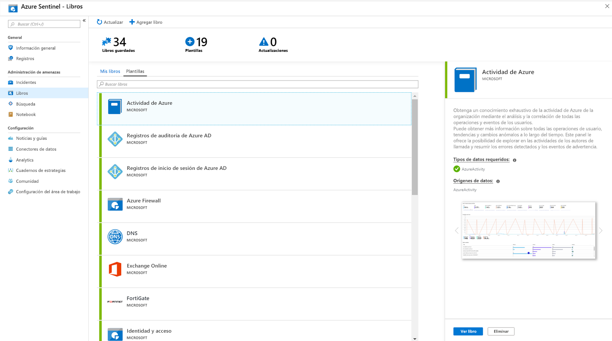

# Tutorial: Supervisión de los datos

Después de que haya [conectado los orígenes de datos](quickstart-onboard.md) a Azure Sentinel, puede supervisar los datos mediante la integración de Azure Sentinel con los libros de Azure Monitor, lo que proporciona versatilidad al crear paneles personalizados. Aunque los libros se muestran de manera diferente en Azure Sentinel, puede que le resulte útil ver cómo [crear informes interactivos con los libros de Azure Monitor](../azure-monitor/app/usage-workbooks.md). Azure Sentinel permite crear libros personalizados en los datos y también incluye plantillas de libro integradas que permiten obtener información rápidamente en los datos en cuanto se conecta con un origen de datos.

Este tutorial le ayudará a supervisar los datos en Azure Sentinel.
> [!div class="checklist"]
> * Uso de libros integrados
> * Creación de libros

## Requisitos previos

- Debe tener al menos permisos de lector de libros o de colaborador de libros en el grupo de recursos del área de trabajo de Azure Sentinel.

> [!NOTE]
> Los libros que puede ver en Azure Sentinel se guardan en el grupo de recursos del área de trabajo de Azure Sentinel y se etiquetan según el área de trabajo en el que se crearon.

## Uso de libros integrados

1. Vaya a **Libros** y, a continuación, seleccione **Plantillas** para ver la lista completa de los libros integrados de Azure Sentinel. Para ver cuáles son importantes para los tipos de datos que ha conectado, el campo **Tipos de datos requeridos** de cada libro mostrará el tipo de datos junto a una marca de verificación verde si ya ha transmitido los datos correspondientes a Azure Sentinel.
  
1. Haga clic en **Mostrar panel** para ver la plantilla rellenada con los datos.
  
1. Para editar el libro, seleccione **Guardar** y, a continuación, seleccione la ubicación en la que desea guardar el archivo JSON de la plantilla. 

   > [!NOTE]
   > Esto crea un recurso de Azure basado en la plantilla correspondiente y guarda el archivo JSON de la plantilla en sí pero no los datos.

1. Seleccione **Mostrar panel**. Después, haga clic en el botón **Editar** en la parte superior. Ahora puede editar el libro y personalizarlo según sus necesidades. Para más información sobre cómo personalizar el libro, consulte cómo [Crear informes interactivos con libros de Azure Monitor](../azure-monitor/app/usage-workbooks.md).

1. Después de realizar los cambios, puede guardar el libro. 

1. También puede clonar el libro: Seleccione **Editar** y, después, **Guardar como**, asegurándose de guardarlo con otro nombre, en la misma suscripción y el mismo grupo de recursos. Estos libros aparecerán en la pestaña **Mis libros**.

## Creación de un libro

1. Vaya a **Libros** y, a continuación, seleccione **Agregar libro** para crear un nuevo libro desde el principio.
  

1. Para editar el libro, seleccione **Editar** y, a continuación, agregue texto, consultas y parámetros según sea necesario. Para más información sobre cómo personalizar el libro, consulte cómo [Crear informes interactivos con libros de Azure Monitor](../azure-monitor/app/usage-workbooks.md). 

1. Al compilar una consulta, establezca **Origen de datos** en **Registros**, el **tipo de recurso** en **Log Analytics** y, después, elija las áreas de trabajo apropiadas. 

1. Después de crear el libro, guárdelo asegurándose de que lo guarda en el grupo de recursos y la suscripción del área de trabajo de Azure Sentinel.

1. Si desea permitir que otros usuarios de su organización utilicen el libro, en **Guardar en** seleccione **Informes compartidos**. Si desea que este libro esté disponible solo para usted, seleccione **Mis informes**.

1. Para alternar entre los libros del área de trabajo, puede seleccionar **Abrir** (Cambiar libros) en el panel superior de cualquier libro. En la ventana que se abre a la derecha, cambie entre los diferentes libros.

   

## Eliminación de libros

Puede eliminar libros que se crearon a partir de una plantilla de Azure Sentinel. 

Para eliminar un libro personalizado, en la página Libros, seleccione el libro guardado que quiera eliminar y seleccione **Eliminar**. Esto eliminará el libro guardado.

> [!NOTE]
> Esto elimina el recurso y los cambios realizados en la plantilla. La plantilla original seguirá estando disponible.

## Pasos siguientes

En este tutorial, ha aprendido a ver los datos en Azure Sentinel.

Para aprender a automatizar las respuestas a las amenazas, consulte [Configuración de respuestas automatizadas frente a amenazas en Azure Sentinel](tutorial-respond-threats-playbook.md).
