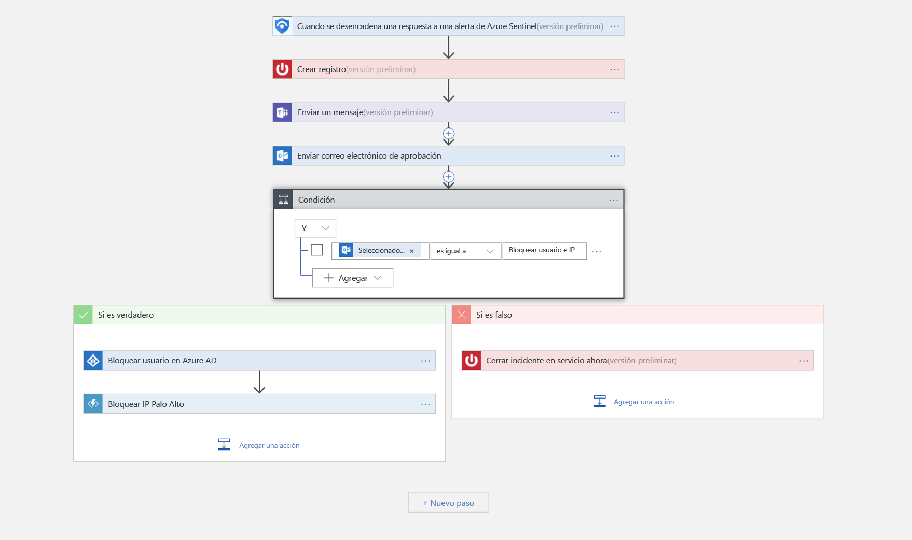

# Tutorial: Configuración de respuestas automatizadas frente a amenazas en Azure Sentinel (versión preliminar)

> [!IMPORTANT]
> Azure Sentinel se encuentra actualmente en versión preliminar pública.
> Esta versión preliminar se ofrece sin Acuerdo de Nivel de Servicio y no se recomienda para cargas de trabajo de producción. Es posible que algunas características no sean compatibles o que tengan sus funcionalidades limitadas. Para más información, consulte [Términos de uso complementarios de las Versiones Preliminares de Microsoft Azure](https://azure.microsoft.com/support/legal/preview-supplemental-terms/).

Este tutorial le ayuda a usar cuadernos de estrategias de seguridad en Azure Sentinel para establecer respuestas automatizadas frente a amenazas en problemas relacionados con la seguridad detectados por Azure Sentinel.

> [!div class="checklist"]
> * Comprender los cuadernos de estrategias
> * Crear un cuaderno de estrategias
> * Ejecutar un cuaderno de estrategias
> * Automatizar las respuestas frente a amenazas

## ¿Qué es un cuaderno de estrategias de seguridad en Azure Sentinel?

Un cuaderno de estrategias de seguridad es una colección de procedimientos que se pueden ejecutar desde Azure Sentinel en respuesta a una alerta. Un cuaderno de estrategias de seguridad puede ayudar a automatizar y orquestar la respuesta y se puede ejecutar manualmente o establecerse para que se ejecute automáticamente cuando se desencadenan alertas específicas. Los cuadernos de estrategias de seguridad de Azure Sentinel se basan en [Azure Logic Apps](https://docs.microsoft.com/azure/logic-apps/logic-apps-what-are-logic-apps), lo que significa que obtendrá toda la versatilidad, personalización y plantillas integradas de Logic Apps. Cada cuaderno de estrategias se crea para la suscripción específica que elija, pero cuando observe la página Cuadernos de estrategias, verá todos los cuadernos de estrategias en las suscripciones seleccionadas.

> [!NOTE]
> Los cuadernos de estrategias aprovechan Azure Logic Apps, por lo que se aplican cargos. Visite la página de precios de [Azure Logic Apps](https://azure.microsoft.com/pricing/details/logic-apps/) para más información.

Por ejemplo, si le preocupa que los atacantes malintencionados accedan a los recursos de red, puede establecer una alerta que busque direcciones IP malintencionadas que accedan a la red. A continuación, puede crear un cuaderno de estrategias que haga lo siguiente:
1. Cuando se desencadene la alerta, abra un vale en ServiceNow o en cualquier otro sistema de vales de TI.
2. Envíe un mensaje al canal de operaciones de seguridad en Microsoft Teams o Slack para asegurarse de que los analistas de seguridad son conscientes del incidente.
3. Envíe toda la información de la alerta al administrador de seguridad y al administrador de red sénior. El mensaje de correo electrónico también incluye dos botones de opción usuario: **Bloquear** u **Omitir**.
4. El cuaderno de estrategias continúa ejecutándose después de que se recibe una respuesta de los administradores.
5. Si los administradores eligen **Bloquear**, la dirección IP se bloquea en el firewall y el usuario se deshabilita en Azure AD.
6. Si elige los administradores **omitir**, se cierra la alerta en Azure Sentinel y se cierra el incidente de ServiceNow.

Los cuadernos de estrategias de seguridad se pueden ejecutar de forma manual o automática. La ejecución manual de los mismos significa que cuando obtiene una alerta, puede optar por ejecutar un cuaderno de estrategias a petición como respuesta a la alerta seleccionada. Si se ejecutan automáticamente, al crear la regla de correlación, se establece para que ejecute uno o más cuadernos de estrategias automáticamente cuando la alerta se desencadena.

## Creación de un cuaderno de estrategias de seguridad

Para crear un nuevo cuaderno de estrategias de seguridad en Azure Sentinel, siga estos pasos:

1. Abra el panel de **Azure Sentinel**.
2. En **Administración**, seleccione **Cuaderno de estrategias**.

   

3. En la página **Azure Sentinel - Cuadernos de estrategias (versión preliminar)** , haga clic en el botón **Agregar**.

    

4. En la página **Crear aplicación lógica**, escriba la información solicitada para crear la nueva aplicación lógica y haga clic en el **Crear**. 

5. En [**Diseñador de aplicación lógica** ](../logic-apps/logic-apps-overview.md), seleccione la plantilla que desea usar. Si selecciona una plantilla que necesite credenciales, tendrá que proporcionarlas. Como alternativa, puede crear un nuevo cuaderno de estrategias en blanco desde cero. Seleccione **Aplicación lógica en blanco**. 

   

6. Se abrirá el Diseñador de aplicación lógica donde puede crear una plantilla nueva o editarla. Más información sobre cómo crear un cuaderno de estrategias con [Logic Apps](../logic-apps/logic-apps-create-logic-apps-from-templates.md).

7. Si crea un cuaderno de estrategias en blanco, en el campo **Buscar todos los conectores y desencadenadores** , escriba *Azure Sentinel* y seleccione **When a response to an Azure Sentinel alert is triggered** (Cuando se desencadena una respuesta a una alerta de Azure Sentinel).  Después de crearlo, el nuevo cuaderno de estrategias aparece en la lista **Cuadernos de estrategias**. Si no aparece, haga clic en **Actualizar**. 

7. Ahora puede definir lo que ocurre cuando se desencadena el playbook. Puede agregar una acción, una condición lógica, condiciones de casos de conmutador o bucles.

   

## Ejecución de un cuaderno de estrategias de seguridad

Puede ejecutar un cuaderno de estrategias a petición.

Para ejecutar un cuaderno de estrategias a petición:

1. En la página **Cases** (Casos), seleccione un caso y haga clic en **View full details** (Ver detalles completos).

2. En la pestaña **Alertas**, haga clic en la alerta que desee para ejecutar el cuaderno de estrategias, desplácese completamente a la derecha, haga clic en **Ver cuadernos de estrategias** y seleccione un cuaderno de estrategias para **ejecutar** en el lista de cuadernos de estrategias disponibles en la suscripción. 

## Automatizar las respuestas frente a amenazas

Los equipos de SIEM y SOC pueden verse inundados con alertas de seguridad periódicamente. El volumen de las alertas generadas es tan grande que los administradores de seguridad disponibles están desbordados. Esto genera, con demasiada frecuencia, situaciones en las que no se pueden investigar muchas alertas, lo que hace que la organización sea vulnerable a ataques que pasan desapercibidos. 

Muchas de estas alertas, si no la mayoría, se ajustan a los patrones recurrentes que se pueden resolver mediante acciones de corrección específicas y definidas. Azure Sentinel ya le permite definir la corrección en los cuadernos de estrategias. También es posible establecer la automatización en tiempo real como parte de la definición del cuaderno de estrategias para que pueda automatizar completamente una respuesta definida ante alertas de seguridad determinadas. Con la automatización en tiempo real, los equipos de respuesta pueden reducir de forma significativa su carga de trabajo al automatizar completamente las respuestas rutinarias a tipos de alertas recurrentes, lo que le permite concentrarse más en las alertas singulares, en el analizar patrones, en la búsqueda de amenazas y mucho más.

Para automatizar las respuestas:

1. Elija la alerta para la que quiere automatizar la respuesta.
1. En el menú de navegación del área de trabajo de Azure Sentinel, seleccione **Análisis**.
1. Seleccione la alerta que quiere automatizar. 
1. En la página**Editar regla de alerta**, en **Real-time automation** (Automatización en tiempo real), elija el **Triggered playbook** (Cuaderno de estrategias desencadenado) que quiera ejecutar cuando se cumpla esta regla de alerta.
1. Seleccione **Guardar**.

   

## Pasos siguientes

En este tutorial, aprendió cómo ejecutar un cuaderno de estrategias en Azure Sentinel. Continúe con la sección sobre [cómo buscar proactivamente amenazas](hunting.md) mediante Azure Sentinel.

