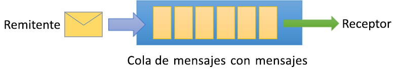
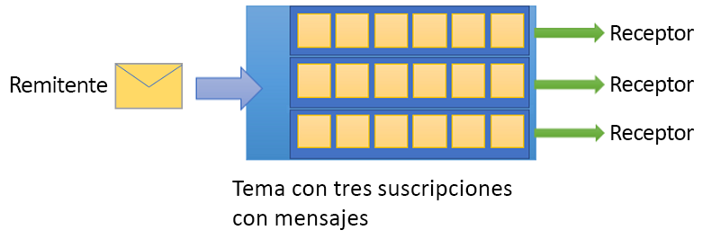

# Qué es Azure Service Bus

Microsoft Azure Service Bus es un agente de mensajes de integración empresarial completamente administrado. Service Bus puede desacoplar aplicaciones y servicios. Service Bus ofrece una plataforma confiable y segura para la transferencia asincrónica de datos y estado.

Los datos se transfieren entre distintas aplicaciones y servicios mediante *mensajes*. Un mensaje está en formato binario y puede contener JSON, XML o simplemente texto. Para más información, consulte [Integration Services](https://azure.com/integration).

Algunos escenarios de mensajería comunes son:

* *Mensajería*. Transferir datos empresariales, como pedidos de ventas o compras, diarios o movimientos de inventario.
* *Desacoplar aplicaciones*. Mejore la confiabilidad y la escalabilidad de las aplicaciones y los servicios. El cliente y el servicio no tienen que estar en línea al mismo tiempo.
* *Temas y suscripciones*. Habilite 1:*n* relaciones entre publicadores y suscriptores.
* *Sesiones de mensajes*. Implemente flujos de trabajo que requieran la ordenación de mensajes o el aplazamiento de mensajes.

## Espacios de nombres

Un espacio de nombres es un contenedor para todos los componentes de mensajería. Varias colas y temas pueden estar en un solo espacio de nombres, y los espacios de nombres suelen servir como contenedores de aplicación.

## Colas

Los mensajes se envían y se reciben desde *colas*. Las colas almacenan mensajes hasta que la aplicación receptora está disponible para recibirlos y procesarlos.

Los mensajes de las colas se ordenan y se les asigna una marca de tiempo a su llegada. Una vez aceptado, el mensaje se conserva de forma segura en almacenamiento redundante. Los mensajes se entregan en modo de *extracción* y solo entregan mensajes cuando se solicitan.

## Temas

También puede usar *temas* para enviar y recibir mensajes. Mientras que una cola se utiliza a menudo para la comunicación punto a punto, los temas son útiles en escenarios de publicación y suscripción.

Los temas pueden tener varias suscripciones independientes. Un suscriptor a un tema puede recibir una copia de cada mensaje enviado a ese tema. Las suscripciones son entidades con nombre. Las suscripciones se conservan, pero pueden expirar o eliminarse de la misma.

Es posible que no desee que las suscripciones individuales reciban todos los mensajes enviados a un tema. Si es así, puede usar *reglas* y *filtros* para definir las condiciones que desencadenan *acciones* opcionales. Puede filtrar los mensajes especificados y establecer o modificar las propiedades de los mensajes. Para más información, consulte [Filtros y acciones de temas](topic-filters.md).

## Características avanzadas

Service Bus incluye características avanzadas que le permiten resolver problemas de mensajería más complejos. En las secciones siguientes se describen algunas de estas características.

### Sesiones de mensajes

Para crear una garantía primero en entrar/primero en salir (FIFO) en Service Bus, use sesiones. Las sesiones de mensajes permiten la administración ordenada y conjunta de secuencias sin enlace de mensajes relacionados. Para más información, consulte [Sesiones de mensajes: primera en entrar, primero en salir (FIFO)](message-sessions.md).

### Artículo reenvío automático

La característica de reenvío directo encadena una cola o suscripción a otra cola o tema. Deben formar parte del mismo espacio de nombres. Con el reenvío automático, Service Bus quita automáticamente los mensajes de una cola o suscripción y los coloca en una cola o tema diferente. Para más información, consulte [Encadenamiento de Service Bus entidades con el reenvío](service-bus-auto-forwarding.md).

### Cola de mensajes fallidos

Service Bus admite una cola de mensajes fallidos (DLQ). Una cola con problemas de entrega contiene mensajes que no se pueden entregar a ningún receptor. Contiene mensajes que no se pueden procesar. Service Bus le permite quitar los mensajes de mensajes fallidos e inspeccionarlos. Para más información, consulte [Introducción a las colas de mensajes fallidos de Service Bus](service-bus-dead-letter-queues.md).

### Entrega programada

Puede enviar mensajes a una cola o un tema para el procesamiento retrasado. Puede programar un trabajo para que esté disponible para que lo procese un sistema en un momento determinado. Para más información, consulte [Mensajes programados](message-sequencing.md#scheduled-messages).

### Aplazamiento de mensajes

Un cliente de cola o suscripción puede diferir la recuperación de un mensaje hasta un momento posterior. Este aplazamiento podría deberse a circunstancias especiales en la aplicación. El mensaje permanece en la cola o la suscripción, pero se reserva. Para más información, consulte [ Aplazamiento de mensajes](message-deferral.md).

### Lotes

El procesamiento por lotes del lado cliente permite a un cliente de cola o tema retrasar el envío de un mensaje durante un período de tiempo determinado. Si el cliente envía más mensajes durante este período, los transmite en un único lote. Para más información, consulte [Procesamiento por lotes del lado cliente](service-bus-performance-improvements.md#client-side-batching).

### Transacciones

Una transacción agrupa dos o más operaciones en un *ámbito de ejecución*. Service Bus admite operaciones de agrupación en una sola entidad de mensajería dentro del ámbito de una única transacción. Una entidad de mensaje puede ser una cola, un tema o una suscripción. Para más información, consulte [Información general sobre el procesamiento de transacciones de Service Bus](service-bus-transactions.md).

### Filtrado y acciones

Los suscriptores pueden definir los mensajes que quieren recibir de un tema. Estos mensajes se especifican en forma de una o varias reglas de suscripción con nombre. Para cada condición de regla de coincidencia, la suscripción genera una copia del mensaje, que se puede anotar de manera diferente para cada regla de coincidencia. Para más información, consulte [Filtros y acciones de temas](topic-filters.md).

### Eliminación automática en estado inactivo

La eliminación automática en modo inactivo le permite especificar un intervalo de inactividad después del cual se elimina automáticamente una cola. La duración mínima es de 5 minutos. Para más información, consulte la [propiedadQueueDescription.AutoDeleteOnIdle](/dotnet/api/microsoft.servicebus.messaging.queuedescription.autodeleteonidle).

### Detección de duplicados

Un error puede hacer que el cliente tenga dudas sobre el resultado de una operación de envío. La detección de duplicados permite al remitente volver a enviar el mismo mensaje. Otra opción es para que la cola o el tema descarten las copias duplicadas. Para más información, consulte [Detección de duplicados](duplicate-detection.md).

### Protocolos de seguridad

Service Bus admite protocolos de seguridad como las [firmas de acceso compartido](service-bus-sas.md) (SAS), el [Control de acceso basado en rol](authenticate-application.md) (RBAC) y [Entidades administradas para recursos de Azure](service-bus-managed-service-identity.md).

### Recuperación ante desastres geográfica

Cuando las regiones o los centros de datos de Azure experimentan un tiempo de inactividad, la recuperación ante desastres geográfica permite que el procesamiento de datos siga funcionando en una región o un centro de datos diferentes. Para obtener más información, consulte [Recuperación ante desastres con localización geográfica de Azure Service Bus](service-bus-geo-dr.md).

### Seguridad

Service Bus admite los protocolos estándar [AMQP 1.0](service-bus-amqp-overview.md) y [HTTP/REST](/rest/api/servicebus/).

## Bibliotecas de clientes

Service Bus admite bibliotecas de cliente para [.NET](https://github.com/Azure/azure-service-bus-dotnet/tree/master), [Java](https://github.com/Azure/azure-service-bus-java/tree/master)y [JMS](https://github.com/Azure/azure-service-bus/tree/master/samples/Java/qpid-jms-client).

## Integración

Service Bus se integra completamente con los siguientes servicios de Azure:

* [Event Grid](https://azure.microsoft.com/services/event-grid/)
* [Logic Apps](https://azure.microsoft.com/services/logic-apps/)
* [Funciones de Azure](https://azure.microsoft.com/services/functions/)
* [Dynamics 365](https://dynamics.microsoft.com)
* [Azure Stream Analytics](https://azure.microsoft.com/services/stream-analytics/)

## Pasos siguientes

Para comenzar a trabajar con la mensajería de Service Bus, consulte los siguientes artículos:

* Para comparar los servicios de mensajería de Azure, consulte [Comparación de los servicios](../event-grid/compare-messaging-services.md?toc=%2fazure%2fservice-bus-messaging%2ftoc.json&bc=%2fazure%2fservice-bus-messaging%2fbreadcrumb%2ftoc.json).
* Pruebe las guías de inicio rápido para [.NET](service-bus-dotnet-get-started-with-queues.md), [Java](service-bus-java-how-to-use-queues.md)o [JMS](service-bus-java-how-to-use-jms-api-amqp.md).
* Para administrar los recursos de Service Bus, consulte [Explorador de Service Bus](https://github.com/paolosalvatori/ServiceBusExplorer/releases).
* Más información sobre los niveles Estándar y Premium y sus precios, consulte [precios de Service Bus](https://azure.microsoft.com/pricing/details/service-bus/).
* Para más información sobre el rendimiento y la latencia del nivel Premium, consulte [Mensajería Premium](https://techcommunity.microsoft.com/t5/Service-Bus-blog/Premium-Messaging-How-fast-is-it/ba-p/370722).
