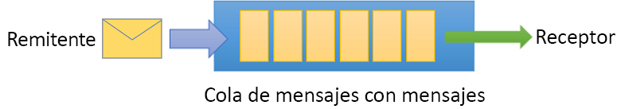
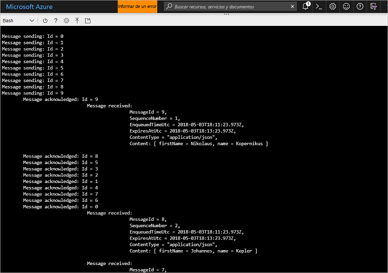

# <a name="quickstart-send-and-receive-messages-using-azure-cli-and-java"></a>Guía de inicio rápido: Envío y recepción de mensajes mediante la CLI de Azure y Java

Microsoft Azure Service Bus es un agente de mensajes de integración empresarial que proporciona mensajería segura y gran confiabilidad. Un escenario típico de Service Bus implica normalmente el desacoplamiento de dos o más aplicaciones, servicios o procesos (no es necesario que las aplicaciones estén en línea al mismo tiempo), la transferencia de los cambios de estado o de datos, y el envío de mensajes entre las aplicaciones. 

Por ejemplo, una empresa minorista puede enviar los datos de un punto de ventas a un área de operaciones o centro de distribución regional para indicar las actualizaciones de reposición y de inventario. En este caso, la aplicación cliente envía y recibe mensajes de una cola de Service Bus:



En esta guía de inicio rápido se describe cómo enviar y recibir mensajes con Service Bus, mediante la CLI de Azure y la biblioteca Java de Service Bus. Por último, si le interesa obtener más información técnica, puede [leer una explicación](#understand-the-sample-code) de los elementos clave del ejemplo de código.

Si no tiene una suscripción a Azure, puede crear una [cuenta gratuita][] antes de empezar.

[!INCLUDE [cloud-shell-try-it.md](../../includes/cloud-shell-try-it.md)]

## <a name="log-in-to-azure"></a>Inicio de sesión en Azure

Haga clic en el botón de Cloud Shell en el menú de la esquina superior derecha de Azure Portal y, en la lista desplegable **Seleccionar entorno**, seleccione **Bash**. 

## <a name="use-cli-to-create-resources"></a>Uso de la CLI para crear recursos

En Cloud Shell, desde el símbolo del sistema de Bash emita los comandos siguientes para aprovisionar los recursos de Service Bus. Asegúrese de reemplazar todos los marcadores de posición por los valores apropiados:

```azurecli-interactive
# Create a resource group
az group create --name myResourceGroup --location eastus

# Create a Service Bus messaging namespace with a unique name
namespaceName=myNameSpace$RANDOM
az servicebus namespace create \
   --resource-group myResourceGroup \
   --name $namespaceName \
   --location eastus

# Create a Service Bus queue
az servicebus queue create --resource-group myResourceGroup \
   --namespace-name $namespaceName \
   --name myQueue

# Get the connection string for the namespace
connectionString=$(az servicebus namespace authorization-rule keys list \
   --resource-group myResourceGroup \
   --namespace-name  $namespaceName \
   --name RootManageSharedAccessKey \
   --query primaryConnectionString --output tsv)
```

Después de que se ejecute el último comando, copie y pegue la cadena de conexión y el nombre de cola que ha seleccionado en una ubicación temporal como, por ejemplo, el Bloc de notas. Esta información la necesitará en el siguiente paso.

## <a name="send-and-receive-messages"></a>Envío y recepción de mensajes

Una vez que haya creado el espacio de nombres y la cola, y disponga de las credenciales necesarias, estará listo para enviar y recibir mensajes. Puede examinar el código en [esta carpeta de ejemplo de GitHub](https://github.com/Azure/azure-service-bus/tree/master/samples/Java/quickstarts-and-tutorials/quickstart-java/src/main/java/samples/quickstart/SendAndReceiveMessages.java).

1. Asegúrese de que Cloud Shell está abierto y muestra el símbolo del sistema de Bash.

2. Clone el [repositorio de GitHub de Service Bus](https://github.com/Azure/azure-service-bus/) emitiendo el comando siguiente:

   ```bash
   git clone https://github.com/Azure/azure-service-bus.git
   ```

2. Cambie el directorio actual a la carpeta de ejemplo, con barras diagonales como separadores de ruta de acceso:

   ```bash
   cd azure-service-bus/samples/Java/quickstarts-and-tutorials/quickstart-java 
   ```

3. Emita el siguiente comando para compilar la aplicación:
   
   ```bash
   mvn clean package -DskipTests
   ```

4. Para ejecutar el programa, emita el siguiente comando. Siempre y cuando no haya reiniciado el shell de bash, la variable que contiene el valor de la cadena de conexión se reemplazará automáticamente:

   ```bash
   java -jar ./target/samples.quickstart-1.0.0-jar-with-dependencies.jar -c $connectionString -q myQueue
   ```

6. Observe los 10 mensajes que se envían a la cola. Tenga en cuenta que no se garantiza el orden de los mensajes, pero puede ver los mensajes enviados y, a continuación, los confirmados y los recibidos, junto con los datos de carga:

   

## <a name="clean-up-resources"></a>Limpieza de recursos

Ejecute el siguiente comando para quitar el grupo de recursos, el espacio de nombres y todos los recursos relacionados:

```azurecli-interactive
az group delete --resource-group myResourceGroup
```

## <a name="understand-the-sample-code"></a>Descripción del código de ejemplo

Esta sección contiene información más detallada sobre las secciones principales del código de ejemplo. Puede examinar el código, ubicado en el repositorio de GitHub desde [aquí](https://github.com/Azure/azure-service-bus/blob/master/samples/Java/quickstarts-and-tutorials/quickstart-java/src/main/java/samples/quickstart/SendAndReceiveMessages.java).

### <a name="get-connection-string-and-queue"></a>Obtención de la cadena de conexión y la cola

En primer lugar, el código declara dos variables de cadena que se pasan al programa como argumentos en la línea de comandos:

```java
String ConnectionString = null;
String QueueName = null;
```

Estos valores se agregan mediante parámetros y se agregan en el método `runApp()`:

```java
public static void main(String[] args) {
    SendAndReceiveMessages app = new SendAndReceiveMessages();
    try {
        app.runApp(args);
        app.run();
    } catch (Exception e) {
        System.out.printf("%s", e.toString());
    }
    System.exit(0);
}

public void runApp(String[] args) {
    try {
        // parse connection string from command line             
        Options options = new Options();
        options.addOption(new Option("c", true, "Connection string"));
        options.addOption(new Option("q", true, "Queue Name"));
        CommandLineParser clp = new DefaultParser();
        CommandLine cl = clp.parse(options, args);
        if (cl.getOptionValue("c") != null && cl.getOptionValue("q") != null) {
            ConnectionString = cl.getOptionValue("c");
            QueueName =  cl.getOptionValue("q");
        }
        else
        {
            HelpFormatter formatter = new HelpFormatter();
            formatter.printHelp("run jar with", "", options, "", true);
        }

    } catch (Exception e) {
        System.out.printf("%s", e.toString());
    }
}
```

### <a name="create-queue-clients-to-send-and-receive"></a>Creación de clientes de cola para enviar y recibir

Para enviar y recibir mensajes, el método `run()` crea instancias de clientes de cola, que se construyen a partir de la cadena de conexión y el nombre de la cola. Este código crea dos clientes de cola, uno para enviar y otro para recibir:

```java
public void run() throws Exception {
// Create a QueueClient instance for receiving using the connection string builder
// We set the receive mode to "PeekLock", meaning the message is delivered
// under a lock and must be acknowledged ("completed") to be removed from the queue
QueueClient receiveClient = new QueueClient(new ConnectionStringBuilder(ConnectionString, QueueName), ReceiveMode.PEEKLOCK);
this.registerReceiver(receiveClient);

// Create a QueueClient instance for sending and then asynchronously send messages.
QueueClient sendClient = new QueueClient(new ConnectionStringBuilder(ConnectionString, QueueName), ReceiveMode.PEEKLOCK);
```

El método `run()` también inicia la operación asincrónica de envío de mensajes y cierra el remitente una vez que esta se ha completado:

```java
this.sendMessagesAsync(sendClient).thenRunAsync(() -> sendClient.closeAsync());
``` 

### <a name="construct-and-send-messages"></a>Construcción y envío de mensajes

El método `sendMessagesAsync()` crea un conjunto de 10 mensajes y los envía de forma asincrónica con el cliente de cola:

```java
CompletableFuture<Void> sendMessagesAsync(QueueClient sendClient) {
List<HashMap<String, String>> data =
        GSON.fromJson(
                "[" +
                        "{'name' = 'Einstein', 'firstName' = 'Albert'}," +
                        "{'name' = 'Heisenberg', 'firstName' = 'Werner'}," +
                        "{'name' = 'Curie', 'firstName' = 'Marie'}," +
                        "{'name' = 'Hawking', 'firstName' = 'Steven'}," +
                        "{'name' = 'Newton', 'firstName' = 'Isaac'}," +
                        "{'name' = 'Bohr', 'firstName' = 'Niels'}," +
                        "{'name' = 'Faraday', 'firstName' = 'Michael'}," +
                        "{'name' = 'Galilei', 'firstName' = 'Galileo'}," +
                        "{'name' = 'Kepler', 'firstName' = 'Johannes'}," +
                        "{'name' = 'Kopernikus', 'firstName' = 'Nikolaus'}" +
                        "]",
                new TypeToken<List<HashMap<String, String>>>() {}.getType());

List<CompletableFuture> tasks = new ArrayList<>();
for (int i = 0; i < data.size(); i++) {
    final String messageId = Integer.toString(i);
    Message message = new Message(GSON.toJson(data.get(i), Map.class).getBytes(UTF_8));
    message.setContentType("application/json");
    message.setLabel("Scientist");
    message.setMessageId(messageId);
    message.setTimeToLive(Duration.ofMinutes(2));
    System.out.printf("\nMessage sending: Id = %s", message.getMessageId());
    tasks.add(
            sendClient.sendAsync(message).thenRunAsync(() -> {
                System.out.printf("\n\tMessage acknowledged: Id = %s", message.getMessageId());
            }));
}
return CompletableFuture.allOf(tasks.toArray(new CompletableFuture<?>[tasks.size()]));
```

### <a name="receive-messages"></a>Recepción de mensajes

El método `registerReceiver()` registra la devolución de llamada `RegisterMessageHandler` y también establece algunas opciones del controlador de mensajes:

```java
void registerReceiver(QueueClient queueClient) throws Exception {
    // register the RegisterMessageHandler callback
    queueClient.registerMessageHandler(new IMessageHandler() {
                           // callback invoked when the message handler loop has obtained a message
                           public CompletableFuture<Void> onMessageAsync(IMessage message) {
                               // receives message is passed to callback
                               if (message.getLabel() != null &&
                                       message.getContentType() != null &&
                                       message.getLabel().contentEquals("Scientist") &&
                                       message.getContentType().contentEquals("application/json")) {
                                    byte[] body = message.getBody();
                                   Map scientist = GSON.fromJson(new String(body, UTF_8), Map.class);

                                   System.out.printf(
                                           "\n\t\t\t\tMessage received: \n\t\t\t\t\t\tMessageId = %s, \n\t\t\t\t\t\tSequenceNumber = %s, \n\t\t\t\t\t\tEnqueuedTimeUtc = %s," +
                                                   "\n\t\t\t\t\t\tExpiresAtUtc = %s, \n\t\t\t\t\t\tContentType = \"%s\",  \n\t\t\t\t\t\tContent: [ firstName = %s, name = %s ]\n",
                                           message.getMessageId(),
                                           message.getSequenceNumber(),
                                           message.getEnqueuedTimeUtc(),
                                           message.getExpiresAtUtc(),
                                           message.getContentType(),
                                           scientist != null ? scientist.get("firstName") : "",
                                           scientist != null ? scientist.get("name") : "");
                               }
                               return CompletableFuture.completedFuture(null);
                           }

                           // callback invoked when the message handler has an exception to report
                           public void notifyException(Throwable throwable, ExceptionPhase exceptionPhase) {
                               System.out.printf(exceptionPhase + "-" + throwable.getMessage());
                           }
                       },
    // 1 concurrent call, messages are auto-completed, auto-renew duration
    new MessageHandlerOptions(1, true, Duration.ofMinutes(1)));

}
```

## <a name="next-steps"></a>Pasos siguientes

En este artículo, ha creado un espacio de nombres de Service Bus y otros recursos necesarios para enviar y recibir mensajes de una cola. Para más información sobre cómo escribir código para enviar y recibir mensajes, pase al tutorial siguiente de Service Bus:

> [!div class="nextstepaction"]
> [Actualización de inventario mediante la CLI y Java](./service-bus-tutorial-topics-subscriptions-cli.md)

[cuenta gratuita]: https://azure.microsoft.com/free/?ref=microsoft.com&utm_source=microsoft.com&utm_medium=docs&utm_campaign=visualstudio
[fully qualified domain name]: https://wikipedia.org/wiki/Fully_qualified_domain_name
[Install Azure CLI 2.0]: /cli/azure/install-azure-cli
[az group create]: /cli/azure/group#az_group_create