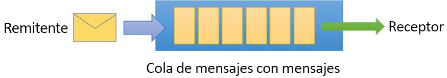
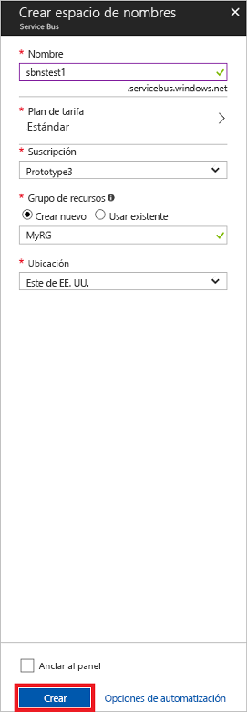

# <a name="quickstart-send-and-receive-messages-using-the-azure-portal-and-net"></a>Guía de inicio rápido: Envío y recepción de mensajes mediante Azure Portal y .NET

Microsoft Azure Service Bus es un agente de mensajes de integración empresarial que proporciona mensajería segura y una absoluta confiabilidad. Un escenario típico de Service Bus implica normalmente el desacoplamiento de dos o más aplicaciones, servicios o procesos, y la transferencia de los cambios de estado o de datos. Estos escenarios pueden implicar la programación de varios trabajos por lotes en otras aplicaciones o servicios, o desencadenar la realización de pedidos. Por ejemplo, una empresa minorista puede enviar los datos de un punto de ventas a un área de operaciones o centro de distribución regional para indicar las actualizaciones de reposición y de inventario. En este escenario, la aplicación cliente envía y recibe mensajes de una cola de Service Bus.  



Esta guía de inicio rápido describe cómo enviar y recibir mensajes de una cola de Service Bus, cómo usar [Azure portal][Azure portal] para crear un espacio de nombres de mensajería y una cola dentro de este, y cómo obtener las credenciales de autorización de ese espacio de nombres. El procedimiento muestra después cómo enviar y recibir mensajes de esta cola mediante la [biblioteca de .NET Standard](https://www.nuget.org/packages/Microsoft.Azure.ServiceBus).

Si no tiene una suscripción a Azure, puede crear una [cuenta gratuita][] antes de empezar.

## <a name="prerequisites"></a>requisitos previos

Para completar este tutorial, asegúrese de que tiene instalados los siguientes elementos:

- [Visual Studio 2017 Update 3 (versión 15.3, 26730.01)](http://www.visualstudio.com/vs) o posterior.
- [NET Core SDK](https://www.microsoft.com/net/download/windows), versión 2.0 o posterior.

## <a name="log-on-to-the-azure-portal"></a>Inicio de sesión en Azure Portal

Primero, vaya a [Azure Portal][Azure portal] e inicie sesión con su suscripción de Azure. El primer paso es crear un espacio de nombres de Service Bus del tipo **Mensajería**.

## <a name="create-a-service-bus-namespace"></a>Creación de un espacio de nombres de Service Bus

Un espacio de nombres de mensajería de Service Bus proporciona un contenedor con un único ámbito, al que hace referencia su [nombre de dominio completo][], en el que puede crear una o varias colas, temas y suscripciones. En el ejemplo siguiente se crea un espacio de nombres de mensajería de Service Bus en un [grupo de recursos](/azure/azure-resource-manager/resource-group-portal) nuevo o ya existente:

1. En el panel de navegación izquierdo del portal, haga clic en **+ Crear un recurso**, luego, en **Enterprise Integration** y, finalmente, en **Service Bus**.
2. En el cuadro de diálogo **Crear un espacio de nombres** , especifique un nombre para el espacio de nombres. El sistema realiza la comprobación automáticamente para ver si el nombre está disponible.
3. Después de asegurarse de que el espacio de nombres está disponible, elija el plan de tarifas (Estándar o Premium).
4. En el campo **Suscripción** elija la suscripción de Azure en la que se va a crear el espacio de nombres.
5. En el campo **Grupo de recursos** , elija un grupo de recursos existente en el que residirá el espacio de nombres o cree uno.      
6. En **Ubicación**, elija el país o región donde se debe hospedar el espacio de nombres.
7. Haga clic en **Create**(Crear). El sistema crea ahora el espacio de nombres del servicio y lo habilita. Es posible que tenga que esperar algunos minutos mientras el sistema realiza el aprovisionamiento de los recursos para la cuenta.



### <a name="obtain-the-management-credentials"></a>Obtención de las credenciales de administración

La creación un nuevo espacio de nombres genera automáticamente una regla de firma de acceso compartido (SAS) inicial con un par asociado de claves principal y secundaria en el que ambas conceden control total sobre todos los aspectos del espacio de nombres. Para copiar la regla inicial, siga estos pasos: 

1.  Haga clic en **Todos los recursos** y, después, en el nombre del espacio de nombres recién creado.
2. En la ventana del espacio de nombres, haga clic en **Directivas de acceso compartido**.
3. En la pantalla **Directivas de acceso compartido**, haga clic en **RootManageSharedAccessKey**.
4. En la ventana **Directiva: RootManageSharedAccessKey**, haga clic en el botón **Copiar** que hay junto a **Cadena de conexión principal** para copiar la cadena de conexión en el portapapeles para su uso posterior. Pegue este valor en el Bloc de notas o cualquier otra ubicación temporal. 

    ![connection-string][connection-string]
5. Repita el paso anterior, copie y pegue el valor de **Clave principal** en una ubicación temporal para su uso posterior.

## <a name="create-a-queue"></a>Creación de una cola

Para crear una cola de Service Bus, especifique el espacio de nombres en el que desea crearlo. En el ejemplo siguiente se muestra cómo crear una cola en el portal:

1. En el panel de navegación izquierdo del portal, haga clic en **Service Bus** (si no ve **Service Bus**, haga clic en **Más servicios**).
2. Haga clic en el espacio de nombres en el que desea crear la cola.
3. En la ventana del espacio de nombres, haga clic en **Colas** y, después, en la ventana **Colas**, haga clic en **+ Cola**.
4. Escriba el **nombre** de la cola y deje los restantes valores con sus valores predeterminados.
5. En la parte inferior de la ventana, haga clic en **Crear**.
6. Tome nota del nombre de la cola.

## <a name="send-and-receive-messages"></a>Envío y recepción de mensajes

Una vez que haya aprovisionado el espacio de nombres y la cola, y disponga de las credenciales necesarias, estará listo para enviar y recibir mensajes. Puede examinar el código en [esta carpeta de ejemplos de GitHub](https://github.com/Azure/azure-service-bus/tree/master/samples/Java/quickstarts-and-tutorials/quickstart-jms).

Para ejecutar el código, haga lo siguiente:

1. Clone el [repositorio de GitHub de Service Bus](https://github.com/Azure/azure-service-bus/) mediante la emisión del comando siguiente:

   ```shell
   git clone https://github.com/Azure/azure-service-bus.git
   ```

3. Navegue hasta la carpeta de ejemplos `azure-service-bus\samples\DotNet\GettingStarted\BasicSendReceiveQuickStart\BasicSendReceiveQuickStart`.

4. Copie la cadena de conexión y el nombre de la cola que obtuvo en la sección [Obtención de las credenciales de administración](#obtain-the-management-credentials).

5.  En un símbolo del sistema, escriba el siguiente comando:

   ```shell
   dotnet build
   ```

6.  Vaya a la carpeta `bin\Debug\netcoreapp2.0`.

7.  Escriba el siguiente comando para ejecutar el programa. No olvide reemplazar `myConnectionString` por el valor que obtuvo previamente, y `myQueueName` por el nombre de la cola que creó:

   ```shell
   dotnet BasicSendReceiveQuickStart.dll -ConnectionString "myConnectionString" -QueueName "myQueueName"
   ``` 

8. Observe que se envían 10 mensajes a la cola y que, posteriormente, se reciben de ella:

   

## <a name="clean-up-resources"></a>Limpieza de recursos

Puede usar el portal para quitar el grupo de recursos, el espacio de nombres y la cola.

## <a name="understand-the-sample-code"></a>Descripción del código de ejemplo

Esta sección contiene información más detallada sobre lo que hace el código de ejemplo. 

### <a name="get-connection-string-and-queue"></a>Obtención de la cadena de conexión y la cola

La cadena de conexión y el nombre de la cola se pasan al método `Main()` como argumentos de la línea de comandos. `Main()` declara dos variables de cadena que contienen estos valores:

```csharp
static void Main(string[] args)
{
    string ServiceBusConnectionString = "";
    string QueueName = "";

    for (int i = 0; i < args.Length; i++)
    {
        var p = new Program();
        if (args[i] == "-ConnectionString")
        {
            Console.WriteLine($"ConnectionString: {args[i+1]}");
            ServiceBusConnectionString = args[i + 1]; 
        }
        else if(args[i] == "-QueueName")
        {
            Console.WriteLine($"QueueName: {args[i+1]}");
            QueueName = args[i + 1];
        }                
    }

    if (ServiceBusConnectionString != "" && QueueName != "")
        MainAsync(ServiceBusConnectionString, QueueName).GetAwaiter().GetResult();
    else
    {
        Console.WriteLine("Specify -Connectionstring and -QueueName to execute the example.");
        Console.ReadKey();
    }                            
}
```
 
El método `Main()` inicia entonces el bucle de mensajes asincrónicos `MainAsync()`.

### <a name="message-loop"></a>Bucle de mensajes

El método MainAsync() crea un cliente de cola con los argumentos de la línea de comandos, llama a un controlador de mensajes de recepción denominado `RegisterOnMessageHandlerAndReceiveMessages()` y envía el conjunto de mensajes:

```csharp
static async Task MainAsync(string ServiceBusConnectionString, string QueueName)
{
    const int numberOfMessages = 10;
    queueClient = new QueueClient(ServiceBusConnectionString, QueueName);

    Console.WriteLine("======================================================");
    Console.WriteLine("Press any key to exit after receiving all the messages.");
    Console.WriteLine("======================================================");

    // Register QueueClient's MessageHandler and receive messages in a loop
    RegisterOnMessageHandlerAndReceiveMessages();

    // Send Messages
    await SendMessagesAsync(numberOfMessages);

    Console.ReadKey();

    await queueClient.CloseAsync();
}
```

El método `RegisterOnMessageHandlerAndReceiveMessages()` simplemente establece unas cuantas opciones del controlador de mensajes y, a continuación, llama al método `RegisterMessageHandler()` del cliente de la cola que inicia la recepción:

```csharp
static void RegisterOnMessageHandlerAndReceiveMessages()
{
    // Configure the MessageHandler Options in terms of exception handling, number of concurrent messages to deliver etc.
    var messageHandlerOptions = new MessageHandlerOptions(ExceptionReceivedHandler)
    {
        // Maximum number of Concurrent calls to the callback `ProcessMessagesAsync`, set to 1 for simplicity.
        // Set it according to how many messages the application wants to process in parallel.
        MaxConcurrentCalls = 1,

        // Indicates whether MessagePump should automatically complete the messages after returning from User Callback.
        // False below indicates the Complete will be handled by the User Callback as in `ProcessMessagesAsync` below.
        AutoComplete = false
    };

    // Register the function that will process messages
    queueClient.RegisterMessageHandler(ProcessMessagesAsync, messageHandlerOptions);
} 
```

### <a name="send-messages"></a>Envío de mensajes

Se producen las operaciones de creación y envío de mensajes del método `SendMessagesAsync()`:

```csharp
static async Task SendMessagesAsync(int numberOfMessagesToSend)
{
    try
    {
        for (var i = 0; i < numberOfMessagesToSend; i++)
        {
            // Create a new message to send to the queue
            string messageBody = $"Message {i}";
            var message = new Message(Encoding.UTF8.GetBytes(messageBody));

            // Write the body of the message to the console
            Console.WriteLine($"Sending message: {messageBody}");

            // Send the message to the queue
            await queueClient.SendAsync(message);
        }
    }
    catch (Exception exception)
    {
        Console.WriteLine($"{DateTime.Now} :: Exception: {exception.Message}");
    }
}
```

### <a name="process-messages"></a>Procesamiento de mensajes

El método `ProcessMessagesAsync()` confirma, procesa y completa la recepción de los mensajes:

```csharp
static async Task ProcessMessagesAsync(Message message, CancellationToken token)
{
    // Process the message
    Console.WriteLine($"Received message: SequenceNumber:{message.SystemProperties.SequenceNumber} Body:{Encoding.UTF8.GetString(message.Body)}");

    // Complete the message so that it is not received again.
    await queueClient.CompleteAsync(message.SystemProperties.LockToken);
}
```

## <a name="next-steps"></a>Pasos siguientes

En este artículo, ha creado un espacio de nombres de Service Bus y otros recursos necesarios para enviar y recibir mensajes de una cola. Para más información sobre cómo escribir código para enviar y recibir mensajes, pase al tutorial siguiente de Service Bus:

> [!div class="nextstepaction"]
> [Actualización del inventario mediante Azure Portal](./service-bus-tutorial-topics-subscriptions-portal.md)


[cuenta gratuita]: https://azure.microsoft.com/free/?ref=microsoft.com&utm_source=microsoft.com&utm_medium=docs&utm_campaign=visualstudio
[Nombre de dominio completo]: https://wikipedia.org/wiki/Fully_qualified_domain_name
[Azure portal]: https://portal.azure.com/

[connection-string]: ./media/service-bus-quickstart-portal/connection-string.png
[service-bus-flow]: ./media/service-bus-quickstart-portal/service-bus-flow.png
